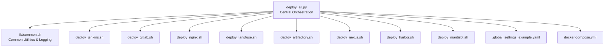
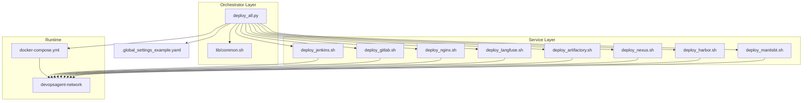
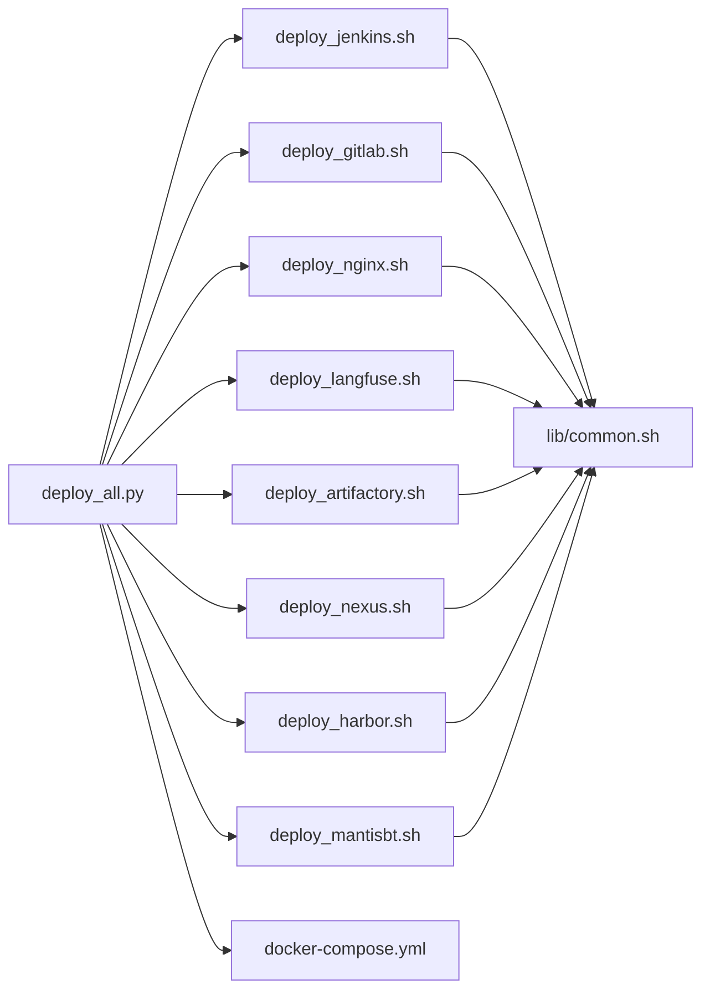
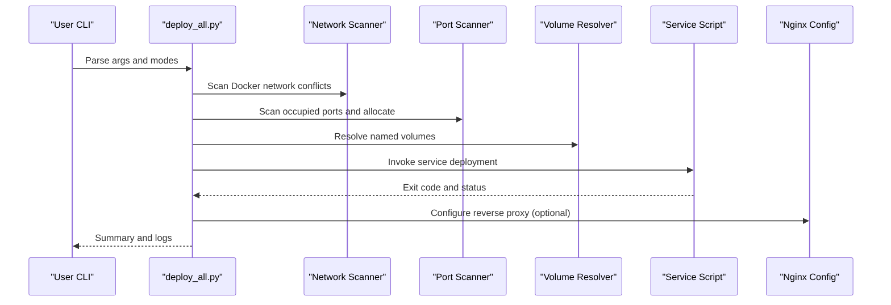

# API Reference

<cite>
**Referenced Files in This Document**
- [README.md](file://README.md)
- [deploy_all.py](file://deploy/deploy_all.py)
- [common.sh](file://deploy/lib/common.sh)
- [deploy_jenkins.sh](file://deploy/deploy_jenkins/deploy_jenkins.sh)
- [deploy_gitlab.sh](file://deploy/deploy_gitlab/deploy_gitlab.sh)
- [deploy_nginx.sh](file://deploy/deploy_nginx/deploy_nginx.sh)
- [deploy_langfuse.sh](file://deploy/deploy_langfuse/deploy_langfuse.sh)
- [deploy_artifactory.sh](file://deploy/deploy_artifactory/deploy_artifactory.sh)
- [deploy_nexus.sh](file://deploy/deploy_nexus/deploy_nexus.sh)
- [deploy_harbor.sh](file://deploy/deploy_harbor/deploy_harbor.sh)
- [deploy_mantisbt.sh](file://deploy/deploy_MantisBT/deploy_mantisbt.sh)
- [.global_settings_example.yaml](file://deploy/config/.global_settings_example.yaml)
- [docker-compose.yml](file://deploy/docker-compose.yml)
</cite>

## Table of Contents
1. [Introduction](#introduction)
2. [Project Structure](#project-structure)
3. [Core Components](#core-components)
4. [Architecture Overview](#architecture-overview)
5. [Detailed Component Analysis](#detailed-component-analysis)
6. [Dependency Analysis](#dependency-analysis)
7. [Performance Considerations](#performance-considerations)
8. [Troubleshooting Guide](#troubleshooting-guide)
9. [Conclusion](#conclusion)
10. [Appendices](#appendices)

## Introduction
This document describes the DeployAgent service management and configuration interfaces. It covers:
- Command-line interfaces for deployment operations
- Service management commands and configuration modification
- Internal APIs for common utilities, logging, and deployment orchestration
- Parameter specifications, return value documentation, and error code meanings
- Examples of programmatic deployment operations, service status queries, and configuration management
- Integration points for external systems, webhook implementations, and automated deployment triggers
- API versioning strategy and backward compatibility considerations

## Project Structure
The project is organized around a central orchestrator (Python) and modular service deployment scripts (Bash). A shared library provides common utilities and logging. Docker Compose defines the runtime environment and inter-service networking.

**Diagram sources**
- [deploy_all.py:1-1315](file://deploy/deploy_all.py#L1-L1315)
- [common.sh:1-566](file://deploy/lib/common.sh#L1-L566)
- [deploy_jenkins.sh:1-385](file://deploy/deploy_jenkins/deploy_jenkins.sh#L1-L385)
- [deploy_gitlab.sh:1-445](file://deploy/deploy_gitlab/deploy_gitlab.sh#L1-L445)
- [deploy_nginx.sh:1-712](file://deploy/deploy_nginx/deploy_nginx.sh#L1-L712)
- [deploy_langfuse.sh:1-164](file://deploy/deploy_langfuse/deploy_langfuse.sh#L1-L164)
- [deploy_artifactory.sh:1-195](file://deploy/deploy_artifactory/deploy_artifactory.sh#L1-L195)
- [deploy_nexus.sh:1-174](file://deploy/deploy_nexus/deploy_nexus.sh#L1-L174)
- [deploy_harbor.sh:1-124](file://deploy/deploy_harbor/deploy_harbor.sh#L1-L124)
- [deploy_mantisbt.sh:1-458](file://deploy/deploy_MantisBT/deploy_mantisbt.sh#L1-L458)
- [.global_settings_example.yaml:1-31](file://deploy/config/.global_settings_example.yaml#L1-L31)
- [docker-compose.yml:1-222](file://deploy/docker-compose.yml#L1-L222)

**Section sources**
- [README.md:1-3](file://README.md#L1-L3)
- [deploy_all.py:1-1315](file://deploy/deploy_all.py#L1-L1315)
- [docker-compose.yml:1-222](file://deploy/docker-compose.yml#L1-L222)

## Core Components
- Central orchestrator (Python): Provides CLI, environment scanning, port allocation, volume resolution, service deployment, reverse proxy configuration, and logging.
- Shared library (Bash): Provides logging, environment loading, Docker checks, port checks, image pulling with fallback, and helper functions for agents and passwords.
- Service scripts (Bash): Individual deployment scripts for Jenkins, GitLab, Nginx, Langfuse, Artifactory, Nexus, Harbor, and MantisBT. Each supports standalone and orchestrated modes.
- Global configuration: YAML-based global settings for CI/CD, AI model, GitLab, Git credentials, and whitelist policies.
- Runtime definition: Docker Compose sets network, volumes, and service exposure.

Key responsibilities:
- CLI and orchestration: [deploy_all.py:1-1315](file://deploy/deploy_all.py#L1-L1315)
- Common utilities and logging: [common.sh:1-566](file://deploy/lib/common.sh#L1-L566)
- Service-specific deployment: [deploy_jenkins.sh:1-385](file://deploy/deploy_jenkins/deploy_jenkins.sh#L1-L385), [deploy_gitlab.sh:1-445](file://deploy/deploy_gitlab/deploy_gitlab.sh#L1-L445), [deploy_nginx.sh:1-712](file://deploy/deploy_nginx/deploy_nginx.sh#L1-L712), [deploy_langfuse.sh:1-164](file://deploy/deploy_langfuse/deploy_langfuse.sh#L1-L164), [deploy_artifactory.sh:1-195](file://deploy/deploy_artifactory/deploy_artifactory.sh#L1-L195), [deploy_nexus.sh:1-174](file://deploy/deploy_nexus/deploy_nexus.sh#L1-L174), [deploy_harbor.sh:1-124](file://deploy/deploy_harbor/deploy_harbor.sh#L1-L124), [deploy_mantisbt.sh:1-458](file://deploy/deploy_MantisBT/deploy_mantisbt.sh#L1-L458)
- Global settings: [.global_settings_example.yaml:1-31](file://deploy/config/.global_settings_example.yaml#L1-L31)
- Runtime environment: [docker-compose.yml:1-222](file://deploy/docker-compose.yml#L1-L222)

**Section sources**
- [deploy_all.py:1-1315](file://deploy/deploy_all.py#L1-L1315)
- [common.sh:1-566](file://deploy/lib/common.sh#L1-L566)
- [.global_settings_example.yaml:1-31](file://deploy/config/.global_settings_example.yaml#L1-L31)
- [docker-compose.yml:1-222](file://deploy/docker-compose.yml#L1-L222)

## Architecture Overview
The system uses a hybrid orchestration model:
- Python orchestrator manages environment scanning, port assignment, volume resolution, and service deployment.
- Bash service scripts encapsulate service-specific logic and expose standardized CLI options.
- Shared Bash library ensures consistent logging and environment checks.
- Docker Compose defines the network and service topology.

**Diagram sources**
- [deploy_all.py:1-1315](file://deploy/deploy_all.py#L1-L1315)
- [common.sh:1-566](file://deploy/lib/common.sh#L1-L566)
- [deploy_jenkins.sh:1-385](file://deploy/deploy_jenkins/deploy_jenkins.sh#L1-L385)
- [deploy_gitlab.sh:1-445](file://deploy/deploy_gitlab/deploy_gitlab.sh#L1-L445)
- [deploy_nginx.sh:1-712](file://deploy/deploy_nginx/deploy_nginx.sh#L1-L712)
- [deploy_langfuse.sh:1-164](file://deploy/deploy_langfuse/deploy_langfuse.sh#L1-L164)
- [deploy_artifactory.sh:1-195](file://deploy/deploy_artifactory/deploy_artifactory.sh#L1-L195)
- [deploy_nexus.sh:1-174](file://deploy/deploy_nexus/deploy_nexus.sh#L1-L174)
- [deploy_harbor.sh:1-124](file://deploy/deploy_harbor/deploy_harbor.sh#L1-L124)
- [deploy_mantisbt.sh:1-458](file://deploy/deploy_MantisBT/deploy_mantisbt.sh#L1-L458)
- [docker-compose.yml:1-222](file://deploy/docker-compose.yml#L1-L222)

## Detailed Component Analysis

### Central Orchestrator (Python)
- Purpose: CLI-driven deployment, environment scanning, port allocation, volume resolution, service orchestration, reverse proxy configuration, and logging.
- Key functions:
  - Logging: [log:152-162](file://deploy/deploy_all.py#L152-L162), [info:163-163](file://deploy/deploy_all.py#L163-L163), [warn:164-164](file://deploy/deploy_all.py#L164-L164), [error:165-165](file://deploy/deploy_all.py#L165-L165), [step:166-166](file://deploy/deploy_all.py#L166-L166)
  - Command execution wrapper: [run:168-182](file://deploy/deploy_all.py#L168-L182)
  - Environment helpers: [load_env:209-217](file://deploy/deploy_all.py#L209-L217), [apply_env_file:235-239](file://deploy/deploy_all.py#L235-L239), [save_env_auto:219-233](file://deploy/deploy_all.py#L219-L233)
  - Port scanning and allocation: [scan_occupied_ports:269-292](file://deploy/deploy_all.py#L269-L292), [find_available_port:294-300](file://deploy/deploy_all.py#L294-L300), [scan_ports:302-340](file://deploy/deploy_all.py#L302-L340)
  - Docker network and volume management: [scan_docker_network:346-399](file://deploy/deploy_all.py#L346-L399), [scan_volumes:405-427](file://deploy/deploy_all.py#L405-L427), [backup_volume:429-444](file://deploy/deploy_all.py#L429-L444), [cleanup_volumes:446-453](file://deploy/deploy_all.py#L446-L453), [VOLUME_MAP:458-475](file://deploy/deploy_all.py#L458-L475), [_resolve_volume_name:477-490](file://deploy/deploy_all.py#L477-L490), [_resolve_service_volumes:492-500](file://deploy/deploy_all.py#L492-L500)
  - Service orchestration: [deploy_service:502-545](file://deploy/deploy_all.py#L502-L545), [_container_running:547-552](file://deploy/deploy_all.py#L547-L552), [_find_running_container:554-564](file://deploy/deploy_all.py#L554-L564), [_cleanup_old_containers:566-589](file://deploy/deploy_all.py#L566-L589), [deploy_services:682-699](file://deploy/deploy_all.py#L682-L699)
  - Reverse proxy configuration: [ensure_nginx_proxy:769-788](file://deploy/deploy_all.py#L769-L788), [_ensure_network:757-767](file://deploy/deploy_all.py#L757-L767), [configure_reverse_proxy_env:701-756](file://deploy/deploy_all.py#L701-L756), [_generate_nginx_conf:591-681](file://deploy/deploy_all.py#L591-L681)
  - CLI argument parsing and modes: [DEPLOY_MODES:131-142](file://deploy/deploy_all.py#L131-L142)

- Parameters and return values:
  - run(cmd, timeout, check, env, input_text) -> CompletedProcess
  - scan_ports(selected_services) -> dict mapping service to port assignments
  - deploy_service(service_name) -> bool
  - deploy_services(services, use_nginx, nginx_bind) -> bool
  - ensure_nginx_proxy(nginx_bind) -> bool
  - configure_reverse_proxy_env(services, use_nginx, public_host) -> void
  - save_env_auto(port_map) -> void
  - apply_env_file() -> void
  - load_env() -> dict
  - scan_docker_network() -> list of conflicts
  - scan_volumes() -> dict
  - backup_volume(volume_name) -> bool
  - cleanup_volumes(dry_run) -> void

- Error handling:
  - Timeout and CalledProcessError are caught and surfaced via error logs.
  - Port conflicts trigger automatic allocation and warnings.
  - Service failures are logged with stdout/stderr context when available.

- Example usage:
  - Programmatic deployment: call [deploy_services:682-699](file://deploy/deploy_all.py#L682-L699) with a list of services and a boolean for Nginx.
  - Service status: inspect container existence via [_container_running:547-552](file://deploy/deploy_all.py#L547-L552) and [deploy_service:502-545](file://deploy/deploy_all.py#L502-L545).
  - Configuration management: write auto-generated port mappings via [save_env_auto:219-233](file://deploy/deploy_all.py#L219-L233) and apply via [apply_env_file:235-239](file://deploy/deploy_all.py#L235-L239).

**Section sources**
- [deploy_all.py:1-1315](file://deploy/deploy_all.py#L1-L1315)

### Shared Library (Bash)
- Purpose: Provide common logging, environment loading, Docker checks, port checks, image pulling with fallback, and helper functions for agents and passwords.
- Key functions:
  - Logging: [log_info:25-36](file://deploy/lib/common.sh#L25-L36), [log_warn:38-49](file://deploy/lib/common.sh#L38-L49), [log_error:51-62](file://deploy/lib/common.sh#L51-L62), [log_step:64-74](file://deploy/lib/common.sh#L64-L74), [log_banner:76-87](file://deploy/lib/common.sh#L76-L87)
  - Environment: [load_env:130-151](file://deploy/lib/common.sh#L130-L151)
  - Docker checks: [check_root:93-99](file://deploy/lib/common.sh#L93-L99), [check_docker:101-124](file://deploy/lib/common.sh#L101-L124)
  - Ports: [check_port:157-168](file://deploy/lib/common.sh#L157-L168)
  - Image pulling with fallback: [pull_image_with_fallback:174-335](file://deploy/lib/common.sh#L174-L335)
  - Password retrieval: [get_jenkins_password:341-380](file://deploy/lib/common.sh#L341-L380), [get_gitlab_password:382-423](file://deploy/lib/common.sh#L382-L423)
  - Agent device management: [reset_agent_device:429-480](file://deploy/lib/common.sh#L429-L480), [list_agent_devices:482-502](file://deploy/lib/common.sh#L482-L502), [approve_agent_device:504-537](file://deploy/lib/common.sh#L504-L537)
  - Network detection: [detect_local_ip:543-555](file://deploy/lib/common.sh#L543-L555)

- Parameters and return values:
  - pull_image_with_fallback(service, target_tag) -> int (exit code)
  - get_jenkins_password(container_name) -> int (exit code)
  - get_gitlab_password(container_name) -> int (exit code)
  - reset_agent_device(container_name, agent_dir) -> int (exit code)
  - list_agent_devices(container_name) -> int (exit code)
  - approve_agent_device(device_uuid, container_name) -> int (exit code)
  - detect_local_ip() -> string (IP address)

- Error handling:
  - Docker and compose availability checked early; exits with error messages if missing.
  - Image pull attempts multiple sources with timeouts and retries.

- Example usage:
  - Programmatic deployment: call [pull_image_with_fallback:174-335](file://deploy/lib/common.sh#L174-L335) before running service containers.
  - Service status: use [check_docker:101-124](file://deploy/lib/common.sh#L101-L124) and container inspection commands.
  - Configuration management: use [load_env:130-151](file://deploy/lib/common.sh#L130-L151) to populate environment variables.

**Section sources**
- [common.sh:1-566](file://deploy/lib/common.sh#L1-L566)

### Service Scripts (Bash)
Each service script exposes a standardized CLI and supports both standalone and orchestrated modes.

#### Jenkins
- CLI options: [--deploy, --get-password, --status, --stop, --start, --restart, --standalone]
- Key functions: [deploy_jenkins:43-113](file://deploy/deploy_jenkins/deploy_jenkins.sh#L43-L113), [get_jenkins_password:115-204](file://deploy/deploy_jenkins/deploy_jenkins.sh#L115-L204), [print_jenkins_summary:224-254](file://deploy/deploy_jenkins/deploy_jenkins.sh#L224-L254)
- Parameters and return values:
  - deploy_jenkins() -> int (exit code)
  - get_jenkins_password(container_name) -> int (exit code)
  - print_jenkins_summary(mode) -> void

#### GitLab
- CLI options: [--deploy, --get-password, --status, --stop, --start, --restart, --standalone]
- Key functions: [deploy_gitlab:57-156](file://deploy/deploy_gitlab/deploy_gitlab.sh#L57-L156), [get_gitlab_password:158-230](file://deploy/deploy_gitlab/deploy_gitlab.sh#L158-L230), [print_gitlab_summary:250-285](file://deploy/deploy_gitlab/deploy_gitlab.sh#L250-L285)
- Parameters and return values:
  - deploy_gitlab() -> int (exit code)
  - get_gitlab_password(container_name) -> int (exit code)
  - print_gitlab_summary(mode) -> void

#### Nginx
- CLI options: [--standalone, --deploy, --generate-ssl, --check-ssl, --status, --stop, --start, --restart, --reload]
- Key functions: [ensure_nginx_proxy:58-365](file://deploy/deploy_nginx/deploy_nginx.sh#L58-L365), [deploy_nginx:454-517](file://deploy/deploy_nginx/deploy_nginx.sh#L454-L517), [print_nginx_summary:519-556](file://deploy/deploy_nginx/deploy_nginx.sh#L519-L556)
- Parameters and return values:
  - ensure_nginx_proxy() -> int (exit code)
  - deploy_nginx() -> int (exit code)
  - print_nginx_summary() -> void

#### Langfuse
- CLI options: [--deploy, --standalone]
- Key functions: [deploy_langfuse:46-139](file://deploy/deploy_langfuse/deploy_langfuse.sh#L46-L139)
- Parameters and return values:
  - deploy_langfuse() -> int (exit code)

#### Artifactory
- CLI options: none (invoked via orchestrator)
- Key functions: [deploy_artifactory:22-190](file://deploy/deploy_artifactory/deploy_artifactory.sh#L22-L190)
- Parameters and return values:
  - deploy_artifactory() -> int (exit code)

#### Nexus
- CLI options: none (invoked via orchestrator)
- Key functions: [deploy_nexus:29-169](file://deploy/deploy_nexus/deploy_nexus.sh#L29-L169)
- Parameters and return values:
  - deploy_nexus() -> int (exit code)

#### Harbor
- CLI options: none (invoked via orchestrator)
- Key functions: [deploy_harbor:40-120](file://deploy/deploy_harbor/deploy_harbor.sh#L40-L120)
- Parameters and return values:
  - deploy_harbor() -> int (exit code)

#### MantisBT
- CLI options: [--deploy, --standalone]
- Key functions: [deploy_mantisbt_db:62-135](file://deploy/deploy_MantisBT/deploy_mantisbt.sh#L62-L135), [deploy_mantisbt:137-433](file://deploy/deploy_MantisBT/deploy_mantisbt.sh#L137-L433)
- Parameters and return values:
  - deploy_mantisbt_db() -> int (exit code)
  - deploy_mantisbt() -> int (exit code)

**Section sources**
- [deploy_jenkins.sh:1-385](file://deploy/deploy_jenkins/deploy_jenkins.sh#L1-L385)
- [deploy_gitlab.sh:1-445](file://deploy/deploy_gitlab/deploy_gitlab.sh#L1-L445)
- [deploy_nginx.sh:1-712](file://deploy/deploy_nginx/deploy_nginx.sh#L1-L712)
- [deploy_langfuse.sh:1-164](file://deploy/deploy_langfuse/deploy_langfuse.sh#L1-L164)
- [deploy_artifactory.sh:1-195](file://deploy/deploy_artifactory/deploy_artifactory.sh#L1-L195)
- [deploy_nexus.sh:1-174](file://deploy/deploy_nexus/deploy_nexus.sh#L1-L174)
- [deploy_harbor.sh:1-124](file://deploy/deploy_harbor/deploy_harbor.sh#L1-L124)
- [deploy_mantisbt.sh:1-458](file://deploy/deploy_MantisBT/deploy_mantisbt.sh#L1-L458)

### Global Configuration Management
- YAML schema: [.global_settings_example.yaml:1-31](file://deploy/config/.global_settings_example.yaml#L1-L31)
- Fields:
  - jenkins: base_url, username, api_token
  - ai_model: provider, model_name, api_key
  - gitlab: base_url, api_token, permissions note
  - git: user_name, user_email, credential_type, token, optional ssh_private_key_path
  - white_list: repos[], branch_pattern

- Usage:
  - Load via [load_env:130-151](file://deploy/lib/common.sh#L130-L151) in Bash scripts.
  - Apply environment variables for orchestrated deployments.

**Section sources**
- [.global_settings_example.yaml:1-31](file://deploy/config/.global_settings_example.yaml#L1-L31)
- [common.sh:130-151](file://deploy/lib/common.sh#L130-L151)

### Runtime Environment and Networking
- Network: devopsagent-network (bridge)
- Volumes: Named volumes per service for persistence
- Exposure: Services exposed via docker-compose ports; Nginx proxies HTTPS to backend services

**Section sources**
- [docker-compose.yml:1-222](file://deploy/docker-compose.yml#L1-L222)

## Dependency Analysis
- Orchestrator-to-service dependencies:
  - [deploy_all.py:502-545](file://deploy/deploy_all.py#L502-L545) invokes service scripts and passes environment variables.
  - [deploy_all.py:682-699](file://deploy/deploy_all.py#L682-L699) orchestrates multiple services and conditionally configures Nginx.
- Shared library dependencies:
  - Service scripts source [common.sh:29-29](file://deploy/lib/common.sh#L29-L29) for logging and utilities.
- Runtime dependencies:
  - All services depend on [docker-compose.yml:3-6](file://deploy/docker-compose.yml#L3-L6) for network and volume definitions.

**Diagram sources**
- [deploy_all.py:1-1315](file://deploy/deploy_all.py#L1-L1315)
- [common.sh:1-566](file://deploy/lib/common.sh#L1-L566)
- [deploy_jenkins.sh:1-385](file://deploy/deploy_jenkins/deploy_jenkins.sh#L1-L385)
- [deploy_gitlab.sh:1-445](file://deploy/deploy_gitlab/deploy_gitlab.sh#L1-L445)
- [deploy_nginx.sh:1-712](file://deploy/deploy_nginx/deploy_nginx.sh#L1-L712)
- [deploy_langfuse.sh:1-164](file://deploy/deploy_langfuse/deploy_langfuse.sh#L1-L164)
- [deploy_artifactory.sh:1-195](file://deploy/deploy_artifactory/deploy_artifactory.sh#L1-L195)
- [deploy_nexus.sh:1-174](file://deploy/deploy_nexus/deploy_nexus.sh#L1-L174)
- [deploy_harbor.sh:1-124](file://deploy/deploy_harbor/deploy_harbor.sh#L1-L124)
- [deploy_mantisbt.sh:1-458](file://deploy/deploy_MantisBT/deploy_mantisbt.sh#L1-L458)
- [docker-compose.yml:1-222](file://deploy/docker-compose.yml#L1-L222)

**Section sources**
- [deploy_all.py:1-1315](file://deploy/deploy_all.py#L1-L1315)
- [common.sh:1-566](file://deploy/lib/common.sh#L1-L566)
- [docker-compose.yml:1-222](file://deploy/docker-compose.yml#L1-L222)

## Performance Considerations
- Image pulling with fallback reduces downtime by trying multiple registries.
- Port scanning and automatic allocation minimize manual intervention.
- Named volumes reduce filesystem permission issues and improve reliability.
- Nginx reverse proxy consolidates SSL termination and reduces per-service overhead.

## Troubleshooting Guide
- Common errors and remedies:
  - Docker not installed or compose unavailable: handled by [check_docker:101-124](file://deploy/lib/common.sh#L101-L124).
  - Port conflicts: resolved automatically by [scan_ports:302-340](file://deploy/deploy_all.py#L302-L340).
  - Image pull failures: retried across multiple sources in [pull_image_with_fallback:174-335](file://deploy/lib/common.sh#L174-L335).
  - Service initialization issues: review container logs and use service-specific status helpers.
- Logging:
  - Python: [log:152-162](file://deploy/deploy_all.py#L152-L162) with levels INFO/WARN/ERROR/STEP.
  - Bash: [log_info:25-36](file://deploy/lib/common.sh#L25-L36), [log_warn:38-49](file://deploy/lib/common.sh#L38-L49), [log_error:51-62](file://deploy/lib/common.sh#L51-L62), [log_step:64-74](file://deploy/lib/common.sh#L64-L74).

**Section sources**
- [common.sh:1-566](file://deploy/lib/common.sh#L1-L566)
- [deploy_all.py:1-1315](file://deploy/deploy_all.py#L1-L1315)

## Conclusion
DeployAgent provides a robust, modular deployment framework combining a Python orchestrator and Bash service scripts with a shared library for utilities and logging. It supports automated environment scanning, port allocation, volume management, and reverse proxy configuration, enabling streamlined CI/CD and observability platform deployments.

## Appendices

### API Versioning and Backward Compatibility
- Version metadata in labels:
  - Services include labels indicating version and role, aiding identification and migration planning.
- Backward compatibility:
  - Service scripts maintain stable CLI options and environment variable names.
  - Orchestrator preserves legacy port and volume mappings while adding new ones.

**Section sources**
- [docker-compose.yml:62-136](file://deploy/docker-compose.yml#L62-L136)
- [deploy_all.py:40-129](file://deploy/deploy_all.py#L40-L129)

### Sequence Diagram: Full Deployment Workflow

**Diagram sources**
- [deploy_all.py:1-1315](file://deploy/deploy_all.py#L1-L1315)
- [deploy_nginx.sh:58-365](file://deploy/deploy_nginx/deploy_nginx.sh#L58-L365)