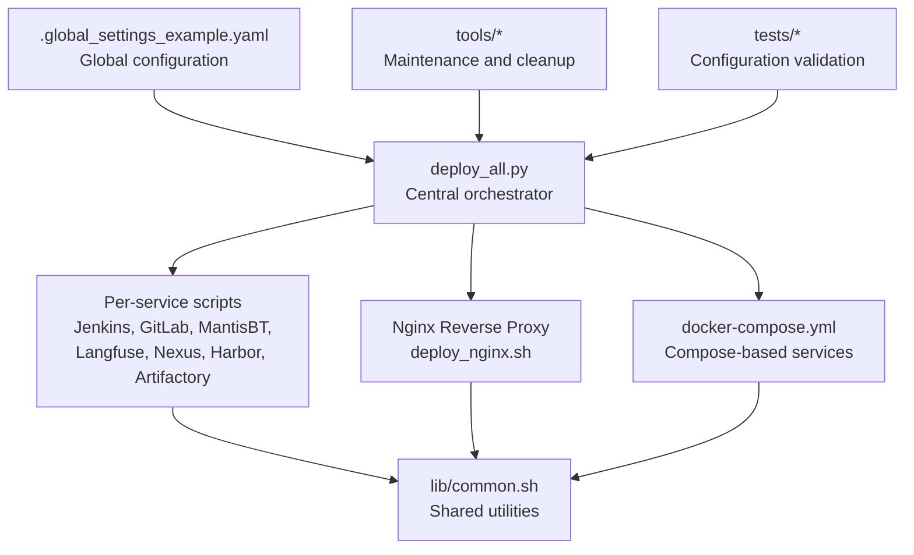
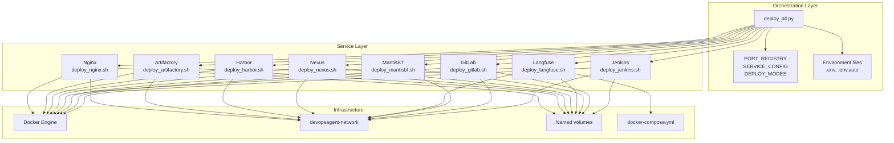
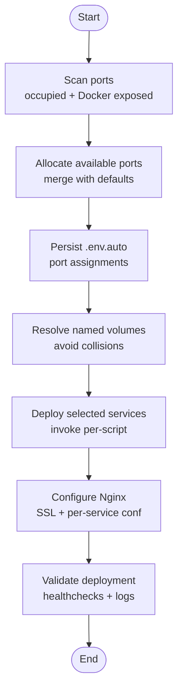
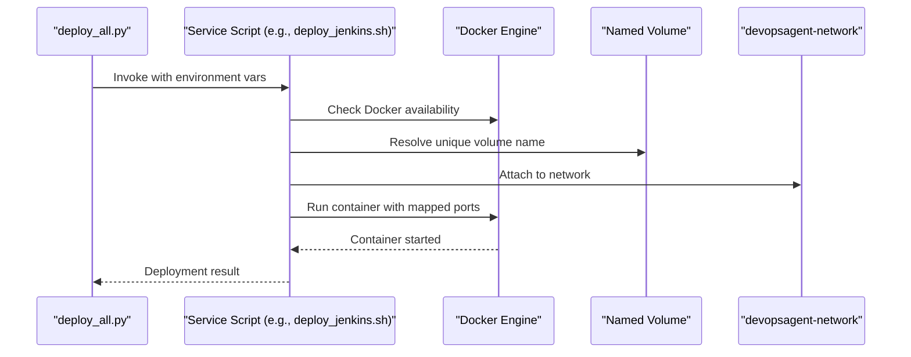
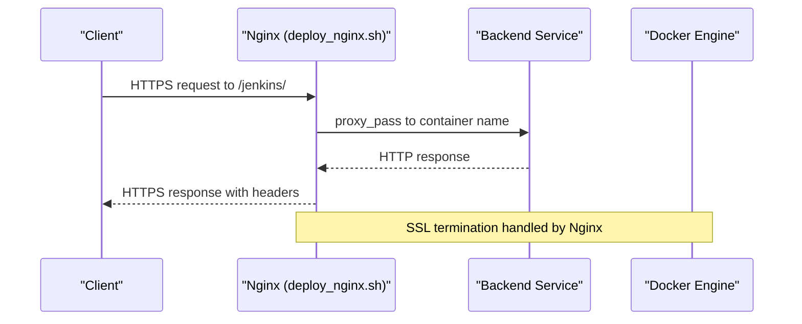
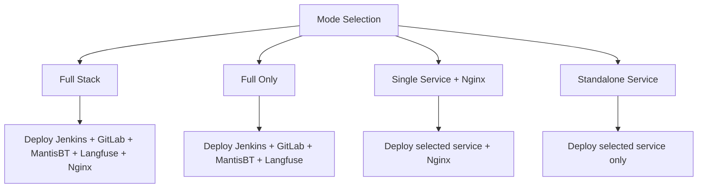
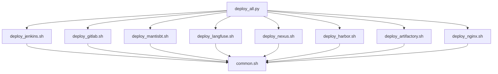

# Architecture Overview

<cite>
**Referenced Files in This Document**
- [README.md](file://README.md)
- [deploy_all.py](file://deploy/deploy_all.py)
- [docker-compose.yml](file://deploy/docker-compose.yml)
- [common.sh](file://deploy/lib/common.sh)
- [.global_settings_example.yaml](file://deploy/config/.global_settings_example.yaml)
- [deploy_jenkins.sh](file://deploy/deploy_jenkins/deploy_jenkins.sh)
- [deploy_gitlab.sh](file://deploy/deploy_gitlab/deploy_gitlab.sh)
- [deploy_nginx.sh](file://deploy/deploy_nginx/deploy_nginx.sh)
- [deploy_langfuse.sh](file://deploy/deploy_langfuse/deploy_langfuse.sh)
- [deploy_nexus.sh](file://deploy/deploy_nexus/deploy_nexus.sh)
- [deploy_artifactory.sh](file://deploy/deploy_artifactory/deploy_artifactory.sh)
- [deploy_harbor.sh](file://deploy/deploy_harbor/deploy_harbor.sh)
- [deploy_mantisbt.sh](file://deploy/deploy_MantisBT/deploy_mantisbt.sh)
- [test_config.py](file://deploy/tests/test_config.py)
- [clean_docker_container.sh](file://deploy/tools/clean_docker_container.sh)
- [b.sh](file://deploy/b.sh)
- [m.sh](file://deploy/m.sh)
</cite>

## Table of Contents
1. [Introduction](#introduction)
2. [Project Structure](#project-structure)
3. [Core Components](#core-components)
4. [Architecture Overview](#architecture-overview)
5. [Detailed Component Analysis](#detailed-component-analysis)
6. [Dependency Analysis](#dependency-analysis)
7. [Performance Considerations](#performance-considerations)
8. [Troubleshooting Guide](#troubleshooting-guide)
9. [Conclusion](#conclusion)
10. [Appendices](#appendices)

## Introduction
This document presents the architecture and component relationships of DeployAgent, a containerized DevOps deployment platform. It focuses on the centralized deployment orchestrator, modular service deployment scripts, and automated configuration management. The system leverages Docker and Docker Compose for containerization, orchestrates services with a Python-based orchestrator, and integrates a reverse proxy for unified HTTPS access. Deployment modes include full stack, selective service, and standalone deployments. Configuration management combines environment-driven settings, YAML templates, and dynamic configuration generation.

## Project Structure
The repository is organized around a central orchestrator and per-service deployment modules:
- Central orchestrator: Python-based orchestration and environment scanning
- Per-service deployment scripts: Bash-based modules for Jenkins, GitLab, MantisBT, Langfuse, Nexus, Harbor, Artifactory, and Nginx
- Shared libraries: Common shell utilities and logging
- Configuration templates: YAML and environment files
- Tools: Maintenance and troubleshooting helpers
- Tests: Validation of configuration constants and deployment modes



**Diagram sources**
- [deploy_all.py:1-1315](file://deploy/deploy_all.py#L1-L1315)
- [docker-compose.yml:1-222](file://deploy/docker-compose.yml#L1-L222)
- [common.sh:1-566](file://deploy/lib/common.sh#L1-L566)
- [.global_settings_example.yaml:1-31](file://deploy/config/.global_settings_example.yaml#L1-L31)
- [deploy_nginx.sh:1-712](file://deploy/deploy_nginx/deploy_nginx.sh#L1-L712)

**Section sources**
- [README.md:1-3](file://README.md#L1-L3)
- [deploy_all.py:1-1315](file://deploy/deploy_all.py#L1-L1315)
- [docker-compose.yml:1-222](file://deploy/docker-compose.yml#L1-L222)
- [common.sh:1-566](file://deploy/lib/common.sh#L1-L566)
- [.global_settings_example.yaml:1-31](file://deploy/config/.global_settings_example.yaml#L1-L31)

## Core Components
- Central orchestrator (Python): Environment scanning, port allocation, Docker network and volume management, service orchestration, reverse proxy configuration, and deployment modes.
- Per-service deployment scripts (Bash): Modular deployment for each service with environment-driven configuration, named volumes, and optional Nginx integration.
- Shared library (Shell): Logging, environment loading, Docker checks, image pulling with fallbacks, and helper utilities.
- Reverse proxy (Nginx): Automated SSL certificate generation, per-service configuration, and runtime detection of backend containers.
- Compose-based services: Optional Docker Compose stack for select services (e.g., Agent, Jenkins, GitLab, MantisBT).
- Configuration templates: Global YAML settings and environment files for credentials and preferences.
- Tools and tests: Cleanup utilities, mirror download helpers, and unit tests validating configuration structures.

**Section sources**
- [deploy_all.py:1-1315](file://deploy/deploy_all.py#L1-L1315)
- [deploy_jenkins.sh:1-385](file://deploy/deploy_jenkins/deploy_jenkins.sh#L1-L385)
- [deploy_gitlab.sh:1-445](file://deploy/deploy_gitlab/deploy_gitlab.sh#L1-L445)
- [deploy_nginx.sh:1-712](file://deploy/deploy_nginx/deploy_nginx.sh#L1-L712)
- [common.sh:1-566](file://deploy/lib/common.sh#L1-L566)
- [docker-compose.yml:1-222](file://deploy/docker-compose.yml#L1-L222)
- [.global_settings_example.yaml:1-31](file://deploy/config/.global_settings_example.yaml#L1-L31)
- [test_config.py:1-131](file://deploy/tests/test_config.py#L1-L131)

## Architecture Overview
DeployAgent’s architecture centers on a Python orchestrator that coordinates:
- Environment scanning and conflict resolution (ports, Docker networks, volumes)
- Service deployment via modular Bash scripts
- Reverse proxy configuration and HTTPS exposure
- Optional Docker Compose orchestration for selected services



**Diagram sources**
- [deploy_all.py:1-1315](file://deploy/deploy_all.py#L1-L1315)
- [deploy_jenkins.sh:1-385](file://deploy/deploy_jenkins/deploy_jenkins.sh#L1-L385)
- [deploy_gitlab.sh:1-445](file://deploy/deploy_gitlab/deploy_gitlab.sh#L1-L445)
- [deploy_mantisbt.sh:1-458](file://deploy/deploy_MantisBT/deploy_mantisbt.sh#L1-L458)
- [deploy_langfuse.sh:1-164](file://deploy/deploy_langfuse/deploy_langfuse.sh#L1-L164)
- [deploy_nexus.sh:1-174](file://deploy/deploy_nexus/deploy_nexus.sh#L1-L174)
- [deploy_harbor.sh:1-124](file://deploy/deploy_harbor/deploy_harbor.sh#L1-L124)
- [deploy_artifactory.sh:1-195](file://deploy/deploy_artifactory/deploy_artifactory.sh#L1-L195)
- [deploy_nginx.sh:1-712](file://deploy/deploy_nginx/deploy_nginx.sh#L1-L712)
- [docker-compose.yml:1-222](file://deploy/docker-compose.yml#L1-L222)

## Detailed Component Analysis

### Central Orchestrator (deploy_all.py)
- Responsibilities:
  - Environment scanning: port occupancy, Docker network conflicts, volume collisions
  - Dynamic port allocation and persistence (.env.auto)
  - Service orchestration: volume resolution, container cleanup, deployment invocation
  - Reverse proxy management: SSL generation, per-service configuration, runtime updates
  - Deployment modes: full stack, selective service, standalone
- Key data structures:
  - PORT_REGISTRY: default port allocations per service
  - SERVICE_CONFIG: per-service deployment metadata and backend mapping
  - DEPLOY_MODES: predefined deployment configurations
- Interactions:
  - Calls per-service scripts with environment variables and resolved volumes
  - Manages Docker network creation and volume naming
  - Generates Nginx configuration dynamically based on detected services



**Diagram sources**
- [deploy_all.py:269-340](file://deploy/deploy_all.py#L269-L340)
- [deploy_all.py:405-453](file://deploy/deploy_all.py#L405-L453)
- [deploy_all.py:682-756](file://deploy/deploy_all.py#L682-L756)

**Section sources**
- [deploy_all.py:1-1315](file://deploy/deploy_all.py#L1-L1315)

### Per-Service Deployment Scripts
- Jenkins:
  - Deploys Jenkins container with named volumes, optional bind mounts, and Docker socket access
  - Provides initial admin password retrieval and deployment summary
- GitLab:
  - Supports named volumes and bind mounts; configures external URL and trusted proxies for HTTPS reverse proxy
  - Retrieves initial root password and prints access instructions
- MantisBT:
  - Deploys MariaDB and MantisBT containers; initializes database schema and admin user
  - Supports HTTPS reverse proxy configuration and Nginx integration
- Langfuse:
  - Clones repository, generates environment variables, and starts services via Docker Compose
  - Provides standalone deployment mode
- Nexus:
  - Pulls image with fallback sources and deploys with named volumes
  - Retrieves initial admin password after startup
- Harbor:
  - Downloads offline installer, configures YAML, and runs installation script
  - Starts services and validates readiness
- Artifactory:
  - Uses official and third-party mirrors with fallback strategies
  - Deploys container with ulimits and user configuration
- Nginx:
  - Generates SSL certificates, detects backends, and creates per-service configuration
  - Supports standalone deployment and reload operations



**Diagram sources**
- [deploy_all.py:502-545](file://deploy/deploy_all.py#L502-L545)
- [deploy_jenkins.sh:43-113](file://deploy/deploy_jenkins/deploy_jenkins.sh#L43-L113)
- [common.sh:101-124](file://deploy/lib/common.sh#L101-L124)

**Section sources**
- [deploy_jenkins.sh:1-385](file://deploy/deploy_jenkins/deploy_jenkins.sh#L1-L385)
- [deploy_gitlab.sh:1-445](file://deploy/deploy_gitlab/deploy_gitlab.sh#L1-L445)
- [deploy_mantisbt.sh:1-458](file://deploy/deploy_MantisBT/deploy_mantisbt.sh#L1-L458)
- [deploy_langfuse.sh:1-164](file://deploy/deploy_langfuse/deploy_langfuse.sh#L1-L164)
- [deploy_nexus.sh:1-174](file://deploy/deploy_nexus/deploy_nexus.sh#L1-L174)
- [deploy_harbor.sh:1-124](file://deploy/deploy_harbor/deploy_harbor.sh#L1-L124)
- [deploy_artifactory.sh:1-195](file://deploy/deploy_artifactory/deploy_artifactory.sh#L1-L195)
- [deploy_nginx.sh:1-712](file://deploy/deploy_nginx/deploy_nginx.sh#L1-L712)
- [common.sh:1-566](file://deploy/lib/common.sh#L1-L566)

### Reverse Proxy and Inter-Service Communication
- Nginx reverse proxy:
  - Automatically generates SSL certificates and per-service configuration
  - Detects running backend containers and updates configuration dynamically
  - Exposes services over HTTPS with unified ports
- Inter-service communication:
  - All services join the same Docker network for internal DNS resolution
  - Backends are addressed by container names (e.g., devopsagent-jenkins)
  - HTTPS reverse proxy sets appropriate headers for upstream services



**Diagram sources**
- [deploy_nginx.sh:58-365](file://deploy/deploy_nginx/deploy_nginx.sh#L58-L365)
- [deploy_all.py:591-681](file://deploy/deploy_all.py#L591-L681)

**Section sources**
- [deploy_nginx.sh:1-712](file://deploy/deploy_nginx/deploy_nginx.sh#L1-L712)
- [deploy_all.py:682-756](file://deploy/deploy_all.py#L682-L756)

### Configuration Management Architecture
- Environment-driven configuration:
  - .env and .env.auto for runtime overrides and generated port assignments
  - Per-service environment variables controlling ports, volumes, and behavior
- YAML templates:
  - .global_settings_example.yaml for global settings (credentials, AI model, Git)
- Dynamic configuration generation:
  - Orchestrator writes .env.auto with port allocations
  - Nginx script generates per-service configuration files
  - Langfuse script generates .env for Docker Compose
- Validation:
  - Unit tests validate configuration structures and completeness

```mermaid
flowchart TD
EnvFile[".env<br/>User overrides"] --> Orchestrator["deploy_all.py"]
AutoEnv[".env.auto<br/>Generated port assignments"] <-- Orchestrator
GlobalYAML[".global_settings_example.yaml<br/>Global settings"] --> Orchestrator
Orchestrator --> GeneratedEnv["Per-service .env<br/>Volume names, URLs"]
Orchestrator --> NginxConf["Nginx conf.d/*.conf<br/>Dynamic generation"]
Orchestrator --> ComposeEnv["docker-compose.yml<br/>Environment variables"]
```

**Diagram sources**
- [deploy_all.py:209-264](file://deploy/deploy_all.py#L209-L264)
- [deploy_all.py:682-756](file://deploy/deploy_all.py#L682-L756)
- [deploy_langfuse.sh:74-97](file://deploy/deploy_langfuse/deploy_langfuse.sh#L74-L97)
- [.global_settings_example.yaml:1-31](file://deploy/config/.global_settings_example.yaml#L1-L31)

**Section sources**
- [deploy_all.py:209-264](file://deploy/deploy_all.py#L209-L264)
- [deploy_all.py:682-756](file://deploy/deploy_all.py#L682-L756)
- [deploy_langfuse.sh:74-97](file://deploy/deploy_langfuse/deploy_langfuse.sh#L74-L97)
- [.global_settings_example.yaml:1-31](file://deploy/config/.global_settings_example.yaml#L1-L31)
- [test_config.py:1-131](file://deploy/tests/test_config.py#L1-L131)

### Deployment Modes
- Full stack: Deploys Jenkins, GitLab, MantisBT, Langfuse, and Nginx
- Full-only: Deploys core services without Nginx
- Selective service: Deploys a single service plus Nginx (e.g., Jenkins, GitLab, MantisBT, Langfuse, Artifactory, Nexus, Harbor)
- Standalone: Independent deployment of a single service with optional Nginx integration



**Diagram sources**
- [deploy_all.py:131-142](file://deploy/deploy_all.py#L131-L142)

**Section sources**
- [deploy_all.py:131-142](file://deploy/deploy_all.py#L131-L142)

### Docker-Based Containerization Strategy
- Containerization:
  - Each service runs in its own container with explicit port mappings
  - Named volumes for persistent data; fallback to bind mounts when needed
  - Shared devopsagent-network for inter-service communication
- Orchestration:
  - Python orchestrator manages lifecycle and configuration
  - Optional docker-compose.yml for specific services (Agent, Jenkins, GitLab, MantisBT)
- Security and isolation:
  - Dedicated volumes and minimal container privileges where applicable
  - Reverse proxy centralizes TLS termination

**Section sources**
- [docker-compose.yml:1-222](file://deploy/docker-compose.yml#L1-L222)
- [deploy_all.py:458-501](file://deploy/deploy_all.py#L458-L501)

## Dependency Analysis
- Coupling:
  - deploy_all.py orchestrates all services and depends on per-service scripts and shared utilities
  - Per-service scripts depend on common.sh for logging and Docker checks
  - Nginx script depends on backend container detection and configuration templates
- Cohesion:
  - Each service script encapsulates deployment logic and environment handling
  - Shared library consolidates common operations (logging, environment, Docker checks)
- External dependencies:
  - Docker and Docker Compose
  - Image registries with fallback strategies
  - Optional mirror download scripts for Artifactory



**Diagram sources**
- [deploy_all.py:1-1315](file://deploy/deploy_all.py#L1-L1315)
- [common.sh:1-566](file://deploy/lib/common.sh#L1-L566)

**Section sources**
- [deploy_all.py:1-1315](file://deploy/deploy_all.py#L1-L1315)
- [common.sh:1-566](file://deploy/lib/common.sh#L1-L566)

## Performance Considerations
- Port allocation minimizes conflicts and reduces reconfiguration overhead.
- Named volumes avoid permission issues and improve data locality.
- Reverse proxy consolidates TLS termination and reduces per-service overhead.
- Mirror and fallback strategies accelerate image pulls in constrained environments.
- Health checks and startup waits ensure services are ready before proceeding.

## Troubleshooting Guide
- Environment scanning:
  - Use port and network scans to identify conflicts; resolve by adjusting defaults or accepting auto-allocation.
- Docker and Compose:
  - Verify Docker availability and Compose plugin presence; ensure network and volume prerequisites are met.
- Service-specific diagnostics:
  - Retrieve initial passwords for Jenkins and GitLab; check container logs for failures.
  - Validate Nginx configuration syntax and reload after changes.
- Maintenance tools:
  - Use the cleanup script to remove containers and volumes; selectively remove data if needed.
- Mirror downloads:
  - Utilize mirror scripts for Artifactory when official sources are unavailable.

**Section sources**
- [deploy_all.py:269-340](file://deploy/deploy_all.py#L269-L340)
- [common.sh:101-124](file://deploy/lib/common.sh#L101-L124)
- [deploy_jenkins.sh:115-204](file://deploy/deploy_jenkins/deploy_jenkins.sh#L115-L204)
- [deploy_gitlab.sh:158-230](file://deploy/deploy_gitlab/deploy_gitlab.sh#L158-L230)
- [deploy_nginx.sh:356-365](file://deploy/deploy_nginx/deploy_nginx.sh#L356-L365)
- [clean_docker_container.sh:1-248](file://deploy/tools/clean_docker_container.sh#L1-L248)
- [b.sh:1-199](file://deploy/b.sh#L1-L199)
- [m.sh:1-219](file://deploy/m.sh#L1-L219)

## Conclusion
DeployAgent provides a modular, container-first deployment platform with a centralized orchestrator, per-service deployment scripts, and automated configuration management. Its Docker-based strategy, reverse proxy integration, and flexible deployment modes enable scalable and maintainable DevOps stacks. The design emphasizes extensibility, robustness, and ease of operation through shared utilities, validation, and operational tools.

## Appendices
- Additional tools:
  - Mirror download helpers for Artifactory and Nexus alternatives
  - Comprehensive cleanup utilities for containers and volumes

**Section sources**
- [b.sh:1-199](file://deploy/b.sh#L1-L199)
- [m.sh:1-219](file://deploy/m.sh#L1-L219)
- [clean_docker_container.sh:1-248](file://deploy/tools/clean_docker_container.sh#L1-L248)