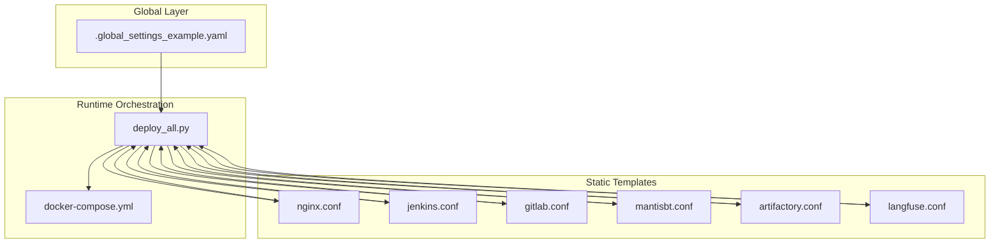
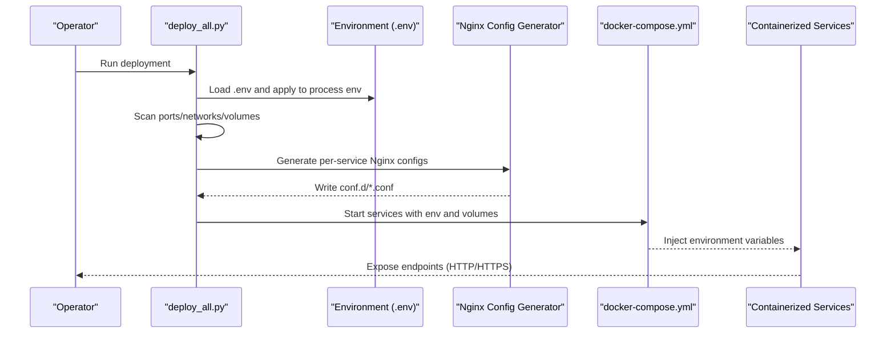
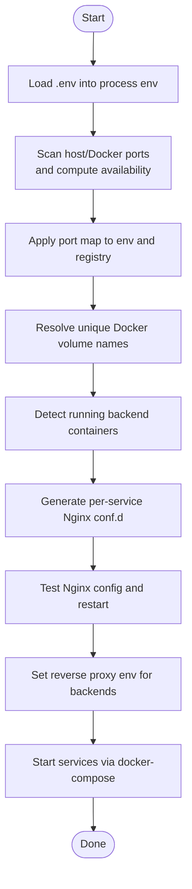
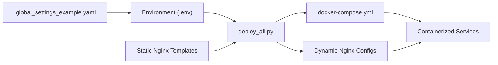

# Configuration Management

<cite>
**Referenced Files in This Document**
- [deploy_all.py](file://deploy/deploy_all.py)
- [.global_settings_example.yaml](file://deploy/config/.global_settings_example.yaml)
- [docker-compose.yml](file://deploy/docker-compose.yml)
- [nginx.conf](file://deploy/deploy_nginx/nginx/nginx.conf)
- [jenkins.conf](file://deploy/deploy_nginx/nginx/conf.d/jenkins.conf)
- [gitlab.conf](file://deploy/deploy_nginx/nginx/conf.d/gitlab.conf)
- [mantisbt.conf](file://deploy/deploy_nginx/nginx/conf.d/mantisbt.conf)
- [artifactory.conf](file://deploy/deploy_nginx/nginx/conf.d/artifactory.conf)
- [langfuse.conf](file://deploy/deploy_nginx/nginx/conf.d/langfuse.conf)
</cite>

## Table of Contents
1. [Introduction](#introduction)
2. [Project Structure](#project-structure)
3. [Core Components](#core-components)
4. [Architecture Overview](#architecture-overview)
5. [Detailed Component Analysis](#detailed-component-analysis)
6. [Dependency Analysis](#dependency-analysis)
7. [Performance Considerations](#performance-considerations)
8. [Troubleshooting Guide](#troubleshooting-guide)
9. [Conclusion](#conclusion)
10. [Appendices](#appendices)

## Introduction
This document explains DeployAgent’s configuration management system with a focus on:
- Multi-layered configuration architecture: global settings, service-specific configurations, and environment variable management
- YAML-based configuration templates and dynamic configuration generation
- Environment variable precedence rules and Docker Compose integration
- Relationship between static templates and runtime configuration
- Examples of customization, environment-specific overrides, and validation procedures
- Persistence mechanisms and automated generation for Nginx and other services

## Project Structure
DeployAgent organizes configuration across three primary layers:
- Global settings template: a YAML blueprint for agent and platform credentials
- Static Nginx templates: reusable configuration fragments for reverse proxy routing
- Runtime orchestration: Docker Compose and Python orchestration script that merge environment variables and generate dynamic runtime configuration

**Diagram sources**
- [deploy_all.py:1-1315](file://deploy/deploy_all.py#L1-L1315)
- [.global_settings_example.yaml:1-31](file://deploy/config/.global_settings_example.yaml#L1-L31)
- [docker-compose.yml:1-222](file://deploy/docker-compose.yml#L1-L222)
- [nginx.conf:1-65](file://deploy/deploy_nginx/nginx/nginx.conf#L1-L65)
- [jenkins.conf:1-43](file://deploy/deploy_nginx/nginx/conf.d/jenkins.conf#L1-L43)
- [gitlab.conf:1-35](file://deploy/deploy_nginx/nginx/conf.d/gitlab.conf#L1-L35)
- [mantisbt.conf:1-35](file://deploy/deploy_nginx/nginx/conf.d/mantisbt.conf#L1-L35)
- [artifactory.conf:1-35](file://deploy/deploy_nginx/nginx/conf.d/artifactory.conf#L1-L35)
- [langfuse.conf:1-35](file://deploy/deploy_nginx/nginx/conf.d/langfuse.conf#L1-L35)

**Section sources**
- [deploy_all.py:1-1315](file://deploy/deploy_all.py#L1-L1315)
- [.global_settings_example.yaml:1-31](file://deploy/config/.global_settings_example.yaml#L1-L31)
- [docker-compose.yml:1-222](file://deploy/docker-compose.yml#L1-L222)
- [nginx.conf:1-65](file://deploy/deploy_nginx/nginx/nginx.conf#L1-L65)
- [jenkins.conf:1-43](file://deploy/deploy_nginx/nginx/conf.d/jenkins.conf#L1-L43)
- [gitlab.conf:1-35](file://deploy/deploy_nginx/nginx/conf.d/gitlab.conf#L1-L35)
- [mantisbt.conf:1-35](file://deploy/deploy_nginx/nginx/conf.d/mantisbt.conf#L1-L35)
- [artifactory.conf:1-35](file://deploy/deploy_nginx/nginx/conf.d/artifactory.conf#L1-L35)
- [langfuse.conf:1-35](file://deploy/deploy_nginx/nginx/conf.d/langfuse.conf#L1-L35)

## Core Components
- Global settings template: Provides a structured YAML blueprint for agent and platform credentials (e.g., Jenkins, GitLab, AI model, Git).
- Static Nginx templates: Define SSL/TLS, proxy headers, timeouts, and backend routing for each service.
- Runtime orchestration: The Python orchestrator loads environment variables, scans ports/networks/volumes, generates Nginx configuration dynamically, and starts services via Docker Compose or ad-hoc containers.

Key responsibilities:
- Environment loading and precedence: .env file, environment variables, and defaults
- Port scanning and conflict resolution
- Dynamic Nginx configuration generation and validation
- Reverse proxy environment variable propagation to backend services
- Docker volume naming and network management

**Section sources**
- [deploy_all.py:209-264](file://deploy/deploy_all.py#L209-L264)
- [deploy_all.py:269-340](file://deploy/deploy_all.py#L269-L340)
- [deploy_all.py:769-872](file://deploy/deploy_all.py#L769-L872)
- [deploy_all.py:1056-1119](file://deploy/deploy_all.py#L1056-L1119)

## Architecture Overview
The configuration architecture follows a layered approach:
- Global settings: YAML template for agent and platform credentials
- Static templates: Nginx configuration fragments and core http context
- Runtime orchestration: Python script merges environment variables and generates dynamic runtime configuration; Docker Compose defines container-level environment and volumes

**Diagram sources**
- [deploy_all.py:1253-1308](file://deploy/deploy_all.py#L1253-L1308)
- [deploy_all.py:769-872](file://deploy/deploy_all.py#L769-L872)
- [docker-compose.yml:1-222](file://deploy/docker-compose.yml#L1-L222)

**Section sources**
- [deploy_all.py:1253-1308](file://deploy/deploy_all.py#L1253-L1308)
- [deploy_all.py:769-872](file://deploy/deploy_all.py#L769-L872)
- [docker-compose.yml:1-222](file://deploy/docker-compose.yml#L1-L222)

## Detailed Component Analysis

### Global Settings Template (.global_settings_example.yaml)
- Purpose: Defines a YAML blueprint for agent and platform credentials and preferences
- Typical keys: Jenkins base URL and credentials, AI model provider and keys, Git user and token, whitelist repositories and branch patterns
- Usage: Serves as a reference for operators to populate .env or CI secret stores; not directly consumed by runtime orchestration

Operational notes:
- Operators should copy this template to a working configuration file and fill in values
- Values here can be overridden by environment variables at runtime

**Section sources**
- [.global_settings_example.yaml:1-31](file://deploy/config/.global_settings_example.yaml#L1-L31)

### Static Nginx Templates
- Core context: Global http settings, logging, gzip, proxy defaults, and include directive for per-service fragments
- Per-service fragments: Define SSL/TLS, listen ports, proxy headers, timeouts, and backend proxy_pass directives
- Jenkins fragment: Special handling for /jenkins/ location with trailing redirects
- GitLab, MantisBT, Artifactory, Langfuse fragments: Standard reverse proxy to internal ports

Operational notes:
- These templates are authoritative for Nginx behavior
- The orchestrator can regenerate per-service fragments at runtime based on detected backend containers and port registry

**Section sources**
- [nginx.conf:1-65](file://deploy/deploy_nginx/nginx/nginx.conf#L1-L65)
- [jenkins.conf:1-43](file://deploy/deploy_nginx/nginx/conf.d/jenkins.conf#L1-L43)
- [gitlab.conf:1-35](file://deploy/deploy_nginx/nginx/conf.d/gitlab.conf#L1-L35)
- [mantisbt.conf:1-35](file://deploy/deploy_nginx/nginx/conf.d/mantisbt.conf#L1-L35)
- [artifactory.conf:1-35](file://deploy/deploy_nginx/nginx/conf.d/artifactory.conf#L1-L35)
- [langfuse.conf:1-35](file://deploy/deploy_nginx/nginx/conf.d/langfuse.conf#L1-L35)

### Runtime Orchestration and Dynamic Configuration Generation (deploy_all.py)
Responsibilities:
- Environment loading and precedence
  - Loads .env file entries into process environment
  - Applies environment variables to port registry and service-specific keys
  - Supports fallback defaults for missing values
- Port scanning and conflict resolution
  - Scans host LISTEN and Docker exposed ports
  - Automatically assigns alternative ports and persists them to .env.auto
- Volume naming and uniqueness
  - Resolves conflicting Docker volume names by appending suffixes
- Reverse proxy configuration
  - Generates per-service Nginx conf.d fragments based on detected running containers
  - Validates generated configuration and restarts Nginx container
- Reverse proxy environment propagation
  - Sets backend-specific environment variables (e.g., external URLs, ports) for services behind Nginx

**Diagram sources**
- [deploy_all.py:209-264](file://deploy/deploy_all.py#L209-L264)
- [deploy_all.py:269-340](file://deploy/deploy_all.py#L269-L340)
- [deploy_all.py:769-872](file://deploy/deploy_all.py#L769-L872)
- [deploy_all.py:701-756](file://deploy/deploy_all.py#L701-L756)

**Section sources**
- [deploy_all.py:209-264](file://deploy/deploy_all.py#L209-L264)
- [deploy_all.py:269-340](file://deploy/deploy_all.py#L269-L340)
- [deploy_all.py:769-872](file://deploy/deploy_all.py#L769-L872)
- [deploy_all.py:701-756](file://deploy/deploy_all.py#L701-L756)

### Docker Compose Integration (docker-compose.yml)
- Networks and volumes: Centralized network and named volumes with environment-driven names
- Service environment: Environment variables injected into containers (e.g., AGENT_GATEWAY_TOKEN, LOG_LEVEL, JENKINS_OPTS)
- Port exposure: Host bindings and container ports driven by environment variables
- Health checks: Service-specific health checks for readiness
- Labels: Metadata for service identification and versioning

Operational notes:
- Variables like COMPOSE_PROJECT_NAME, DOCKER_NETWORK, and service-specific *_PORT_* controls are applied from environment
- Nginx binds expose HTTPS endpoints mapped to internal container ports defined in the orchestrator

**Section sources**
- [docker-compose.yml:1-222](file://deploy/docker-compose.yml#L1-L222)

## Dependency Analysis
Configuration dependencies across layers:
- Global settings template informs operator-provided values that feed into environment variables
- Static Nginx templates define the authoritative behavior for reverse proxy
- Runtime orchestration depends on environment variables and registry maps to generate dynamic Nginx configs and propagate backend environment
- Docker Compose consumes environment variables to configure container environments and volumes

**Diagram sources**
- [deploy_all.py:1-1315](file://deploy/deploy_all.py#L1-L1315)
- [.global_settings_example.yaml:1-31](file://deploy/config/.global_settings_example.yaml#L1-L31)
- [docker-compose.yml:1-222](file://deploy/docker-compose.yml#L1-L222)
- [nginx.conf:1-65](file://deploy/deploy_nginx/nginx/nginx.conf#L1-L65)

**Section sources**
- [deploy_all.py:1-1315](file://deploy/deploy_all.py#L1-L1315)
- [docker-compose.yml:1-222](file://deploy/docker-compose.yml#L1-L222)

## Performance Considerations
- Port scanning and conflict detection avoid collisions and reduce startup failures
- Dynamic Nginx configuration generation avoids manual maintenance and reduces drift
- Named volumes and unique naming prevent accidental reuse and improve reliability
- Health checks in Compose and Nginx ensure quick detection of misconfiguration

## Troubleshooting Guide
Common configuration issues and resolutions:
- Port conflicts
  - Symptom: Deployment fails due to occupied ports
  - Resolution: Run environment scan to auto-assign alternative ports; review .env.auto for new assignments
- Nginx configuration errors
  - Symptom: Nginx container fails to start or reports invalid config
  - Resolution: Regenerate conf.d/* using the orchestrator; confirm generated files match detected backends; validate with Nginx test command
- Backend service connectivity
  - Symptom: Services behind Nginx cannot reach backends
  - Resolution: Verify reverse proxy environment variables (e.g., external URLs, ports) are set; ensure Docker network connectivity
- Volume conflicts
  - Symptom: Volume creation fails due to name conflicts
  - Resolution: Allow the orchestrator to resolve unique names; inspect resolved names in summary output
- Environment precedence confusion
  - Symptom: Changes to .env do not take effect
  - Resolution: Ensure .env is loaded before deployment; confirm environment variables override defaults as intended

Validation procedures:
- Confirm environment variables are present and correct before deployment
- Validate Nginx configuration after generation
- Inspect Docker Compose logs for container health and readiness
- Review generated .env.auto for port allocations

**Section sources**
- [deploy_all.py:269-340](file://deploy/deploy_all.py#L269-L340)
- [deploy_all.py:769-872](file://deploy/deploy_all.py#L769-L872)
- [deploy_all.py:961-1051](file://deploy/deploy_all.py#L961-L1051)

## Conclusion
DeployAgent’s configuration management combines a global YAML template, static Nginx templates, and a dynamic orchestration layer driven by environment variables. The system supports environment-specific overrides, automated port/volume resolution, and runtime generation of Nginx configurations. Docker Compose integrates environment variables to provision services consistently across deployments.

## Appendices

### Environment Variable Precedence Rules
- Operator-defined values in .env override defaults
- Environment variables set in the shell/process override .env during orchestration
- Static templates and Compose define defaults; environment variables supersede these defaults
- Registry maps and generated .env.auto persist computed values for reproducibility

**Section sources**
- [deploy_all.py:209-264](file://deploy/deploy_all.py#L209-L264)
- [deploy_all.py:254-264](file://deploy/deploy_all.py#L254-L264)
- [docker-compose.yml:1-222](file://deploy/docker-compose.yml#L1-L222)

### Example Customization Scenarios
- Customize Jenkins base URL and credentials
  - Populate global settings template and/or .env; these values influence backend service configuration
- Override service ports
  - Set *_PORT_* variables in .env; orchestrator applies and persists alternative ports to .env.auto
- Enable Nginx HTTPS for specific services
  - Select deployment modes that include Nginx; orchestrator generates per-service SSL configs and sets backend external URLs
- Configure Git and GitLab tokens
  - Fill credentials in global settings or .env; backend services consume these values

**Section sources**
- [.global_settings_example.yaml:1-31](file://deploy/config/.global_settings_example.yaml#L1-L31)
- [deploy_all.py:1056-1119](file://deploy/deploy_all.py#L1056-L1119)
- [deploy_all.py:701-756](file://deploy/deploy_all.py#L701-L756)

### Configuration Persistence Mechanisms
- .env: Operator-managed persistent configuration
- .env.auto: Auto-generated port allocations derived from environment scan
- Named volumes: Unique volume names resolved at runtime to avoid conflicts
- Generated Nginx configs: Conf.d fragments written to disk and included by nginx.conf

**Section sources**
- [deploy_all.py:219-233](file://deploy/deploy_all.py#L219-L233)
- [deploy_all.py:477-500](file://deploy/deploy_all.py#L477-L500)
- [deploy_all.py:769-872](file://deploy/deploy_all.py#L769-L872)

### Automated Configuration Generation for Nginx and Other Services
- Nginx
  - Orchestrator detects running backends and writes per-service conf.d/*.conf
  - Generates SSL certificates if missing and validates configuration before restarting
- Other services
  - Compose injects environment variables into containers
  - Scripts for individual services can also read .env and environment variables to tailor behavior

**Section sources**
- [deploy_all.py:591-681](file://deploy/deploy_all.py#L591-L681)
- [deploy_all.py:769-872](file://deploy/deploy_all.py#L769-L872)
- [docker-compose.yml:1-222](file://deploy/docker-compose.yml#L1-L222)