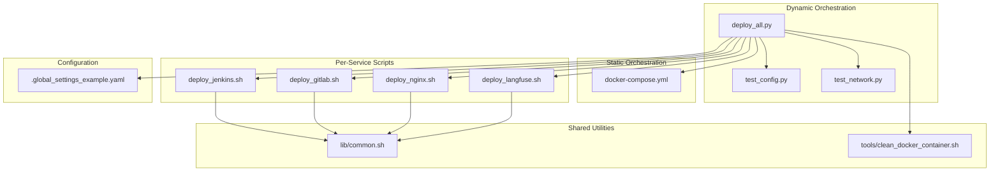
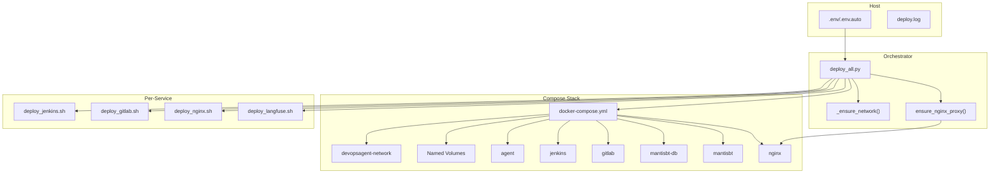
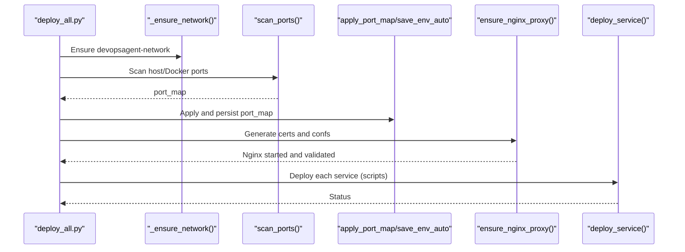
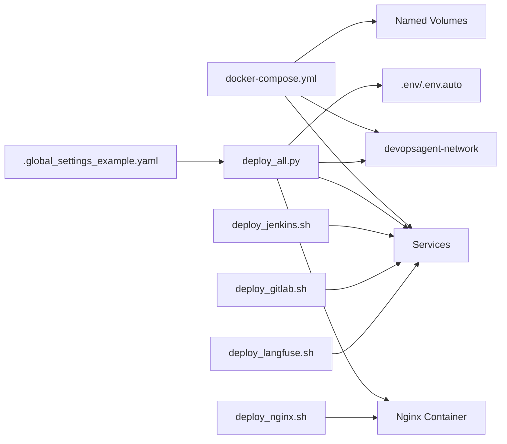

# Docker Compose Integration

<cite>
**Referenced Files in This Document**
- [docker-compose.yml](file://deploy/docker-compose.yml)
- [deploy_all.py](file://deploy/deploy_all.py)
- [common.sh](file://deploy/lib/common.sh)
- [deploy_jenkins.sh](file://deploy/deploy_jenkins/deploy_jenkins.sh)
- [deploy_gitlab.sh](file://deploy/deploy_gitlab/deploy_gitlab.sh)
- [deploy_nginx.sh](file://deploy/deploy_nginx/deploy_nginx.sh)
- [deploy_langfuse.sh](file://deploy/deploy_langfuse/deploy_langfuse.sh)
- [.global_settings_example.yaml](file://deploy/config/.global_settings_example.yaml)
- [test_config.py](file://deploy/tests/test_config.py)
- [test_network.py](file://deploy/tests/test_network.py)
- [clean_docker_container.sh](file://deploy/tools/clean_docker_container.sh)
</cite>

## Table of Contents
1. [Introduction](#introduction)
2. [Project Structure](#project-structure)
3. [Core Components](#core-components)
4. [Architecture Overview](#architecture-overview)
5. [Detailed Component Analysis](#detailed-component-analysis)
6. [Dependency Analysis](#dependency-analysis)
7. [Performance Considerations](#performance-considerations)
8. [Troubleshooting Guide](#troubleshooting-guide)
9. [Conclusion](#conclusion)
10. [Appendices](#appendices)

## Introduction
This document explains DeployAgent’s Docker Compose integration and container orchestration configuration. It covers the static Docker Compose template, dynamic configuration generation, network and volume management, port mapping strategies, reverse proxy integration, and the relationship between static templates and runtime-generated configurations. It also provides customization examples, troubleshooting guidance, and operational best practices for deploying and maintaining the orchestrated stack.

## Project Structure
The orchestration spans a static Compose template and dynamic orchestration logic:
- Static Compose: defines networks, volumes, and service specs for core services.
- Dynamic orchestration: Python script scans ports, ensures Docker network, generates Nginx configs, and coordinates service deployments.
- Per-service scripts: handle individual service deployments and optional Docker Compose usage (e.g., Langfuse).
- Shared library: Bash utilities for Docker detection, image pulling, and common tasks.

**Diagram sources**
- [docker-compose.yml:1-222](file://deploy/docker-compose.yml#L1-L222)
- [deploy_all.py:1-1315](file://deploy/deploy_all.py#L1-L1315)
- [deploy_jenkins.sh:1-385](file://deploy/deploy_jenkins/deploy_jenkins.sh#L1-L385)
- [deploy_gitlab.sh:1-445](file://deploy/deploy_gitlab/deploy_gitlab.sh#L1-L445)
- [deploy_nginx.sh:1-712](file://deploy/deploy_nginx/deploy_nginx.sh#L1-L712)
- [deploy_langfuse.sh:1-164](file://deploy/deploy_langfuse/deploy_langfuse.sh#L1-L164)
- [common.sh:1-566](file://deploy/lib/common.sh#L1-L566)
- [test_config.py:1-131](file://deploy/tests/test_config.py#L1-L131)
- [test_network.py:1-82](file://deploy/tests/test_network.py#L1-L82)
- [clean_docker_container.sh:1-248](file://deploy/tools/clean_docker_container.sh#L1-L248)
- [.global_settings_example.yaml:1-31](file://deploy/config/.global_settings_example.yaml#L1-L31)

**Section sources**
- [docker-compose.yml:1-222](file://deploy/docker-compose.yml#L1-L222)
- [deploy_all.py:1-1315](file://deploy/deploy_all.py#L1-L1315)

## Core Components
- Static Compose Template
  - Defines a named bridge network and per-service named volumes.
  - Declares core services: agent, Jenkins, GitLab, MantisBT (DB and app), and Nginx.
  - Uses environment variables and labels for runtime customization and service metadata.
- Dynamic Orchestration Engine
  - Scans host and Docker resources to avoid conflicts.
  - Applies environment variables and port mappings.
  - Generates Nginx reverse proxy configs and starts Nginx.
  - Coordinates per-service deployments and cleans up legacy containers.
- Per-Service Deployment Scripts
  - Jenkins: runs a containerized Jenkins with named volumes and Docker socket mount.
  - GitLab: supports named volumes and HTTPS reverse proxy configuration.
  - Nginx: detects running backends and generates per-service configs.
  - Langfuse: uses its own docker-compose.yml from a cloned repo.
- Shared Library
  - Provides Docker detection, image pulling with fallback mirrors, and helper functions.

**Section sources**
- [docker-compose.yml:3-222](file://deploy/docker-compose.yml#L3-L222)
- [deploy_all.py:40-142](file://deploy/deploy_all.py#L40-L142)
- [deploy_jenkins.sh:43-113](file://deploy/deploy_jenkins/deploy_jenkins.sh#L43-L113)
- [deploy_gitlab.sh:57-156](file://deploy/deploy_gitlab/deploy_gitlab.sh#L57-L156)
- [deploy_nginx.sh:58-365](file://deploy/deploy_nginx/deploy_nginx.sh#L58-L365)
- [deploy_langfuse.sh:46-139](file://deploy/deploy_langfuse/deploy_langfuse.sh#L46-L139)
- [common.sh:101-124](file://deploy/lib/common.sh#L101-L124)

## Architecture Overview
The orchestration integrates static Compose with dynamic runtime decisions:
- Static Compose defines the baseline network and volumes.
- deploy_all.py orchestrates environment scanning, port allocation, Nginx configuration, and service startup.
- Per-service scripts either reuse Compose or bring up services via docker run with explicit mounts and ports.
- Nginx acts as a reverse proxy for HTTPS access to Jenkins, GitLab, MantisBT, and other services.

**Diagram sources**
- [docker-compose.yml:3-222](file://deploy/docker-compose.yml#L3-L222)
- [deploy_all.py:757-872](file://deploy/deploy_all.py#L757-L872)
- [deploy_nginx.sh:58-365](file://deploy/deploy_nginx/deploy_nginx.sh#L58-L365)
- [deploy_jenkins.sh:43-113](file://deploy/deploy_jenkins/deploy_jenkins.sh#L43-L113)
- [deploy_gitlab.sh:57-156](file://deploy/deploy_gitlab/deploy_gitlab.sh#L57-L156)
- [deploy_langfuse.sh:46-139](file://deploy/deploy_langfuse/deploy_langfuse.sh#L46-L139)

## Detailed Component Analysis

### Static Compose Template
- Network
  - Bridge network named via environment variable for isolation and reuse.
- Volumes
  - Named volumes per service to persist data and avoid filesystem permission issues.
- Services
  - agent: privileged-like hardening, health checks, and gateway token injection.
  - jenkins: exposes web and agent ports, mounts Docker socket for pipeline builds.
  - gitlab: configurable hostname and ports; sets Omnibus config for HTTPS redirection and trusted proxies.
  - mantisbt-db: MariaDB with environment-driven credentials and timezone.
  - mantisbt: PHP app container depending on DB; connects via service name.
  - nginx: reverse proxy with per-service SSL termination and proxy configs.

Key environment variables and labels enable dynamic customization and metadata for discovery.

**Section sources**
- [docker-compose.yml:3-222](file://deploy/docker-compose.yml#L3-L222)

### Dynamic Orchestration Engine (deploy_all.py)
- Port Scanning and Allocation
  - Scans host LISTEN sockets and Docker exposed ports to avoid conflicts.
  - Automatically assigns alternative ports and writes .env.auto for reproducibility.
- Docker Network and Volume Management
  - Ensures devopsagent-network exists.
  - Resolves conflicting named volumes by appending numeric suffixes.
- Reverse Proxy Integration
  - Generates Nginx SSL certs if missing.
  - Detects running backends and creates per-service confs.
  - Starts Nginx with mapped ports and validates configuration.
- Service Deployment Coordination
  - Executes per-service scripts with environment propagation.
  - Cleans up legacy containers sharing the same logical service names.
- Configuration Propagation
  - Sets environment variables for HTTPS reverse proxy URLs and ports.

**Diagram sources**
- [deploy_all.py:269-340](file://deploy/deploy_all.py#L269-L340)
- [deploy_all.py:502-545](file://deploy/deploy_all.py#L502-L545)
- [deploy_all.py:757-872](file://deploy/deploy_all.py#L757-L872)

**Section sources**
- [deploy_all.py:269-340](file://deploy/deploy_all.py#L269-L340)
- [deploy_all.py:502-545](file://deploy/deploy_all.py#L502-L545)
- [deploy_all.py:757-872](file://deploy/deploy_all.py#L757-L872)

### Jenkins Deployment (docker run)
- Uses named volumes or local directories for persistence.
- Mounts Docker socket for build agents.
- Supports HTTPS reverse proxy via Nginx and prints access URLs.

**Section sources**
- [deploy_jenkins.sh:43-113](file://deploy/deploy_jenkins/deploy_jenkins.sh#L43-L113)
- [deploy_jenkins.sh:224-254](file://deploy/deploy_jenkins/deploy_jenkins.sh#L224-L254)

### GitLab Deployment (docker run)
- Configurable ports for HTTP, HTTPS, and SSH.
- Supports named volumes and HTTPS reverse proxy with trusted proxies and forwarded headers.

**Section sources**
- [deploy_gitlab.sh:57-156](file://deploy/deploy_gitlab/deploy_gitlab.sh#L57-L156)
- [deploy_gitlab.sh:158-230](file://deploy/deploy_gitlab/deploy_gitlab.sh#L158-L230)

### Nginx Reverse Proxy (dynamic generation)
- Detects running backends and generates per-service SSL-enabled configs.
- Starts Nginx with mapped ports and validates configuration.

**Section sources**
- [deploy_nginx.sh:58-365](file://deploy/deploy_nginx/deploy_nginx.sh#L58-L365)

### Langfuse Deployment (external docker-compose)
- Clones the official repository and brings up services with docker compose.
- Generates environment variables for database and Redis connectivity.

**Section sources**
- [deploy_langfuse.sh:46-139](file://deploy/deploy_langfuse/deploy_langfuse.sh#L46-L139)

### Shared Utilities (common.sh)
- Detects Docker and Compose availability.
- Provides multi-source image pull with fallback mirrors.
- Offers helper functions for password retrieval and device management.

**Section sources**
- [common.sh:101-124](file://deploy/lib/common.sh#L101-L124)
- [common.sh:174-335](file://deploy/lib/common.sh#L174-L335)

## Dependency Analysis
- Static Compose Dependencies
  - Services depend on devopsagent-network for inter-container communication.
  - Volumes are referenced by service names to ensure persistence.
- Dynamic Orchestration Dependencies
  - deploy_all.py depends on per-service scripts for deployment.
  - Nginx depends on backend container names for proxy_pass targets.
- Environment and Configuration
  - .env and .env.auto drive port and bind address overrides.
  - .global_settings_example.yaml provides example configuration for integrations.

**Diagram sources**
- [docker-compose.yml:3-222](file://deploy/docker-compose.yml#L3-L222)
- [deploy_all.py:1-1315](file://deploy/deploy_all.py#L1-L1315)
- [deploy_jenkins.sh:1-385](file://deploy/deploy_jenkins/deploy_jenkins.sh#L1-L385)
- [deploy_gitlab.sh:1-445](file://deploy/deploy_gitlab/deploy_gitlab.sh#L1-L445)
- [deploy_nginx.sh:1-712](file://deploy/deploy_nginx/deploy_nginx.sh#L1-L712)
- [deploy_langfuse.sh:1-164](file://deploy/deploy_langfuse/deploy_langfuse.sh#L1-L164)
- [.global_settings_example.yaml:1-31](file://deploy/config/.global_settings_example.yaml#L1-L31)

**Section sources**
- [test_config.py:13-127](file://deploy/tests/test_config.py#L13-L127)
- [test_network.py:20-82](file://deploy/tests/test_network.py#L20-L82)

## Performance Considerations
- Resource Constraints
  - Jenkins and GitLab can be memory-intensive; tune JAVA_OPTS and shm_size as needed.
- Network Overhead
  - Using a single bridge network reduces routing overhead; keep service counts reasonable.
- Reverse Proxy Efficiency
  - Nginx handles SSL termination and connection pooling; ensure adequate timeouts for long-running operations.
- Image Pull Reliability
  - Multi-source image pulls reduce downtime during network issues.

[No sources needed since this section provides general guidance]

## Troubleshooting Guide
- Port Conflicts
  - Use scan-only mode to identify conflicts and regenerate .env.auto.
  - Redeploy after adjusting port values in .env.
- Docker Network Issues
  - Ensure devopsagent-network exists; the orchestrator creates it automatically.
  - Verify containers are connected to the network.
- Nginx Configuration Failures
  - Check generated confs under deploy_nginx/nginx/conf.d.
  - Validate syntax and reload Nginx after changes.
- Service Startup Problems
  - Review per-service logs and ensure named volumes are writable.
  - Use the cleanup tool to remove stale containers and volumes.
- Password Retrieval
  - Use built-in helpers to fetch initial passwords for Jenkins and GitLab.

**Section sources**
- [deploy_all.py:269-340](file://deploy/deploy_all.py#L269-L340)
- [deploy_all.py:757-872](file://deploy/deploy_all.py#L757-L872)
- [deploy_nginx.sh:58-365](file://deploy/deploy_nginx/deploy_nginx.sh#L58-L365)
- [deploy_jenkins.sh:115-204](file://deploy/deploy_jenkins/deploy_jenkins.sh#L115-L204)
- [deploy_gitlab.sh:158-230](file://deploy/deploy_gitlab/deploy_gitlab.sh#L158-L230)
- [clean_docker_container.sh:1-248](file://deploy/tools/clean_docker_container.sh#L1-L248)

## Conclusion
DeployAgent combines a static Docker Compose template with a robust dynamic orchestration engine to deliver a production-ready CI/CD and DevOps platform. The system automates conflict detection, reverse proxy configuration, and service lifecycle management while preserving flexibility for customization. By leveraging named networks, volumes, and environment-driven configuration, it achieves reliable, repeatable deployments across diverse environments.

[No sources needed since this section summarizes without analyzing specific files]

## Appendices

### Customizing Compose Configurations
- Override Environment Variables
  - Set COMPOSE_PROJECT_NAME, DOCKER_NETWORK, and service-specific variables to change names and bindings.
- Add New Services
  - Extend docker-compose.yml with a new service definition, ensuring it joins devopsagent-network and uses named volumes where appropriate.
- Adjust Port Mappings
  - Modify port mappings in .env or .env.auto; the orchestrator applies these values at runtime.
- Integrate Additional Backends
  - Add new entries to SERVICE_CONFIG and DEPLOY_MODES in deploy_all.py to support new services in the orchestration.

**Section sources**
- [docker-compose.yml:3-222](file://deploy/docker-compose.yml#L3-L222)
- [deploy_all.py:61-142](file://deploy/deploy_all.py#L61-L142)
- [deploy_all.py:1056-1119](file://deploy/deploy_all.py#L1056-L1119)

### Adding New Services
- Define Service in Compose
  - Add a new service block with networks, volumes, and environment variables.
- Update Orchestration
  - Add SERVICE_CONFIG entry with deploy_script, container name, and Nginx mapping keys.
- Update Deployment Modes
  - Add a new mode in DEPLOY_MODES to include the service in standard deployment flows.

**Section sources**
- [deploy_all.py:61-142](file://deploy/deploy_all.py#L61-L142)
- [deploy_all.py:131-142](file://deploy/deploy_all.py#L131-L142)

### Port Mapping Strategies
- Static Defaults
  - Predefined port registries ensure consistent defaults across services.
- Dynamic Allocation
  - The orchestrator scans for conflicts and assigns alternative ports, persisting them in .env.auto.
- Reverse Proxy Ports
  - Nginx listens on dedicated HTTPS ports for each backend; ensure these do not overlap with host services.

**Section sources**
- [deploy_all.py:40-59](file://deploy/deploy_all.py#L40-L59)
- [deploy_all.py:302-340](file://deploy/deploy_all.py#L302-L340)
- [deploy_all.py:701-756](file://deploy/deploy_all.py#L701-L756)

### Service Discovery Mechanisms
- Docker Networks
  - All services join devopsagent-network, enabling name-based discovery.
- Labels and Metadata
  - Services include labels for service identification and versioning.
- Reverse Proxy Routing
  - Nginx routes traffic to backend containers by their container names.

**Section sources**
- [docker-compose.yml:47-66](file://deploy/docker-compose.yml#L47-L66)
- [deploy_nginx.sh:130-327](file://deploy/deploy_nginx/deploy_nginx.sh#L130-L327)

### Relationship Between Static Templates and Dynamic Configurations
- Static Template
  - Defines network, volumes, and service specs with environment variable placeholders.
- Dynamic Generation
  - deploy_all.py injects runtime values (ports, binds, URLs) and generates Nginx configs based on detected running backends.
- Per-Service Scripts
  - Some services (e.g., Jenkins, GitLab) are deployed via docker run with explicit mounts and ports; others (e.g., Langfuse) use their own docker-compose.yml.

**Section sources**
- [docker-compose.yml:3-222](file://deploy/docker-compose.yml#L3-L222)
- [deploy_all.py:757-872](file://deploy/deploy_all.py#L757-L872)
- [deploy_langfuse.sh:68-98](file://deploy/deploy_langfuse/deploy_langfuse.sh#L68-L98)