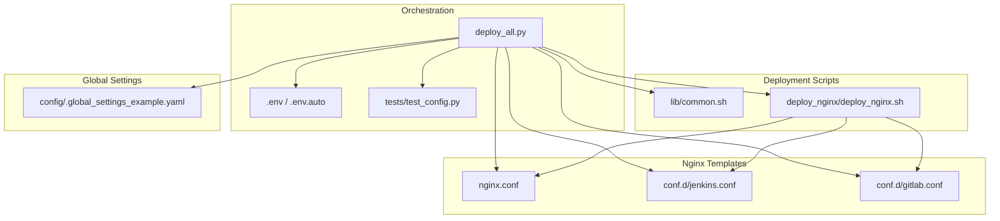
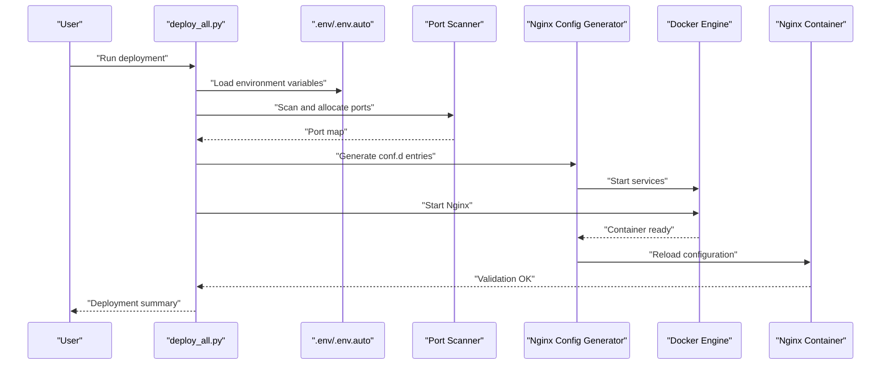
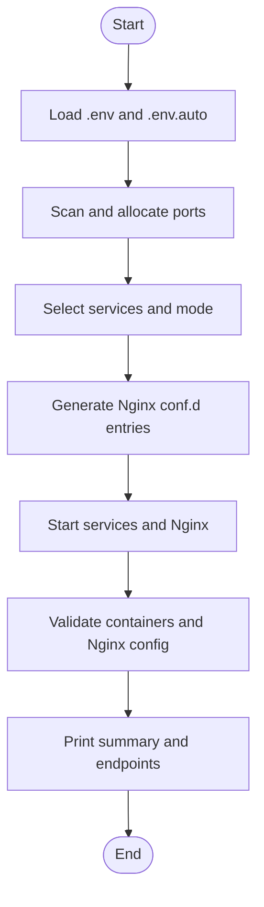
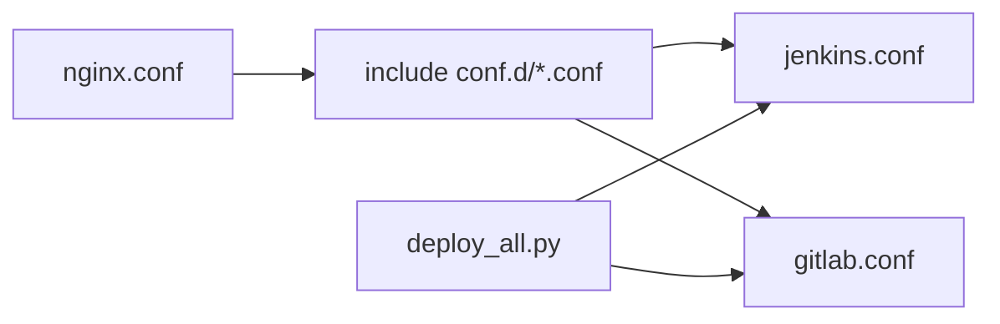
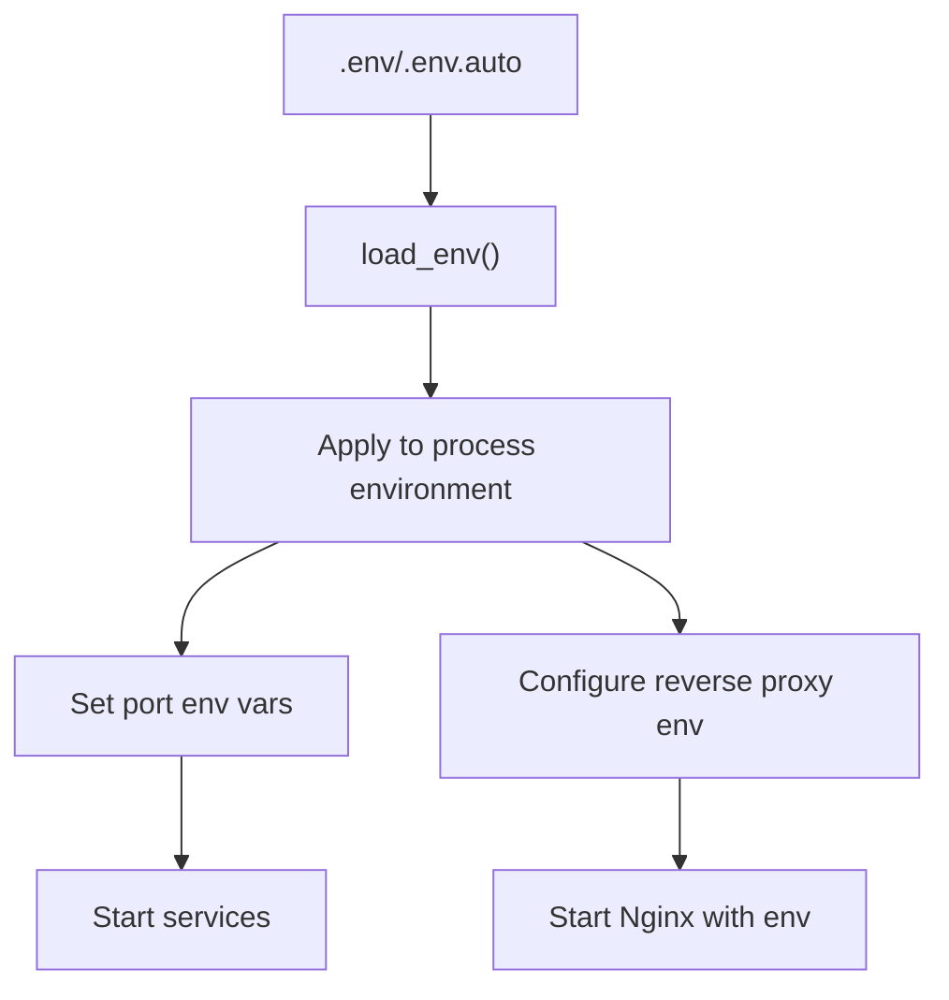
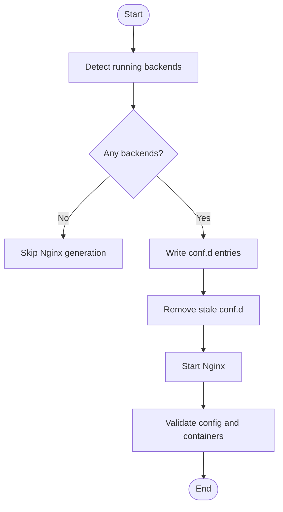
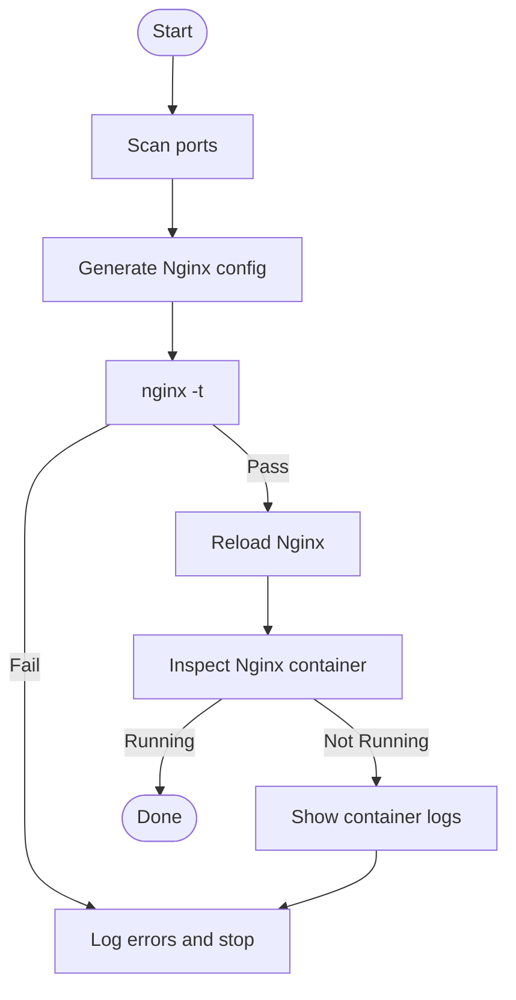
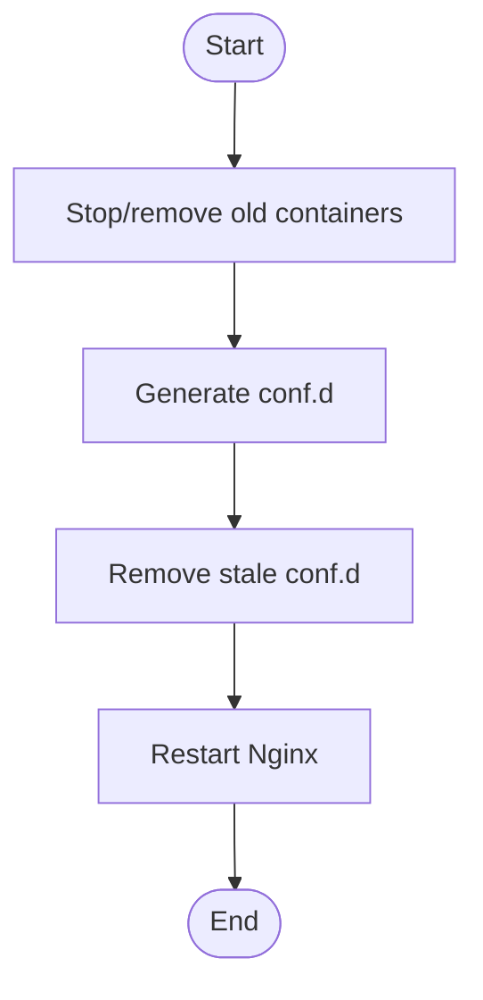
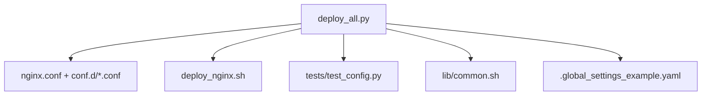

# Dynamic Configuration Generation

<cite>
**Referenced Files in This Document**
- [deploy_all.py](file://deploy/deploy_all.py)
- [test_config.py](file://deploy/tests/test_config.py)
- [.global_settings_example.yaml](file://deploy/config/.global_settings_example.yaml)
- [common.sh](file://deploy/lib/common.sh)
- [deploy_nginx.sh](file://deploy/deploy_nginx/deploy_nginx.sh)
- [nginx.conf](file://deploy/deploy_nginx/nginx/nginx.conf)
- [jenkins.conf](file://deploy/deploy_nginx/nginx/conf.d/jenkins.conf)
- [gitlab.conf](file://deploy/deploy_nginx/nginx/conf.d/gitlab.conf)
</cite>

## Table of Contents
1. [Introduction](#introduction)
2. [Project Structure](#project-structure)
3. [Core Components](#core-components)
4. [Architecture Overview](#architecture-overview)
5. [Detailed Component Analysis](#detailed-component-analysis)
6. [Dependency Analysis](#dependency-analysis)
7. [Performance Considerations](#performance-considerations)
8. [Troubleshooting Guide](#troubleshooting-guide)
9. [Conclusion](#conclusion)
10. [Appendices](#appendices)

## Introduction
This document explains DeployAgent’s dynamic configuration generation system. It covers how runtime configurations are produced from static templates, merged with user inputs, validated, and applied to services. It also documents the templating and interpolation mechanisms, conditional logic, validation and error handling, rollback procedures, and practical guidance for extending the system.

DeployAgent orchestrates multiple services behind a unified reverse proxy. The dynamic generation focuses on:
- Port allocation and conflict resolution
- Environment variable propagation and interpolation
- Nginx configuration generation and reloading
- Validation of configuration correctness and container health
- Rollback and cleanup procedures when deployments fail

## Project Structure
The dynamic configuration system spans Python orchestration, Bash deployment scripts, and static Nginx templates. The key areas are:
- Python orchestration for scanning, merging, and applying runtime configuration
- Static Nginx template files under deploy_nginx/nginx
- Per-service Nginx configuration fragments under deploy_nginx/nginx/conf.d
- Shared Bash library for logging, environment loading, and common utilities
- Global YAML settings for agent-level configuration

**Diagram sources**
- [deploy_all.py:1-1315](file://deploy/deploy_all.py#L1-L1315)
- [deploy_nginx.sh:1-712](file://deploy/deploy_nginx/deploy_nginx.sh#L1-L712)
- [nginx.conf:1-65](file://deploy/deploy_nginx/nginx/nginx.conf#L1-L65)
- [jenkins.conf:1-43](file://deploy/deploy_nginx/nginx/conf.d/jenkins.conf#L1-L43)
- [gitlab.conf:1-35](file://deploy/deploy_nginx/nginx/conf.d/gitlab.conf#L1-L35)
- [common.sh:1-566](file://deploy/lib/common.sh#L1-L566)
- [.global_settings_example.yaml:1-31](file://deploy/config/.global_settings_example.yaml#L1-L31)

**Section sources**
- [deploy_all.py:1-1315](file://deploy/deploy_all.py#L1-L1315)
- [deploy_nginx.sh:1-712](file://deploy/deploy_nginx/deploy_nginx.sh#L1-L712)
- [nginx.conf:1-65](file://deploy/deploy_nginx/nginx/nginx.conf#L1-L65)
- [jenkins.conf:1-43](file://deploy/deploy_nginx/nginx/conf.d/jenkins.conf#L1-L43)
- [gitlab.conf:1-35](file://deploy/deploy_nginx/nginx/conf.d/gitlab.conf#L1-L35)
- [common.sh:1-566](file://deploy/lib/common.sh#L1-L566)
- [.global_settings_example.yaml:1-31](file://deploy/config/.global_settings_example.yaml#L1-L31)

## Core Components
- Orchestration engine (Python): Scans ports, merges environment inputs, generates Nginx configs, applies environment variables, and manages deployment lifecycle.
- Static Nginx templates: Base nginx.conf and per-service conf.d fragments define the structural configuration.
- Deployment scripts (Bash): Load environment, generate certificates, detect running containers, write conf.d entries, and manage container lifecycle.
- Shared library (Bash): Provides logging, environment loading, port checks, and helper utilities.
- Global YAML settings: Defines agent-level configuration keys for credentials and preferences.

Key responsibilities:
- Port registry and conflict resolution
- Environment variable interpolation and propagation
- Conditional Nginx configuration generation
- Validation via container inspection and Nginx syntax checks
- Cleanup and rollback on failure

**Section sources**
- [deploy_all.py:40-142](file://deploy/deploy_all.py#L40-L142)
- [deploy_all.py:269-340](file://deploy/deploy_all.py#L269-L340)
- [deploy_all.py:769-873](file://deploy/deploy_all.py#L769-L873)
- [deploy_nginx.sh:58-365](file://deploy/deploy_nginx/deploy_nginx.sh#L58-L365)
- [common.sh:130-151](file://deploy/lib/common.sh#L130-L151)
- [.global_settings_example.yaml:1-31](file://deploy/config/.global_settings_example.yaml#L1-L31)

## Architecture Overview
The system follows a deterministic pipeline:
1. Environment discovery: Load .env and .env.auto, apply to process environment.
2. Port scanning and allocation: Detect occupied ports and assign alternatives.
3. Service selection: Choose deployment modes and services.
4. Nginx configuration generation: Detect running backends and write conf.d entries.
5. Container orchestration: Start services and Nginx, validate configuration.
6. Validation and reporting: Verify container status and Nginx syntax.

**Diagram sources**
- [deploy_all.py:1253-1311](file://deploy/deploy_all.py#L1253-L1311)
- [deploy_all.py:269-340](file://deploy/deploy_all.py#L269-L340)
- [deploy_all.py:769-873](file://deploy/deploy_all.py#L769-L873)
- [deploy_nginx.sh:58-365](file://deploy/deploy_nginx/deploy_nginx.sh#L58-L365)

## Detailed Component Analysis

### Orchestration Engine (Python)
The orchestration engine centralizes dynamic configuration generation:
- Port registry and conflict resolution: Maintains default port mappings and assigns alternatives when collisions occur.
- Environment merging: Loads .env and .env.auto, updates process environment, and propagates values to child processes.
- Service orchestration: Deploys services and conditionally starts Nginx, connecting containers to the shared network.
- Nginx configuration generation: Iterates detected backends, writes conf.d entries, and restarts Nginx with validation.

**Diagram sources**
- [deploy_all.py:1253-1311](file://deploy/deploy_all.py#L1253-L1311)
- [deploy_all.py:269-340](file://deploy/deploy_all.py#L269-L340)
- [deploy_all.py:769-873](file://deploy/deploy_all.py#L769-L873)

**Section sources**
- [deploy_all.py:40-142](file://deploy/deploy_all.py#L40-L142)
- [deploy_all.py:209-264](file://deploy/deploy_all.py#L209-L264)
- [deploy_all.py:269-340](file://deploy/deploy_all.py#L269-L340)
- [deploy_all.py:769-873](file://deploy/deploy_all.py#L769-L873)

### Nginx Template System and Interpolation
Static Nginx templates define the base configuration and per-service fragments. The orchestration engine dynamically generates conf.d entries based on detected running backends and environment variables.

Key behaviors:
- Base template: Defines global HTTP settings, proxy headers, timeouts, and includes conf.d.
- Per-service fragments: Define SSL, listen ports, and proxy_pass directives for each backend.
- Dynamic generation: The generator detects running containers, computes port mappings, and writes conf.d entries accordingly.

**Diagram sources**
- [nginx.conf:1-65](file://deploy/deploy_nginx/nginx/nginx.conf#L1-L65)
- [jenkins.conf:1-43](file://deploy/deploy_nginx/nginx/conf.d/jenkins.conf#L1-L43)
- [gitlab.conf:1-35](file://deploy/deploy_nginx/nginx/conf.d/gitlab.conf#L1-L35)
- [deploy_all.py:791-825](file://deploy/deploy_all.py#L791-L825)

**Section sources**
- [nginx.conf:1-65](file://deploy/deploy_nginx/nginx/nginx.conf#L1-L65)
- [jenkins.conf:1-43](file://deploy/deploy_nginx/nginx/conf.d/jenkins.conf#L1-L43)
- [gitlab.conf:1-35](file://deploy/deploy_nginx/nginx/conf.d/gitlab.conf#L1-L35)
- [deploy_all.py:591-681](file://deploy/deploy_all.py#L591-L681)
- [deploy_all.py:791-825](file://deploy/deploy_all.py#L791-L825)

### Environment Variables and Interpolation
Environment variables drive configuration interpolation:
- .env and .env.auto: Loaded and exported to the process environment.
- Port mapping: Updated environment variables reflect allocated ports.
- Reverse proxy environment: Generates HTTPS proxy URLs and related variables for backends.

**Diagram sources**
- [deploy_all.py:209-264](file://deploy/deploy_all.py#L209-L264)
- [deploy_all.py:701-756](file://deploy/deploy_all.py#L701-L756)
- [common.sh:130-151](file://deploy/lib/common.sh#L130-L151)

**Section sources**
- [deploy_all.py:209-264](file://deploy/deploy_all.py#L209-L264)
- [deploy_all.py:701-756](file://deploy/deploy_all.py#L701-L756)
- [common.sh:130-151](file://deploy/lib/common.sh#L130-L151)

### Conditional Configuration Logic
Conditional logic determines which services and Nginx entries are generated:
- Backend detection: Only generate conf.d entries for running containers.
- Mode selection: Full vs standalone deployments influence whether Nginx is included.
- Cleanup: Remove stale conf.d entries when backends are missing.

**Diagram sources**
- [deploy_all.py:791-825](file://deploy/deploy_all.py#L791-L825)
- [deploy_all.py:848-872](file://deploy/deploy_all.py#L848-L872)

**Section sources**
- [deploy_all.py:791-825](file://deploy/deploy_all.py#L791-L825)
- [deploy_all.py:848-872](file://deploy/deploy_all.py#L848-L872)

### Validation and Error Handling
Validation steps ensure configuration correctness:
- Port scanning: Confirms availability and records allocations.
- Nginx syntax: Validates configuration before reloading.
- Container status: Checks Nginx container status and logs on failure.
- Error reporting: Comprehensive logging and error messages guide remediation.

**Diagram sources**
- [deploy_all.py:269-340](file://deploy/deploy_all.py#L269-L340)
- [deploy_all.py:848-872](file://deploy/deploy_all.py#L848-L872)

**Section sources**
- [deploy_all.py:269-340](file://deploy/deploy_all.py#L269-L340)
- [deploy_all.py:848-872](file://deploy/deploy_all.py#L848-L872)

### Rollback Procedures
Rollback and cleanup are integrated into the orchestration:
- Old container cleanup: Stops and removes previous devopsagent-* containers before deploying.
- Stale conf removal: Deletes conf.d entries for backends that are no longer running.
- Nginx restart: Reapplies configuration after changes.

**Diagram sources**
- [deploy_all.py:566-590](file://deploy/deploy_all.py#L566-L590)
- [deploy_all.py:819-825](file://deploy/deploy_all.py#L819-L825)

**Section sources**
- [deploy_all.py:566-590](file://deploy/deploy_all.py#L566-L590)
- [deploy_all.py:819-825](file://deploy/deploy_all.py#L819-L825)

### Extending the System: Adding New Services and Parameters
To add a new service:
- Add default port mappings to the port registry.
- Add service configuration to the service registry with required fields.
- Implement or reuse a deployment script and ensure it exports environment variables for Nginx.
- Optionally add a new conf.d template and integrate it into the generator.

To add new configuration parameters:
- Extend the interactive .env setup with defaults.
- Update environment loading to propagate new variables.
- Integrate new variables into Nginx generation logic.

Practical guidance:
- Use the port scanner to avoid collisions.
- Validate Nginx syntax before restarting.
- Keep cleanup logic aligned with new services to prevent stale configurations.

**Section sources**
- [deploy_all.py:40-142](file://deploy/deploy_all.py#L40-L142)
- [deploy_all.py:1056-1118](file://deploy/deploy_all.py#L1056-L1118)
- [deploy_all.py:791-825](file://deploy/deploy_all.py#L791-L825)

## Dependency Analysis
The orchestration engine depends on:
- Static Nginx templates for structural configuration
- Bash deployment scripts for environment loading and container management
- Tests for validating configuration structures

**Diagram sources**
- [deploy_all.py:1-1315](file://deploy/deploy_all.py#L1-L1315)
- [deploy_nginx.sh:1-712](file://deploy/deploy_nginx/deploy_nginx.sh#L1-L712)
- [test_config.py:1-131](file://deploy/tests/test_config.py#L1-L131)
- [common.sh:1-566](file://deploy/lib/common.sh#L1-L566)
- [.global_settings_example.yaml:1-31](file://deploy/config/.global_settings_example.yaml#L1-L31)

**Section sources**
- [deploy_all.py:1-1315](file://deploy/deploy_all.py#L1-L1315)
- [deploy_nginx.sh:1-712](file://deploy/deploy_nginx/deploy_nginx.sh#L1-L712)
- [test_config.py:1-131](file://deploy/tests/test_config.py#L1-L131)
- [common.sh:1-566](file://deploy/lib/common.sh#L1-L566)
- [.global_settings_example.yaml:1-31](file://deploy/config/.global_settings_example.yaml#L1-L31)

## Performance Considerations
- Port scanning: Minimizes overhead by combining host and Docker port checks.
- Conditional generation: Only writes conf.d entries for running backends, reducing Nginx reload scope.
- Environment propagation: Avoids redundant environment updates by merging once before starting services.
- Container reuse: Cleans up old containers to prevent resource leaks.

[No sources needed since this section provides general guidance]

## Troubleshooting Guide
Common issues and resolutions:
- Nginx configuration errors: Run Nginx syntax check and inspect container logs.
- Port conflicts: Use the port scanner to identify and resolve collisions.
- Missing backends: Confirm container status and regenerate conf.d entries.
- Environment mismatches: Verify .env and .env.auto contents and ensure variables are exported.

Operational commands and checks:
- Validate Nginx configuration and reload
- Inspect container status and logs
- Recreate SSL certificates if missing
- Re-run deployment to regenerate configs

**Section sources**
- [deploy_all.py:848-872](file://deploy/deploy_all.py#L848-L872)
- [deploy_nginx.sh:356-365](file://deploy/deploy_nginx/deploy_nginx.sh#L356-L365)
- [common.sh:130-151](file://deploy/lib/common.sh#L130-L151)

## Conclusion
DeployAgent’s dynamic configuration generation system combines static templates with runtime inputs to produce robust, validated configurations for services and Nginx. The orchestration engine coordinates port allocation, environment propagation, conditional generation, and validation, ensuring reliable deployments with clear rollback and cleanup procedures.

[No sources needed since this section summarizes without analyzing specific files]

## Appendices

### Appendix A: Configuration Validation Tests
Automated tests validate:
- Port registry structure and values
- Service configuration completeness
- Deployment mode correctness

These tests serve as a blueprint for extending validation to new services and parameters.

**Section sources**
- [test_config.py:1-131](file://deploy/tests/test_config.py#L1-L131)

### Appendix B: Global Settings Reference
Global YAML settings define agent-level configuration keys for credentials and preferences. These can be extended to support new integrations and parameters.

**Section sources**
- [.global_settings_example.yaml:1-31](file://deploy/config/.global_settings_example.yaml#L1-L31)