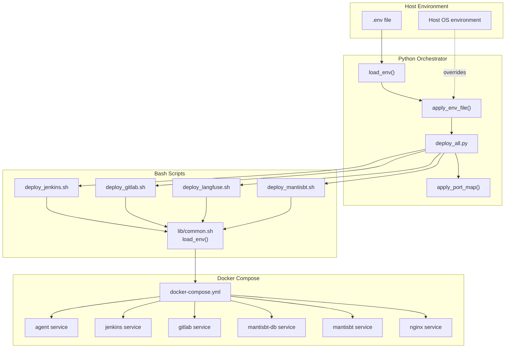
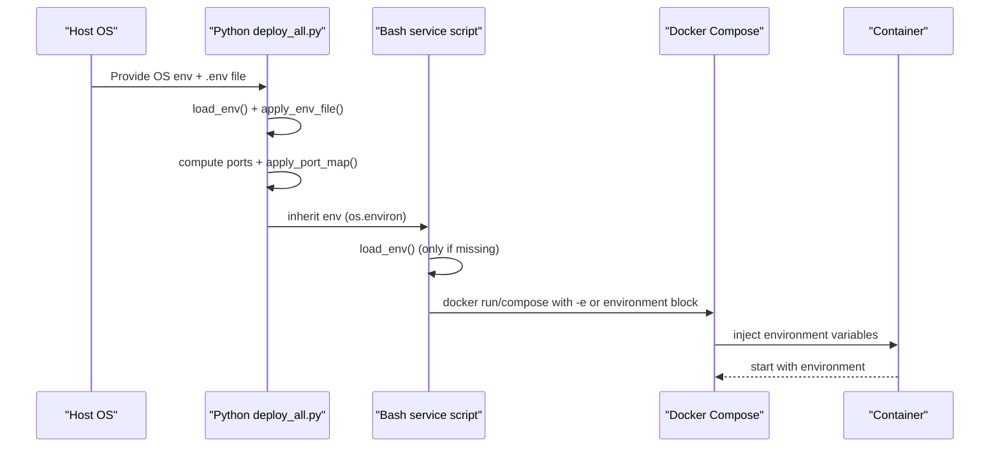
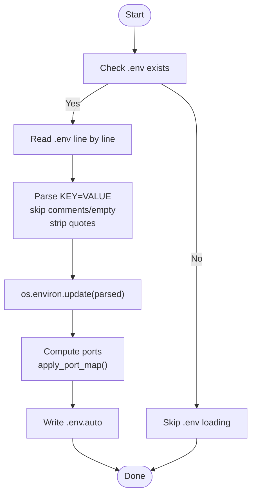
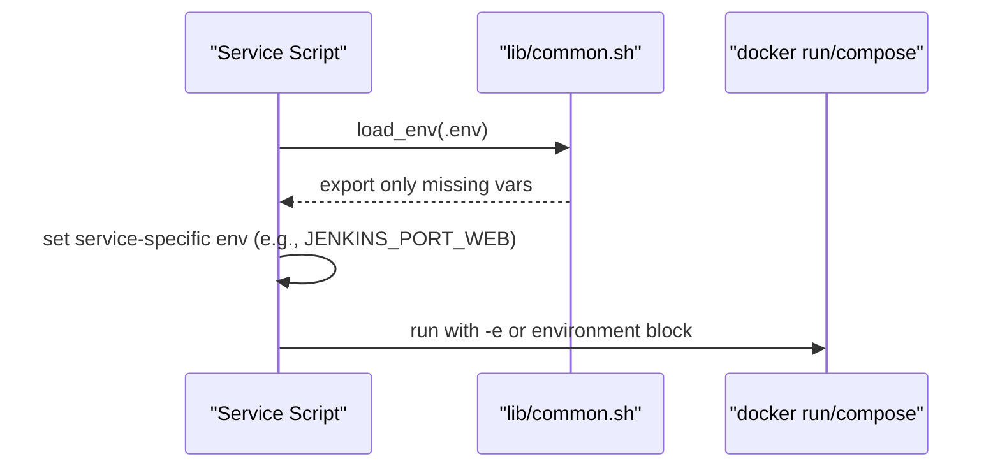
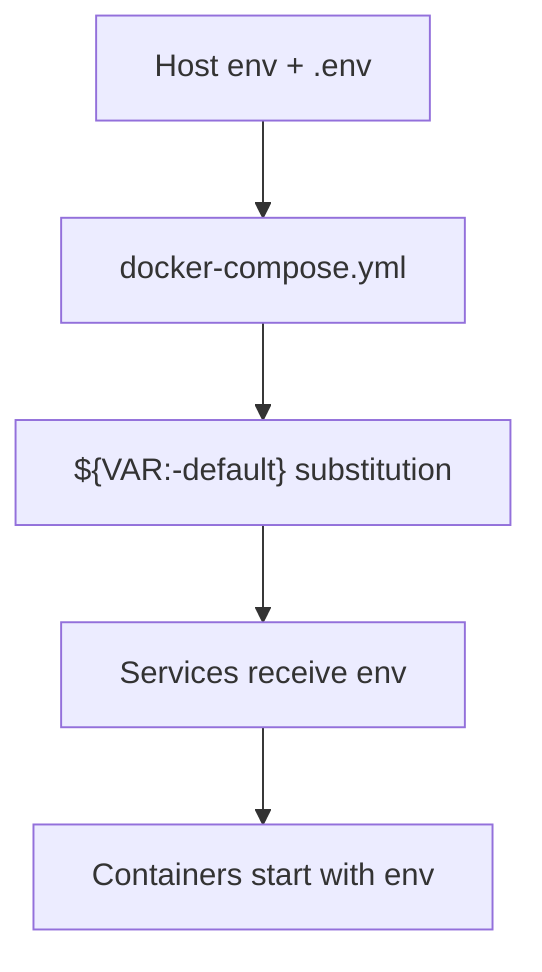
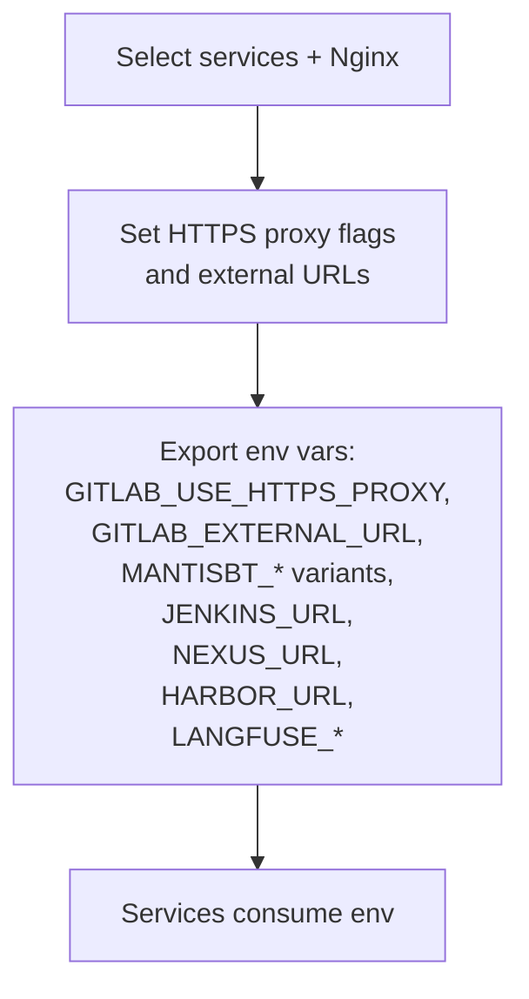
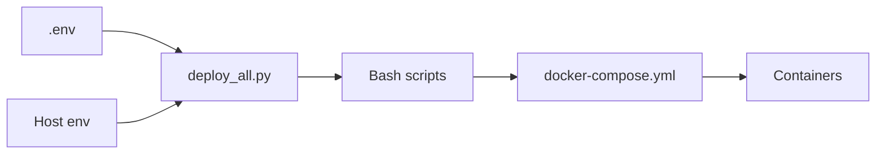

# Environment Variable Management

<cite>
**Referenced Files in This Document**
- [deploy_all.py](file://deploy/deploy_all.py)
- [docker-compose.yml](file://deploy/docker-compose.yml)
- [common.sh](file://deploy/lib/common.sh)
- [deploy_jenkins.sh](file://deploy/deploy_jenkins/deploy_jenkins.sh)
- [deploy_gitlab.sh](file://deploy/deploy_gitlab/deploy_gitlab.sh)
- [deploy_langfuse.sh](file://deploy/deploy_langfuse/deploy_langfuse.sh)
- [deploy_mantisbt.sh](file://deploy/deploy_MantisBT/deploy_mantisbt.sh)
- [.global_settings_example.yaml](file://deploy/config/.global_settings_example.yaml)
</cite>

## Table of Contents
1. [Introduction](#introduction)
2. [Project Structure](#project-structure)
3. [Core Components](#core-components)
4. [Architecture Overview](#architecture-overview)
5. [Detailed Component Analysis](#detailed-component-analysis)
6. [Dependency Analysis](#dependency-analysis)
7. [Performance Considerations](#performance-considerations)
8. [Troubleshooting Guide](#troubleshooting-guide)
9. [Conclusion](#conclusion)
10. [Appendices](#appendices)

## Introduction
This document explains DeployAgent’s environment variable management system. It covers precedence rules, loading mechanisms, inheritance patterns, .env file integration, Docker Compose environment variable injection, service-specific overrides, naming conventions, supported data types, validation procedures, practical deployment scenarios, troubleshooting, and best practices for managing sensitive configuration.

## Project Structure
DeployAgent uses a hybrid approach:
- Python orchestrator reads a .env file and sets process environment variables.
- Bash service scripts load .env and pass variables to Docker containers.
- Docker Compose defines environment variables for services and supports variable substitution from the host environment.

**Diagram sources**
- [deploy_all.py:209-264](file://deploy/deploy_all.py#L209-L264)
- [common.sh:130-151](file://deploy/lib/common.sh#L130-L151)
- [docker-compose.yml:1-222](file://deploy/docker-compose.yml#L1-L222)
- [deploy_jenkins.sh:336-374](file://deploy/deploy_jenkins/deploy_jenkins.sh#L336-L374)
- [deploy_gitlab.sh:396-434](file://deploy/deploy_gitlab/deploy_gitlab.sh#L396-L434)
- [deploy_langfuse.sh:74-98](file://deploy/deploy_langfuse/deploy_langfuse.sh#L74-L98)
- [deploy_mantisbt.sh:62-135](file://deploy/deploy_MantisBT/deploy_mantisbt.sh#L62-L135)

**Section sources**
- [deploy_all.py:31-38](file://deploy/deploy_all.py#L31-L38)
- [docker-compose.yml:1-222](file://deploy/docker-compose.yml#L1-L222)

## Core Components
- .env loader in Python orchestrator:
  - Reads .env, parses KEY=VALUE lines, strips comments and quotes, updates os.environ.
- .env loader in Bash scripts:
  - Reads .env, exports only undefined variables to avoid overriding existing environment.
- Docker Compose environment injection:
  - Uses ${VAR:-default} syntax for variable substitution with defaults.
- Port registry and dynamic environment:
  - Python assigns computed ports to environment variables for downstream use.
- Reverse proxy environment configuration:
  - Python sets HTTPS proxy flags and URLs for services requiring reverse proxy behavior.

Key behaviors:
- Python .env loader does not override existing environment variables.
- Bash .env loader exports variables only if not already present.
- Docker Compose substitutes variables from host environment with defaults.
- Python orchestrator writes .env.auto with computed ports for persistence across runs.

**Section sources**
- [deploy_all.py:209-240](file://deploy/deploy_all.py#L209-L240)
- [common.sh:130-151](file://deploy/lib/common.sh#L130-L151)
- [docker-compose.yml:36-90](file://deploy/docker-compose.yml#L36-L90)
- [deploy_all.py:241-264](file://deploy/deploy_all.py#L241-L264)
- [deploy_all.py:701-756](file://deploy/deploy_all.py#L701-L756)

## Architecture Overview
The environment variable lifecycle spans three layers:
1. Host environment and .env file
2. Python orchestrator applying .env and computed values
3. Docker Compose injecting variables into services

**Diagram sources**
- [deploy_all.py:209-240](file://deploy/deploy_all.py#L209-L240)
- [deploy_all.py:254-264](file://deploy/deploy_all.py#L254-L264)
- [common.sh:130-151](file://deploy/lib/common.sh#L130-L151)
- [docker-compose.yml:34-101](file://deploy/docker-compose.yml#L34-L101)

## Detailed Component Analysis

### Python Orchestrator (.env loading and precedence)
- Loads .env if present, skipping comments and empty lines, stripping quotes, and updating os.environ.
- Does not override existing environment variables, ensuring host environment takes precedence.
- Computes and persists port allocations to .env.auto and sets per-service port environment variables for downstream consumers.

**Diagram sources**
- [deploy_all.py:209-240](file://deploy/deploy_all.py#L209-L240)
- [deploy_all.py:254-264](file://deploy/deploy_all.py#L254-L264)
- [deploy_all.py:219-234](file://deploy/deploy_all.py#L219-L234)

**Section sources**
- [deploy_all.py:209-240](file://deploy/deploy_all.py#L209-L240)
- [deploy_all.py:219-234](file://deploy/deploy_all.py#L219-L234)
- [deploy_all.py:241-264](file://deploy/deploy_all.py#L241-L264)

### Bash Service Scripts (.env loading and service-specific overrides)
- Load .env via lib/common.sh load_env(), exporting only if not already defined.
- Apply service-specific environment variables (e.g., Jenkins, GitLab, MantisBT, Langfuse).
- Pass variables to docker run or docker compose commands.

**Diagram sources**
- [common.sh:130-151](file://deploy/lib/common.sh#L130-L151)
- [deploy_jenkins.sh:336-374](file://deploy/deploy_jenkins/deploy_jenkins.sh#L336-L374)
- [deploy_gitlab.sh:396-434](file://deploy/deploy_gitlab/deploy_gitlab.sh#L396-L434)
- [deploy_mantisbt.sh:62-135](file://deploy/deploy_MantisBT/deploy_mantisbt.sh#L62-L135)
- [deploy_langfuse.sh:74-98](file://deploy/deploy_langfuse/deploy_langfuse.sh#L74-L98)

**Section sources**
- [common.sh:130-151](file://deploy/lib/common.sh#L130-L151)
- [deploy_jenkins.sh:336-374](file://deploy/deploy_jenkins/deploy_jenkins.sh#L336-L374)
- [deploy_gitlab.sh:396-434](file://deploy/deploy_gitlab/deploy_gitlab.sh#L396-L434)
- [deploy_mantisbt.sh:62-135](file://deploy/deploy_MantisBT/deploy_mantisbt.sh#L62-L135)
- [deploy_langfuse.sh:74-98](file://deploy/deploy_langfuse/deploy_langfuse.sh#L74-L98)

### Docker Compose Environment Injection
- Uses ${VAR:-default} syntax to substitute host environment variables with sensible defaults.
- Supports network, volume, image, container name, ports, and environment blocks.
- Enables service-specific overrides via environment keys (e.g., JENKINS_PORT_WEB, GITLAB_PORT_HTTP).

**Diagram sources**
- [docker-compose.yml:34-101](file://deploy/docker-compose.yml#L34-L101)
- [docker-compose.yml:103-187](file://deploy/docker-compose.yml#L103-L187)
- [docker-compose.yml:189-222](file://deploy/docker-compose.yml#L189-L222)

**Section sources**
- [docker-compose.yml:34-101](file://deploy/docker-compose.yml#L34-L101)
- [docker-compose.yml:103-187](file://deploy/docker-compose.yml#L103-L187)
- [docker-compose.yml:189-222](file://deploy/docker-compose.yml#L189-L222)

### Reverse Proxy Environment Configuration
- Python sets HTTPS proxy flags and external URLs for services integrated behind Nginx.
- Ensures services behave correctly when accessed via HTTPS reverse proxy.

**Diagram sources**
- [deploy_all.py:701-756](file://deploy/deploy_all.py#L701-L756)

**Section sources**
- [deploy_all.py:701-756](file://deploy/deploy_all.py#L701-L756)

## Dependency Analysis
- Python orchestrator depends on:
  - .env file presence and parseability.
  - Host environment for defaults when .env is absent.
  - Port registry and computed port assignments.
- Bash scripts depend on:
  - .env file for service-specific configuration.
  - Python orchestrator for computed ports and reverse proxy environment.
- Docker Compose depends on:
  - Host environment variables for substitution.
  - Service-specific environment blocks.

**Diagram sources**
- [deploy_all.py:209-240](file://deploy/deploy_all.py#L209-L240)
- [common.sh:130-151](file://deploy/lib/common.sh#L130-L151)
- [docker-compose.yml:34-101](file://deploy/docker-compose.yml#L34-L101)

**Section sources**
- [deploy_all.py:209-240](file://deploy/deploy_all.py#L209-L240)
- [common.sh:130-151](file://deploy/lib/common.sh#L130-L151)
- [docker-compose.yml:34-101](file://deploy/docker-compose.yml#L34-L101)

## Performance Considerations
- Prefer .env for persistent configuration to avoid repeated computation of ports and environment values.
- Keep .env minimal and only include overrides; rely on defaults for most services.
- Use named volumes and avoid excessive bind mounts to reduce filesystem overhead.
- Limit environment variable count in Docker Compose to reduce startup overhead.

## Troubleshooting Guide
Common environment-related issues and resolutions:
- Variables not taking effect
  - Verify .env file syntax and absence of comments/whitespace anomalies.
  - Confirm Python orchestrator applied .env before service scripts.
  - Ensure host environment variables are not overriding desired values unintentionally.
- Port conflicts
  - Use the Python orchestrator’s scanning and auto-allocation feature to generate .env.auto with computed ports.
  - Review .env.auto to confirm effective port assignments.
- HTTPS reverse proxy misconfiguration
  - Ensure HTTPS proxy flags and external URLs are set for services behind Nginx.
  - Confirm NGINX_BIND and service-specific NGINX_PORT_* variables are correct.
- Service-specific variables not recognized
  - Confirm Bash scripts source lib/common.sh and call load_env().
  - Verify service-specific environment keys match the service’s expectations.
- Sensitive data exposure
  - Store tokens and secrets in .env and restrict file permissions.
  - Avoid committing .env to version control; keep it in a secure location outside the repository.

**Section sources**
- [deploy_all.py:209-240](file://deploy/deploy_all.py#L209-L240)
- [common.sh:130-151](file://deploy/lib/common.sh#L130-L151)
- [deploy_all.py:219-234](file://deploy/deploy_all.py#L219-L234)
- [deploy_all.py:701-756](file://deploy/deploy_all.py#L701-L756)

## Conclusion
DeployAgent’s environment variable system combines a Python orchestrator, Bash service scripts, and Docker Compose to provide flexible, layered configuration. The precedence order favors host environment variables, followed by .env overrides, then Docker Compose defaults. By leveraging .env, computed port persistence, and service-specific overrides, teams can reliably manage configuration across diverse deployment scenarios.

## Appendices

### Environment Variable Precedence Rules
1. Host environment variables take highest precedence.
2. .env file values override defaults but do not override existing host variables.
3. Docker Compose ${VAR:-default} substitution uses host env or defaults.
4. Service-specific variables set by Python (e.g., computed ports) override defaults for downstream consumers.

**Section sources**
- [deploy_all.py:209-240](file://deploy/deploy_all.py#L209-L240)
- [common.sh:130-151](file://deploy/lib/common.sh#L130-L151)
- [docker-compose.yml:34-101](file://deploy/docker-compose.yml#L34-L101)

### .env File Integration
- Python loads .env and updates os.environ.
- Bash scripts load .env and export only if not already defined.
- Computed ports are written to .env.auto for reuse.

**Section sources**
- [deploy_all.py:209-240](file://deploy/deploy_all.py#L209-L240)
- [common.sh:130-151](file://deploy/lib/common.sh#L130-L151)
- [deploy_all.py:219-234](file://deploy/deploy_all.py#L219-L234)

### Docker Compose Environment Variable Injection
- Uses ${VAR:-default} syntax for substitution.
- Supports images, container names, ports, volumes, and environment blocks.

**Section sources**
- [docker-compose.yml:34-101](file://deploy/docker-compose.yml#L34-L101)
- [docker-compose.yml:103-187](file://deploy/docker-compose.yml#L103-L187)
- [docker-compose.yml:189-222](file://deploy/docker-compose.yml#L189-L222)

### Service-Specific Overrides
- Jenkins: JENKINS_PORT_WEB, JENKINS_PORT_AGENT, JENKINS_BIND, JENKINS_OPTS, JAVA_OPTS.
- GitLab: GITLAB_PORT_HTTP, GITLAB_PORT_HTTPS, GITLAB_PORT_SSH, GITLAB_BIND, GITLAB_USE_HTTPS_PROXY, GITLAB_EXTERNAL_URL.
- MantisBT: MANTISBT_PORT_WEB, MARIADB_PORT, MANTISBT_DB_* variables, MANTISBT_ADMIN_* variables.
- Langfuse: LANGFUSE_PORT_WEB, LANGFUSE_USE_HTTPS_PROXY, LANGFUSE_EXTERNAL_URL.
- Agent/Nginx: AGENT_* and NGINX_* variables as defined in docker-compose.yml.

**Section sources**
- [deploy_jenkins.sh:31-41](file://deploy/deploy_jenkins/deploy_jenkins.sh#L31-L41)
- [deploy_gitlab.sh:32-51](file://deploy/deploy_gitlab/deploy_gitlab.sh#L32-L51)
- [deploy_mantisbt.sh:31-58](file://deploy/deploy_MantisBT/deploy_mantisbt.sh#L31-L58)
- [deploy_langfuse.sh:30-44](file://deploy/deploy_langfuse/deploy_langfuse.sh#L30-L44)
- [docker-compose.yml:36-90](file://deploy/docker-compose.yml#L36-L90)
- [docker-compose.yml:189-222](file://deploy/docker-compose.yml#L189-L222)

### Variable Naming Conventions
- Uppercase with underscores (KEY_NAME).
- Service-scoped keys use service prefixes (e.g., JENKINS_, GITLAB_, MANTISBT_, LANGFUSE_, AGENT_, NGINX_).
- Compound keys use suffixes (e.g., *_PORT_WEB, *_PORT_HTTP, *_PORT_SSH, *_PORT_AGENT).

**Section sources**
- [deploy_jenkins.sh:31-41](file://deploy/deploy_jenkins/deploy_jenkins.sh#L31-L41)
- [deploy_gitlab.sh:32-51](file://deploy/deploy_gitlab/deploy_gitlab.sh#L32-L51)
- [deploy_mantisbt.sh:31-58](file://deploy/deploy_MantisBT/deploy_mantisbt.sh#L31-L58)
- [deploy_langfuse.sh:30-44](file://deploy/deploy_langfuse/deploy_langfuse.sh#L30-L44)
- [docker-compose.yml:36-90](file://deploy/docker-compose.yml#L36-L90)

### Supported Data Types and Validation Procedures
- Strings: Used for URLs, paths, and identifiers.
- Integers: Used for ports and numeric options.
- Booleans: Represented as strings (e.g., "true"/"false") for flags.
Validation steps:
- Ensure numeric variables are integers (e.g., port numbers).
- Validate URL formats for external URLs and prefixes.
- Confirm boolean flags are set to allowed values.

**Section sources**
- [deploy_all.py:241-264](file://deploy/deploy_all.py#L241-L264)
- [deploy_all.py:701-756](file://deploy/deploy_all.py#L701-L756)
- [docker-compose.yml:36-90](file://deploy/docker-compose.yml#L36-L90)

### Examples Across Deployment Scenarios
- Full deployment with Nginx:
  - Provide .env with desired ports and passwords.
  - Run Python orchestrator; it applies .env, computes ports, sets reverse proxy environment, and deploys services.
- Standalone service deployment:
  - Source lib/common.sh and call load_env in the service script.
  - Use service-specific variables to customize behavior.
- Docker Compose-only deployment:
  - Rely on ${VAR:-default} substitution; ensure host environment variables are set appropriately.

**Section sources**
- [deploy_all.py:131-142](file://deploy/deploy_all.py#L131-L142)
- [common.sh:130-151](file://deploy/lib/common.sh#L130-L151)
- [docker-compose.yml:34-101](file://deploy/docker-compose.yml#L34-L101)

### Best Practices for Managing Sensitive Configuration
- Store tokens and secrets in .env with restricted file permissions.
- Avoid committing .env to version control.
- Use separate .env files per environment (development, staging, production).
- Rotate secrets regularly and update .env accordingly.
- Use Docker secrets or external secret managers for production deployments.

**Section sources**
- [deploy_all.py:905-917](file://deploy/deploy_all.py#L905-L917)
- [docker-compose.yml:53-55](file://deploy/docker-compose.yml#L53-L55)