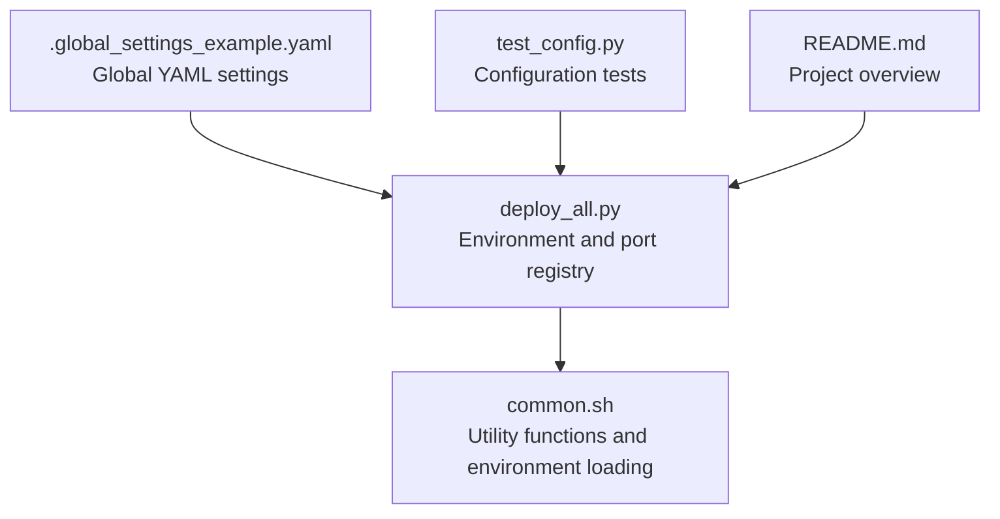
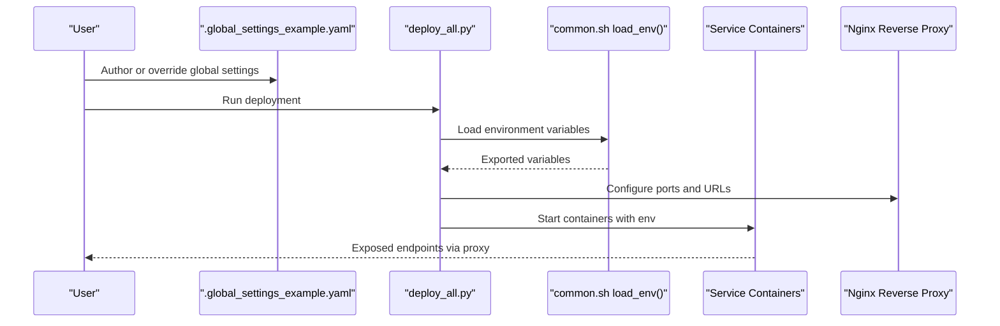
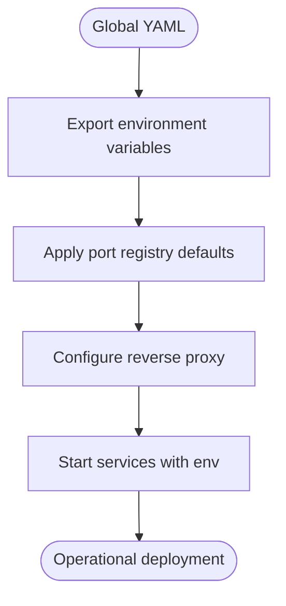
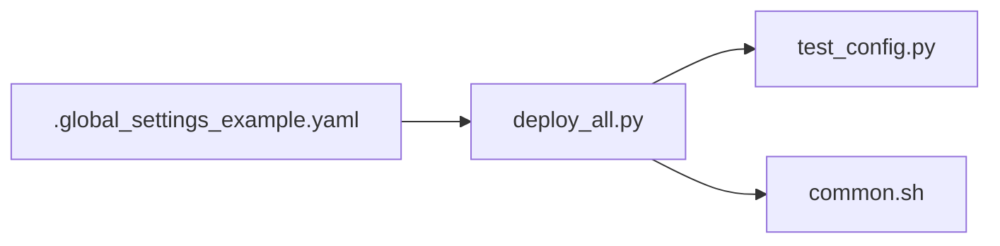

# Global Configuration System

<cite>
**Referenced Files in This Document**
- [.global_settings_example.yaml](file://deploy/config/.global_settings_example.yaml)
- [deploy_all.py](file://deploy/deploy_all.py)
- [common.sh](file://deploy/lib/common.sh)
- [test_config.py](file://deploy/tests/test_config.py)
- [README.md](file://README.md)
</cite>

## Table of Contents
1. [Introduction](#introduction)
2. [Project Structure](#project-structure)
3. [Core Components](#core-components)
4. [Architecture Overview](#architecture-overview)
5. [Detailed Component Analysis](#detailed-component-analysis)
6. [Dependency Analysis](#dependency-analysis)
7. [Performance Considerations](#performance-considerations)
8. [Troubleshooting Guide](#troubleshooting-guide)
9. [Conclusion](#conclusion)

## Introduction
This document explains DeployAgent’s global configuration system with a focus on the YAML-based global settings. It covers the configuration schema, default values, required versus optional parameters for each service block, credential management, environment-specific overrides, validation procedures, and how global settings cascade to service-specific configurations.

## Project Structure
The global configuration is defined in a YAML file and complemented by deployment orchestration logic and environment variable handling.

**Diagram sources**
- [.global_settings_example.yaml:1-31](file://deploy/config/.global_settings_example.yaml#L1-L31)
- [deploy_all.py:1056-1118](file://deploy/deploy_all.py#L1056-L1118)
- [common.sh:130-151](file://deploy/lib/common.sh#L130-L151)
- [test_config.py:10-131](file://deploy/tests/test_config.py#L10-L131)
- [README.md:1-3](file://README.md#L1-L3)

**Section sources**
- [.global_settings_example.yaml:1-31](file://deploy/config/.global_settings_example.yaml#L1-L31)
- [deploy_all.py:1056-1118](file://deploy/deploy_all.py#L1056-L1118)
- [common.sh:130-151](file://deploy/lib/common.sh#L130-L151)
- [test_config.py:10-131](file://deploy/tests/test_config.py#L10-L131)
- [README.md:1-3](file://README.md#L1-L3)

## Core Components
- Global YAML settings file: Defines jenkins, ai_model, gitlab, git, and white_list blocks with their parameters.
- Environment variable loader: Reads .env-like files and exports variables for downstream services.
- Port registry and reverse proxy configuration: Provides defaults and computed values for service exposure.
- Tests: Validate configuration structures and defaults.

Key responsibilities:
- Define global defaults and optional overrides.
- Provide environment variables consumed by service deployments.
- Enforce configuration shape and defaults via tests.

**Section sources**
- [.global_settings_example.yaml:1-31](file://deploy/config/.global_settings_example.yaml#L1-L31)
- [deploy_all.py:1056-1118](file://deploy/deploy_all.py#L1056-L1118)
- [test_config.py:13-127](file://deploy/tests/test_config.py#L13-L127)

## Architecture Overview
The global configuration system integrates with the deployment orchestrator to propagate settings to services and reverse proxies.

**Diagram sources**
- [.global_settings_example.yaml:1-31](file://deploy/config/.global_settings_example.yaml#L1-L31)
- [deploy_all.py:1056-1118](file://deploy/deploy_all.py#L1056-L1118)
- [common.sh:130-151](file://deploy/lib/common.sh#L130-L151)

## Detailed Component Analysis

### Global Settings Schema and Blocks
The global YAML defines the following top-level blocks and parameters:

- jenkins
  - base_url: string (required for external access)
  - username: string (required for API access)
  - api_token: string (required for API access)
- ai_model
  - provider: string (provider identifier)
  - model_name: string (model identifier)
  - api_key: string (provider API key)
- gitlab
  - base_url: string (required for external access)
  - api_token: string (required for GitLab API)
- git
  - user_name: string (Git user name)
  - user_email: string (Git user email)
  - credential_type: string (e.g., "ssh_key")
  - token: string (credential for HTTPS operations)
  - ssh_private_key_path: string (when using SSH)
- white_list
  - repos: array of strings (repository identifiers)
  - branch_pattern: string (regex pattern for allowed branches)

Notes:
- Required vs optional parameters are indicated by comments in the example file.
- The example file also documents permission requirements for GitLab tokens.

**Section sources**
- [.global_settings_example.yaml:1-31](file://deploy/config/.global_settings_example.yaml#L1-L31)

### Credential Management
- Jenkins: Requires username and API token for programmatic access.
- GitLab: Requires a Personal Access Token with appropriate scopes.
- AI model providers: Requires provider and api_key; model_name may be required depending on provider.

Credential storage and retrieval:
- Jenkins initial admin password is exposed by the container and printed during setup.
- GitLab initial root password is exposed by the container and printed during setup.
- For persistent configuration, store tokens in secure secret stores or environment variables managed by the orchestrator.

**Section sources**
- [deploy_all.py:341-423](file://deploy/deploy_all.py#L341-L423)

### Environment-Specific Overrides and Defaults
- The orchestrator supports interactive .env generation with default values for ports, bind address, and service-specific variables.
- Environment variables are loaded and exported for use by service scripts.
- Reverse proxy configuration derives service URLs from environment variables and port registry.

Key defaults and overrides:
- Port registry includes default ports for Jenkins, GitLab, MantisBT, Langfuse, and Nginx proxy mappings.
- Interactive prompts allow overriding default values for ports and bind address.
- Environment variables are written to a .env file and later loaded by the environment loader.

**Section sources**
- [deploy_all.py:1056-1118](file://deploy/deploy_all.py#L1056-L1118)
- [common.sh:130-151](file://deploy/lib/common.sh#L130-L151)

### Validation Procedures
- Configuration tests validate:
  - Port registry existence and correctness.
  - Service configuration completeness (required fields).
  - Deployment modes structure and inclusion of new services.

These tests ensure that global defaults and service mappings remain consistent and complete.

**Section sources**
- [test_config.py:13-127](file://deploy/tests/test_config.py#L13-L127)

### Relationship Between Global Settings and Service-Specific Configurations
- Global settings inform environment variables and reverse proxy configuration.
- Service-specific scripts consume environment variables to configure endpoints and credentials.
- The orchestrator sets variables like service URLs and proxy ports, which downstream services use to connect to each other and expose themselves externally.

**Diagram sources**
- [.global_settings_example.yaml:1-31](file://deploy/config/.global_settings_example.yaml#L1-L31)
- [deploy_all.py:1056-1118](file://deploy/deploy_all.py#L1056-L1118)

## Dependency Analysis
- Global YAML is the single source of truth for service endpoints and credentials.
- The orchestrator depends on the YAML for environment variable composition.
- Tests depend on the orchestrator’s configuration structures to validate correctness.

**Diagram sources**
- [.global_settings_example.yaml:1-31](file://deploy/config/.global_settings_example.yaml#L1-L31)
- [deploy_all.py:1056-1118](file://deploy/deploy_all.py#L1056-L1118)
- [test_config.py:10-131](file://deploy/tests/test_config.py#L10-L131)
- [common.sh:130-151](file://deploy/lib/common.sh#L130-L151)

**Section sources**
- [deploy_all.py:1056-1118](file://deploy/deploy_all.py#L1056-L1118)
- [test_config.py:13-127](file://deploy/tests/test_config.py#L13-L127)

## Performance Considerations
- Prefer environment variables for runtime configuration to avoid repeated YAML parsing.
- Use defaults judiciously to minimize interactive prompts during automated deployments.
- Keep white_list patterns concise to reduce regex overhead in filtering logic.

## Troubleshooting Guide
Common issues and resolutions:
- Missing or empty credentials: Ensure jenkins.username, jenkins.api_token, gitlab.api_token, and ai_model.api_key are populated.
- Incorrect base URLs: Verify jenkins.base_url and gitlab.base_url match the reverse proxy configuration.
- Port conflicts: Use the interactive port configuration to select alternate ports.
- Initial admin passwords: Retrieve Jenkins and GitLab initial passwords from container logs during setup.
- YAML parsing errors: Confirm YAML syntax and indentation; ensure required keys are present.

**Section sources**
- [deploy_all.py:341-423](file://deploy/deploy_all.py#L341-L423)
- [deploy_all.py:1056-1118](file://deploy/deploy_all.py#L1056-L1118)

## Conclusion
DeployAgent’s global configuration system centers on a YAML file that defines service endpoints, credentials, and white-listing rules. The orchestrator translates these settings into environment variables and reverse proxy configuration, ensuring consistent and secure service operation. Tests validate configuration integrity, while environment-specific overrides enable flexible deployments across environments.