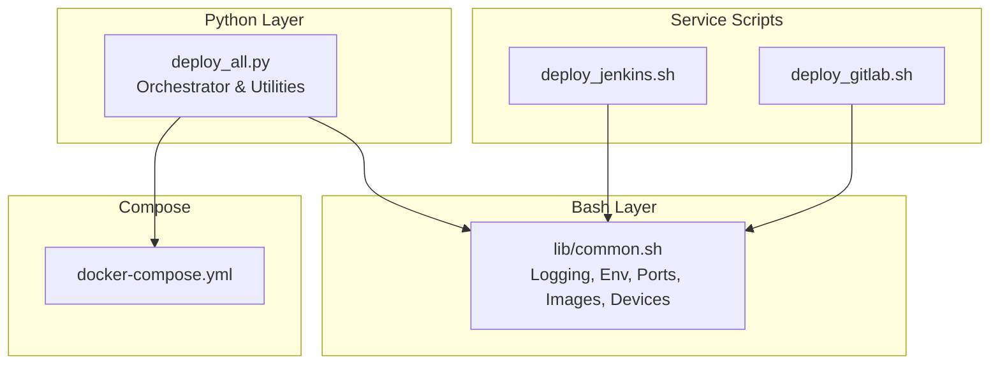
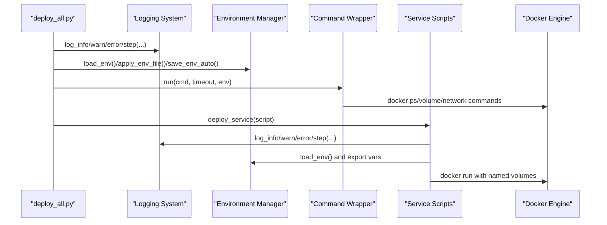
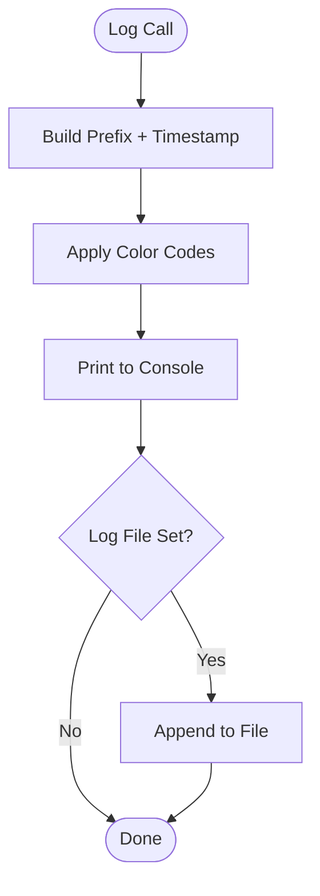
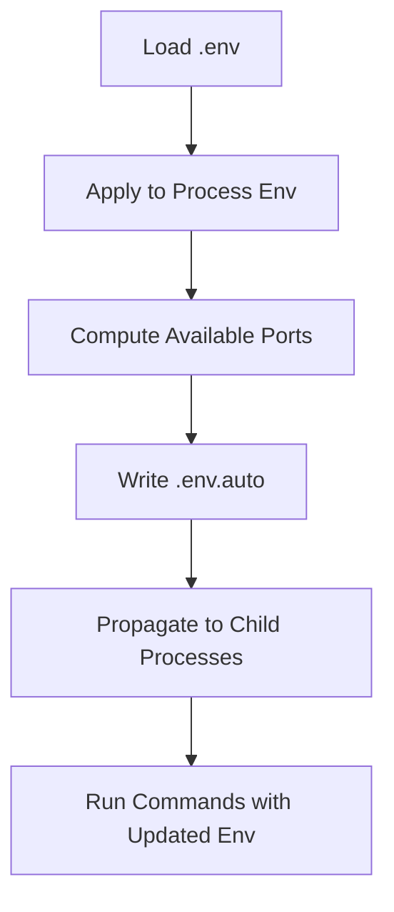
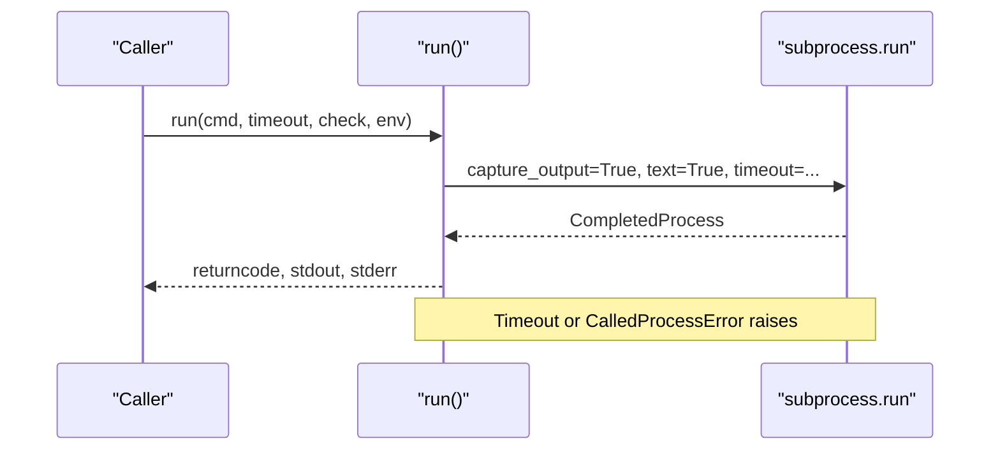
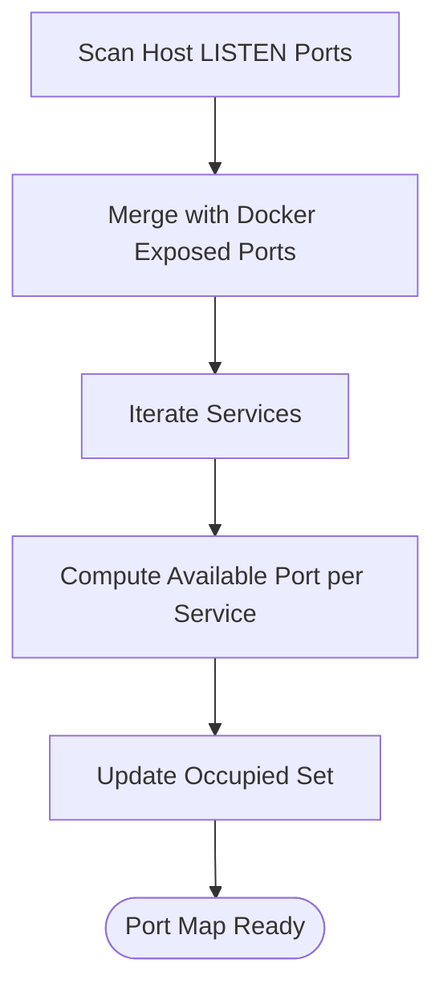
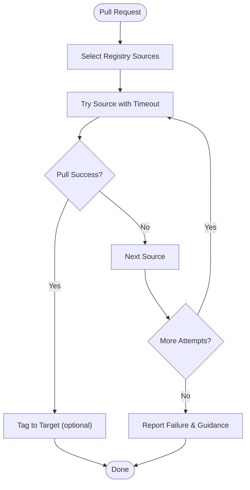
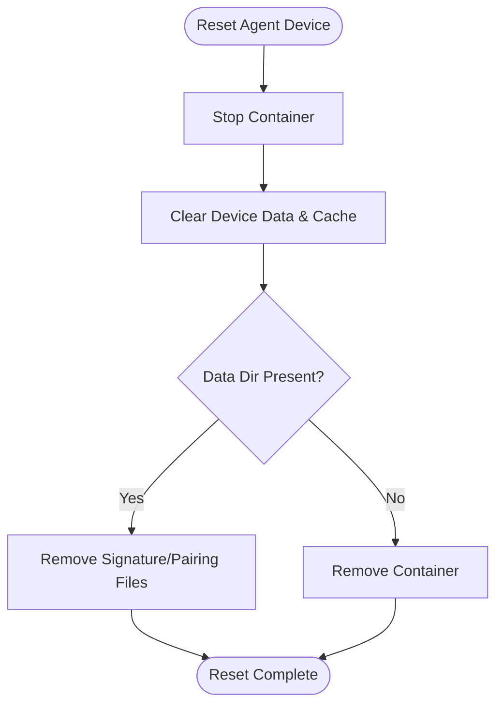
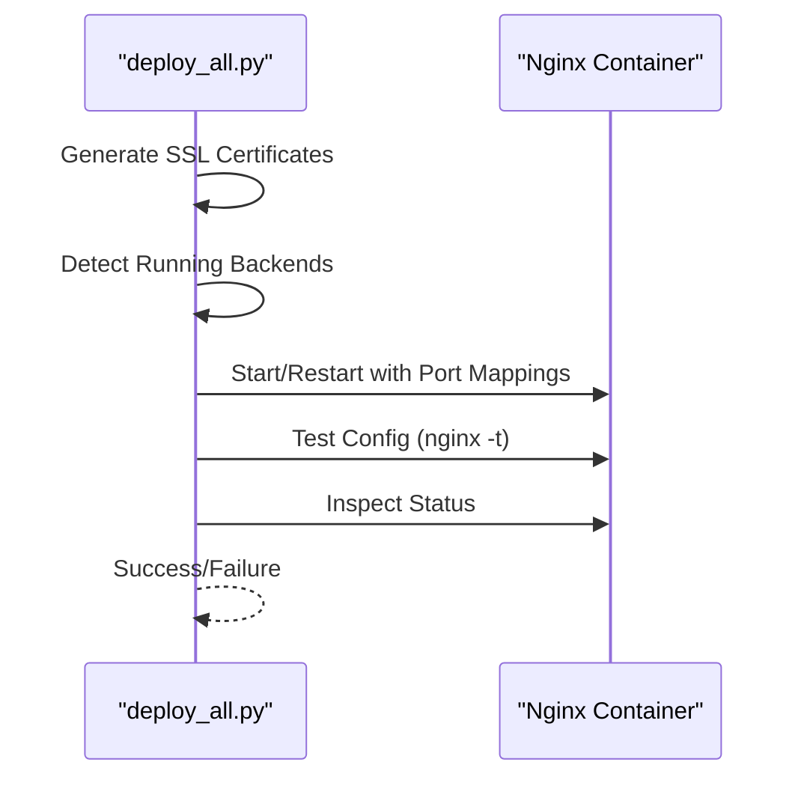
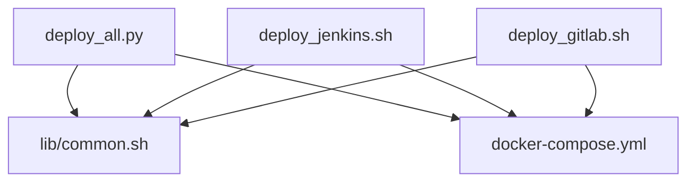

# Common Utility Functions

<cite>
**Referenced Files in This Document**
- [deploy_all.py](file://deploy/deploy_all.py)
- [common.sh](file://deploy/lib/common.sh)
- [docker-compose.yml](file://deploy/docker-compose.yml)
- [deploy_jenkins.sh](file://deploy/deploy_jenkins/deploy_jenkins.sh)
- [deploy_gitlab.sh](file://deploy/deploy_gitlab/deploy_gitlab.sh)
</cite>

## Table of Contents
1. [Introduction](#introduction)
2. [Project Structure](#project-structure)
3. [Core Components](#core-components)
4. [Architecture Overview](#architecture-overview)
5. [Detailed Component Analysis](#detailed-component-analysis)
6. [Dependency Analysis](#dependency-analysis)
7. [Performance Considerations](#performance-considerations)
8. [Troubleshooting Guide](#troubleshooting-guide)
9. [Conclusion](#conclusion)

## Introduction
This document explains the common utility functions and helper systems that underpin the deployment automation across the DevOpsAgent project. It focuses on:
- Logging system with colored output formatting, log file management, and structured logging patterns
- Environment variable management including .env loading, auto-port configuration, and environment propagation to child processes
- Command execution wrapper with timeout handling, error management, and subprocess integration
- Multi-source image pulling capabilities, device management functions, and cross-platform compatibility considerations
- How these utilities support the overall deployment system and provide reusable functionality across all service deployments

## Project Structure
The common utilities are implemented in two complementary layers:
- Python-based orchestration and utilities in deploy_all.py
- Bash-based library in lib/common.sh consumed by individual service scripts

**Diagram sources**
- [deploy_all.py](file://deploy/deploy_all.py)
- [common.sh](file://deploy/lib/common.sh)
- [deploy_jenkins.sh](file://deploy/deploy_jenkins/deploy_jenkins.sh)
- [deploy_gitlab.sh](file://deploy/deploy_gitlab/deploy_gitlab.sh)
- [docker-compose.yml](file://deploy/docker-compose.yml)

**Section sources**
- [deploy_all.py](file://deploy/deploy_all.py)
- [common.sh](file://deploy/lib/common.sh)
- [docker-compose.yml](file://deploy/docker-compose.yml)

## Core Components
- Logging utilities:
  - Python: centralized log function with colored prefixes and optional file append
  - Bash: log_info, log_warn, log_error, log_step with timestamped output and optional file redirection
- Environment management:
  - Python: load_env reads .env, apply_env_file updates process environment, save_env_auto writes .env.auto with computed ports
  - Bash: load_env reads .env and exports variables into the shell
- Command execution wrapper:
  - Python: run wraps subprocess with timeouts, error propagation, and structured return
  - Bash: integrates with Docker commands and environment-aware service scripts
- Port scanning and allocation:
  - Python: scan_occupied_ports, find_available_port, scan_ports, apply_port_map
- Image pulling with fallback:
  - Bash: pull_image_with_fallback supports multiple registries and retries
- Device management:
  - Bash: reset_agent_device, list_agent_devices, approve_agent_device for Agent device lifecycle
- Reverse proxy configuration:
  - Python: ensure_nginx_proxy generates per-service configs and starts Nginx container

**Section sources**
- [deploy_all.py](file://deploy/deploy_all.py)
- [common.sh](file://deploy/lib/common.sh)

## Architecture Overview
The deployment system uses a hybrid orchestration model:
- deploy_all.py orchestrates environment scanning, port allocation, volume resolution, and service deployment
- Individual service scripts source lib/common.sh to reuse logging, environment, and utility functions
- docker-compose.yml defines shared network and named volumes used across services

**Diagram sources**
- [deploy_all.py](file://deploy/deploy_all.py)
- [common.sh](file://deploy/lib/common.sh)
- [deploy_jenkins.sh](file://deploy/deploy_jenkins/deploy_jenkins.sh)
- [deploy_gitlab.sh](file://deploy/deploy_gitlab/deploy_gitlab.sh)
- [docker-compose.yml](file://deploy/docker-compose.yml)

## Detailed Component Analysis

### Logging System
- Python logging:
  - Centralized log function formats messages with timestamps and color-coded prefixes
  - Optional file append controlled by a module-level log_file variable
  - Convenience wrappers info, warn, error, step provide consistent output
- Bash logging:
  - Timestamped, colorized output with optional tee to DEPLOY_LOG
  - Banner printing and step separators for structured progress reporting
  - Exported functions for use by sourced scripts

**Diagram sources**
- [deploy_all.py](file://deploy/deploy_all.py)
- [common.sh](file://deploy/lib/common.sh)

**Section sources**
- [deploy_all.py](file://deploy/deploy_all.py)
- [common.sh](file://deploy/lib/common.sh)

### Environment Variable Management
- .env loading and propagation:
  - Python: load_env parses key=value lines, strips quotes, applies to process environment
  - Bash: load_env reads .env and exports variables into the shell
- Auto-port configuration:
  - Python: scan_ports computes available ports, apply_port_map updates registry and environment
  - save_env_auto writes .env.auto with generated mappings for downstream consumption
- Environment propagation to child processes:
  - Python: run passes env to subprocess; deploy_service copies os.environ and augments with volumes
  - Bash: exported functions and variables propagate to sourced scripts

**Diagram sources**
- [deploy_all.py](file://deploy/deploy_all.py)
- [common.sh](file://deploy/lib/common.sh)

**Section sources**
- [deploy_all.py](file://deploy/deploy_all.py)
- [common.sh](file://deploy/lib/common.sh)

### Command Execution Wrapper
- Python run:
  - Wraps subprocess.run with timeout, error handling, and structured CompletedProcess return
  - Raises exceptions on timeout or non-zero exit codes
- Bash integration:
  - Sourced scripts rely on exported functions and environment variables
  - Docker commands executed with explicit timeouts and error checks

**Diagram sources**
- [deploy_all.py](file://deploy/deploy_all.py)

**Section sources**
- [deploy_all.py](file://deploy/deploy_all.py)

### Port Scanning and Allocation
- Occupied port detection:
  - Python scans ss and Docker container ports to build a union set
- Availability algorithm:
  - find_available_port iterates within a bounded offset to locate free ports
- Per-service port assignment:
  - scan_ports computes mappings for nginx and other services, updating occupied set incrementally

**Diagram sources**
- [deploy_all.py](file://deploy/deploy_all.py)

**Section sources**
- [deploy_all.py](file://deploy/deploy_all.py)

### Multi-Source Image Pulling
- Bash pull_image_with_fallback:
  - Supports multiple registries per service with ordered preference
  - Retries per source with configurable timeout and waits between attempts
  - Tags images to a target tag when requested
  - Provides actionable guidance for mirror configuration and proxy setup

**Diagram sources**
- [common.sh](file://deploy/lib/common.sh)

**Section sources**
- [common.sh](file://deploy/lib/common.sh)

### Device Management Functions
- Reset Agent device:
  - Stops container, clears device signature and pairing data, or removes container if data dir missing
- List and approve devices:
  - Lists pending device pairings and approves a given UUID via container command or JSON inspection

**Diagram sources**
- [common.sh](file://deploy/lib/common.sh)

**Section sources**
- [common.sh](file://deploy/lib/common.sh)

### Cross-Platform Compatibility Considerations
- Python:
  - Uses POSIX-style subprocess calls; relies on Docker CLI availability
  - Network interface filtering excludes virtual interfaces to avoid false positives
- Bash:
  - Uses ip and hostname utilities; falls back to hostname if ip unavailable
  - Detects Docker and Compose variants and sets DOCKER_COMPOSE_CMD accordingly

**Section sources**
- [deploy_all.py](file://deploy/deploy_all.py)
- [common.sh](file://deploy/lib/common.sh)

### Reverse Proxy Integration
- Python ensure_nginx_proxy:
  - Generates per-service Nginx configs, manages SSL certificates, connects backend containers to the shared network, and validates configuration
- Environment-driven URLs:
  - configure_reverse_proxy_env sets HTTPS proxy variables for services when Nginx is enabled

**Diagram sources**
- [deploy_all.py](file://deploy/deploy_all.py)

**Section sources**
- [deploy_all.py](file://deploy/deploy_all.py)

### Environment Validation Checks and System Integration Patterns
- Root and Docker checks:
  - Bash check_root and check_docker ensure prerequisites and export DOCKER_COMPOSE_CMD
- Volume resolution:
  - Python resolves conflicting named volumes and propagates to service scripts via environment
- IP detection:
  - Python detect_local_ip and Bash detect_local_ip provide robust host IP discovery

**Section sources**
- [common.sh](file://deploy/lib/common.sh)
- [deploy_all.py](file://deploy/deploy_all.py)

## Dependency Analysis
- Orchestration-to-library coupling:
  - deploy_all.py imports and uses logging, environment, and port utilities
  - Service scripts source lib/common.sh for logging, environment, and device functions
- External dependencies:
  - Docker CLI and Docker Compose are required
  - OpenSSL for Nginx certificate generation
- Shared resources:
  - Named volumes and devopsagent-network are managed centrally and consumed by services

**Diagram sources**
- [deploy_all.py](file://deploy/deploy_all.py)
- [common.sh](file://deploy/lib/common.sh)
- [deploy_jenkins.sh](file://deploy/deploy_jenkins/deploy_jenkins.sh)
- [deploy_gitlab.sh](file://deploy/deploy_gitlab/deploy_gitlab.sh)
- [docker-compose.yml](file://deploy/docker-compose.yml)

**Section sources**
- [deploy_all.py](file://deploy/deploy_all.py)
- [common.sh](file://deploy/lib/common.sh)
- [docker-compose.yml](file://deploy/docker-compose.yml)

## Performance Considerations
- Timeouts:
  - Python run enforces timeouts to prevent hanging subprocesses
  - Bash pull_image_with_fallback uses timeout command when available
- I/O efficiency:
  - Logging uses minimal allocations and optional file append
  - Port scanning avoids redundant system calls by combining host and Docker inspections
- Resource safety:
  - Named volumes reduce filesystem contention and improve cleanup predictability

[No sources needed since this section provides general guidance]

## Troubleshooting Guide
- Logging:
  - Enable file logging by setting DEPLOY_LOG in Bash or by assigning to log_file in Python
  - Use step/warn/info/error consistently to track progress and errors
- Port conflicts:
  - Rerun scan-only mode to regenerate .env.auto with new allocations
  - Review occupied ports and adjust service selection
- Image pulls:
  - Use pull_image_with_fallback to retry across mirrors
  - Configure Docker registry mirrors or proxies as suggested by the function
- Device issues:
  - Use reset_agent_device to clear stale pairing data
  - Approve pending devices via approve_agent_device with UUID
- Nginx failures:
  - Check generated conf files and run nginx -t inside the container
  - Verify backend container connectivity on devopsagent-network

**Section sources**
- [deploy_all.py](file://deploy/deploy_all.py)
- [common.sh](file://deploy/lib/common.sh)

## Conclusion
The common utility functions and helper systems provide a robust foundation for DevOpsAgent deployments:
- Unified logging and environment management across Python and Bash
- Reliable command execution with timeouts and structured error handling
- Resilient image pulling with multi-source fallbacks
- Practical device lifecycle management for Agent services
- Seamless reverse proxy integration and cross-platform IP detection

These utilities enable consistent, repeatable deployments across all services while maintaining portability and operability in diverse environments.