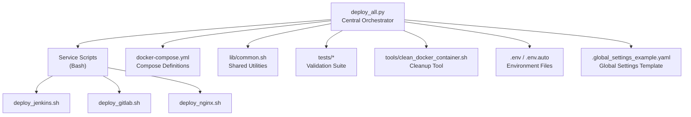
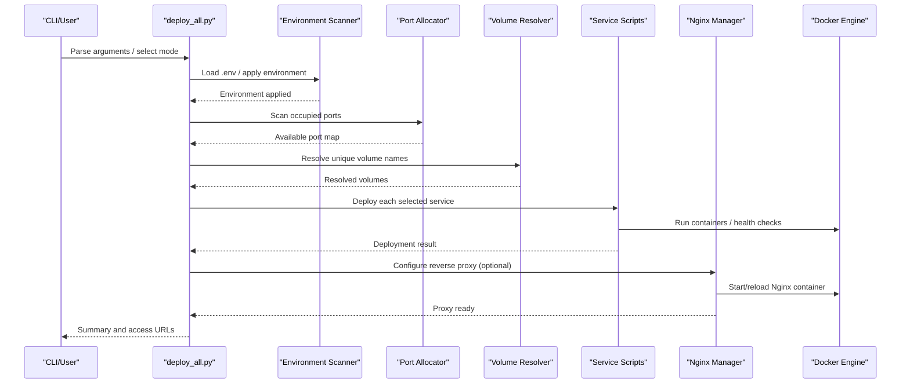
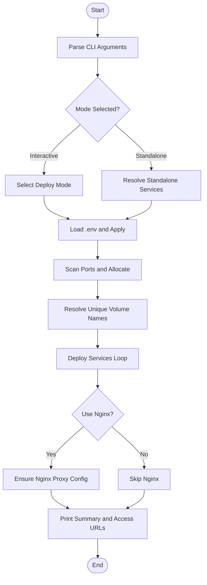
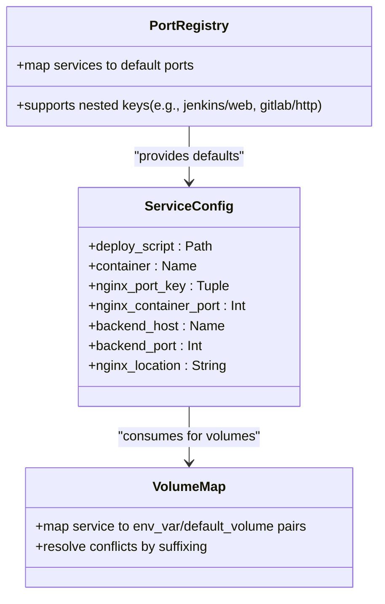
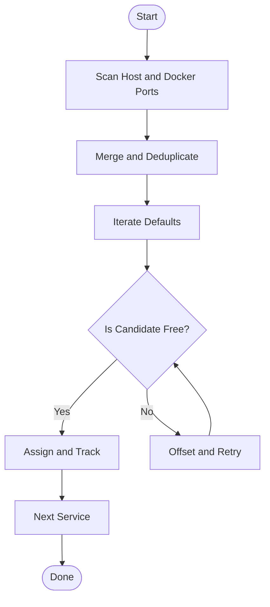
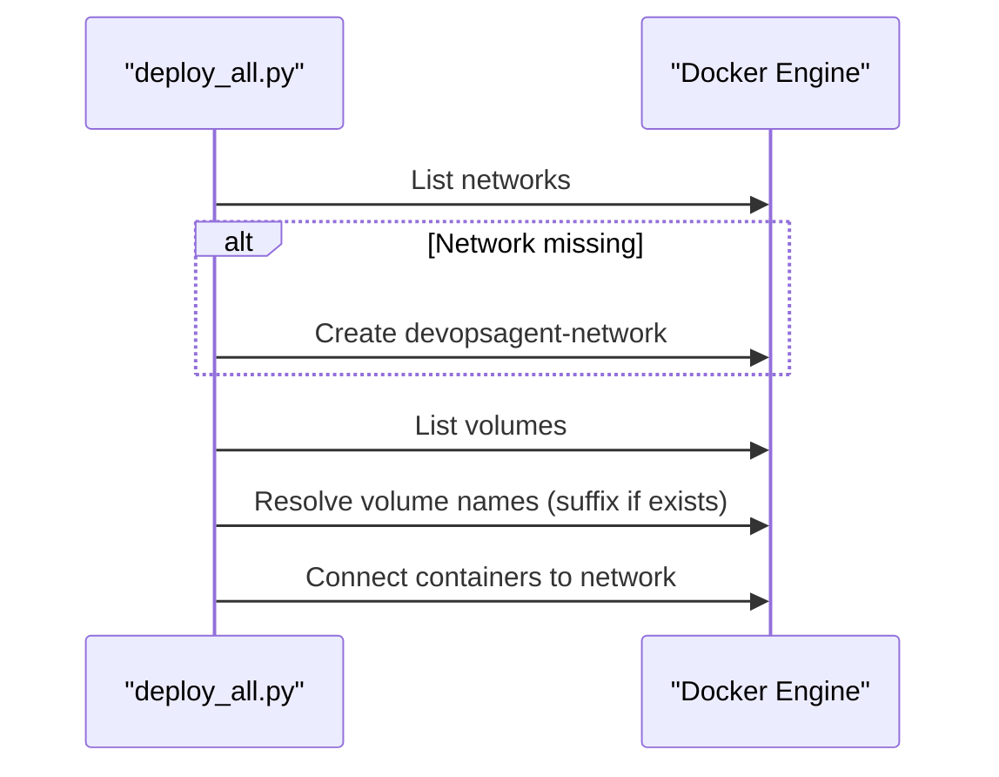
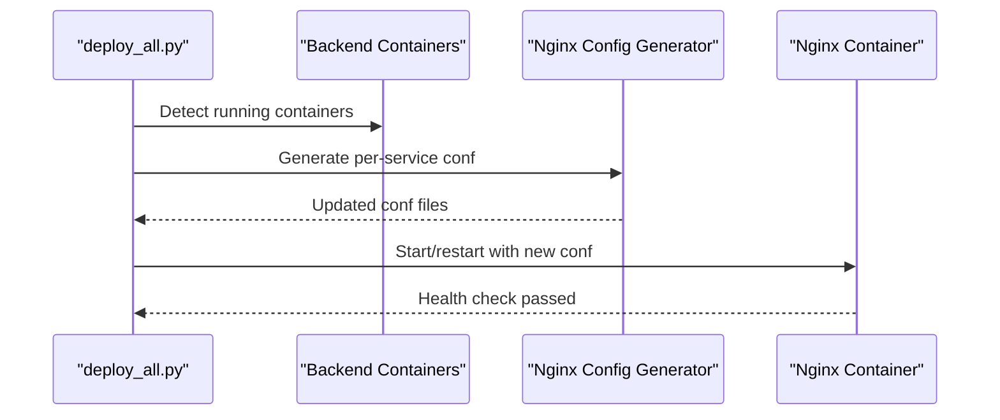
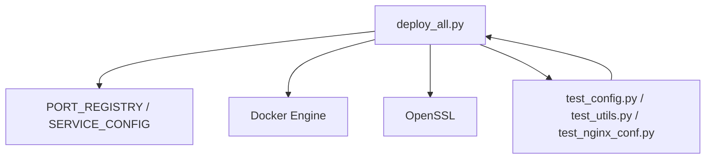

# Core Deployment Engine

<cite>
**Referenced Files in This Document**
- [deploy_all.py](file://deploy/deploy_all.py)
- [docker-compose.yml](file://deploy/docker-compose.yml)
- [common.sh](file://deploy/lib/common.sh)
- [.global_settings_example.yaml](file://deploy/config/.global_settings_example.yaml)
- [deploy_jenkins.sh](file://deploy/deploy_jenkins/deploy_jenkins.sh)
- [deploy_gitlab.sh](file://deploy/deploy_gitlab/deploy_gitlab.sh)
- [deploy_nginx.sh](file://deploy/deploy_nginx/deploy_nginx.sh)
- [test_config.py](file://deploy/tests/test_config.py)
- [test_utils.py](file://deploy/tests/test_utils.py)
- [test_nginx_conf.py](file://deploy/tests/test_nginx_conf.py)
- [clean_docker_container.sh](file://deploy/tools/clean_docker_container.sh)
</cite>

## Table of Contents
1. [Introduction](#introduction)
2. [Project Structure](#project-structure)
3. [Core Components](#core-components)
4. [Architecture Overview](#architecture-overview)
5. [Detailed Component Analysis](#detailed-component-analysis)
6. [Dependency Analysis](#dependency-analysis)
7. [Performance Considerations](#performance-considerations)
8. [Troubleshooting Guide](#troubleshooting-guide)
9. [Conclusion](#conclusion)
10. [Appendices](#appendices)

## Introduction
This document explains the DeployAgent core deployment engine centered on deploy_all.py. It covers orchestration logic, service configuration management, port conflict detection and resolution, deployment mode selection, centralized workflow from environment validation to service startup and Nginx configuration, common utilities for logging and environment checks, multi-source image pulling, the service dictionary architecture, deployment strategy patterns, examples of deployment modes, error handling, and recovery procedures. The engine balances modular service management with centralized coordination.

## Project Structure
The deployment system is organized around a central orchestrator (Python) and modular service scripts (Bash). Supporting libraries and configurations enable robust environment scanning, logging, and Docker integration.

**Diagram sources**
- [deploy_all.py:1-1315](file://deploy/deploy_all.py#L1-L1315)
- [docker-compose.yml:1-222](file://deploy/docker-compose.yml#L1-L222)
- [common.sh:1-566](file://deploy/lib/common.sh#L1-L566)
- [deploy_jenkins.sh:1-385](file://deploy/deploy_jenkins/deploy_jenkins.sh#L1-L385)
- [deploy_gitlab.sh:1-445](file://deploy/deploy_gitlab/deploy_gitlab.sh#L1-L445)
- [deploy_nginx.sh:1-712](file://deploy/deploy_nginx/deploy_nginx.sh#L1-L712)
- [.global_settings_example.yaml:1-31](file://deploy/config/.global_settings_example.yaml#L1-L31)
- [clean_docker_container.sh:1-248](file://deploy/tools/clean_docker_container.sh#L1-L248)

**Section sources**
- [deploy_all.py:1-1315](file://deploy/deploy_all.py#L1-L1315)
- [docker-compose.yml:1-222](file://deploy/docker-compose.yml#L1-L222)
- [common.sh:1-566](file://deploy/lib/common.sh#L1-L566)

## Core Components
- Central orchestrator (Python): Environment scanning, port allocation, service orchestration, Nginx integration, logging, and CLI.
- Service scripts (Bash): Modular deployment per service with standardized functions and environment handling.
- Shared library (Bash): Logging, environment loading, Docker checks, port checks, multi-source image pulling, and helpers.
- Compose definitions: Network and volume definitions for consistent runtime environment.
- Tests: Validation of configuration dictionaries, port registry, and Nginx container mappings.

Key responsibilities:
- Port conflict detection and automatic allocation
- Volume name resolution avoiding conflicts
- Reverse proxy configuration generation and lifecycle
- Multi-source image pulling with fallbacks
- Interactive and standalone deployment modes

**Section sources**
- [deploy_all.py:1-1315](file://deploy/deploy_all.py#L1-L1315)
- [common.sh:1-566](file://deploy/lib/common.sh#L1-L566)
- [docker-compose.yml:1-222](file://deploy/docker-compose.yml#L1-L222)
- [test_config.py:1-131](file://deploy/tests/test_config.py#L1-L131)

## Architecture Overview
The orchestrator coordinates environment validation, port assignment, service deployment, and Nginx reverse proxy configuration. Services are deployed via modular scripts that handle container creation, environment propagation, and post-deployment tasks. The system maintains a centralized configuration model while enabling independent service management.

**Diagram sources**
- [deploy_all.py:1-1315](file://deploy/deploy_all.py#L1-L1315)
- [deploy_jenkins.sh:1-385](file://deploy/deploy_jenkins/deploy_jenkins.sh#L1-L385)
- [deploy_gitlab.sh:1-445](file://deploy/deploy_gitlab/deploy_gitlab.sh#L1-L445)
- [deploy_nginx.sh:1-712](file://deploy/deploy_nginx/deploy_nginx.sh#L1-L712)

## Detailed Component Analysis

### Central Orchestrator (deploy_all.py)
- Responsibilities:
  - CLI argument parsing and mode selection
  - Environment loading and application (.env, .env.auto)
  - Port scanning and allocation
  - Volume name resolution
  - Service orchestration and failure aggregation
  - Nginx reverse proxy configuration and lifecycle
  - Summary printing and access URLs
- Key data structures:
  - PORT_REGISTRY: Default port assignments per service and sub-key
  - SERVICE_CONFIG: Per-service deployment metadata and Nginx mapping
  - DEPLOY_MODES: Predefined deployment scenarios with service lists and Nginx flags
- Orchestration flow:
  - Pre-deploy environment scan and .env application
  - Port allocation with conflict avoidance
  - Optional interactive .env creation
  - Service deployment loop
  - Optional Nginx proxy configuration and restart
  - Post-deployment summary and credentials retrieval

**Diagram sources**
- [deploy_all.py:1171-1315](file://deploy/deploy_all.py#L1171-L1315)
- [deploy_all.py:682-699](file://deploy/deploy_all.py#L682-L699)
- [deploy_all.py:769-872](file://deploy/deploy_all.py#L769-L872)

**Section sources**
- [deploy_all.py:1-1315](file://deploy/deploy_all.py#L1-L1315)

### Service Configuration Management
- PORT_REGISTRY: Centralized default port mapping for all services and sub-keys (e.g., Jenkins web/agent, GitLab HTTP/SSH, Nginx per-backend).
- SERVICE_CONFIG: Defines per-service:
  - deploy_script path
  - container name
  - nginx_port_key tuple for reverse proxy mapping
  - nginx_container_port for internal Nginx listener
  - backend_host and backend_port for proxy_pass
  - nginx_location for URL path routing
- VOLUME_MAP: Maps service to Docker volume environment variable and default names for conflict-free resolution.

**Diagram sources**
- [deploy_all.py:40-129](file://deploy/deploy_all.py#L40-L129)
- [deploy_all.py:459-475](file://deploy/deploy_all.py#L459-L475)

**Section sources**
- [deploy_all.py:40-129](file://deploy/deploy_all.py#L40-L129)
- [deploy_all.py:459-501](file://deploy/deploy_all.py#L459-L501)

### Port Conflict Detection and Resolution
- Scanning:
  - Host LISTEN sockets via ss
  - Running Docker container exposed ports
  - Union of occupied ports
- Allocation:
  - Iterative offset from default port until free
  - Updates PORT_REGISTRY and environment variables
  - Persists allocations to .env.auto for reproducibility
- Application:
  - Applies port map to environment and service-specific keys

**Diagram sources**
- [deploy_all.py:269-340](file://deploy/deploy_all.py#L269-L340)
- [deploy_all.py:294-300](file://deploy/deploy_all.py#L294-L300)
- [deploy_all.py:254-264](file://deploy/deploy_all.py#L254-L264)

**Section sources**
- [deploy_all.py:269-340](file://deploy/deploy_all.py#L269-L340)
- [deploy_all.py:219-234](file://deploy/deploy_all.py#L219-L234)

### Docker Network and Volume Management
- Network:
  - Ensures devopsagent-network exists; created if missing
  - Connects backend containers to the network
- Volumes:
  - Detects existing named volumes
  - Resolves conflicts by suffixing _1/_2
  - Supports backup and cleanup utilities

**Diagram sources**
- [deploy_all.py:757-767](file://deploy/deploy_all.py#L757-L767)
- [deploy_all.py:405-427](file://deploy/deploy_all.py#L405-L427)
- [deploy_all.py:477-490](file://deploy/deploy_all.py#L477-L490)

**Section sources**
- [deploy_all.py:757-767](file://deploy/deploy_all.py#L757-L767)
- [deploy_all.py:405-427](file://deploy/deploy_all.py#L405-L427)
- [deploy_all.py:477-501](file://deploy/deploy_all.py#L477-L501)

### Reverse Proxy Integration (Nginx)
- Dynamic configuration:
  - Detects running backend containers
  - Generates per-service Nginx configs with proxy_pass
  - Creates/updates SSL certificates if missing
  - Starts Nginx container with mapped ports and reloads config
- Environment propagation:
  - Sets HTTPS proxy-related variables for GitLab/MantisBT/Langfuse
- Cleanup:
  - Removes stale conf files for non-existent backends

**Diagram sources**
- [deploy_all.py:769-872](file://deploy/deploy_all.py#L769-L872)
- [deploy_all.py:591-681](file://deploy/deploy_all.py#L591-L681)
- [deploy_all.py:701-756](file://deploy/deploy_all.py#L701-L756)

**Section sources**
- [deploy_all.py:769-872](file://deploy/deploy_all.py#L769-L872)
- [deploy_all.py:591-681](file://deploy/deploy_all.py#L591-L681)
- [deploy_all.py:701-756](file://deploy/deploy_all.py#L701-L756)

### Deployment Modes and Strategy Patterns
- Predefined modes:
  - Full stack with Nginx
  - Full stack without Nginx
  - Individual services with optional Nginx
  - Nginx-only deployment
- Strategy pattern:
  - Mode-driven service list and Nginx flag
  - Standalone CLI flags for single-service deployments
  - Centralized selection and validation

Examples:
- Jenkins standalone with Nginx: ["jenkins", "nginx"]
- GitLab standalone with Nginx: ["gitlab", "nginx"]
- Nexus standalone with Nginx: ["nexus", "nginx"]
- Harbor standalone with Nginx: ["harbor", "nginx"]

**Section sources**
- [deploy_all.py:131-142](file://deploy/deploy_all.py#L131-L142)
- [deploy_all.py:1232-1251](file://deploy/deploy_all.py#L1232-L1251)

### Common Utility Functions
- Logging:
  - Colored console output with timestamps
  - Append to deploy.log
- Environment:
  - Load .env key=value pairs
  - Apply to process environment
- Command execution:
  - Subprocess wrapper with timeouts and error handling
- IP detection:
  - Filters out virtual interfaces to pick physical IP
- Multi-source image pulling:
  - Bash library supports fallback registries for images

**Section sources**
- [deploy_all.py:152-182](file://deploy/deploy_all.py#L152-L182)
- [deploy_all.py:209-218](file://deploy/deploy_all.py#L209-L218)
- [deploy_all.py:183-208](file://deploy/deploy_all.py#L183-L208)
- [common.sh:174-335](file://deploy/lib/common.sh#L174-L335)

### Service Scripts (Modular Design)
Each service has a dedicated script that:
- Validates prerequisites (root, Docker)
- Loads environment
- Deploys container with appropriate ports/volumes
- Provides status, password retrieval, and lifecycle commands

Representative scripts:
- Jenkins: [deploy_jenkins.sh:1-385](file://deploy/deploy_jenkins/deploy_jenkins.sh#L1-L385)
- GitLab: [deploy_gitlab.sh:1-445](file://deploy/deploy_gitlab/deploy_gitlab.sh#L1-L445)
- Nginx: [deploy_nginx.sh:1-712](file://deploy/deploy_nginx/deploy_nginx.sh#L1-L712)

**Section sources**
- [deploy_jenkins.sh:1-385](file://deploy/deploy_jenkins/deploy_jenkins.sh#L1-L385)
- [deploy_gitlab.sh:1-445](file://deploy/deploy_gitlab/deploy_gitlab.sh#L1-L445)
- [deploy_nginx.sh:1-712](file://deploy/deploy_nginx/deploy_nginx.sh#L1-L712)

## Dependency Analysis
- Central dependencies:
  - deploy_all.py depends on SERVICE_CONFIG for service metadata and on PORT_REGISTRY for port defaults.
  - Nginx configuration relies on backend container names and ports.
- External dependencies:
  - Docker and Docker Compose
  - OpenSSL for self-signed certificates
  - ss/netstat for port scanning
- Tests validate:
  - Configuration dictionaries correctness
  - Port registry validity
  - Nginx container name alignment with actual containers

**Diagram sources**
- [deploy_all.py:1-1315](file://deploy/deploy_all.py#L1-L1315)
- [test_config.py:1-131](file://deploy/tests/test_config.py#L1-L131)
- [test_utils.py:1-125](file://deploy/tests/test_utils.py#L1-L125)
- [test_nginx_conf.py:1-158](file://deploy/tests/test_nginx_conf.py#L1-L158)

**Section sources**
- [deploy_all.py:1-1315](file://deploy/deploy_all.py#L1-L1315)
- [test_config.py:1-131](file://deploy/tests/test_config.py#L1-L131)
- [test_utils.py:1-125](file://deploy/tests/test_utils.py#L1-L125)
- [test_nginx_conf.py:1-158](file://deploy/tests/test_nginx_conf.py#L1-L158)

## Performance Considerations
- Port scanning uses lightweight system calls; keep scans minimal by limiting selected services.
- Image pulls can be slow; multi-source pulling reduces dependency on single registry.
- Nginx configuration generation avoids unnecessary writes by comparing content.
- Volume resolution prevents repeated failures by pre-resolving names.

## Troubleshooting Guide
Common issues and recovery procedures:
- Port conflicts:
  - Use scan-only mode to generate .env.auto and review allocations.
  - Re-run deployment after adjusting .env or accepting suggested ports.
- Docker permission errors:
  - Ensure running under root/sudo.
- Nginx configuration errors:
  - Validate generated conf files and restart Nginx.
  - Remove stale conf files if backends are missing.
- Volume conflicts:
  - Use cleanup tools to remove unused volumes.
- Password retrieval:
  - Use helper functions to fetch initial passwords from containers.
- Recovery:
  - Use standalone flags to redeploy individual services.
  - Clean containers and volumes via cleanup tool if stuck.

**Section sources**
- [deploy_all.py:1222-1230](file://deploy/deploy_all.py#L1222-L1230)
- [deploy_all.py:878-900](file://deploy/deploy_all.py#L878-L900)
- [clean_docker_container.sh:1-248](file://deploy/tools/clean_docker_container.sh#L1-L248)

## Conclusion
The DeployAgent core engine provides a robust, modular, and centralized deployment solution. It automates environment validation, port allocation, service orchestration, and reverse proxy configuration while preserving independent service management. The configuration-driven design, comprehensive error handling, and recovery utilities make it suitable for both development and production environments.

## Appendices

### Example Deployment Modes
- Full deployment with Nginx: ["jenkins", "gitlab", "mantisbt", "langfuse", "nginx"]
- Jenkins standalone with Nginx: ["jenkins", "nginx"]
- GitLab standalone with Nginx: ["gitlab", "nginx"]
- Nexus standalone with Nginx: ["nexus", "nginx"]
- Harbor standalone with Nginx: ["harbor", "nginx"]
- Nginx-only deployment: ["nginx"]

**Section sources**
- [deploy_all.py:131-142](file://deploy/deploy_all.py#L131-L142)

### Environment and Global Settings
- .env and .env.auto: Store environment variables and auto-generated port allocations.
- .global_settings_example.yaml: Provides template for global configuration (Agent, AI model, Git).

**Section sources**
- [deploy_all.py:30-39](file://deploy/deploy_all.py#L30-L39)
- [.global_settings_example.yaml:1-31](file://deploy/config/.global_settings_example.yaml#L1-L31)

### Testing and Validation
- Configuration tests validate dictionaries and structures.
- Utility tests validate port availability and script existence.
- Nginx configuration tests validate container names and network connectivity.

**Section sources**
- [test_config.py:1-131](file://deploy/tests/test_config.py#L1-L131)
- [test_utils.py:1-125](file://deploy/tests/test_utils.py#L1-L125)
- [test_nginx_conf.py:1-158](file://deploy/tests/test_nginx_conf.py#L1-L158)