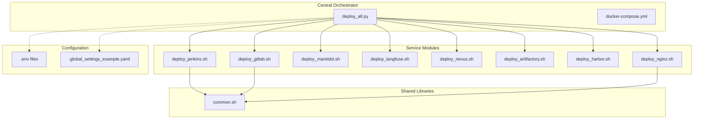
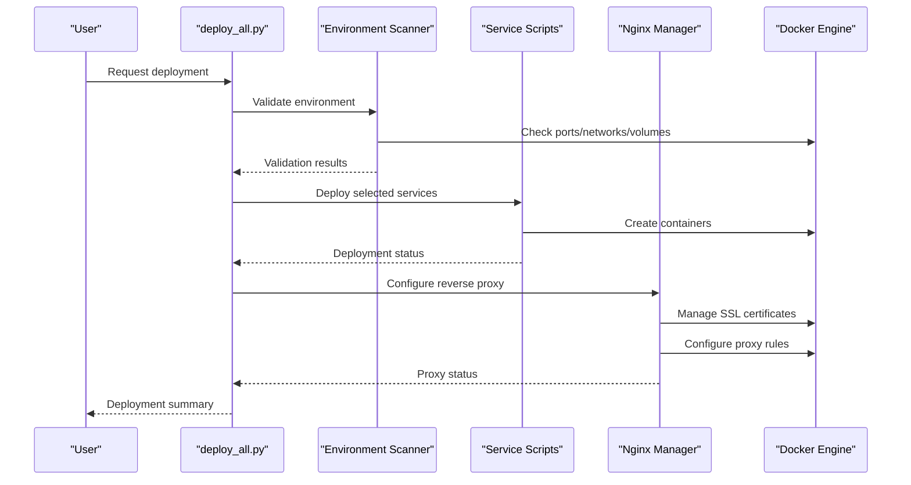
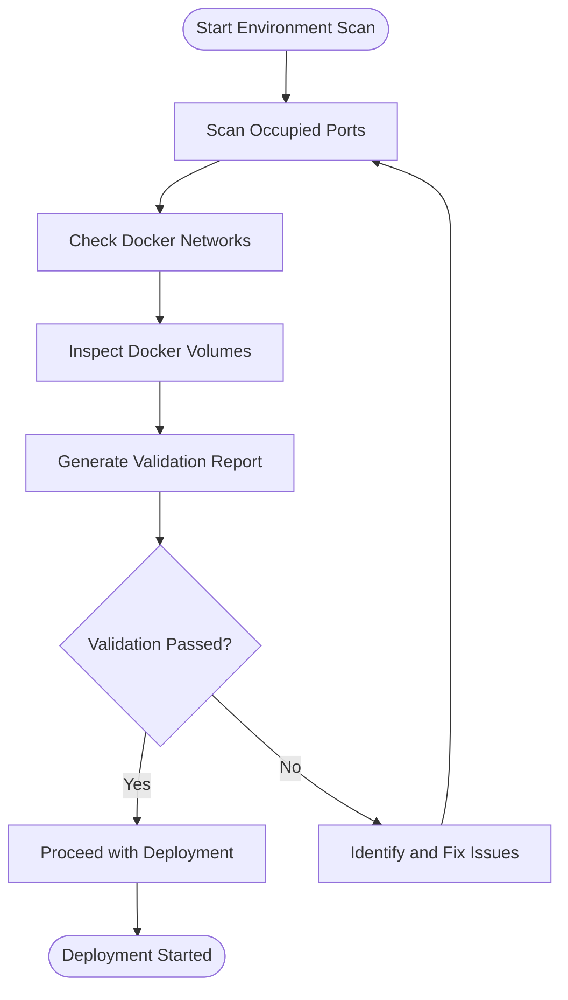
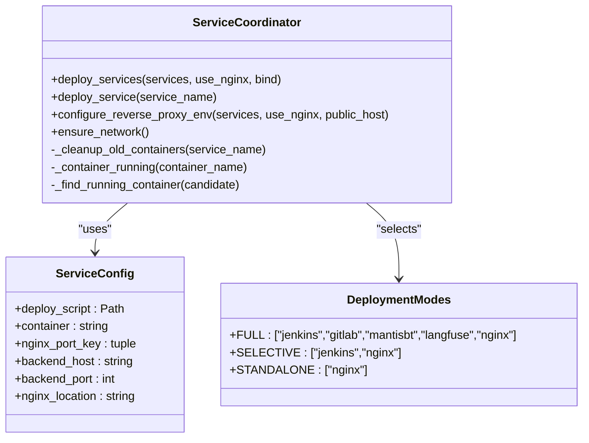
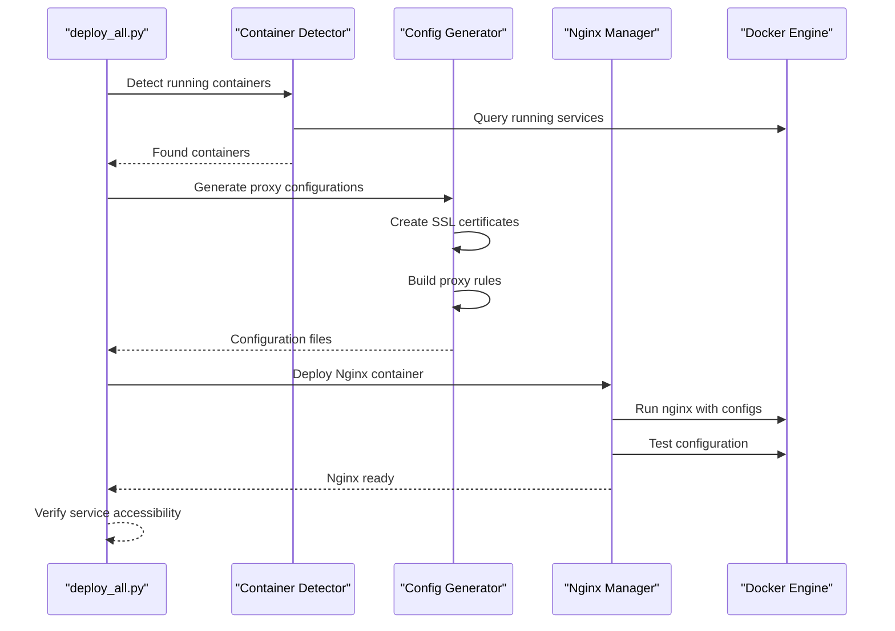
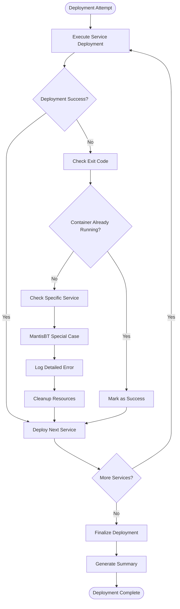
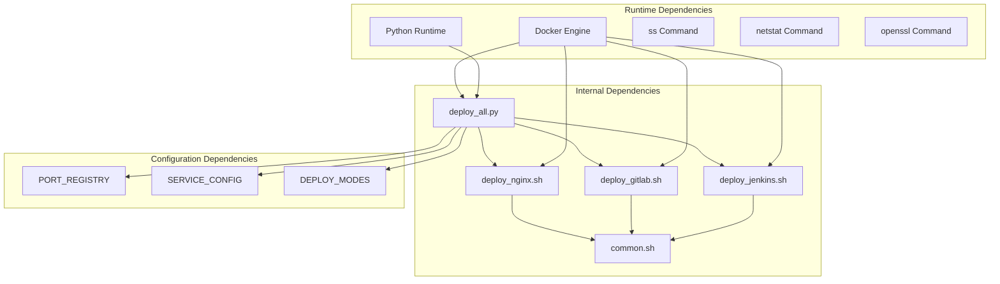

# Deployment Orchestration Logic

<cite>
**Referenced Files in This Document**
- [deploy_all.py](file://deploy/deploy_all.py)
- [docker-compose.yml](file://deploy/docker-compose.yml)
- [common.sh](file://deploy/lib/common.sh)
- [deploy_jenkins.sh](file://deploy/deploy_jenkins/deploy_jenkins.sh)
- [deploy_gitlab.sh](file://deploy/deploy_gitlab/deploy_gitlab.sh)
- [deploy_nginx.sh](file://deploy/deploy_nginx/deploy_nginx.sh)
- [test_config.py](file://deploy/tests/test_config.py)
- [.global_settings_example.yaml](file://deploy/config/.global_settings_example.yaml)
</cite>

## Table of Contents
1. [Introduction](#introduction)
2. [Project Structure](#project-structure)
3. [Core Components](#core-components)
4. [Architecture Overview](#architecture-overview)
5. [Detailed Component Analysis](#detailed-component-analysis)
6. [Dependency Analysis](#dependency-analysis)
7. [Performance Considerations](#performance-considerations)
8. [Troubleshooting Guide](#troubleshooting-guide)
9. [Conclusion](#conclusion)

## Introduction
This document provides comprehensive technical documentation for the core deployment orchestration logic implemented in the Python-based deployment system. It focuses on the main deployment workflow from environment validation through service startup and Nginx configuration, detailing the centralized deployment coordination, service ordering, dependency management, error handling mechanisms, and the deployment modes system. The modular design enabling independent service management while maintaining centralized coordination is thoroughly explained, along with the role of the main orchestrator in coordinating all deployment activities.

## Project Structure
The deployment system follows a hybrid architecture combining a central Python orchestrator with modular Bash-based service deployment scripts. The structure emphasizes separation of concerns, allowing each service to manage its own lifecycle while being coordinated centrally.

**Diagram sources**
- [deploy_all.py:1-1315](file://deploy/deploy_all.py#L1-L1315)
- [docker-compose.yml:1-222](file://deploy/docker-compose.yml#L1-L222)

**Section sources**
- [deploy_all.py:1-1315](file://deploy/deploy_all.py#L1-L1315)
- [docker-compose.yml:1-222](file://deploy/docker-compose.yml#L1-L222)

## Core Components
The deployment system consists of several key components that work together to provide comprehensive orchestration capabilities:

### Central Orchestrator (deploy_all.py)
The main orchestrator serves as the primary controller for the entire deployment process. It manages environment validation, service coordination, and Nginx integration while delegating individual service deployments to specialized scripts.

Key responsibilities include:
- Environment scanning and validation
- Port allocation and conflict resolution
- Service deployment coordination
- Nginx reverse proxy configuration
- Error handling and recovery procedures
- Interactive and automated deployment modes

### Service Deployment Scripts
Each service has a dedicated Bash script that handles its specific deployment requirements:
- Jenkins deployment with context path configuration
- GitLab deployment with external URL management
- MantisBT deployment with database integration
- Langfuse deployment with data persistence
- Nexus and Artifactory deployment with repository management
- Harbor deployment with registry services
- Nginx deployment with SSL certificate management

### Shared Library Functions
The common.sh library provides reusable functions for logging, environment checking, and utility operations used across all service scripts.

**Section sources**
- [deploy_all.py:1-1315](file://deploy/deploy_all.py#L1-L1315)
- [common.sh:1-566](file://deploy/lib/common.sh#L1-L566)

## Architecture Overview
The deployment architecture implements a centralized orchestration pattern with modular service management. The system maintains a clear separation between coordination logic and service-specific implementation.

**Diagram sources**
- [deploy_all.py:682-873](file://deploy/deploy_all.py#L682-L873)
- [deploy_nginx.sh:58-365](file://deploy/deploy_nginx/deploy_nginx.sh#L58-L365)

The architecture ensures that:
- Centralized coordination maintains service ordering and dependencies
- Modular design allows independent service management
- Error isolation prevents cascading failures
- Configuration management is centralized but flexible

## Detailed Component Analysis

### Environment Validation and Scanning
The environment validation system performs comprehensive checks to ensure deployment prerequisites are met:

**Diagram sources**
- [deploy_all.py:269-340](file://deploy/deploy_all.py#L269-L340)
- [deploy_all.py:346-399](file://deploy/deploy_all.py#L346-L399)
- [deploy_all.py:405-427](file://deploy/deploy_all.py#L405-L427)

The scanning process includes:
- Port occupancy detection using system commands
- Docker network conflict resolution
- Volume existence verification
- Automatic port allocation when conflicts are detected

**Section sources**
- [deploy_all.py:269-340](file://deploy/deploy_all.py#L269-L340)
- [deploy_all.py:346-399](file://deploy/deploy_all.py#L346-L399)
- [deploy_all.py:405-427](file://deploy/deploy_all.py#L405-L427)

### Service Deployment Coordination
The service deployment system manages the execution order and dependency resolution for multiple services:

**Diagram sources**
- [deploy_all.py:502-545](file://deploy/deploy_all.py#L502-L545)
- [deploy_all.py:682-699](file://deploy/deploy_all.py#L682-L699)
- [deploy_all.py:131-142](file://deploy/deploy_all.py#L131-L142)

The coordination mechanism ensures:
- Proper service ordering based on dependencies
- Container cleanup and conflict resolution
- Environment variable propagation
- Network connectivity verification

**Section sources**
- [deploy_all.py:502-545](file://deploy/deploy_all.py#L502-L545)
- [deploy_all.py:682-699](file://deploy/deploy_all.py#L682-L699)
- [deploy_all.py:131-142](file://deploy/deploy_all.py#L131-L142)

### Nginx Reverse Proxy Management
The Nginx management system provides centralized SSL certificate handling and dynamic configuration generation:

**Diagram sources**
- [deploy_all.py:769-873](file://deploy/deploy_all.py#L769-L873)
- [deploy_nginx.sh:58-365](file://deploy/deploy_nginx/deploy_nginx.sh#L58-L365)

The Nginx management includes:
- Dynamic SSL certificate generation
- Automatic proxy configuration creation
- Container network integration
- Health check and validation

**Section sources**
- [deploy_all.py:769-873](file://deploy/deploy_all.py#L769-L873)
- [deploy_nginx.sh:58-365](file://deploy/deploy_nginx/deploy_nginx.sh#L58-L365)

### Deployment Modes System
The deployment modes system provides flexible deployment configurations for different use cases:

| Mode ID | Mode Name | Description | Services | Nginx Enabled |
|---------|-----------|-------------|----------|---------------|
| 1 | full | Complete deployment (Jenkins + GitLab + MantisBT + Langfuse + Nginx) | ["jenkins","gitlab","mantisbt","langfuse","nginx"] | True |
| 2 | full-only | Complete deployment (no Nginx) | ["jenkins","gitlab","mantisbt","langfuse"] | False |
| 3 | jenkins | Jenkins only (+ Nginx HTTPS) | ["jenkins","nginx"] | True |
| 4 | gitlab | GitLab only (+ Nginx HTTPS) | ["gitlab","nginx"] | True |
| 5 | mantisbt | MantisBT only (+ Nginx HTTPS) | ["mantisbt","nginx"] | True |
| 6 | langfuse | Langfuse only (+ Nginx HTTPS) | ["langfuse","nginx"] | True |
| 7 | nginx | Nginx reverse proxy only | ["nginx"] | True |
| 8 | artifactory | JFrog Artifactory only (+ Nginx HTTPS) | ["artifactory","nginx"] | True |
| 9 | nexus | Sonatype Nexus3 only (+ Nginx HTTPS) | ["nexus","nginx"] | True |
| 10 | harbor | Harbor only (+ Nginx HTTPS) | ["harbor","nginx"] | True |

**Section sources**
- [deploy_all.py:131-142](file://deploy/deploy_all.py#L131-L142)

### Error Handling and Recovery Procedures
The system implements comprehensive error handling with recovery mechanisms:

**Diagram sources**
- [deploy_all.py:502-545](file://deploy/deploy_all.py#L502-L545)

Error handling mechanisms include:
- Graceful degradation for partial failures
- Service-specific error recovery logic
- Resource cleanup and container management
- Detailed logging and diagnostic information

**Section sources**
- [deploy_all.py:502-545](file://deploy/deploy_all.py#L502-L545)

## Dependency Analysis
The deployment system exhibits clear dependency relationships between components:

**Diagram sources**
- [deploy_all.py:1-1315](file://deploy/deploy_all.py#L1-L1315)
- [common.sh:1-566](file://deploy/lib/common.sh#L1-L566)

The dependency analysis reveals:
- Central orchestrator depends on Docker and system commands
- Service scripts depend on shared library functions
- Configuration dictionaries drive deployment decisions
- Network dependencies require proper container connectivity

**Section sources**
- [deploy_all.py:1-1315](file://deploy/deploy_all.py#L1-L1315)
- [common.sh:1-566](file://deploy/lib/common.sh#L1-L566)

## Performance Considerations
The deployment system incorporates several performance optimization strategies:

### Parallel Execution Opportunities
- Service deployments can potentially run in parallel for independent services
- Network scanning and validation can be optimized for concurrent operations
- Container cleanup operations can be batched

### Resource Management
- Automatic port allocation prevents conflicts and reduces retry attempts
- Volume name resolution avoids naming collisions
- SSL certificate caching reduces regeneration overhead

### Memory and Storage Efficiency
- Temporary file handling minimizes disk I/O
- Stream processing for large log outputs
- Efficient container resource allocation

## Troubleshooting Guide
Common deployment issues and their resolutions:

### Port Conflicts
**Issue**: Deployment fails due to port conflicts
**Resolution**: The system automatically detects and resolves port conflicts by allocating alternative ports

### Docker Connectivity Issues
**Issue**: Services fail to connect to Docker daemon
**Resolution**: Verify Docker installation and permissions, check Docker service status

### SSL Certificate Problems
**Issue**: Nginx fails with SSL certificate errors
**Resolution**: Ensure openssl is installed and certificates are properly generated

### Service Startup Failures
**Issue**: Individual services fail to start
**Resolution**: Check service-specific logs, verify dependencies, review configuration files

**Section sources**
- [deploy_all.py:168-182](file://deploy/deploy_all.py#L168-L182)
- [deploy_all.py:878-900](file://deploy/deploy_all.py#L878-L900)

## Conclusion
The deployment orchestration system provides a robust, modular, and scalable solution for managing complex multi-service deployments. The centralized orchestrator effectively coordinates service deployments while maintaining flexibility through its modular design. Key strengths include comprehensive environment validation, intelligent error handling, flexible deployment modes, and seamless Nginx integration. The system's architecture supports both interactive and automated deployment scenarios while providing extensive diagnostic capabilities for troubleshooting and maintenance.

The implementation demonstrates best practices in deployment automation, including proper separation of concerns, comprehensive error handling, and user-friendly operational interfaces. The modular design enables easy extension for new services while maintaining system stability and reliability.