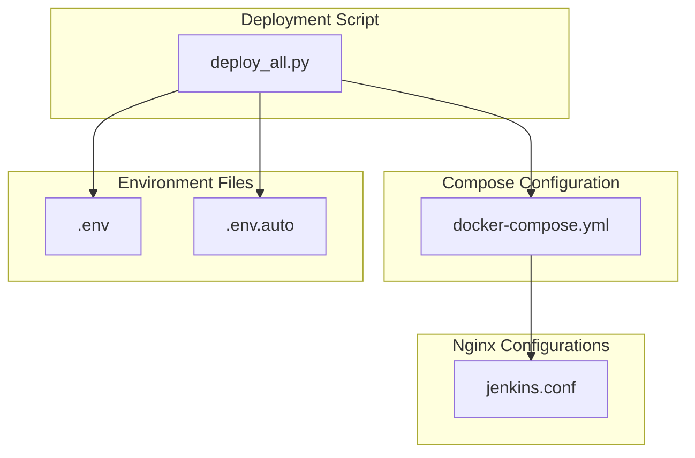
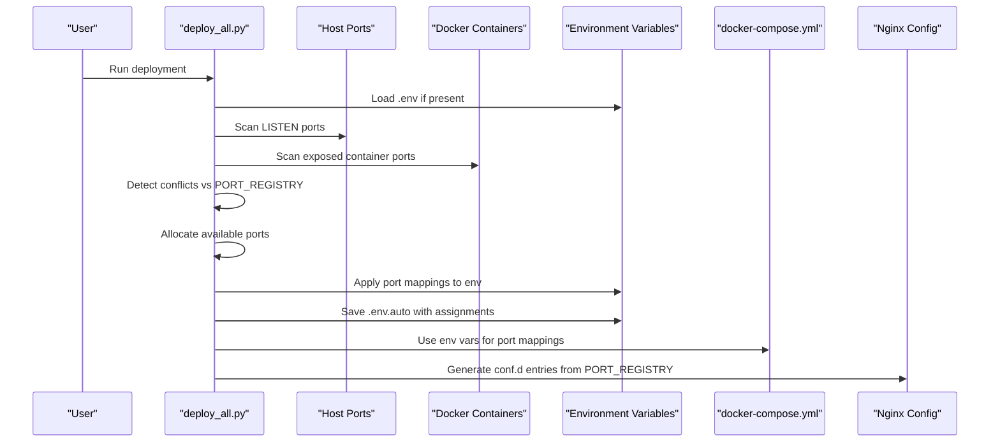
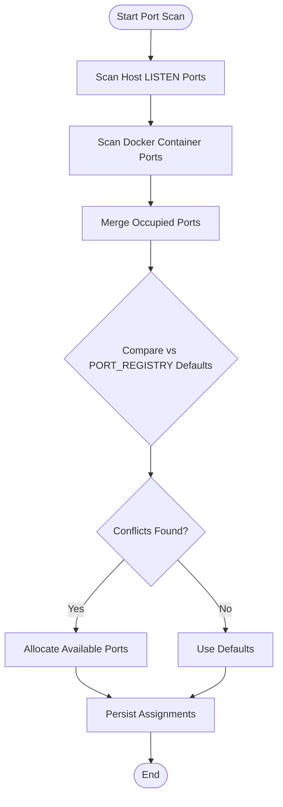
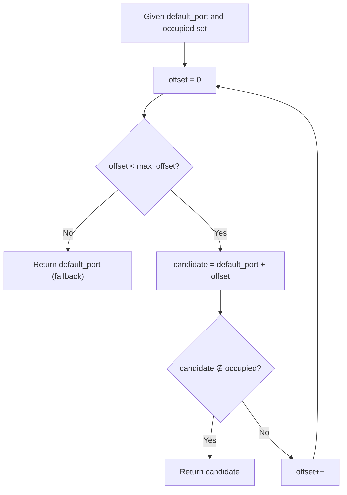
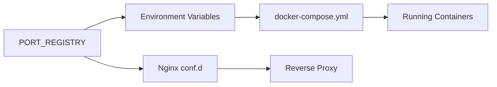
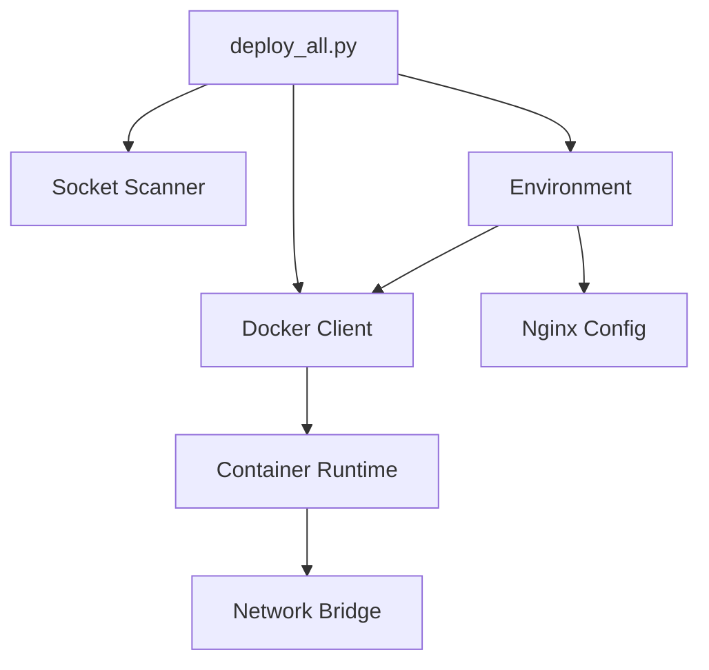

# Port Management System

<cite>
**Referenced Files in This Document**
- [deploy_all.py](file://deploy/deploy_all.py)
- [docker-compose.yml](file://deploy/docker-compose.yml)
- [jenkins.conf](file://deploy/deploy_nginx/nginx/conf.d/jenkins.conf)
- [.global_settings_example.yaml](file://deploy/config/.global_settings_example.yaml)
</cite>

## Table of Contents
1. [Introduction](#introduction)
2. [Project Structure](#project-structure)
3. [Core Components](#core-components)
4. [Architecture Overview](#architecture-overview)
5. [Detailed Component Analysis](#detailed-component-analysis)
6. [Dependency Analysis](#dependency-analysis)
7. [Performance Considerations](#performance-considerations)
8. [Troubleshooting Guide](#troubleshooting-guide)
9. [Conclusion](#conclusion)

## Introduction
This document explains the port management system implemented in the deployment automation script. It covers the PORT_REGISTRY architecture that defines default port allocations for all services, the port conflict detection algorithm that scans host ports and Docker container mappings, the automatic port allocation mechanism that finds available ports when conflicts occur, and the persistence of port assignments through environment variables and auto-generated configuration files. It also details how port assignments relate to service deployment and how the system handles edge cases like port exhaustion.

## Project Structure
The port management system spans several key files:
- The main deployment script defines the PORT_REGISTRY, port scanning, conflict detection, and automatic allocation logic.
- The Docker Compose file maps container ports to host ports using environment variables.
- The Nginx configuration files define reverse proxy mappings that depend on the PORT_REGISTRY values.

**Diagram sources**
- [deploy_all.py](file://deploy/deploy_all.py)
- [docker-compose.yml](file://deploy/docker-compose.yml)
- [jenkins.conf](file://deploy/deploy_nginx/nginx/conf.d/jenkins.conf)

**Section sources**
- [deploy_all.py](file://deploy/deploy_all.py)
- [docker-compose.yml](file://deploy/docker-compose.yml)

## Core Components
- PORT_REGISTRY: Central registry of default port allocations for all services, including web ports, agent ports, and Nginx proxy ports.
- Port Scanning: Collects occupied host ports and Docker container mappings to build a conflict set.
- Conflict Detection: Compares default ports against the occupied set to identify conflicts.
- Automatic Allocation: Iterates through offsets from default ports to find the first available port.
- Environment Persistence: Applies port mappings to environment variables and writes auto-generated port configuration files.
- Reverse Proxy Integration: Uses PORT_REGISTRY values to configure Nginx proxy mappings dynamically.

**Section sources**
- [deploy_all.py:40-59](file://deploy/deploy_all.py#L40-L59)
- [deploy_all.py:269-340](file://deploy/deploy_all.py#L269-L340)
- [deploy_all.py:219-264](file://deploy/deploy_all.py#L219-L264)

## Architecture Overview
The port management system orchestrates port discovery, conflict resolution, and persistence across the deployment lifecycle.

**Diagram sources**
- [deploy_all.py:269-340](file://deploy/deploy_all.py#L269-L340)
- [deploy_all.py:219-264](file://deploy/deploy_all.py#L219-L264)
- [deploy_all.py:769-872](file://deploy/deploy_all.py#L769-L872)
- [docker-compose.yml](file://deploy/docker-compose.yml)

## Detailed Component Analysis

### PORT_REGISTRY Architecture
PORT_REGISTRY defines default port allocations for all services:
- Web ports: Jenkins web and agent, GitLab HTTP/SSH, MantisBT web, MariaDB database, Langfuse web, Nexus web, Artifactory web.
- Nginx proxy ports: Dedicated HTTPS ports for each proxied service.
- Additional: webhook port.

Key characteristics:
- Hierarchical structure for services with multiple ports (e.g., Jenkins web and agent).
- Separate Nginx port group for reverse proxy mappings.
- Provides a single source of truth for default allocations.

**Section sources**
- [deploy_all.py:40-59](file://deploy_all.py#L40-L59)

### Port Conflict Detection Algorithm
The algorithm performs two primary scans:
1. Host LISTEN ports: Parses output from the system socket scanner to collect all listening TCP/UDP ports.
2. Docker container mappings: Extracts published host ports from running containers.

It merges these into a unified set of occupied ports and compares against PORT_REGISTRY defaults.

**Diagram sources**
- [deploy_all.py:269-292](file://deploy_all.py#L269-L292)
- [deploy_all.py:302-340](file://deploy_all.py#L302-L340)

**Section sources**
- [deploy_all.py:269-292](file://deploy_all.py#L269-L292)
- [deploy_all.py:302-340](file://deploy_all.py#L302-L340)

### Automatic Port Allocation Mechanism
When conflicts are detected, the system iterates through a bounded offset range from the default port to find the first available port. This ensures minimal disruption to default configurations while avoiding collisions.

Behavior:
- Starts at default_port and increments by offset until finding a port not in the occupied set.
- If no available port is found within the maximum offset, falls back to the default port.

**Diagram sources**
- [deploy_all.py:294-300](file://deploy_all.py#L294-L300)

**Section sources**
- [deploy_all.py:294-300](file://deploy_all.py#L294-L300)

### Port Assignment Persistence System
The system persists port assignments through:
- Environment variables: Applied to the process environment for immediate use during deployment.
- Auto-generated .env.auto: Written with service-specific variables derived from PORT_REGISTRY keys.

Persistence steps:
- Apply port mappings to environment variables using service-specific naming conventions.
- Write .env.auto with comments indicating generation time and per-service port assignments.

**Section sources**
- [deploy_all.py:241-264](file://deploy_all.py#L241-L264)
- [deploy_all.py:219-234](file://deploy_all.py#L219-L234)

### Port Environment Variable Management
Environment variable management follows service-specific naming:
- Standard service ports: SERVICE_NAME_UPPERCASE_PORT.
- Nested service ports: SERVICE_NAME_UPPERCASE_PORT_KEY_UPPERCASE.
- Special cases:
  - Nginx ports: NGINX_PORT_KEY_UPPERCASE.
  - MariaDB database port: MARIADB_PORT.

These variables are applied to the process environment and consumed by child deployment scripts and Docker Compose.

**Section sources**
- [deploy_all.py:241-253](file://deploy_all.py#L241-L253)

### Auto-Generated Port Configuration Files
The system generates .env.auto with:
- Header comment indicating auto-generation.
- Timestamp of creation.
- Per-service port entries using uppercase keys and values.

This file serves as a record of the final port assignments and can be reviewed or reused.

**Section sources**
- [deploy_all.py:219-234](file://deploy_all.py#L219-L234)

### Relationship Between Port Assignments and Service Deployment
Port assignments influence deployment in two ways:
- Docker Compose port mappings: Host ports are mapped from environment variables to container ports.
- Nginx reverse proxy: PORT_REGISTRY values drive the generation of per-service Nginx configuration files.

**Diagram sources**
- [deploy_all.py:40-59](file://deploy_all.py#L40-L59)
- [deploy_all.py:769-872](file://deploy_all.py#L769-L872)
- [docker-compose.yml](file://deploy/docker-compose.yml)

**Section sources**
- [deploy_all.py:40-59](file://deploy_all.py#L40-L59)
- [deploy_all.py:769-872](file://deploy_all.py#L769-L872)
- [docker-compose.yml](file://deploy/docker-compose.yml)

### Edge Cases and Fallback Mechanisms
Edge cases handled:
- Port exhaustion within the offset range: Falls back to the default port when no available port is found within the configured maximum offset.
- Existing .env presence: Loads existing environment variables to preserve user-defined overrides.
- Non-interactive operation: Skips interactive prompts when invoked with command-line flags.

Fallback behavior:
- Automatic allocation returns the default port if no free port is found within the allowed offset.
- Deployment continues with the chosen port, minimizing failure risk.

**Section sources**
- [deploy_all.py:294-300](file://deploy_all.py#L294-L300)
- [deploy_all.py:1254-1259](file://deploy_all.py#L1254-L1259)

## Dependency Analysis
Port management depends on:
- Host networking and Docker runtime for port availability checks.
- Environment variable system for configuration propagation.
- Docker Compose for translating environment variables into container port mappings.
- Nginx configuration templates for reverse proxy routing.

**Diagram sources**
- [deploy_all.py:269-340](file://deploy_all.py#L269-L340)
- [deploy_all.py:769-872](file://deploy_all.py#L769-L872)
- [docker-compose.yml](file://deploy/docker-compose.yml)

**Section sources**
- [deploy_all.py:269-340](file://deploy_all.py#L269-L340)
- [deploy_all.py:769-872](file://deploy_all.py#L769-L872)
- [docker-compose.yml](file://deploy/docker-compose.yml)

## Performance Considerations
- Port scanning uses lightweight system commands and regex parsing; timeouts are enforced to prevent hangs.
- Automatic allocation uses a bounded linear search; the maximum offset limits search cost.
- Environment variable updates are O(n) over the number of ports per service.
- Nginx configuration generation is triggered only when backend containers are detected, reducing unnecessary reloads.

## Troubleshooting Guide
Common issues and resolutions:
- Conflicting ports:
  - Run the scan-only mode to identify occupied ports and review .env.auto for the generated assignments.
  - Adjust defaults in .env or increase the maximum offset for automatic allocation.
- Nginx proxy failures:
  - Verify that backend containers are running and detectable by the script.
  - Check generated Nginx configuration files under deploy_nginx/nginx/conf.d for correctness.
- Docker port mapping mismatches:
  - Confirm that environment variables match the expected service keys and that docker-compose is using the correct variables.
- Port exhaustion:
  - Increase the maximum offset for automatic allocation or manually select alternative ports in .env.

**Section sources**
- [deploy_all.py:1222-1230](file://deploy_all.py#L1222-L1230)
- [deploy_all.py:769-872](file://deploy_all.py#L769-L872)
- [docker-compose.yml](file://deploy/docker-compose.yml)

## Conclusion
The port management system provides a robust, automated approach to allocating and persisting port assignments across services. By centralizing defaults in PORT_REGISTRY, scanning host and container ports, and applying environment-driven persistence, it minimizes conflicts and simplifies deployment. The system’s fallback mechanisms and integration with Docker Compose and Nginx ensure reliable operation even under constrained environments.