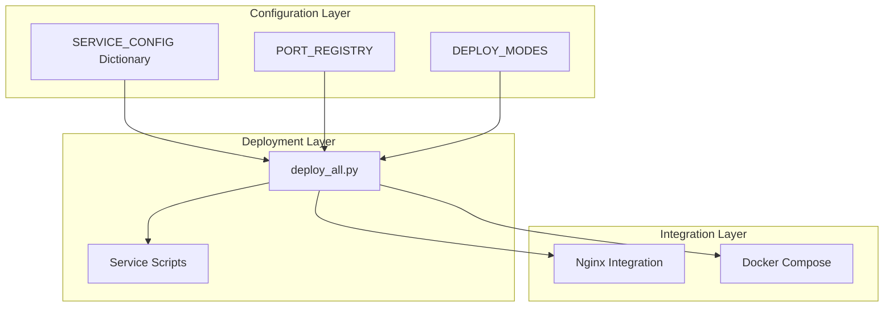
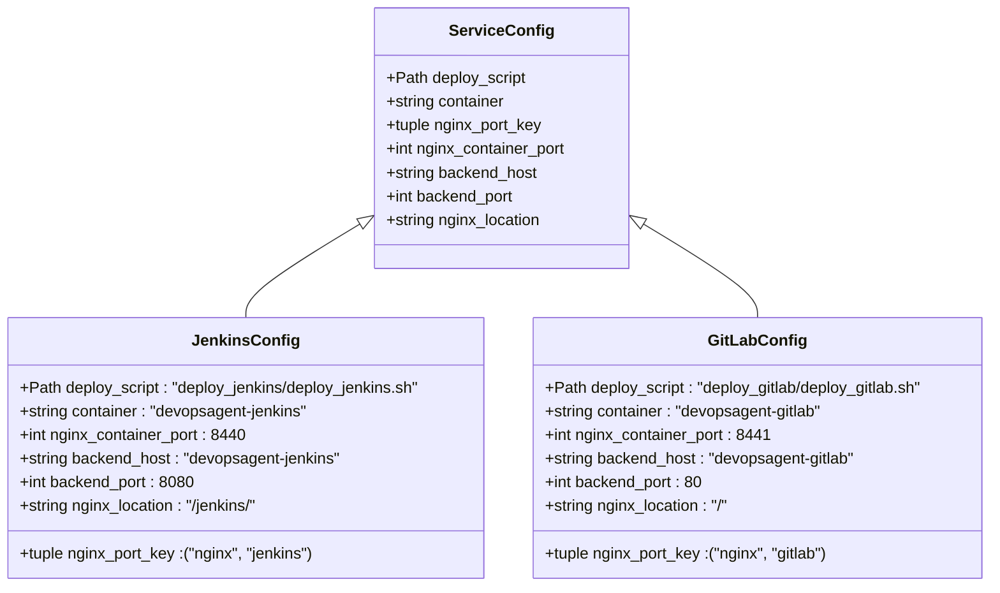
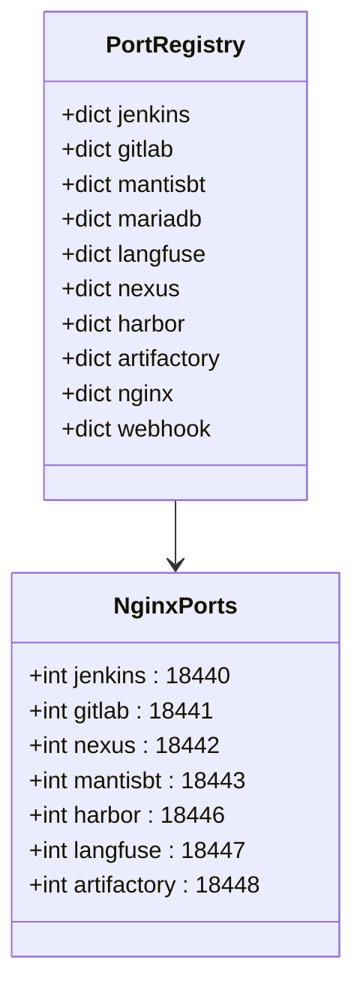
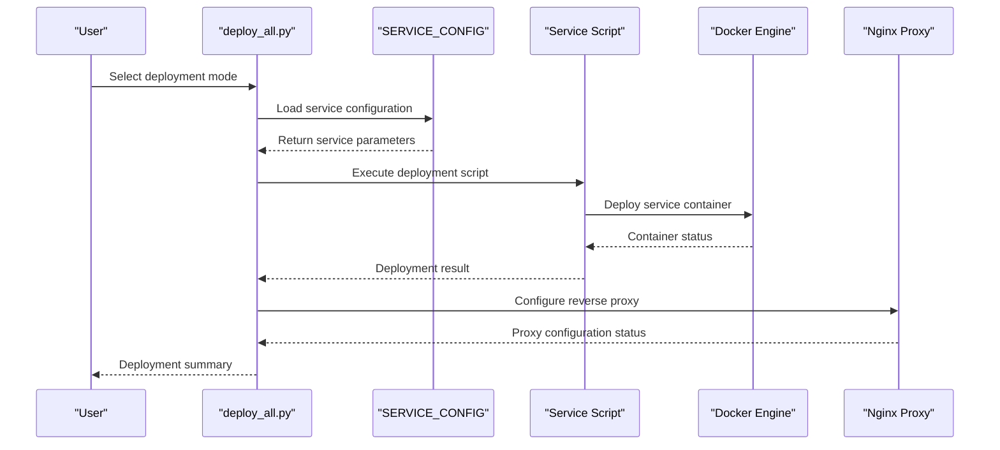
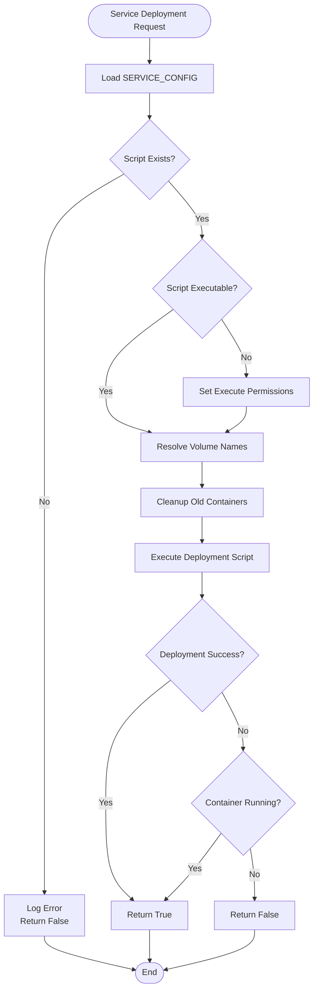
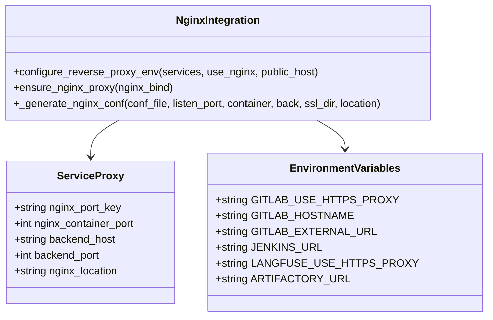
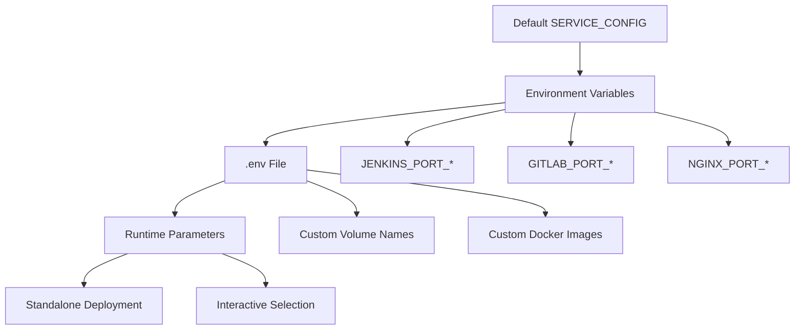
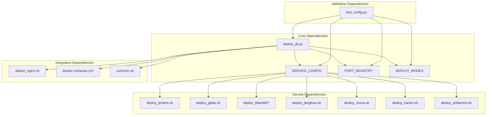
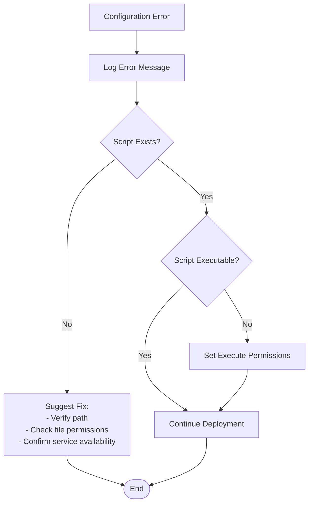

# Service Configuration Management

<cite>
**Referenced Files in This Document**
- [deploy_all.py](file://deploy/deploy_all.py)
- [deploy_jenkins.sh](file://deploy/deploy_jenkins/deploy_jenkins.sh)
- [deploy_gitlab.sh](file://deploy/deploy_gitlab/deploy_gitlab.sh)
- [deploy_nginx.sh](file://deploy/deploy_nginx/deploy_nginx.sh)
- [docker-compose.yml](file://deploy/docker-compose.yml)
- [.global_settings_example.yaml](file://deploy/config/.global_settings_example.yaml)
- [common.sh](file://deploy/lib/common.sh)
- [test_config.py](file://deploy/tests/test_config.py)
</cite>

## Table of Contents
1. [Introduction](#introduction)
2. [Project Structure](#project-structure)
3. [Core Components](#core-components)
4. [Architecture Overview](#architecture-overview)
5. [Detailed Component Analysis](#detailed-component-analysis)
6. [Dependency Analysis](#dependency-analysis)
7. [Performance Considerations](#performance-considerations)
8. [Troubleshooting Guide](#troubleshooting-guide)
9. [Conclusion](#conclusion)

## Introduction

The DevOpsAgent service configuration management system provides a centralized, declarative approach to managing service deployments across multiple DevOps tools. This system uses a structured configuration dictionary (SERVICE_CONFIG) to define deployment parameters for each supported service, enabling consistent deployment patterns and seamless Nginx integration.

The system manages 7 core services: Jenkins, GitLab, MantisBT, Langfuse, Nexus, Harbor, and Artifactory, each with standardized deployment scripts and configuration parameters. The architecture ensures that service configurations are validated, loaded dynamically, and integrated with the broader deployment orchestration system.

## Project Structure

The service configuration management system is organized around several key components:

**Diagram sources**
- [deploy_all.py:61-142](file://deploy/deploy_all.py#L61-L142)
- [deploy_all.py:40-59](file://deploy/deploy_all.py#L40-L59)
- [deploy_all.py:131-142](file://deploy/deploy_all.py#L131-L142)

**Section sources**
- [deploy_all.py:1-800](file://deploy/deploy_all.py#L1-L800)

## Core Components

### SERVICE_CONFIG Dictionary Architecture

The SERVICE_CONFIG dictionary serves as the central configuration hub, defining deployment parameters for each supported service. Each service configuration contains the following standardized structure:

**Diagram sources**
- [deploy_all.py:61-129](file://deploy/deploy_all.py#L61-L129)

### PORT_REGISTRY Configuration

The PORT_REGISTRY maintains default port allocations for all services, with special handling for Nginx reverse proxy ports:

**Diagram sources**
- [deploy_all.py:40-59](file://deploy/deploy_all.py#L40-L59)

**Section sources**
- [deploy_all.py:61-129](file://deploy/deploy_all.py#L61-L129)
- [deploy_all.py:40-59](file://deploy/deploy_all.py#L40-L59)

## Architecture Overview

The service configuration management system follows a layered architecture that separates concerns between configuration definition, deployment orchestration, and runtime integration:

**Diagram sources**
- [deploy_all.py:502-545](file://deploy/deploy_all.py#L502-L545)
- [deploy_all.py:769-872](file://deploy/deploy_all.py#L769-L872)

The architecture ensures that:

1. **Centralized Configuration**: All service parameters are defined in a single location
2. **Consistent Deployment**: Standardized deployment patterns across all services
3. **Dynamic Integration**: Automatic Nginx configuration based on deployed services
4. **Environment Adaptation**: Flexible port assignment and environment variable injection

## Detailed Component Analysis

### Service Configuration Loading and Validation

The deployment system validates service configurations before execution:

**Diagram sources**
- [deploy_all.py:502-545](file://deploy/deploy_all.py#L502-L545)

### Nginx Integration Architecture

The system provides automatic Nginx reverse proxy configuration for services that require it:

**Diagram sources**
- [deploy_all.py:701-756](file://deploy/deploy_all.py#L701-L756)
- [deploy_all.py:769-872](file://deploy/deploy_all.py#L769-L872)

### Service-Specific Configuration Examples

Each service has specific configuration requirements demonstrated below:

#### Jenkins Configuration
- **Container**: `devopsagent-jenkins`
- **Backend Port**: 8080
- **Nginx Location**: `/jenkins/`
- **Context Path**: Configured via `--prefix=/jenkins`

#### GitLab Configuration
- **Container**: `devopsagent-gitlab`
- **Backend Port**: 80
- **Nginx Location**: `/`
- **External URL**: Automatically configured for HTTPS proxy

#### MantisBT Configuration
- **Container**: `devopsagent-mantisbt`
- **Backend Port**: 80
- **Nginx Location**: `/`
- **Database**: Requires MariaDB container (`devopsagent-mantisbt-db`)

**Section sources**
- [deploy_all.py:61-129](file://deploy/deploy_all.py#L61-L129)
- [deploy_jenkins.sh:31-41](file://deploy/deploy_jenkins/deploy_jenkins.sh#L31-L41)
- [deploy_gitlab.sh:32-50](file://deploy/deploy_gitlab/deploy_gitlab.sh#L32-L50)

### Configuration Override Mechanisms

The system supports multiple levels of configuration overrides:

**Diagram sources**
- [deploy_all.py:1056-1119](file://deploy/deploy_all.py#L1056-L1119)
- [deploy_all.py:209-264](file://deploy/deploy_all.py#L209-L264)

**Section sources**
- [deploy_all.py:1056-1119](file://deploy/deploy_all.py#L1056-L1119)
- [deploy_all.py:209-264](file://deploy/deploy_all.py#L209-L264)

## Dependency Analysis

The service configuration management system has well-defined dependencies between components:

**Diagram sources**
- [deploy_all.py:61-142](file://deploy/deploy_all.py#L61-L142)
- [deploy_all.py:1-800](file://deploy/deploy_all.py#L1-L800)

The dependency analysis reveals:

- **High Cohesion**: SERVICE_CONFIG encapsulates all service-specific information
- **Low Coupling**: Individual service scripts remain independent of the main orchestrator
- **Clear Interfaces**: Well-defined boundaries between configuration, deployment, and integration layers
- **Testable Components**: Dedicated test suite validates configuration integrity

**Section sources**
- [deploy_all.py:61-142](file://deploy/deploy_all.py#L61-L142)
- [test_config.py:1-130](file://deploy/tests/test_config.py#L1-L130)

## Performance Considerations

The service configuration management system incorporates several performance optimization strategies:

### Configuration Caching
- SERVICE_CONFIG is loaded once and reused across deployments
- PORT_REGISTRY provides immediate access to port assignments
- Environment variables are cached after initial loading

### Parallel Execution
- Service deployments can be executed in parallel where dependencies permit
- Nginx configuration updates are batched to minimize container restarts
- Port scanning operations are optimized to reduce system calls

### Resource Management
- Volume name resolution prevents conflicts before deployment
- Container cleanup removes unused resources proactively
- Network connectivity checks prevent unnecessary retries

## Troubleshooting Guide

### Common Configuration Issues

**Service Script Not Found**
- Verify SERVICE_CONFIG paths match actual script locations
- Check script permissions and executable flags
- Ensure deployment scripts are located in the correct directories

**Port Conflicts**
- Use the `--scan-only` option to identify occupied ports
- Modify `.env` file to change default port assignments
- Utilize the automatic port allocation system

**Nginx Configuration Failures**
- Verify backend containers are running before Nginx startup
- Check SSL certificate generation and permissions
- Validate proxy configuration syntax

**Section sources**
- [deploy_all.py:502-545](file://deploy/deploy_all.py#L502-L545)
- [deploy_all.py:769-872](file://deploy/deploy_all.py#L769-L872)

### Debugging Configuration Loading

The system provides comprehensive logging for configuration issues:

**Diagram sources**
- [deploy_all.py:502-506](file://deploy/deploy_all.py#L502-L506)

## Conclusion

The DevOpsAgent service configuration management system provides a robust, scalable foundation for deploying and managing multiple DevOps tools. The centralized SERVICE_CONFIG architecture ensures consistency across deployments while maintaining flexibility for customization through environment variables and configuration files.

Key strengths of the system include:

- **Centralized Configuration**: Single source of truth for all service parameters
- **Standardized Deployment**: Consistent patterns across all supported services
- **Automatic Integration**: Seamless Nginx reverse proxy configuration
- **Flexible Overrides**: Multiple levels of configuration customization
- **Comprehensive Testing**: Automated validation of configuration integrity

The system's modular design enables easy extension to support additional services while maintaining backward compatibility and deployment reliability. The combination of declarative configuration, automated validation, and dynamic integration creates a powerful platform for DevOps tool deployment and management.