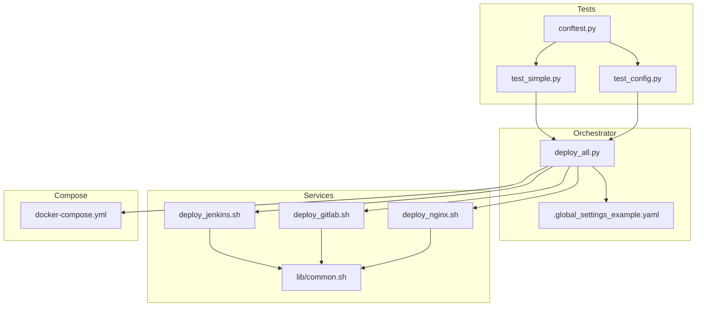
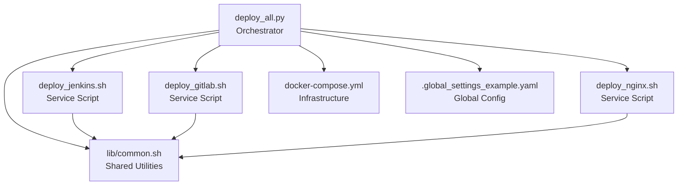
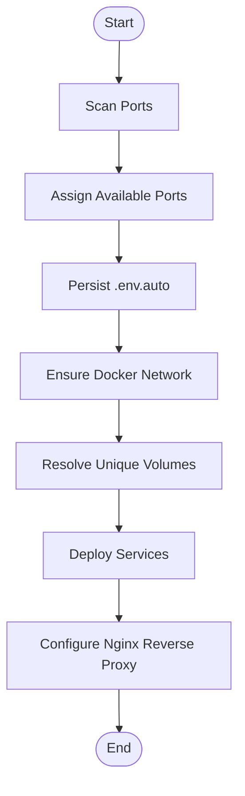
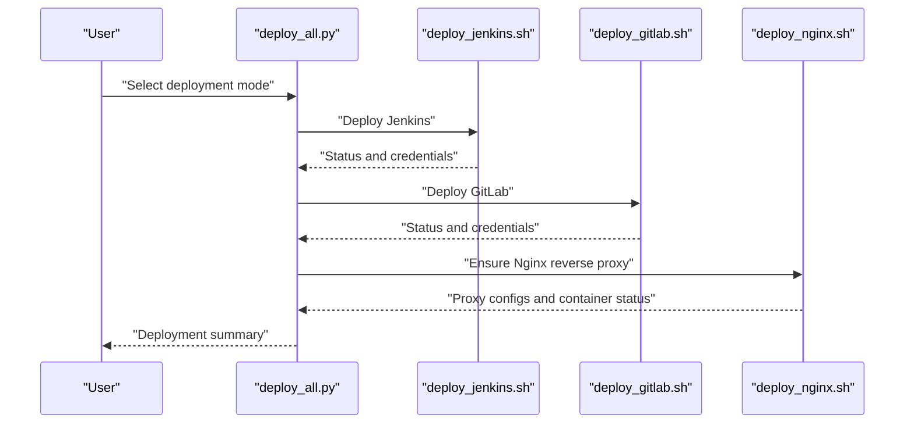
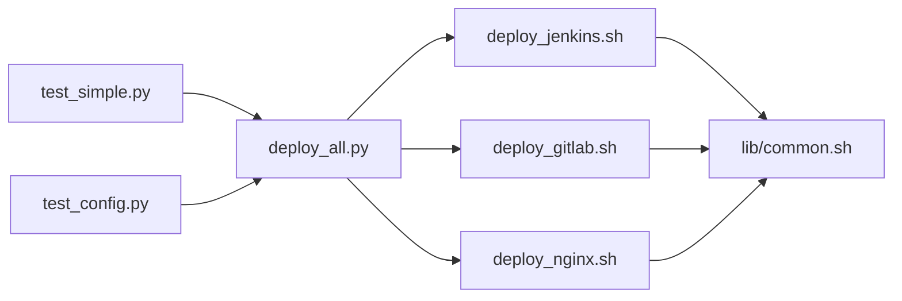
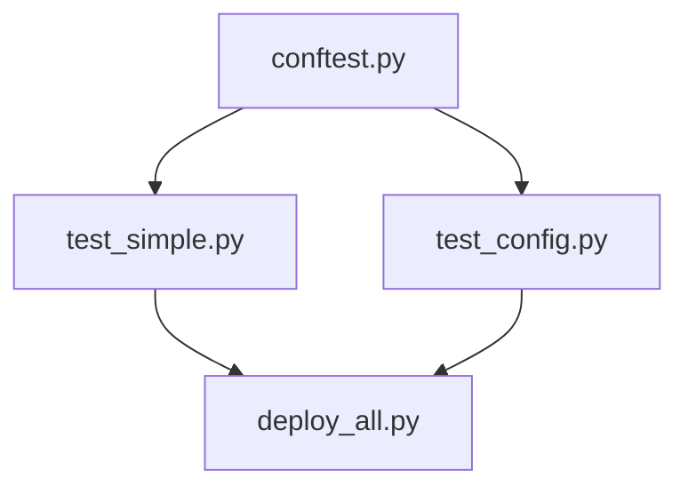

# Development and Contributing

<cite>
**Referenced Files in This Document**
- [README.md](file://README.md)
- [deploy_all.py](file://deploy/deploy_all.py)
- [docker-compose.yml](file://deploy/docker-compose.yml)
- [.global_settings_example.yaml](file://deploy/config/.global_settings_example.yaml)
- [common.sh](file://deploy/lib/common.sh)
- [test_simple.py](file://deploy/tests/test_simple.py)
- [test_config.py](file://deploy/tests/test_config.py)
- [conftest.py](file://deploy/tests/conftest.py)
- [b.sh](file://deploy/b.sh)
- [c.sh](file://deploy/c.sh)
- [deploy_jenkins.sh](file://deploy/deploy_jenkins/deploy_jenkins.sh)
- [deploy_gitlab.sh](file://deploy/deploy_gitlab/deploy_gitlab.sh)
- [deploy_nginx.sh](file://deploy/deploy_nginx/deploy_nginx.sh)
- [部署问题.md](file://deploy/部署问题.md)
- [容器IP漂移-ECONNREFUSED-根因与永久修复.md](file://deploy/issue/容器IP漂移-ECONNREFUSED-根因与永久修复.md)
- [容器内 Python 依赖安装实战总结.md](file://deploy/issue/容器内 Python 依赖安装实战总结.md)
</cite>

## Table of Contents
1. [Introduction](#introduction)
2. [Project Structure](#project-structure)
3. [Core Components](#core-components)
4. [Architecture Overview](#architecture-overview)
5. [Detailed Component Analysis](#detailed-component-analysis)
6. [Dependency Analysis](#dependency-analysis)
7. [Performance Considerations](#performance-considerations)
8. [Troubleshooting Guide](#troubleshooting-guide)
9. [Contribution Guidelines](#contribution-guidelines)
10. [Testing Architecture](#testing-architecture)
11. [Release Management and Deployment](#release-management-and-deployment)
12. [Debugging, Profiling, and Optimization](#debugging-profiling-and-optimization)
13. [Conclusion](#conclusion)

## Introduction
DeployAgent is a unified deployment orchestrator for DevOps tooling stacks, centered around a Python orchestration script and modular Bash deployment scripts for individual services. It automates environment scanning, port allocation, Docker network and volume management, reverse proxy integration via Nginx, and service lifecycle management. The project emphasizes repeatable deployments, minimal manual intervention, and robust diagnostics.

## Project Structure
The repository is organized into:
- deploy/: Orchestration and service deployment scripts, configuration, tests, and auxiliary tools
- deploy/deploy_*: Per-service deployment scripts (Jenkins, GitLab, Nginx, etc.)
- deploy/lib/common.sh: Shared Bash utilities for logging, environment checks, and helpers
- deploy/tests/: Unit and configuration tests for the Python orchestrator
- deploy/config/.global_settings_example.yaml: Example global configuration for agents and integrations
- deploy/docker-compose.yml: Container orchestration definition for core services
- deploy/issue/* and deploy/部署问题.md: Operational issues, root causes, and fixes

**Diagram sources**
- [deploy_all.py:1-1315](file://deploy/deploy_all.py#L1-L1315)
- [docker-compose.yml:1-222](file://deploy/docker-compose.yml#L1-L222)
- [.global_settings_example.yaml:1-31](file://deploy/config/.global_settings_example.yaml#L1-L31)
- [common.sh:1-566](file://deploy/lib/common.sh#L1-L566)
- [test_simple.py:1-138](file://deploy/tests/test_simple.py#L1-L138)
- [test_config.py:1-131](file://deploy/tests/test_config.py#L1-L131)
- [conftest.py:1-29](file://deploy/tests/conftest.py#L1-L29)
- [deploy_jenkins.sh:1-385](file://deploy/deploy_jenkins/deploy_jenkins.sh#L1-L385)
- [deploy_gitlab.sh:1-445](file://deploy/deploy_gitlab/deploy_gitlab.sh#L1-L445)
- [deploy_nginx.sh:1-712](file://deploy/deploy_nginx/deploy_nginx.sh#L1-L712)

**Section sources**
- [README.md:1-3](file://README.md#L1-L3)
- [deploy_all.py:1-1315](file://deploy/deploy_all.py#L1-L1315)
- [docker-compose.yml:1-222](file://deploy/docker-compose.yml#L1-L222)
- [.global_settings_example.yaml:1-31](file://deploy/config/.global_settings_example.yaml#L1-L31)
- [common.sh:1-566](file://deploy/lib/common.sh#L1-L566)
- [test_simple.py:1-138](file://deploy/tests/test_simple.py#L1-L138)
- [test_config.py:1-131](file://deploy/tests/test_config.py#L1-L131)
- [conftest.py:1-29](file://deploy/tests/conftest.py#L1-L29)
- [deploy_jenkins.sh:1-385](file://deploy/deploy_jenkins/deploy_jenkins.sh#L1-L385)
- [deploy_gitlab.sh:1-445](file://deploy/deploy_gitlab/deploy_gitlab.sh#L1-L445)
- [deploy_nginx.sh:1-712](file://deploy/deploy_nginx/deploy_nginx.sh#L1-L712)

## Core Components
- Python orchestrator (deploy_all.py): Central control plane for environment scanning, port assignment, Docker network/volume management, service deployment, and Nginx reverse proxy integration.
- Service deployment scripts: Modular Bash scripts per service (Jenkins, GitLab, Nginx) that encapsulate service-specific logic, environment variable handling, and container lifecycle.
- Shared library (lib/common.sh): Logging, environment loading, Docker checks, port checks, image pulling with fallbacks, and utility functions.
- Tests: Unit and configuration tests validating constants, port/service configs, and basic orchestration logic.
- Docker Compose: Defines networks, volumes, and service containers for core components.

Key responsibilities:
- Environment scanning and conflict resolution (ports, Docker networks, volumes)
- Automated port allocation and persistence (.env.auto)
- Reverse proxy generation and SSL certificate management
- Volume naming and cleanup
- Health checks and container lifecycle

**Section sources**
- [deploy_all.py:1-1315](file://deploy/deploy_all.py#L1-L1315)
- [common.sh:1-566](file://deploy/lib/common.sh#L1-L566)
- [docker-compose.yml:1-222](file://deploy/docker-compose.yml#L1-L222)

## Architecture Overview
DeployAgent follows a layered architecture:
- Orchestrator layer: Python script manages end-to-end deployment flows and integrates with service scripts.
- Service layer: Bash scripts handle service-specific deployment, configuration, and runtime support.
- Infrastructure layer: Docker Compose defines networks, volumes, and container configurations.
- Testing layer: PyTest-based tests validate configuration and core orchestration logic.

**Diagram sources**
- [deploy_all.py:1-1315](file://deploy/deploy_all.py#L1-L1315)
- [deploy_jenkins.sh:1-385](file://deploy/deploy_jenkins/deploy_jenkins.sh#L1-L385)
- [deploy_gitlab.sh:1-445](file://deploy/deploy_gitlab/deploy_gitlab.sh#L1-L445)
- [deploy_nginx.sh:1-712](file://deploy/deploy_nginx/deploy_nginx.sh#L1-L712)
- [common.sh:1-566](file://deploy/lib/common.sh#L1-L566)
- [docker-compose.yml:1-222](file://deploy/docker-compose.yml#L1-L222)
- [.global_settings_example.yaml:1-31](file://deploy/config/.global_settings_example.yaml#L1-L31)

## Detailed Component Analysis

### Python Orchestration (deploy_all.py)
- Responsibilities:
  - Environment scanning (ports, Docker networks, volumes)
  - Port allocation with conflict avoidance and persistence
  - Docker network creation and volume resolution
  - Service deployment coordination and failure handling
  - Nginx reverse proxy configuration and SSL certificate generation
- Design patterns:
  - Configuration-driven service registry (PORT_REGISTRY, SERVICE_CONFIG, DEPLOY_MODES)
  - Functional composition for scanning, deployment, and proxy management
  - Robust logging and error propagation

**Diagram sources**
- [deploy_all.py:269-340](file://deploy/deploy_all.py#L269-L340)
- [deploy_all.py:346-399](file://deploy/deploy_all.py#L346-L399)
- [deploy_all.py:405-427](file://deploy/deploy_all.py#L405-L427)
- [deploy_all.py:502-545](file://deploy/deploy_all.py#L502-L545)
- [deploy_all.py:682-699](file://deploy/deploy_all.py#L682-L699)

**Section sources**
- [deploy_all.py:1-1315](file://deploy/deploy_all.py#L1-L1315)

### Service Scripts (Jenkins, GitLab, Nginx)
- Jenkins:
  - Deploys Jenkins container with named volumes or bind mounts
  - Exposes web and agent ports
  - Provides initial admin password retrieval and status summary
- GitLab:
  - Supports named volumes and bind mounts
  - Configures external URL and SSH port
  - Provides initial root password retrieval and status summary
- Nginx:
  - Generates SSL certificates if missing
  - Detects running backend services and generates per-service reverse proxy configs
  - Starts Nginx container with appropriate port mappings

**Diagram sources**
- [deploy_all.py:682-699](file://deploy/deploy_all.py#L682-L699)
- [deploy_jenkins.sh:43-113](file://deploy/deploy_jenkins/deploy_jenkins.sh#L43-L113)
- [deploy_gitlab.sh:57-156](file://deploy/deploy_gitlab/deploy_gitlab.sh#L57-L156)
- [deploy_nginx.sh:58-365](file://deploy/deploy_nginx/deploy_nginx.sh#L58-L365)

**Section sources**
- [deploy_jenkins.sh:1-385](file://deploy/deploy_jenkins/deploy_jenkins.sh#L1-L385)
- [deploy_gitlab.sh:1-445](file://deploy/deploy_gitlab/deploy_gitlab.sh#L1-L445)
- [deploy_nginx.sh:1-712](file://deploy/deploy_nginx/deploy_nginx.sh#L1-L712)

### Shared Library (lib/common.sh)
- Provides logging, environment loading, Docker checks, port checks, image pulling with fallbacks, and utility functions for retrieving initial passwords and managing Agent devices.
- Centralizes cross-script utilities to reduce duplication and improve maintainability.

**Section sources**
- [common.sh:1-566](file://deploy/lib/common.sh#L1-L566)

### Docker Compose (docker-compose.yml)
- Defines networks, volumes, and service containers for core components (Agent, Jenkins, GitLab, MantisBT, Nginx).
- Uses environment variables for customization and exposes health checks for service readiness.

**Section sources**
- [docker-compose.yml:1-222](file://deploy/docker-compose.yml#L1-L222)

### Global Configuration (config/.global_settings_example.yaml)
- Provides example configuration for agent integrations, AI providers, Git credentials, and white-listed repositories and branches.

**Section sources**
- [.global_settings_example.yaml:1-31](file://deploy/config/.global_settings_example.yaml#L1-L31)

## Dependency Analysis
- Orchestrator-to-scripts coupling:
  - deploy_all.py imports and invokes service scripts, passing environment variables and resolving volumes.
- Script-to-library coupling:
  - Service scripts source lib/common.sh for shared utilities.
- Test-to-orchestrator coupling:
  - Tests import constants and functions from deploy_all.py to validate configuration and behavior.

**Diagram sources**
- [deploy_all.py:1-1315](file://deploy/deploy_all.py#L1-L1315)
- [deploy_jenkins.sh:1-385](file://deploy/deploy_jenkins/deploy_jenkins.sh#L1-L385)
- [deploy_gitlab.sh:1-445](file://deploy/deploy_gitlab/deploy_gitlab.sh#L1-L445)
- [deploy_nginx.sh:1-712](file://deploy/deploy_nginx/deploy_nginx.sh#L1-L712)
- [common.sh:1-566](file://deploy/lib/common.sh#L1-L566)
- [test_simple.py:1-138](file://deploy/tests/test_simple.py#L1-L138)
- [test_config.py:1-131](file://deploy/tests/test_config.py#L1-L131)

**Section sources**
- [deploy_all.py:1-1315](file://deploy/deploy_all.py#L1-L1315)
- [deploy_jenkins.sh:1-385](file://deploy/deploy_jenkins/deploy_jenkins.sh#L1-L385)
- [deploy_gitlab.sh:1-445](file://deploy/deploy_gitlab/deploy_gitlab.sh#L1-L445)
- [deploy_nginx.sh:1-712](file://deploy/deploy_nginx/deploy_nginx.sh#L1-L712)
- [common.sh:1-566](file://deploy/lib/common.sh#L1-L566)
- [test_simple.py:1-138](file://deploy/tests/test_simple.py#L1-L138)
- [test_config.py:1-131](file://deploy/tests/test_config.py#L1-L131)

## Performance Considerations
- Image pulling with fallbacks: Multi-source image pulls and retry logic reduce downtime during network issues.
- Port allocation: Efficient conflict detection and automatic assignment minimize retries and reconfiguration overhead.
- Volume naming: Unique volume resolution prevents collisions and reduces cleanup complexity.
- Reverse proxy reuse: Prefer reusing existing Nginx containers and reloading configurations to avoid unnecessary rebuilds.

[No sources needed since this section provides general guidance]

## Troubleshooting Guide
Common issues and resolutions:
- Nginx external access blocked by default binding to loopback address:
  - Use the orchestrator’s --nginx-bind option to expose Nginx on a public interface.
- Git clone failures due to self-signed certificate validation:
  - Temporarily disable SSL verification in CI steps or import the self-signed CA into trusted stores.
- Container IP drift causing ECONNREFUSED:
  - Replace hardcoded Docker bridge IPs with container names or DNS resolvable service names.
- Jenkins/GitLab initialization delays:
  - Allow sufficient startup time for services to initialize before accessing APIs or UIs.

**Section sources**
- [部署问题.md:205-257](file://deploy/部署问题.md#L205-L257)
- [容器IP漂移-ECONNREFUSED-根因与永久修复.md:1-118](file://deploy/issue/容器IP漂移-ECONNREFUSED-根因与永久修复.md#L1-L118)
- [容器内 Python 依赖安装实战总结.md:1-223](file://deploy/issue/容器内 Python 依赖安装实战总结.md#L1-L223)

## Contribution Guidelines
- Development environment
  - Python 3.x with standard libraries used by the orchestrator
  - Docker and Docker Compose installed and configured
  - Bash shell for service scripts
- Local development workflow
  - Run the orchestrator with desired deployment modes
  - Use service scripts independently for targeted operations
  - Leverage lib/common.sh utilities for consistent behavior
- Coding standards
  - Keep functions focused and reusable
  - Use descriptive logging and consistent error handling
  - Avoid hard-coded Docker bridge IPs; prefer container names
- Pull request procedure
  - Fork the repository and create a feature branch
  - Add or update tests to validate changes
  - Document behavioral changes and configuration updates
  - Reference related issues and include screenshots or logs when applicable

[No sources needed since this section provides general guidance]

## Testing Architecture
- Unit tests
  - test_simple.py validates constants, configuration dictionaries, and basic orchestration functions
  - test_config.py uses PyTest fixtures to validate port/service configurations and deployment modes
- Test configuration
  - conftest.py injects project root and mocks environment variables to isolate tests

**Diagram sources**
- [test_simple.py:1-138](file://deploy/tests/test_simple.py#L1-L138)
- [test_config.py:1-131](file://deploy/tests/test_config.py#L1-L131)
- [conftest.py:1-29](file://deploy/tests/conftest.py#L1-L29)
- [deploy_all.py:1-1315](file://deploy/deploy_all.py#L1-L1315)

**Section sources**
- [test_simple.py:1-138](file://deploy/tests/test_simple.py#L1-L138)
- [test_config.py:1-131](file://deploy/tests/test_config.py#L1-L131)
- [conftest.py:1-29](file://deploy/tests/conftest.py#L1-L29)

## Release Management and Deployment
- Versioning strategy
  - The orchestrator script includes a version comment indicating major/minor versioning for the Python deployment tool
- Release process
  - Update version markers in the orchestrator
  - Validate tests and deployment flows
  - Publish artifacts and update documentation
- Deployment procedures
  - Use the orchestrator to select deployment modes and integrate Nginx as needed
  - Persist environment variables and auto-generated port assignments for reproducibility

**Section sources**
- [deploy_all.py:1-20](file://deploy/deploy_all.py#L1-L20)

## Debugging, Profiling, and Optimization
- Debugging
  - Enable verbose logging and inspect orchestrator logs
  - Use service scripts’ built-in status and summary outputs
  - Verify Docker network connectivity and container health checks
- Profiling
  - Monitor service startup times and health check intervals
  - Track image pull durations and retry counts
- Optimization
  - Reuse Nginx containers and reload configurations instead of recreating
  - Prefer named volumes for predictable data management
  - Avoid hard-coded IPs; rely on container DNS names

[No sources needed since this section provides general guidance]

## Conclusion
DeployAgent streamlines DevOps stack deployments through a cohesive Python orchestrator, modular service scripts, and robust infrastructure definitions. Contributors can extend the system by adding new services following the established patterns, ensuring consistent logging, environment handling, and deployment workflows.