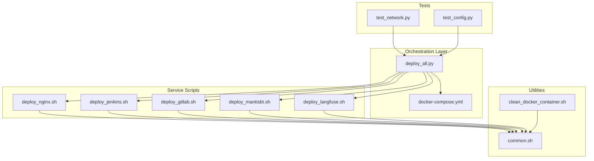
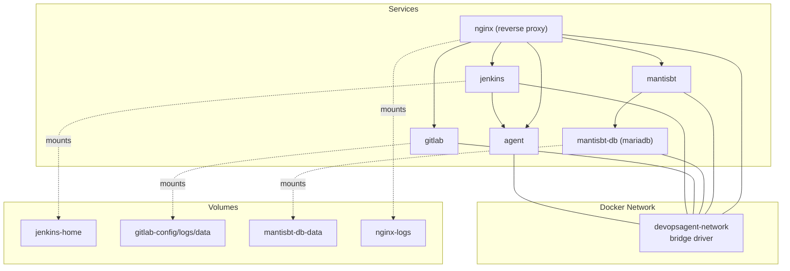
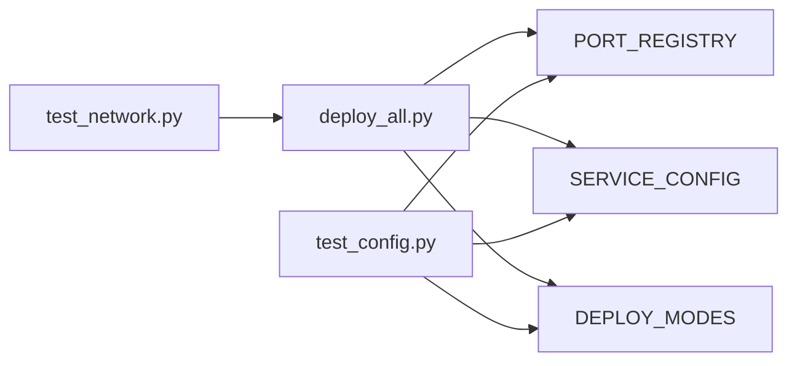

# Docker Orchestration

<cite>
**Referenced Files in This Document**
- [docker-compose.yml](file://deploy/docker-compose.yml)
- [deploy_all.py](file://deploy/deploy_all.py)
- [common.sh](file://deploy/lib/common.sh)
- [clean_docker_container.sh](file://deploy/tools/clean_docker_container.sh)
- [deploy_nginx.sh](file://deploy/deploy_nginx/deploy_nginx.sh)
- [deploy_jenkins.sh](file://deploy/deploy_jenkins/deploy_jenkins.sh)
- [deploy_gitlab.sh](file://deploy/deploy_gitlab/deploy_gitlab.sh)
- [deploy_langfuse.sh](file://deploy/deploy_langfuse/deploy_langfuse.sh)
- [deploy_mantisbt.sh](file://deploy/deploy_MantisBT/deploy_mantisbt.sh)
- [.global_settings_example.yaml](file://deploy/config/.global_settings_example.yaml)
- [test_network.py](file://deploy/tests/test_network.py)
- [test_config.py](file://deploy/tests/test_config.py)
</cite>

## Table of Contents
1. [Introduction](#introduction)
2. [Project Structure](#project-structure)
3. [Core Components](#core-components)
4. [Architecture Overview](#architecture-overview)
5. [Detailed Component Analysis](#detailed-component-analysis)
6. [Dependency Analysis](#dependency-analysis)
7. [Performance Considerations](#performance-considerations)
8. [Troubleshooting Guide](#troubleshooting-guide)
9. [Conclusion](#conclusion)
10. [Appendices](#appendices)

## Introduction
This document explains DeployAgent’s Docker orchestration capabilities, focusing on Docker Compose configuration architecture, network management, and volume persistence. It covers container lifecycle management, health monitoring, and service discovery patterns; describes network isolation and inter-container communication; outlines load balancing strategies; documents volume management, backup, and migration; and provides guidance on resource management, logging, monitoring, customization, scaling, and troubleshooting.

## Project Structure
DeployAgent organizes orchestration around a central Docker Compose definition and a Python-driven deployment orchestrator. Supporting shell scripts handle service-specific deployments and Nginx reverse proxy integration. Tests validate port scanning, network checks, and configuration structures.

**Diagram sources**
- [docker-compose.yml:1-222](file://deploy/docker-compose.yml#L1-L222)
- [deploy_all.py:1-800](file://deploy/deploy_all.py#L1-L800)
- [deploy_nginx.sh:1-712](file://deploy/deploy_nginx/deploy_nginx.sh#L1-L712)
- [deploy_jenkins.sh:1-385](file://deploy/deploy_jenkins/deploy_jenkins.sh#L1-L385)
- [deploy_gitlab.sh:1-445](file://deploy/deploy_gitlab/deploy_gitlab.sh#L1-L445)
- [deploy_mantisbt.sh:1-458](file://deploy/deploy_MantisBT/deploy_mantisbt.sh#L1-L458)
- [deploy_langfuse.sh:1-164](file://deploy/deploy_langfuse/deploy_langfuse.sh#L1-L164)
- [common.sh:1-566](file://deploy/lib/common.sh#L1-L566)
- [clean_docker_container.sh:1-248](file://deploy/tools/clean_docker_container.sh#L1-L248)
- [test_network.py:1-82](file://deploy/tests/test_network.py#L1-L82)
- [test_config.py:1-131](file://deploy/tests/test_config.py#L1-L131)

**Section sources**
- [docker-compose.yml:1-222](file://deploy/docker-compose.yml#L1-L222)
- [deploy_all.py:1-800](file://deploy/deploy_all.py#L1-L800)

## Core Components
- Central orchestration: docker-compose.yml defines a single bridge network and named volumes, plus services for Agent, Jenkins, GitLab, MantisBT (with MariaDB), and Nginx reverse proxy.
- Deployment orchestrator: deploy_all.py scans ports and networks, resolves conflicts, manages volumes, and coordinates service deployments via subscripts.
- Service-specific scripts: individual Bash scripts deploy and manage each service independently and integrate with Nginx.
- Utilities: common.sh provides logging, Docker checks, image pulling with fallback mirrors, and helper functions; clean_docker_container.sh supports cleanup.
- Tests: Python tests validate port scanning, network checks, and configuration structures.

**Section sources**
- [docker-compose.yml:3-222](file://deploy/docker-compose.yml#L3-L222)
- [deploy_all.py:1-800](file://deploy/deploy_all.py#L1-L800)
- [common.sh:1-566](file://deploy/lib/common.sh#L1-L566)
- [clean_docker_container.sh:1-248](file://deploy/tools/clean_docker_container.sh#L1-L248)
- [test_network.py:1-82](file://deploy/tests/test_network.py#L1-L82)
- [test_config.py:1-131](file://deploy/tests/test_config.py#L1-L131)

## Architecture Overview
The system uses a dedicated Docker bridge network for service isolation and inter-service communication. Named volumes persist data for Jenkins, GitLab, MantisBT/MariaDB, and Nginx logs. A centralized Nginx reverse proxy exposes HTTPS endpoints for services behind a unified SSL termination layer. The orchestrator automates port allocation, network creation, and volume resolution.

**Diagram sources**
- [docker-compose.yml:3-222](file://deploy/docker-compose.yml#L3-L222)

**Section sources**
- [docker-compose.yml:3-222](file://deploy/docker-compose.yml#L3-L222)

## Detailed Component Analysis

### Docker Compose Configuration Architecture
- Network: A single bridge network ensures service isolation and internal DNS resolution by service/container names.
- Volumes: Named volumes are declared with deterministic names derived from COMPOSE_PROJECT_NAME, enabling predictable persistence and cleanup.
- Services:
  - Agent: restricted privileges, read-only root filesystem, tmpfs, healthcheck, and exposed port mapping.
  - Jenkins: mounted Docker socket for dynamic agents, configured Java and Jenkins options, healthcheck, and dependency on Agent.
  - GitLab: configured via Omnibus variable block, with explicit HTTP port and disabled HTTPS inside the container when using Nginx proxy.
  - MantisBT: PHP app container with MariaDB backend; inter-service dependency and database initialization.
  - Nginx: reverse proxy with per-service SSL certificates and proxy configurations.

Key orchestration patterns:
- Environment-driven customization via variables for images, ports, binds, and names.
- Healthchecks enable automated readiness and liveness checks.
- Dependencies ensure startup order (e.g., Jenkins after Agent; MantisBT after MariaDB).

**Section sources**
- [docker-compose.yml:3-222](file://deploy/docker-compose.yml#L3-L222)

### Network Management Strategies
- Single isolated bridge network: devopsagent-network provides service-to-service communication without exposing internal ports externally.
- Internal DNS: containers resolve each other by service/container names.
- Port exposure: only Nginx and selected service ports are mapped to host; others remain internal.
- Nginx reverse proxy: consolidates HTTPS termination and routing to internal services.

Operational checks:
- The orchestrator ensures the network exists and reports conflicts (e.g., overlapping host routes).
- Port scanning detects host and container port occupancy to avoid collisions.

**Section sources**
- [docker-compose.yml:3-222](file://deploy/docker-compose.yml#L3-L222)
- [deploy_all.py:346-399](file://deploy/deploy_all.py#L346-L399)
- [deploy_all.py:269-340](file://deploy/deploy_all.py#L269-L340)

### Volume Persistence Mechanisms
- Named volumes:
  - Jenkins: jenkins-home
  - GitLab: gitlab-config, gitlab-logs, gitlab-data
  - MantisBT: mantisbt-web, mantisbt-db-data
  - Nginx: nginx-logs
- Volume resolution: the orchestrator checks for existing volumes and appends suffixes to avoid conflicts.
- Backup and cleanup utilities:
  - Python-based backup routine tars named volumes to archives.
  - Cleanup script removes containers and optionally named volumes.

Backup and restore commands are embedded in service scripts (e.g., GitLab) and the Python backup utility.

**Section sources**
- [docker-compose.yml:8-32](file://deploy/docker-compose.yml#L8-L32)
- [deploy_all.py:405-453](file://deploy/deploy_all.py#L405-L453)
- [deploy_all.py:429-445](file://deploy/deploy_all.py#L429-L445)
- [deploy_gitlab.sh:142-148](file://deploy/deploy_gitlab/deploy_gitlab.sh#L142-L148)
- [clean_docker_container.sh:89-101](file://deploy/tools/clean_docker_container.sh#L89-L101)

### Container Lifecycle Management
- Startup: services are started with restart policies; dependencies ensure ordered startup.
- Shutdown: orchestrated shutdown via Compose or scripts; cleanup script supports batch removal.
- Health monitoring: healthcheck entries for Agent, Jenkins, GitLab, MantisBT, and Nginx validate readiness.
- Logging: Nginx logs volume and per-service logs directories; Python orchestrator writes structured logs.

**Section sources**
- [docker-compose.yml:35-222](file://deploy/docker-compose.yml#L35-L222)
- [deploy_all.py:152-182](file://deploy/deploy_all.py#L152-L182)
- [deploy_nginx.sh:356-365](file://deploy/deploy_nginx/deploy_nginx.sh#L356-L365)

### Service Discovery Patterns
- Internal DNS: containers communicate using service/container names (e.g., MantisBT connects to mantisbt-db).
- Reverse proxy: Nginx routes HTTPS traffic to internal services by name and port.
- Environment variables: services receive backend host/port via environment variables (e.g., Jenkins’ AGENT_HOST/PORT).

**Section sources**
- [docker-compose.yml:174-186](file://deploy/docker-compose.yml#L174-L186)
- [docker-compose.yml:85-86](file://deploy/docker-compose.yml#L85-L86)
- [deploy_nginx.sh:164-165](file://deploy/deploy_nginx/deploy_nginx.sh#L164-L165)

### Inter-Container Communication and Load Balancing
- Inter-service communication: all services share the same network; internal DNS enables direct name-based routing.
- Load balancing: no built-in LB; Nginx acts as a reverse proxy for HTTPS ingress. Scaling is not implemented in the current Compose stack.

**Section sources**
- [docker-compose.yml:3-222](file://deploy/docker-compose.yml#L3-L222)
- [deploy_nginx.sh:130-327](file://deploy/deploy_nginx/deploy_nginx.sh#L130-L327)

### Volume Management, Backup, and Migration
- Management:
  - Named volumes are used for persistent data.
  - Resolution avoids conflicts by appending numeric suffixes.
- Backup:
  - Python utility creates compressed archives of named volumes.
  - Service scripts embed backup/restore commands for GitLab.
- Migration:
  - Stop services, backup volumes, update configuration, and redeploy; restore volumes from backups.

**Section sources**
- [deploy_all.py:405-453](file://deploy/deploy_all.py#L405-L453)
- [deploy_all.py:429-445](file://deploy/deploy_all.py#L429-L445)
- [deploy_gitlab.sh:142-148](file://deploy/deploy_gitlab/deploy_gitlab.sh#L142-L148)

### Resource Management, Logging, and Monitoring Integration
- Resource limits:
  - No CPU/memory quotas defined in Compose; adjust via runtime flags or platform-specific constraints.
  - GitLab sets shared memory size via shm_size.
- Logging:
  - Nginx logs volume persists access/error logs.
  - Orchestrator writes structured logs to a file.
- Monitoring:
  - Healthchecks provide basic readiness/liveness signals.
  - No integrated metrics collection in the stack; external monitoring can scrape health endpoints or logs.

**Section sources**
- [docker-compose.yml:119-120](file://deploy/docker-compose.yml#L119-L120)
- [deploy_all.py:152-162](file://deploy/deploy_all.py#L152-L162)
- [docker-compose.yml:212-217](file://deploy/docker-compose.yml#L212-L217)

### Customization Examples
- Image selection: override service images via environment variables.
- Ports and binds: customize host bindings and published ports.
- Names and network: customize container and network names via environment variables.
- Nginx integration: toggle HTTPS proxy and configure external URLs for services.

Examples of customization keys:
- AGENT_IMAGE, AGENT_CONTAINER_NAME, AGENT_PORT, AGENT_BIND
- JENKINS_IMAGE, JENKINS_CONTAINER_NAME, JENKINS_PORT_WEB, JENKINS_PORT_AGENT, JENKINS_BIND
- GITLAB_IMAGE, GITLAB_CONTAINER_NAME, GITLAB_PORT_HTTP, GITLAB_PORT_HTTPS, GITLAB_PORT_SSH, GITLAB_BIND, GITLAB_HOSTNAME
- MANTISBT_IMAGE, MANTISBT_CONTAINER_NAME, MARIADB_IMAGE, MARIADB_CONTAINER_NAME, MANTISBT_PORT_WEB, MARIADB_PORT
- NGINX_IMAGE, NGINX_CONTAINER_NAME, NGINX_PORT_JENKINS, NGINX_PORT_GITLAB, NGINX_PORT_AGENT, NGINX_PORT_MANTISBT, NGINX_BIND

**Section sources**
- [docker-compose.yml:36-222](file://deploy/docker-compose.yml#L36-L222)
- [deploy_gitlab.sh:46-50](file://deploy/deploy_gitlab/deploy_gitlab.sh#L46-L50)
- [deploy_mantisbt.sh:53-57](file://deploy/deploy_MantisBT/deploy_mantisbt.sh#L53-L57)
- [deploy_nginx.sh:40-49](file://deploy/deploy_nginx/deploy_nginx.sh#L40-L49)

### Scaling Considerations
- Current stack does not define replicas; scaling would require Compose overrides or Swarm/Kubernetes.
- For horizontal scaling, consider stateless services and shared storage/backends.

[No sources needed since this section provides general guidance]

### Troubleshooting Container-Related Issues
Common scenarios and remedies:
- Port conflicts: run port scan and regenerate .env.auto; the orchestrator auto-resolves conflicts.
- Network conflicts: the orchestrator detects overlapping host routes and warns.
- Volume conflicts: the orchestrator resolves conflicting volume names; use cleanup script to remove stale volumes.
- Service failures: inspect healthcheck outcomes, container logs, and service-specific logs (e.g., Nginx logs volume).
- Permissions: Jenkins and GitLab scripts provide permission fixes for bind mounts; prefer named volumes on platforms with restrictive filesystem semantics.

**Section sources**
- [deploy_all.py:269-340](file://deploy/deploy_all.py#L269-L340)
- [deploy_all.py:346-399](file://deploy/deploy_all.py#L346-L399)
- [deploy_all.py:405-453](file://deploy/deploy_all.py#L405-L453)
- [deploy_jenkins.sh:56-67](file://deploy/deploy_jenkins/deploy_jenkins.sh#L56-L67)
- [deploy_gitlab.sh:142-148](file://deploy/deploy_gitlab/deploy_gitlab.sh#L142-L148)
- [clean_docker_container.sh:89-101](file://deploy/tools/clean_docker_container.sh#L89-L101)

## Dependency Analysis
The orchestrator coordinates services and validates configuration structures. Tests assert correctness of port registries, service configs, and deployment modes.

**Diagram sources**
- [deploy_all.py:40-142](file://deploy/deploy_all.py#L40-L142)
- [test_network.py:11-17](file://deploy/tests/test_network.py#L11-L17)
- [test_config.py:10-129](file://deploy/tests/test_config.py#L10-L129)

**Section sources**
- [deploy_all.py:40-142](file://deploy/deploy_all.py#L40-L142)
- [test_network.py:1-82](file://deploy/tests/test_network.py#L1-L82)
- [test_config.py:1-131](file://deploy/tests/test_config.py#L1-L131)

## Performance Considerations
- Use named volumes for predictable IO performance and easier maintenance.
- Prefer HTTPS termination at Nginx to reduce per-service TLS overhead.
- Monitor healthcheck intervals and timeouts to balance responsiveness and resource usage.
- Avoid excessive tmpfs sizes; ensure adequate swap if needed.

[No sources needed since this section provides general guidance]

## Troubleshooting Guide
- Verify Docker and Compose availability and version compatibility.
- Confirm network existence and port availability before deployment.
- Review orchestrator logs and service logs for errors.
- Use cleanup script to reset environments when needed.

**Section sources**
- [common.sh:101-124](file://deploy/lib/common.sh#L101-L124)
- [deploy_all.py:152-182](file://deploy/deploy_all.py#L152-L182)
- [clean_docker_container.sh:1-248](file://deploy/tools/clean_docker_container.sh#L1-L248)

## Conclusion
DeployAgent’s Docker orchestration centers on a robust Compose configuration with a dedicated network, named volumes for persistence, and a unified Nginx reverse proxy. The Python orchestrator automates environment checks, port/volume resolution, and service coordination. Healthchecks and logging support operational visibility. While the current setup emphasizes simplicity and isolation, future enhancements could include scaling, metrics collection, and advanced load balancing.

## Appendices

### Appendix A: Environment Variables Reference
- Images and names:
  - AGENT_IMAGE, AGENT_CONTAINER_NAME
  - JENKINS_IMAGE, JENKINS_CONTAINER_NAME
  - GITLAB_IMAGE, GITLAB_CONTAINER_NAME
  - MANTISBT_IMAGE, MANTISBT_CONTAINER_NAME
  - MARIADB_IMAGE, MARIADB_CONTAINER_NAME
  - NGINX_IMAGE, NGINX_CONTAINER_NAME
- Ports and binds:
  - AGENT_PORT, AGENT_BIND
  - JENKINS_PORT_WEB, JENKINS_PORT_AGENT, JENKINS_BIND
  - GITLAB_PORT_HTTP, GITLAB_PORT_HTTPS, GITLAB_PORT_SSH, GITLAB_BIND, GITLAB_HOSTNAME
  - MANTISBT_PORT_WEB, MARIADB_PORT
  - NGINX_PORT_JENKINS, NGINX_PORT_GITLAB, NGINX_PORT_AGENT, NGINX_PORT_MANTISBT, NGINX_BIND
- Nginx integration:
  - GITLAB_USE_HTTPS_PROXY, GITLAB_NGINX_PORT, GITLAB_EXTERNAL_URL
  - MANTISBT_USE_HTTPS_PROXY, MANTISBT_NGINX_PORT, MANTISBT_EXTERNAL_URL
  - LANGFUSE_USE_HTTPS_PROXY, LANGFUSE_NGINX_PORT, LANGFUSE_EXTERNAL_URL

**Section sources**
- [docker-compose.yml:36-222](file://deploy/docker-compose.yml#L36-L222)
- [deploy_gitlab.sh:46-50](file://deploy/deploy_gitlab/deploy_gitlab.sh#L46-L50)
- [deploy_mantisbt.sh:53-57](file://deploy/deploy_MantisBT/deploy_mantisbt.sh#L53-L57)
- [deploy_langfuse.sh:40-44](file://deploy/deploy_langfuse/deploy_langfuse.sh#L40-L44)

### Appendix B: Global Settings for Integrations
- Configure base URLs, credentials, and white-listed repositories for integrations with Jenkins, GitLab, AI providers, and Git operations.

**Section sources**
- [.global_settings_example.yaml:1-31](file://deploy/config/.global_settings_example.yaml#L1-L31)