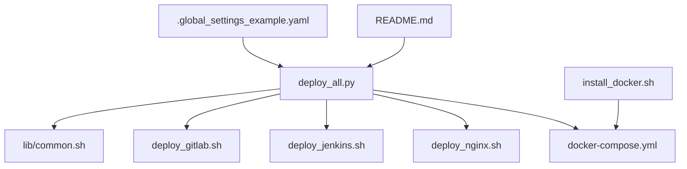
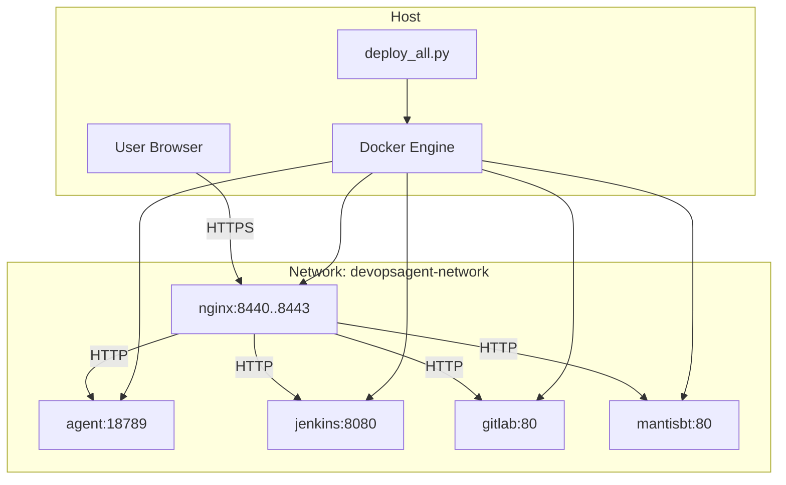
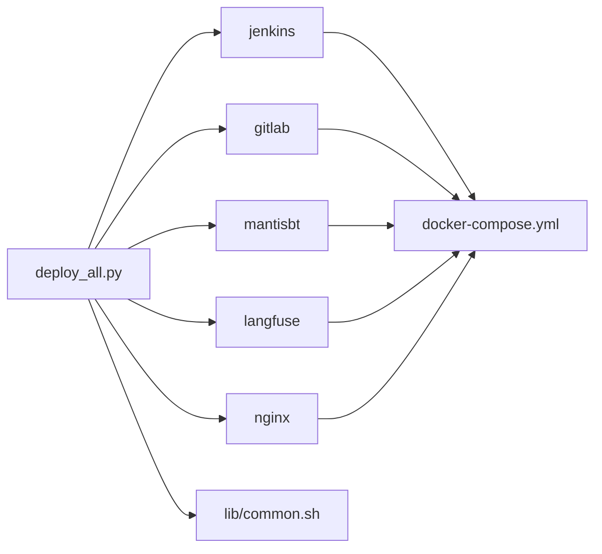

# Getting Started

<cite>
**Referenced Files in This Document**
- [README.md](file://README.md)
- [docker-compose.yml](file://deploy/docker-compose.yml)
- [install_docker.sh](file://deploy/deploy_docker/install_docker.sh)
- [.global_settings_example.yaml](file://deploy/config/.global_settings_example.yaml)
- [deploy_nginx.sh](file://deploy/deploy_nginx/deploy_nginx.sh)
- [deploy_all.py](file://deploy/deploy_all.py)
- [common.sh](file://deploy/lib/common.sh)
- [deploy_jenkins.sh](file://deploy/deploy_jenkins/deploy_jenkins.sh)
- [deploy_gitlab.sh](file://deploy/deploy_gitlab/deploy_gitlab.sh)
- [部署问题.md](file://deploy/部署问题.md)
</cite>

## Table of Contents
1. [Introduction](#introduction)
2. [Project Structure](#project-structure)
3. [Core Components](#core-components)
4. [Architecture Overview](#architecture-overview)
5. [Detailed Component Analysis](#detailed-component-analysis)
6. [Dependency Analysis](#dependency-analysis)
7. [Performance Considerations](#performance-considerations)
8. [Troubleshooting Guide](#troubleshooting-guide)
9. [Conclusion](#conclusion)
10. [Appendices](#appendices)

## Introduction
This guide helps you install and deploy DeployAgent quickly. It covers prerequisites, step-by-step setup, environment configuration, first-time deployment scenarios, verification steps, and troubleshooting. The project provides both a full-stack deployment and selective service deployments, with optional Nginx reverse proxy for HTTPS access.

## Project Structure
The repository organizes deployment automation around a central orchestration script and per-service scripts. A Docker Compose file defines the services and network. A dedicated installer script handles Docker and Docker Compose installation and configuration.

**Diagram sources**
- [README.md:1-3](file://README.md#L1-L3)
- [deploy_all.py:1-16](file://deploy/deploy_all.py#L1-L16)
- [docker-compose.yml:1-222](file://deploy/docker-compose.yml#L1-L222)
- [deploy_nginx.sh:1-25](file://deploy/deploy_nginx/deploy_nginx.sh#L1-L25)
- [deploy_jenkins.sh:1-19](file://deploy/deploy_jenkins/deploy_jenkins.sh#L1-L19)
- [deploy_gitlab.sh:1-19](file://deploy/deploy_gitlab/deploy_gitlab.sh#L1-L19)
- [install_docker.sh:1-15](file://deploy/deploy_docker/install_docker.sh#L1-L15)
- [.global_settings_example.yaml:1-31](file://deploy/config/.global_settings_example.yaml#L1-L31)

**Section sources**
- [README.md:1-3](file://README.md#L1-L3)
- [deploy_all.py:1-16](file://deploy/deploy_all.py#L1-L16)
- [docker-compose.yml:1-222](file://deploy/docker-compose.yml#L1-L222)

## Core Components
- Central orchestrator: Python script that scans ports, resolves volumes, deploys services, and integrates Nginx reverse proxy.
- Docker Compose: Defines the devopsagent-network, named volumes, and service images/ports.
- Installer: Bash script to install Docker and Docker Compose, configure mirrors, and pull images.
- Nginx reverse proxy: Optional HTTPS termination and routing for Jenkins, GitLab, and other services.
- Per-service scripts: Jenkins and GitLab deployment scripts with environment-driven configuration.
- Shared library: Common logging, checks, and helpers used by shell scripts.

**Section sources**
- [deploy_all.py:1-16](file://deploy/deploy_all.py#L1-L16)
- [docker-compose.yml:1-222](file://deploy/docker-compose.yml#L1-L222)
- [install_docker.sh:1-15](file://deploy/deploy_docker/install_docker.sh#L1-L15)
- [deploy_nginx.sh:1-25](file://deploy/deploy_nginx/deploy_nginx.sh#L1-L25)
- [deploy_jenkins.sh:1-19](file://deploy/deploy_jenkins/deploy_jenkins.sh#L1-L19)
- [deploy_gitlab.sh:1-19](file://deploy/deploy_gitlab/deploy_gitlab.sh#L1-L19)
- [common.sh:1-8](file://deploy/lib/common.sh#L1-L8)

## Architecture Overview
The system runs services inside Docker containers on a shared bridge network. Services expose ports on localhost by default. An optional Nginx container terminates HTTPS and proxies to backend services.

**Diagram sources**
- [docker-compose.yml:34-222](file://deploy/docker-compose.yml#L34-L222)
- [deploy_all.py:682-767](file://deploy/deploy_all.py#L682-L767)
- [deploy_nginx.sh:18-24](file://deploy/deploy_nginx/deploy_nginx.sh#L18-L24)

## Detailed Component Analysis

### Installation Prerequisites
- Operating systems: Ubuntu/Debian and CentOS/RHEL are supported by the installer. Other distributions require manual Docker installation.
- Docker Engine: Must be installed and running.
- Docker Compose: Either the plugin or standalone binary is required.
- Network: The orchestrator creates a bridge network named devopsagent-network.
- Ports: The orchestrator detects conflicts and auto-assigns alternative ports.

Verification steps:
- Confirm Docker and Compose availability.
- Verify network creation and volumes resolution.

**Section sources**
- [install_docker.sh:359-428](file://deploy/deploy_docker/install_docker.sh#L359-L428)
- [install_docker.sh:430-476](file://deploy/deploy_docker/install_docker.sh#L430-L476)
- [common.sh:93-124](file://deploy/lib/common.sh#L93-L124)
- [deploy_all.py:269-340](file://deploy/deploy_all.py#L269-L340)

### Step-by-Step Setup
1. Prepare system
   - Ensure root privileges.
   - Install Docker and Docker Compose using the installer script.
   - Configure Docker mirrors for faster pulls.

2. Configure environment
   - Review and customize global settings template.
   - Optionally set environment variables for ports and bind addresses.

3. Run the orchestrator
   - Choose a deployment mode (full stack or selective).
   - The orchestrator will:
     - Scan ports and resolve conflicts.
     - Resolve unique volume names.
     - Deploy services in order.
     - Integrate Nginx reverse proxy if enabled.

4. Verify deployment
   - Check container statuses and logs.
   - Access services via HTTPS through Nginx if enabled.

**Section sources**
- [install_docker.sh:780-807](file://deploy/deploy_docker/install_docker.sh#L780-L807)
- [.global_settings_example.yaml:1-31](file://deploy/config/.global_settings_example.yaml#L1-L31)
- [deploy_all.py:131-142](file://deploy/deploy_all.py#L131-L142)
- [deploy_all.py:682-767](file://deploy/deploy_all.py#L682-L767)

### Environment Configuration
- Global settings: Customize credentials and AI model settings in the global settings template.
- Port configuration: The orchestrator auto-scans and assigns ports if conflicts exist. You can override defaults via environment variables.
- Nginx bind address: Control whether access is restricted to loopback or exposed externally.

Practical tips:
- Use the orchestrator’s port scanning to avoid conflicts.
- Set NGINX_BIND to a public IP or 0.0.0.0 to expose services externally.

**Section sources**
- [.global_settings_example.yaml:1-31](file://deploy/config/.global_settings_example.yaml#L1-L31)
- [deploy_all.py:269-340](file://deploy/deploy_all.py#L269-L340)
- [deploy_all.py:701-756](file://deploy/deploy_all.py#L701-L756)
- [deploy_nginx.sh:40-51](file://deploy/deploy_nginx/deploy_nginx.sh#L40-L51)

### First-Time Deployment Scenarios
- Full stack deployment
  - Deploys Jenkins, GitLab, MantisBT, Langfuse, and Nginx.
  - Integrates Nginx automatically.

- Selective service deployment
  - Example: Jenkins only with Nginx.
  - Example: GitLab only with Nginx.
  - Example: Artifactory or Harbor only with Nginx.

- Nginx-only deployment
  - Reuses existing backend containers and generates Nginx configuration dynamically.

**Section sources**
- [deploy_all.py:131-142](file://deploy/deploy_all.py#L131-L142)
- [deploy_all.py:682-767](file://deploy/deploy_all.py#L682-L767)
- [deploy_nginx.sh:454-517](file://deploy/deploy_nginx/deploy_nginx.sh#L454-L517)

### Basic Usage Patterns
- Full stack
  - Run the orchestrator with the full stack mode.
  - Access services via HTTPS through Nginx.

- Selective services
  - Use the orchestrator’s mode selection to deploy only desired services.
  - Nginx is included by default for selected services.

- Nginx integration
  - The orchestrator ensures the Nginx container is running and reloads configuration when needed.

**Section sources**
- [deploy_all.py:131-142](file://deploy/deploy_all.py#L131-L142)
- [deploy_all.py:682-767](file://deploy/deploy_all.py#L682-L767)

### Verification Steps
- Confirm containers are healthy and reachable.
- Validate Nginx configuration and logs.
- Test HTTPS access to Jenkins and GitLab.
- Retrieve initial admin passwords for Jenkins and GitLab.

**Section sources**
- [deploy_jenkins.sh:115-200](file://deploy/deploy_jenkins/deploy_jenkins.sh#L115-L200)
- [deploy_gitlab.sh:158-200](file://deploy/deploy_gitlab/deploy_gitlab.sh#L158-L200)
- [deploy_nginx.sh:356-365](file://deploy/deploy_nginx/deploy_nginx.sh#L356-L365)

## Dependency Analysis
The orchestrator coordinates multiple components and enforces dependencies among services.

**Diagram sources**
- [deploy_all.py:502-545](file://deploy/deploy_all.py#L502-L545)
- [docker-compose.yml:34-222](file://deploy/docker-compose.yml#L34-L222)
- [common.sh:1-8](file://deploy/lib/common.sh#L1-L8)

**Section sources**
- [deploy_all.py:502-545](file://deploy/deploy_all.py#L502-L545)
- [docker-compose.yml:34-222](file://deploy/docker-compose.yml#L34-L222)

## Performance Considerations
- Port scanning avoids conflicts and reduces retries.
- Named volumes reduce filesystem overhead compared to bind mounts.
- Nginx reuse and reload minimize downtime during updates.

[No sources needed since this section provides general guidance]

## Troubleshooting Guide

### Docker and Compose Issues
- Docker not installed or not running
  - Use the installer script to install Docker and Compose.
  - Verify Docker info and restart the service if needed.

- Docker Compose missing
  - The installer attempts multiple sources to install Compose.

- Image pull failures
  - Configure Docker mirrors or set up proxy for GHCR.

**Section sources**
- [install_docker.sh:359-428](file://deploy/deploy_docker/install_docker.sh#L359-L428)
- [install_docker.sh:430-476](file://deploy/deploy_docker/install_docker.sh#L430-L476)
- [install_docker.sh:589-751](file://deploy/deploy_docker/install_docker.sh#L589-L751)
- [common.sh:174-335](file://deploy/lib/common.sh#L174-L335)

### Port Conflicts
- The orchestrator scans for conflicts and auto-assigns alternative ports.
- Review the generated port map and adjust environment variables if needed.

**Section sources**
- [deploy_all.py:269-340](file://deploy/deploy_all.py#L269-L340)

### Nginx Reverse Proxy Problems
- Nginx rebuilds when bind address changes or port mappings differ.
- Ensure certificates match private keys; the orchestrator regenerates mismatches.
- External access requires setting NGINX_BIND to a public IP or 0.0.0.0.

**Section sources**
- [deploy_all.py:769-800](file://deploy/deploy_all.py#L769-L800)
- [deploy_nginx.sh:367-452](file://deploy/deploy_nginx/deploy_nginx.sh#L367-L452)
- [deploy_nginx.sh:454-517](file://deploy/deploy_nginx/deploy_nginx.sh#L454-L517)
- [部署问题.md:205-257](file://deploy/部署问题.md#L205-L257)

### Service-Specific Issues
- Jenkins
  - Initial admin password retrieval is automated.
  - If password file is not found, check container logs and wait for initialization.

- GitLab
  - Initial root password is retrievable from the container.
  - HTTPS reverse proxy requires correct external URL and trusted proxies configuration.

**Section sources**
- [deploy_jenkins.sh:115-200](file://deploy/deploy_jenkins/deploy_jenkins.sh#L115-L200)
- [deploy_gitlab.sh:158-200](file://deploy/deploy_gitlab/deploy_gitlab.sh#L158-L200)
- [deploy_gitlab.sh:42-50](file://deploy/deploy_gitlab/deploy_gitlab.sh#L42-L50)
- [deploy_gitlab.sh:86-95](file://deploy/deploy_gitlab/deploy_gitlab.sh#L86-L95)

## Conclusion
You now have the essentials to install, configure, and deploy DeployAgent. Start with the installer, run the orchestrator with your chosen mode, and verify access through Nginx. Use the troubleshooting section to resolve common issues.

[No sources needed since this section summarizes without analyzing specific files]

## Appendices

### Appendix A: Environment Variables Reference
- Port and bind controls
  - AGENT_PORT, AGENT_BIND
  - JENKINS_PORT_WEB, JENKINS_PORT_AGENT, JENKINS_BIND
  - GITLAB_PORT_HTTP, GITLAB_PORT_HTTPS, GITLAB_PORT_SSH, GITLAB_BIND, GITLAB_USE_HTTPS_PROXY, GITLAB_EXTERNAL_URL
  - NGINX_PORT_JENKINS, NGINX_PORT_GITLAB, NGINX_PORT_AGENT, NGINX_PORT_MANTISBT, NGINX_BIND
- Global settings
  - See the global settings template for AI model and Git credentials.

**Section sources**
- [docker-compose.yml:34-222](file://deploy/docker-compose.yml#L34-L222)
- [.global_settings_example.yaml:1-31](file://deploy/config/.global_settings_example.yaml#L1-L31)

### Appendix B: Example Commands
- Install Docker and Compose
  - Run the installer script with root privileges.
- Deploy full stack
  - Use the orchestrator’s full stack mode.
- Deploy Jenkins only with Nginx
  - Use the orchestrator’s Jenkins-only mode.
- Expose Nginx externally
  - Set NGINX_BIND to a public IP or 0.0.0.0 before deploying.

**Section sources**
- [install_docker.sh:780-807](file://deploy/deploy_docker/install_docker.sh#L780-L807)
- [deploy_all.py:131-142](file://deploy/deploy_all.py#L131-L142)
- [deploy_all.py:701-756](file://deploy/deploy_all.py#L701-L756)