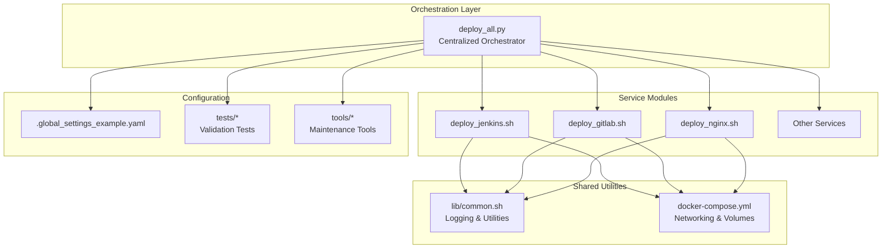
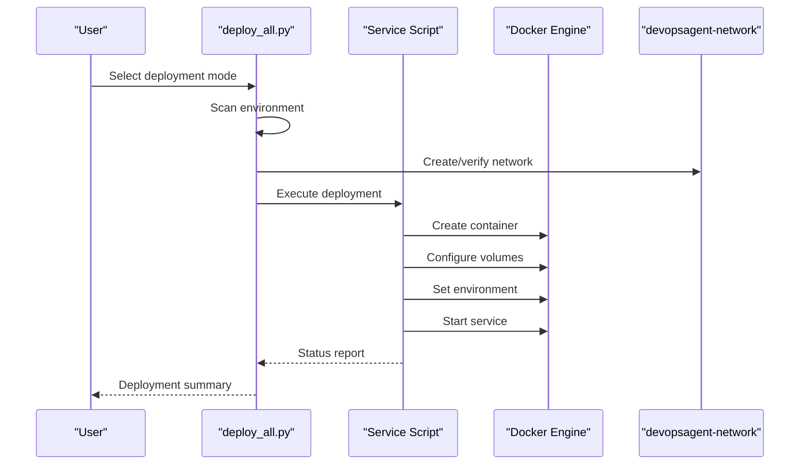
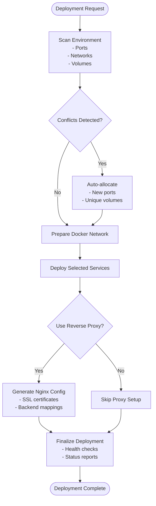
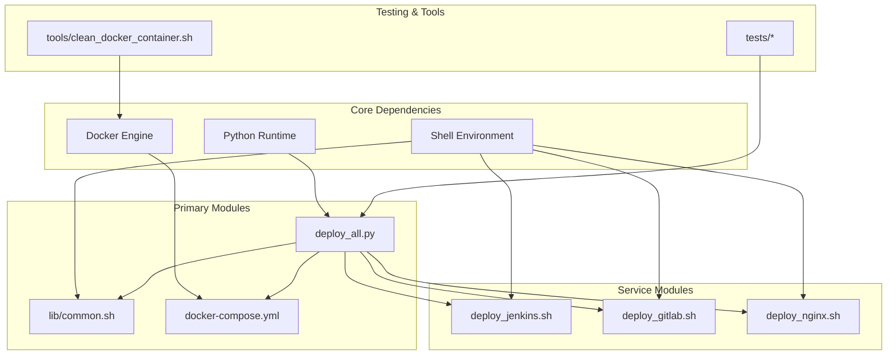

# Project Overview

<cite>
**Referenced Files in This Document**
- [README.md](file://README.md)
- [deploy_all.py](file://deploy/deploy_all.py)
- [common.sh](file://deploy/lib/common.sh)
- [docker-compose.yml](file://deploy/docker-compose.yml)
- [deploy_jenkins.sh](file://deploy/deploy_jenkins/deploy_jenkins.sh)
- [deploy_gitlab.sh](file://deploy/deploy_gitlab/deploy_gitlab.sh)
- [deploy_nginx.sh](file://deploy/deploy_nginx/deploy_nginx.sh)
- [.global_settings_example.yaml](file://deploy/config/.global_settings_example.yaml)
- [test_config.py](file://deploy/tests/test_config.py)
- [conftest.py](file://deploy/tests/conftest.py)
- [clean_docker_container.sh](file://deploy/tools/clean_docker_container.sh)
</cite>

## Table of Contents
1. [Introduction](#introduction)
2. [Project Structure](#project-structure)
3. [Core Components](#core-components)
4. [Architecture Overview](#architecture-overview)
5. [Detailed Component Analysis](#detailed-component-analysis)
6. [Dependency Analysis](#dependency-analysis)
7. [Performance Considerations](#performance-considerations)
8. [Troubleshooting Guide](#troubleshooting-guide)
9. [Conclusion](#conclusion)

## Introduction
DeployAgent is a DevOps infrastructure automation tool designed to streamline deployment automation and CI/CD infrastructure management. Its core mission is to provide a unified, enterprise-grade solution for orchestrating and operating development toolchains with minimal friction. The project focuses on enabling one-click deployment capabilities, automated service orchestration, and comprehensive DevOps stack management through a modular architecture that centralizes configuration and automates operational tasks.

The project emphasizes practical value for DevOps engineers, system administrators, and platform teams who need reliable, repeatable deployments across diverse environments. It addresses common DevOps deployment challenges such as port conflicts, Docker network collisions, persistent storage management, and reverse proxy configuration complexity by offering automated detection, conflict resolution, and centralized orchestration.

## Project Structure
DeployAgent organizes its functionality around a clear separation of concerns:
- Centralized orchestration and deployment logic in a Python-based controller
- Modular service deployment scripts for each tool in the stack
- Shared libraries for common utilities and logging
- Docker Compose definitions for container networking and persistence
- Configuration templates and examples for global settings
- Automated testing and maintenance utilities

**Diagram sources**
- [deploy_all.py:1-1315](file://deploy/deploy_all.py#L1-L1315)
- [common.sh:1-566](file://deploy/lib/common.sh#L1-L566)
- [docker-compose.yml:1-222](file://deploy/docker-compose.yml#L1-L222)

**Section sources**
- [README.md:1-3](file://README.md#L1-L3)
- [deploy_all.py:1-1315](file://deploy/deploy_all.py#L1-L1315)
- [common.sh:1-566](file://deploy/lib/common.sh#L1-L566)
- [docker-compose.yml:1-222](file://deploy/docker-compose.yml#L1-L222)

## Core Components
DeployAgent comprises several core components that work together to deliver comprehensive deployment automation:

### Centralized Orchestration Engine
The orchestration engine serves as the primary entry point for deployment operations. It provides:
- Interactive and non-interactive deployment modes
- Environment scanning and conflict detection
- Automated port allocation and Docker network management
- Centralized logging and state management
- Multi-service deployment coordination

### Modular Service Deployment Scripts
Each service in the DevOps stack has a dedicated deployment script that encapsulates:
- Service-specific configuration and environment setup
- Container lifecycle management
- Credential extraction and initial access information
- Health checks and status reporting

### Shared Utility Library
The common library provides reusable functionality across all service deployments:
- Logging with colored output and file persistence
- Docker environment validation and image management
- Port checking and conflict resolution
- Password extraction and administrative access provisioning
- Network and volume management utilities

### Container Networking and Persistence
Docker Compose defines the runtime environment with:
- Centralized bridge network for service communication
- Named volumes for persistent data storage
- Health checks for service monitoring
- Security hardening through resource constraints

**Section sources**
- [deploy_all.py:1-1315](file://deploy/deploy_all.py#L1-L1315)
- [common.sh:1-566](file://deploy/lib/common.sh#L1-L566)
- [docker-compose.yml:1-222](file://deploy/docker-compose.yml#L1-L222)

## Architecture Overview
DeployAgent follows a modular architecture that separates concerns between orchestration, service management, and shared utilities. The system operates on three fundamental principles:

### Modular Deployment Scripts
Each service maintains its own deployment script with explicit responsibilities:
- Jenkins deployment with context path configuration
- GitLab deployment with external URL management
- Nginx reverse proxy with SSL termination
- Specialized utilities for agent management and device pairing

### Centralized Orchestration
The orchestration engine coordinates multiple services through:
- Configuration-driven service selection
- Automated environment preparation
- Conflict detection and resolution
- Unified logging and state tracking

### Automated Configuration Management
The system automatically manages:
- Port allocation avoiding conflicts
- Docker network creation and validation
- Volume naming and collision prevention
- Reverse proxy configuration generation

**Diagram sources**
- [deploy_all.py:458-767](file://deploy/deploy_all.py#L458-L767)
- [deploy_jenkins.sh:43-113](file://deploy/deploy_jenkins/deploy_jenkins.sh#L43-L113)
- [deploy_gitlab.sh:57-156](file://deploy/deploy_gitlab/deploy_gitlab.sh#L57-L156)

**Section sources**
- [deploy_all.py:458-767](file://deploy/deploy_all.py#L458-L767)
- [deploy_jenkins.sh:43-113](file://deploy/deploy_jenkins/deploy_jenkins.sh#L43-L113)
- [deploy_gitlab.sh:57-156](file://deploy/deploy_gitlab/deploy_gitlab.sh#L57-L156)

## Detailed Component Analysis

### Orchestration Engine Analysis
The orchestration engine implements sophisticated deployment coordination through:
- Service configuration registry with deployment metadata
- Automated port conflict resolution with intelligent fallback
- Docker network management with collision detection
- Volume naming resolution preventing conflicts
- Reverse proxy configuration generation

**Diagram sources**
- [deploy_all.py:269-340](file://deploy/deploy_all.py#L269-L340)
- [deploy_all.py:346-399](file://deploy/deploy_all.py#L346-L399)
- [deploy_all.py:405-453](file://deploy/deploy_all.py#L405-L453)

**Section sources**
- [deploy_all.py:269-340](file://deploy/deploy_all.py#L269-L340)
- [deploy_all.py:346-399](file://deploy/deploy_all.py#L346-L399)
- [deploy_all.py:405-453](file://deploy/deploy_all.py#L405-L453)

### Service Deployment Scripts
Each service deployment script encapsulates specific operational logic:

#### Jenkins Deployment
The Jenkins deployment script provides:
- Flexible storage configuration (named volumes vs bind mounts)
- Context path configuration for reverse proxy support
- Initial password extraction and display
- Comprehensive status reporting and troubleshooting guidance

#### GitLab Deployment
The GitLab deployment script offers:
- External URL configuration for reverse proxy scenarios
- SSH port management and configuration
- Named volume support for Windows/WSL compatibility
- Initial password extraction with clear remediation steps

#### Nginx Reverse Proxy
The Nginx deployment script enables:
- Automatic SSL certificate generation
- Dynamic backend service detection
- Configurable reverse proxy mappings
- Health check integration and validation

**Section sources**
- [deploy_jenkins.sh:43-113](file://deploy/deploy_jenkins/deploy_jenkins.sh#L43-L113)
- [deploy_gitlab.sh:57-156](file://deploy/deploy_gitlab/deploy_gitlab.sh#L57-L156)
- [deploy_nginx.sh:58-365](file://deploy/deploy_nginx/deploy_nginx.sh#L58-L365)

### Shared Utility Library
The common library provides essential cross-cutting functionality:
- Structured logging with color-coded output
- Docker environment validation and image management
- Port conflict detection and resolution
- Administrative credential extraction
- Network and volume management utilities

**Section sources**
- [common.sh:25-74](file://deploy/lib/common.sh#L25-L74)
- [common.sh:101-124](file://deploy/lib/common.sh#L101-L124)
- [common.sh:157-168](file://deploy/lib/common.sh#L157-L168)
- [common.sh:341-380](file://deploy/lib/common.sh#L341-L380)

### Container Orchestration
Docker Compose defines the runtime environment with:
- Centralized bridge network for service communication
- Named volumes for persistent data storage
- Health checks for service monitoring
- Security hardening through resource constraints
- Environment variable injection for service configuration

**Section sources**
- [docker-compose.yml:3-6](file://deploy/docker-compose.yml#L3-L6)
- [docker-compose.yml:8-33](file://deploy/docker-compose.yml#L8-L33)
- [docker-compose.yml:34-222](file://deploy/docker-compose.yml#L34-L222)

## Dependency Analysis
DeployAgent exhibits a well-structured dependency graph that promotes modularity and maintainability:

**Diagram sources**
- [deploy_all.py:1-30](file://deploy/deploy_all.py#L1-L30)
- [common.sh:1-10](file://deploy/lib/common.sh#L1-L10)
- [docker-compose.yml:1-10](file://deploy/docker-compose.yml#L1-L10)

The dependency analysis reveals:
- Clear separation between orchestration and service-specific logic
- Shared utilities reduce code duplication across services
- Docker Compose provides consistent runtime environment
- Testing framework validates configuration integrity
- Maintenance tools support operational workflows

**Section sources**
- [deploy_all.py:1-30](file://deploy/deploy_all.py#L1-L30)
- [common.sh:1-10](file://deploy/lib/common.sh#L1-L10)
- [docker-compose.yml:1-10](file://deploy/docker-compose.yml#L1-L10)

## Performance Considerations
DeployAgent incorporates several performance optimizations and considerations:

### Resource Efficiency
- Minimal memory footprint through focused orchestration logic
- Efficient Docker resource utilization with named volumes
- Optimized network communication through centralized bridge
- Health checks prevent unnecessary resource consumption

### Scalability Factors
- Modular architecture allows incremental service addition
- Automated conflict detection scales with service count
- Shared utilities minimize redundant operations
- Container-based isolation enables horizontal scaling

### Operational Performance
- Parallel service deployment where safe and appropriate
- Intelligent retry mechanisms for transient failures
- Caching of environment state to avoid repeated scans
- Efficient logging with configurable verbosity levels

## Troubleshooting Guide
DeployAgent provides comprehensive troubleshooting capabilities through:

### Automated Diagnostics
- Environment scanning for port conflicts and network issues
- Docker network validation and collision detection
- Volume naming conflict resolution
- SSL certificate verification and regeneration

### Service-Specific Recovery
- Jenkins initial password extraction and display
- GitLab root password recovery procedures
- Container cleanup and restart procedures
- Reverse proxy configuration validation

### Maintenance Tools
- Interactive container management and cleanup
- Volume backup and restoration procedures
- Network diagnostics and repair
- System-wide cleanup and reset capabilities

**Section sources**
- [deploy_all.py:269-340](file://deploy/deploy_all.py#L269-L340)
- [deploy_all.py:346-399](file://deploy/deploy_all.py#L346-L399)
- [common.sh:341-380](file://deploy/lib/common.sh#L341-L380)
- [clean_docker_container.sh:42-180](file://deploy/tools/clean_docker_container.sh#L42-L180)

## Conclusion
DeployAgent represents a mature, enterprise-grade solution for DevOps infrastructure automation. Its modular architecture, centralized orchestration, and comprehensive automation capabilities address the most pressing challenges in modern DevOps environments. The project successfully balances simplicity for everyday operations with the robustness required for production deployments.

Key strengths include:
- One-click deployment capabilities with intelligent conflict resolution
- Automated service orchestration across diverse toolchains
- Enterprise-grade configuration management and security hardening
- Comprehensive testing and validation framework
- Extensive troubleshooting and maintenance tooling

The project's focus on practical automation, combined with its modular design and centralized management approach, makes it an ideal choice for organizations seeking reliable, repeatable DevOps infrastructure management solutions.