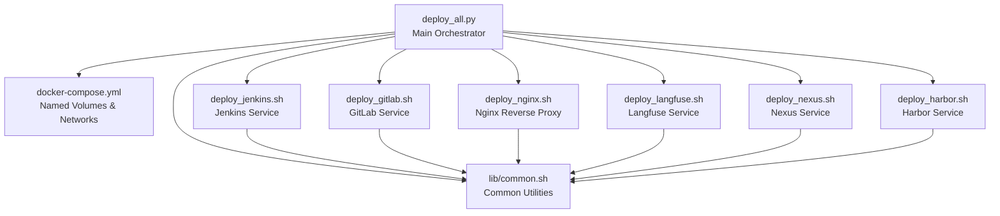
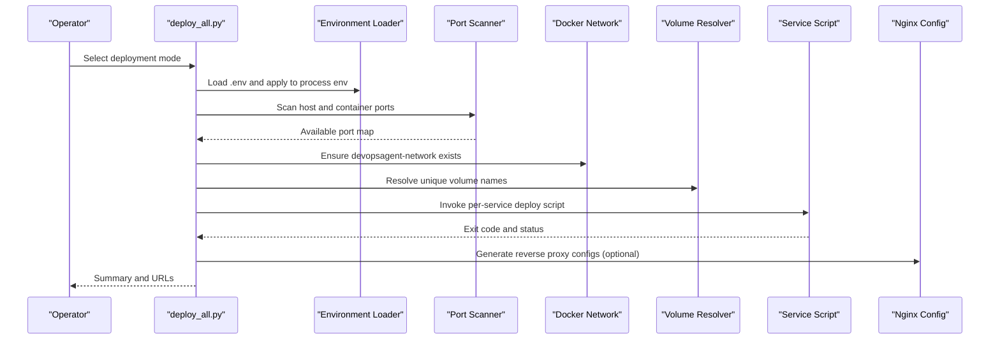
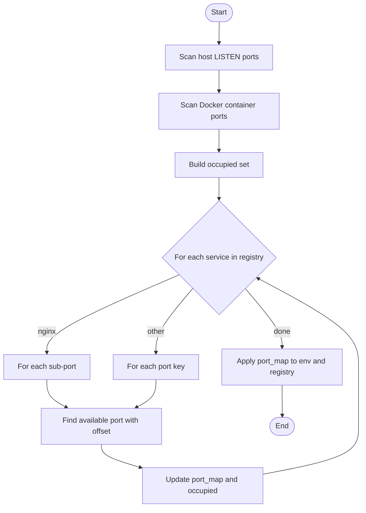
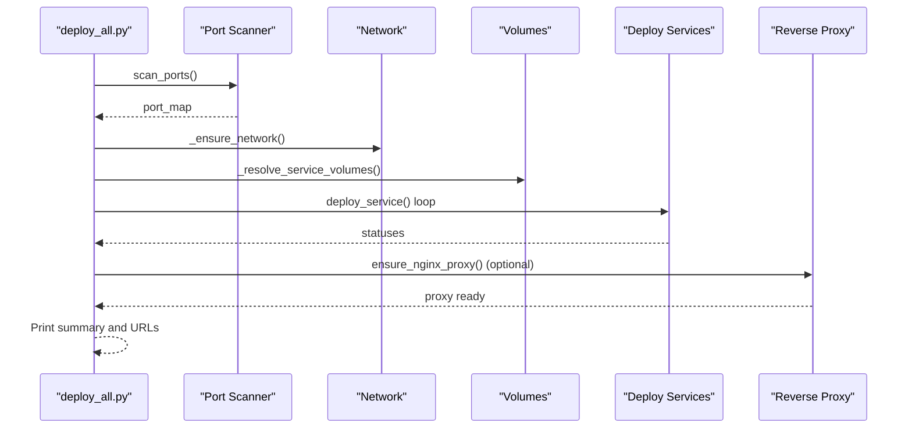
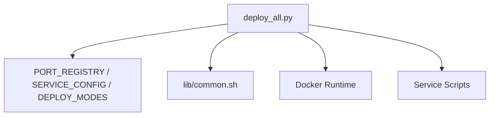

# Core Deployment Engine

<cite>
**Referenced Files in This Document**
- [deploy_all.py](file://deploy/deploy_all.py)
- [common.sh](file://deploy/lib/common.sh)
- [docker-compose.yml](file://deploy/docker-compose.yml)
- [deploy_jenkins.sh](file://deploy/deploy_jenkins/deploy_jenkins.sh)
- [deploy_gitlab.sh](file://deploy/deploy_gitlab/deploy_gitlab.sh)
- [deploy_nginx.sh](file://deploy/deploy_nginx/deploy_nginx.sh)
- [deploy_langfuse.sh](file://deploy/deploy_langfuse/deploy_langfuse.sh)
- [deploy_nexus.sh](file://deploy/deploy_nexus/deploy_nexus.sh)
- [deploy_harbor.sh](file://deploy/deploy_harbor/deploy_harbor.sh)
- [test_config.py](file://deploy/tests/test_config.py)
- [conftest.py](file://deploy/tests/conftest.py)
- [clean_docker_container.sh](file://deploy/tools/clean_docker_container.sh)
</cite>

## Table of Contents
1. [Introduction](#introduction)
2. [Project Structure](#project-structure)
3. [Core Components](#core-components)
4. [Architecture Overview](#architecture-overview)
5. [Detailed Component Analysis](#detailed-component-analysis)
6. [Dependency Analysis](#dependency-analysis)
7. [Performance Considerations](#performance-considerations)
8. [Troubleshooting Guide](#troubleshooting-guide)
9. [Conclusion](#conclusion)
10. [Appendices](#appendices)

## Introduction
This document describes the DeployAgent core deployment engine that orchestrates multi-service deployments with centralized configuration, port management, reverse proxy integration, and robust environment variable handling. It explains how the main orchestrator coordinates service deployments, manages Docker networks and volumes, resolves conflicts, and supports multiple deployment modes. It also documents the centralized service registry, deployment configuration dictionary, port allocation algorithms, and the integration patterns with the common utilities library.

## Project Structure
The deployment engine centers around a Python orchestrator that defines service configurations, port registries, and deployment modes, and coordinates per-service Bash scripts. A shared common library provides logging, environment loading, Docker checks, and reusable helpers. Docker Compose is used for persistent services and named volumes. A dedicated Nginx module generates reverse proxy configurations dynamically.

**Diagram sources**
- [deploy_all.py:1-1315](file://deploy/deploy_all.py#L1-L1315)
- [common.sh:1-566](file://deploy/lib/common.sh#L1-L566)
- [docker-compose.yml:1-222](file://deploy/docker-compose.yml#L1-L222)
- [deploy_jenkins.sh:1-385](file://deploy/deploy_jenkins/deploy_jenkins.sh#L1-L385)
- [deploy_gitlab.sh:1-445](file://deploy/deploy_gitlab/deploy_gitlab.sh#L1-L445)
- [deploy_nginx.sh:1-712](file://deploy/deploy_nginx/deploy_nginx.sh#L1-L712)
- [deploy_langfuse.sh:1-164](file://deploy/deploy_langfuse/deploy_langfuse.sh#L1-L164)
- [deploy_nexus.sh:1-174](file://deploy/deploy_nexus/deploy_nexus.sh#L1-L174)
- [deploy_harbor.sh:1-124](file://deploy/deploy_harbor/deploy_harbor.sh#L1-L124)

**Section sources**
- [deploy_all.py:1-1315](file://deploy/deploy_all.py#L1-L1315)
- [common.sh:1-566](file://deploy/lib/common.sh#L1-L566)
- [docker-compose.yml:1-222](file://deploy/docker-compose.yml#L1-L222)

## Core Components
- Centralized orchestrator (Python): Defines port registry, service configuration dictionary, deployment modes, environment variable management, Docker network handling, volume resolution, and orchestration logic.
- Service scripts (Bash): Per-service deployment scripts that rely on the common utilities library for logging, Docker checks, and environment loading.
- Common utilities (Bash): Provides logging, environment loading, Docker detection, port checks, multi-source image pulls, and helper functions.
- Docker Compose: Manages named volumes and networks for persistent services.

Key responsibilities:
- Port scanning and allocation
- Environment variable propagation and persistence
- Docker network creation and validation
- Volume naming conflict resolution
- Reverse proxy generation and integration
- Deployment modes and service dependency ordering

**Section sources**
- [deploy_all.py:40-142](file://deploy/deploy_all.py#L40-L142)
- [deploy_all.py:209-264](file://deploy/deploy_all.py#L209-L264)
- [deploy_all.py:269-340](file://deploy/deploy_all.py#L269-L340)
- [deploy_all.py:346-399](file://deploy/deploy_all.py#L346-L399)
- [deploy_all.py:405-453](file://deploy/deploy_all.py#L405-L453)
- [deploy_all.py:502-545](file://deploy/deploy_all.py#L502-L545)
- [deploy_all.py:682-699](file://deploy/deploy_all.py#L682-L699)
- [deploy_all.py:769-767](file://deploy/deploy_all.py#L769-L767)
- [common.sh:130-151](file://deploy/lib/common.sh#L130-L151)
- [common.sh:101-124](file://deploy/lib/common.sh#L101-L124)

## Architecture Overview
The orchestrator coordinates environment scanning, port allocation, Docker network creation, volume resolution, and per-service deployment. It optionally configures Nginx reverse proxy and sets environment variables consumed by downstream services.

**Diagram sources**
- [deploy_all.py:209-264](file://deploy/deploy_all.py#L209-L264)
- [deploy_all.py:269-340](file://deploy/deploy_all.py#L269-L340)
- [deploy_all.py:346-399](file://deploy/deploy_all.py#L346-L399)
- [deploy_all.py:405-453](file://deploy/deploy_all.py#L405-L453)
- [deploy_all.py:502-545](file://deploy/deploy_all.py#L502-L545)
- [deploy_all.py:682-699](file://deploy/deploy_all.py#L682-L699)
- [deploy_all.py:769-767](file://deploy/deploy_all.py#L769-L767)

## Detailed Component Analysis

### Centralized Service Registry and Configuration Dictionary
- PORT_REGISTRY: Central registry of default ports per service and sub-keys (e.g., nginx sub-ports). Used to compute available ports during scanning.
- SERVICE_CONFIG: Centralized configuration per service including deploy script path, container name, optional Nginx mapping keys, backend host/port, and Nginx location.
- DEPLOY_MODES: Predefined deployment modes with human-readable names, descriptions, service lists, and whether Nginx is included.

Operational impact:
- Ensures consistent port defaults and Nginx integration.
- Enables flexible deployment modes (full, standalone, partial).
- Supports dynamic port allocation and environment variable updates.

**Section sources**
- [deploy_all.py:40-142](file://deploy/deploy_all.py#L40-L142)
- [deploy_all.py:131-142](file://deploy/deploy_all.py#L131-L142)

### Port Management and Allocation Algorithm
- Host and container port scanning: Enumerates LISTEN sockets and exposed Docker ports to build an occupied set.
- Available port selection: Iterates from a default port with a bounded offset to find the first unused port, updating the occupied set.
- Automatic port map application: Updates environment variables and the registry with allocated ports.

**Diagram sources**
- [deploy_all.py:269-340](file://deploy/deploy_all.py#L269-L340)
- [deploy_all.py:294-300](file://deploy/deploy_all.py#L294-L300)
- [deploy_all.py:254-264](file://deploy/deploy_all.py#L254-L264)

**Section sources**
- [deploy_all.py:269-340](file://deploy/deploy_all.py#L269-L340)
- [deploy_all.py:294-300](file://deploy/deploy_all.py#L294-L300)
- [deploy_all.py:254-264](file://deploy/deploy_all.py#L254-L264)

### Environment Variable Management System
- Loads variables from .env into process environment.
- Applies port allocations to environment variables (including special cases for nginx and mariadb).
- Propagates environment variables to child service scripts via os.environ.

Integration patterns:
- Services read environment variables for ports, binds, and external URLs.
- The orchestrator writes .env.auto with generated port assignments for reproducibility.

**Section sources**
- [deploy_all.py:209-218](file://deploy/deploy_all.py#L209-L218)
- [deploy_all.py:235-247](file://deploy/deploy_all.py#L235-L247)
- [deploy_all.py:249-264](file://deploy/deploy_all.py#L249-L264)
- [common.sh:130-151](file://deploy/lib/common.sh#L130-L151)

### Docker Network Handling
- Ensures the devopsagent-network exists; creates it if missing.
- All services join this network to enable inter-container communication.
- Nginx integrates with the same network and proxies to backend containers by name.

**Section sources**
- [deploy_all.py:757-767](file://deploy/deploy_all.py#L757-L767)
- [docker-compose.yml:3-6](file://deploy/docker-compose.yml#L3-L6)
- [deploy_nginx.sh:338-344](file://deploy/deploy_nginx/deploy_nginx.sh#L338-L344)

### Volume Resolution Mechanisms
- VOLUME_MAP: Maps service to environment variable and default volume name pairs.
- Conflict resolution: Checks existing Docker volumes and appends numeric suffixes until a unique name is found.
- Per-service deployment: Resolves unique names and passes them to child scripts via environment variables.

**Section sources**
- [deploy_all.py:458-475](file://deploy/deploy_all.py#L458-L475)
- [deploy_all.py:477-490](file://deploy/deploy_all.py#L477-L490)
- [deploy_all.py:513-518](file://deploy/deploy_all.py#L513-L518)

### Reverse Proxy Integration (Nginx)
- Dynamic configuration generation: Detects running backend containers and writes per-service Nginx config files.
- SSL certificate management: Generates self-signed certificates if missing.
- Port mapping: Exposes Nginx ports according to allocated nginx registry entries.
- Environment-driven proxy URLs: Sets service-specific HTTPS proxy environment variables for downstream services.

**Section sources**
- [deploy_all.py:682-699](file://deploy/deploy_all.py#L682-L699)
- [deploy_all.py:701-756](file://deploy/deploy_all.py#L701-L756)
- [deploy_all.py:769-767](file://deploy/deploy_all.py#L769-L767)
- [deploy_nginx.sh:58-365](file://deploy/deploy_nginx/deploy_nginx.sh#L58-L365)

### Orchestration Workflow: From Initialization to Completion
- Initialize logging and environment.
- Scan ports and apply allocations.
- Ensure Docker network and volumes.
- Deploy services in order, with cleanup of conflicting old containers.
- Optionally configure Nginx reverse proxy and set environment variables for HTTPS proxy URLs.
- Produce summary and URLs for access.

**Diagram sources**
- [deploy_all.py:682-699](file://deploy/deploy_all.py#L682-L699)
- [deploy_all.py:269-340](file://deploy/deploy_all.py#L269-L340)
- [deploy_all.py:502-545](file://deploy/deploy_all.py#L502-L545)
- [deploy_all.py:769-767](file://deploy/deploy_all.py#L769-L767)

**Section sources**
- [deploy_all.py:682-699](file://deploy/deploy_all.py#L682-L699)
- [deploy_all.py:502-545](file://deploy/deploy_all.py#L502-L545)

### Error Handling Strategies
- Command execution wrapper with timeouts and explicit error reporting.
- Graceful handling of service script failures: checks if containers are already running and treats as success.
- Detailed logging of stdout/stderr for diagnostics.
- Validation of Docker and Compose availability, with clear guidance on installation steps.
- Network and volume conflict detection with warnings and remediation suggestions.

**Section sources**
- [deploy_all.py:168-182](file://deploy/deploy_all.py#L168-L182)
- [deploy_all.py:525-543](file://deploy/deploy_all.py#L525-L543)
- [common.sh:101-124](file://deploy/lib/common.sh#L101-L124)

### Cleanup Procedures
- Old container cleanup: Stops and removes previous devopsagent-* containers before deploying new ones.
- Volume cleanup: Provides a prune utility and a dedicated cleanup tool for named volumes.
- Tool-based cleanup: Interactive menu to stop/remove containers and optionally clean volumes.

**Section sources**
- [deploy_all.py:566-589](file://deploy/deploy_all.py#L566-L589)
- [deploy_all.py:446-453](file://deploy/deploy_all.py#L446-L453)
- [clean_docker_container.sh:61-101](file://deploy/tools/clean_docker_container.sh#L61-L101)
- [clean_docker_container.sh:103-180](file://deploy/tools/clean_docker_container.sh#L103-L180)

### Examples of Deployment Modes and Dependencies
- Full deployment: Jenkins, GitLab, MantisBT, Langfuse, and Nginx.
- Standalone deployments: Jenkins, GitLab, MantisBT, Langfuse, Artifactory, Nexus, Harbor with optional Nginx.
- Dependencies: Jenkins depends on Agent; GitLab depends on external URL configuration; MantisBT depends on MariaDB.

**Section sources**
- [deploy_all.py:131-142](file://deploy/deploy_all.py#L131-L142)
- [docker-compose.yml:96-97](file://deploy/docker-compose.yml#L96-L97)
- [docker-compose.yml:182-183](file://deploy/docker-compose.yml#L182-L183)

### Integration Patterns with Common Utilities Library
- Logging: Colorized logs with timestamps and optional file output.
- Environment loading: Reads .env files and exports variables into the current shell.
- Docker checks: Verifies Docker and Compose presence and selects appropriate command.
- Image pulling: Multi-source fallback with retry and timeout controls.
- Password retrieval: Helper functions to fetch initial admin passwords from running containers.

**Section sources**
- [common.sh:25-74](file://deploy/lib/common.sh#L25-L74)
- [common.sh:130-151](file://deploy/lib/common.sh#L130-L151)
- [common.sh:101-124](file://deploy/lib/common.sh#L101-L124)
- [common.sh:174-335](file://deploy/lib/common.sh#L174-L335)
- [common.sh:341-423](file://deploy/lib/common.sh#L341-L423)

## Dependency Analysis
The orchestrator depends on:
- Central dictionaries (PORT_REGISTRY, SERVICE_CONFIG, DEPLOY_MODES)
- Common utilities for logging and environment management
- Docker runtime for network and volume operations
- Per-service scripts for actual deployment

**Diagram sources**
- [deploy_all.py:40-142](file://deploy/deploy_all.py#L40-L142)
- [deploy_all.py:209-264](file://deploy/deploy_all.py#L209-L264)
- [common.sh:1-566](file://deploy/lib/common.sh#L1-L566)

**Section sources**
- [deploy_all.py:40-142](file://deploy/deploy_all.py#L40-L142)
- [common.sh:1-566](file://deploy/lib/common.sh#L1-L566)

## Performance Considerations
- Port scanning uses lightweight system commands; keep the occupied set minimal and avoid repeated scans when unnecessary.
- Volume resolution iterates existing volumes; caching results can reduce overhead in large environments.
- Nginx configuration generation is idempotent; avoid frequent regeneration by checking content differences.
- Image pulling uses multi-source fallback with timeouts; consider pre-pulling images in CI/CD pipelines to reduce runtime latency.

## Troubleshooting Guide
- Port conflicts: Use the scan-and-allocate workflow to resolve conflicts automatically; review warnings for overridden ports.
- Docker/Compose not found: The common utilities provide clear installation guidance; ensure proper permissions and version compatibility.
- Service startup failures: Inspect container logs and check for dependency issues (e.g., database readiness).
- Nginx proxy errors: Verify backend container names and ports; regenerate configurations if needed.
- Volume conflicts: Use the volume resolver to obtain unique names; clean volumes via the cleanup tool if necessary.

**Section sources**
- [deploy_all.py:269-340](file://deploy/deploy_all.py#L269-L340)
- [common.sh:101-124](file://deploy/lib/common.sh#L101-L124)
- [deploy_all.py:525-543](file://deploy/deploy_all.py#L525-L543)
- [deploy_nginx.sh:356-365](file://deploy/deploy_nginx/deploy_nginx.sh#L356-L365)
- [clean_docker_container.sh:89-101](file://deploy/tools/clean_docker_container.sh#L89-L101)

## Conclusion
The DeployAgent core deployment engine provides a robust, configurable, and extensible foundation for orchestrating multi-service deployments. Its centralized configuration, automated port and volume management, Docker-centric design, and integrated reverse proxy support streamline complex deployments while maintaining flexibility across various operational scenarios.

## Appendices

### Appendix A: Testing Configuration Coverage
- Validates port registry structure and values.
- Validates service configuration completeness and required fields.
- Validates deployment modes structure and inclusion of new services.

**Section sources**
- [test_config.py:13-46](file://deploy/tests/test_config.py#L13-L46)
- [test_config.py:56-76](file://deploy/tests/test_config.py#L56-L76)
- [test_config.py:86-127](file://deploy/tests/test_config.py#L86-L127)
- [conftest.py:11-29](file://deploy/tests/conftest.py#L11-L29)