# Error Handling and Recovery Procedures

<cite>
**Referenced Files in This Document**
- [README.md](file://README.md)
- [deploy_all.py](file://deploy/deploy_all.py)
- [common.sh](file://deploy/lib/common.sh)
- [deploy_jenkins.sh](file://deploy/deploy_jenkins/deploy_jenkins.sh)
- [deploy_gitlab.sh](file://deploy/deploy_gitlab/deploy_gitlab.sh)
- [deploy_nginx.sh](file://deploy/deploy_nginx/deploy_nginx.sh)
- [deploy_langfuse.sh](file://deploy/deploy_langfuse/deploy_langfuse.sh)
- [deploy_artifactory.sh](file://deploy/deploy_artifactory/deploy_artifactory.sh)
- [deploy_nexus.sh](file://deploy/deploy_nexus/deploy_nexus.sh)
- [deploy_harbor.sh](file://deploy/deploy_harbor/deploy_harbor.sh)
- [deploy_mantisbt.sh](file://deploy/deploy_MantisBT/deploy_mantisbt.sh)
- [clean_docker_container.sh](file://deploy/tools/clean_docker_container.sh)
</cite>

## Table of Contents
1. [Introduction](#introduction)
2. [Project Structure](#project-structure)
3. [Core Components](#core-components)
4. [Architecture Overview](#architecture-overview)
5. [Detailed Component Analysis](#detailed-component-analysis)
6. [Dependency Analysis](#dependency-analysis)
7. [Performance Considerations](#performance-considerations)
8. [Troubleshooting Guide](#troubleshooting-guide)
9. [Conclusion](#conclusion)

## Introduction
This document describes the error handling and recovery mechanisms in DeployAgent. It explains exception handling strategies, error classification systems, automated recovery procedures, rollback/cleanup mechanisms, failure containment, logging/reporting, debugging capabilities, and diagnostic tools. It also details how these mechanisms integrate with the overall deployment orchestration system.

## Project Structure
DeployAgent is a multi-service deployment toolkit composed of:
- A Python orchestrator that coordinates scanning, environment preparation, service deployment, and reverse proxy configuration.
- Bash-based deployment scripts for each service (Jenkins, GitLab, Nginx, Langfuse, Artifactory, Nexus, Harbor, MantisBT).
- A shared library of logging and utility functions used by the scripts.
- A cleanup tool for Docker resources.

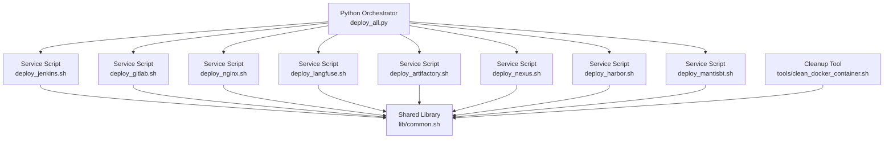

**Diagram sources**
- [deploy_all.py:1-1315](file://deploy/deploy_all.py#L1-L1315)
- [common.sh:1-566](file://deploy/lib/common.sh#L1-L566)
- [deploy_jenkins.sh:1-385](file://deploy/deploy_jenkins/deploy_jenkins.sh#L1-L385)
- [deploy_gitlab.sh:1-445](file://deploy/deploy_gitlab/deploy_gitlab.sh#L1-L445)
- [deploy_nginx.sh:1-712](file://deploy/deploy_nginx/deploy_nginx.sh#L1-L712)
- [deploy_langfuse.sh:1-164](file://deploy/deploy_langfuse/deploy_langfuse.sh#L1-L164)
- [deploy_artifactory.sh:1-195](file://deploy/deploy_artifactory/deploy_artifactory.sh#L1-L195)
- [deploy_nexus.sh:1-174](file://deploy/deploy_nexus/deploy_nexus.sh#L1-L174)
- [deploy_harbor.sh:1-124](file://deploy/deploy_harbor/deploy_harbor.sh#L1-L124)
- [deploy_mantisbt.sh:1-458](file://deploy/deploy_MantisBT/deploy_mantisbt.sh#L1-L458)
- [clean_docker_container.sh:1-248](file://deploy/tools/clean_docker_container.sh#L1-L248)

**Section sources**
- [README.md:1-3](file://README.md#L1-L3)
- [deploy_all.py:1-1315](file://deploy/deploy_all.py#L1-L1315)
- [common.sh:1-566](file://deploy/lib/common.sh#L1-L566)

## Core Components
- Logging and diagnostics
  - Python orchestrator logging to console and file with timestamps and colored prefixes.
  - Bash library provides log_info, log_warn, log_error, log_step with optional file redirection.
- Environment scanning and conflict detection
  - Port occupancy scanning, Docker network overlap checks, volume existence checks.
- Deployment orchestration
  - Per-service deployment with timeouts, pre-deploy cleanup, and post-checks.
- Reverse proxy management
  - Automated Nginx configuration generation and reload with certificate handling.
- Cleanup and recovery
  - Volume backup, prune, and Docker resource cleanup tool.

**Section sources**
- [deploy_all.py:150-182](file://deploy/deploy_all.py#L150-L182)
- [common.sh:25-74](file://deploy/lib/common.sh#L25-L74)
- [deploy_all.py:269-340](file://deploy/deploy_all.py#L269-L340)
- [deploy_all.py:346-399](file://deploy/deploy_all.py#L346-L399)
- [deploy_all.py:405-427](file://deploy/deploy_all.py#L405-L427)
- [deploy_all.py:502-545](file://deploy/deploy_all.py#L502-L545)
- [deploy_all.py:769-788](file://deploy/deploy_all.py#L769-L788)
- [clean_docker_container.sh:1-248](file://deploy/tools/clean_docker_container.sh#L1-L248)

## Architecture Overview
The orchestrator coordinates environment checks, per-service deployments, and reverse proxy configuration. Each service script encapsulates its own lifecycle and error handling. Failures are surfaced via logging and return codes, enabling the orchestrator to continue partial success and report aggregated failures.

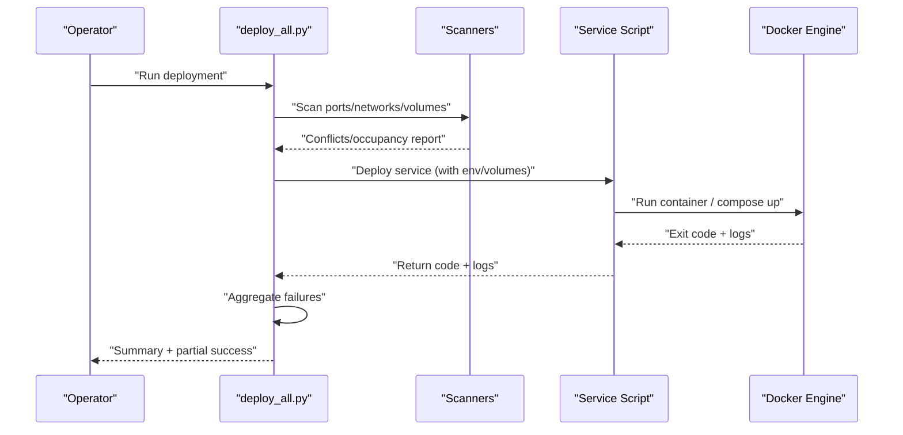

**Diagram sources**
- [deploy_all.py:269-340](file://deploy/deploy_all.py#L269-L340)
- [deploy_all.py:502-545](file://deploy/deploy_all.py#L502-L545)
- [deploy_all.py:682-699](file://deploy/deploy_all.py#L682-L699)

## Detailed Component Analysis

### Python Orchestrator Error Handling
- Logging
  - Centralized log function with INFO/WARN/ERROR/STEP/OK levels and optional file append.
- Command execution
  - Subprocess wrapper with timeout, raising on timeout/explicit failure, capturing stdout/stderr for diagnostics.
- Environment scanning
  - Port scanner merges host LISTEN and Docker exposed ports; warns on conflicts.
  - Docker network scanner detects host route overlaps and physical IPs.
  - Volume scanner lists volumes and warns on potential conflicts.
- Deployment orchestration
  - Per-service deployment with pre-deploy cleanup of conflicting old containers.
  - Post-checks to detect already-running containers and return success accordingly.
  - Aggregated failure reporting after deploying multiple services.
- Reverse proxy
  - Generates SSL certificates if missing, detects backend containers, writes configs, starts Nginx, validates config and reloads.

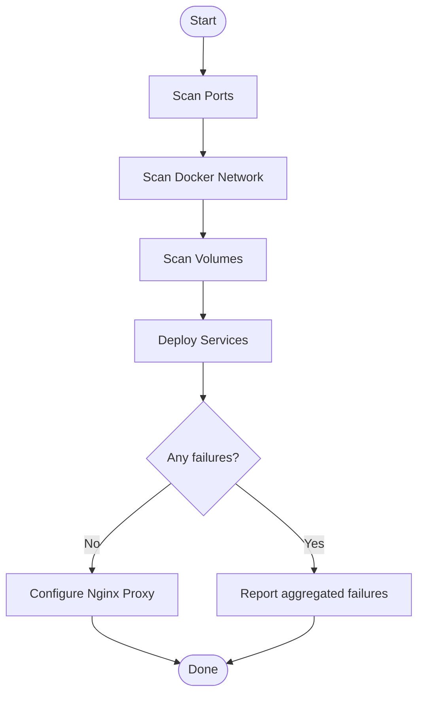

**Diagram sources**
- [deploy_all.py:269-340](file://deploy/deploy_all.py#L269-L340)
- [deploy_all.py:346-399](file://deploy/deploy_all.py#L346-L399)
- [deploy_all.py:405-427](file://deploy/deploy_all.py#L405-L427)
- [deploy_all.py:682-699](file://deploy/deploy_all.py#L682-L699)

**Section sources**
- [deploy_all.py:150-182](file://deploy/deploy_all.py#L150-L182)
- [deploy_all.py:269-340](file://deploy/deploy_all.py#L269-L340)
- [deploy_all.py:346-399](file://deploy/deploy_all.py#L346-L399)
- [deploy_all.py:405-427](file://deploy/deploy_all.py#L405-L427)
- [deploy_all.py:502-545](file://deploy/deploy_all.py#L502-L545)
- [deploy_all.py:682-699](file://deploy/deploy_all.py#L682-L699)
- [deploy_all.py:769-788](file://deploy/deploy_all.py#L769-L788)

### Shared Logging and Utilities (common.sh)
- Colorized logging to stdout and optional file.
- Environment loading, Docker checks, port checks, multi-source image pulls with retries and fallbacks.
- Password retrieval helpers for Jenkins/GitLab with retry loops and guidance.
- Device management utilities for Agent with reset and approval workflows.

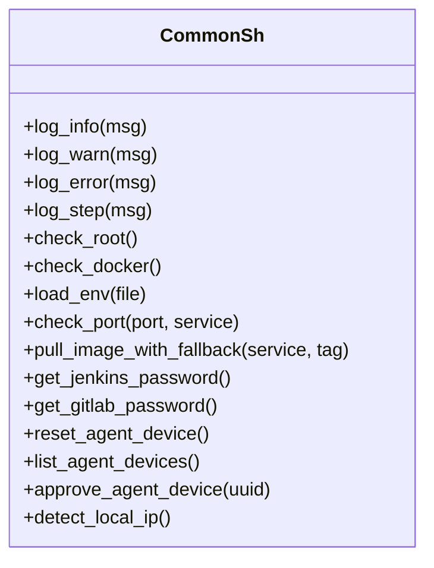

**Diagram sources**
- [common.sh:25-74](file://deploy/lib/common.sh#L25-L74)
- [common.sh:93-124](file://deploy/lib/common.sh#L93-L124)
- [common.sh:130-151](file://deploy/lib/common.sh#L130-L151)
- [common.sh:157-168](file://deploy/lib/common.sh#L157-L168)
- [common.sh:174-335](file://deploy/lib/common.sh#L174-L335)
- [common.sh:341-423](file://deploy/lib/common.sh#L341-L423)
- [common.sh:429-502](file://deploy/lib/common.sh#L429-L502)
- [common.sh:543-555](file://deploy/lib/common.sh#L543-L555)

**Section sources**
- [common.sh:25-74](file://deploy/lib/common.sh#L25-L74)
- [common.sh:93-124](file://deploy/lib/common.sh#L93-L124)
- [common.sh:130-151](file://deploy/lib/common.sh#L130-L151)
- [common.sh:157-168](file://deploy/lib/common.sh#L157-L168)
- [common.sh:174-335](file://deploy/lib/common.sh#L174-L335)
- [common.sh:341-423](file://deploy/lib/common.sh#L341-L423)
- [common.sh:429-502](file://deploy/lib/common.sh#L429-L502)
- [common.sh:543-555](file://deploy/lib/common.sh#L543-L555)

### Jenkins Deployment Script
- Pre-deploy cleanup and container lifecycle management.
- Named volumes vs bind mounts with permission handling and remediation scripts.
- Post-start verification and container status reporting.
- Initial admin password retrieval with retry loop and guidance.

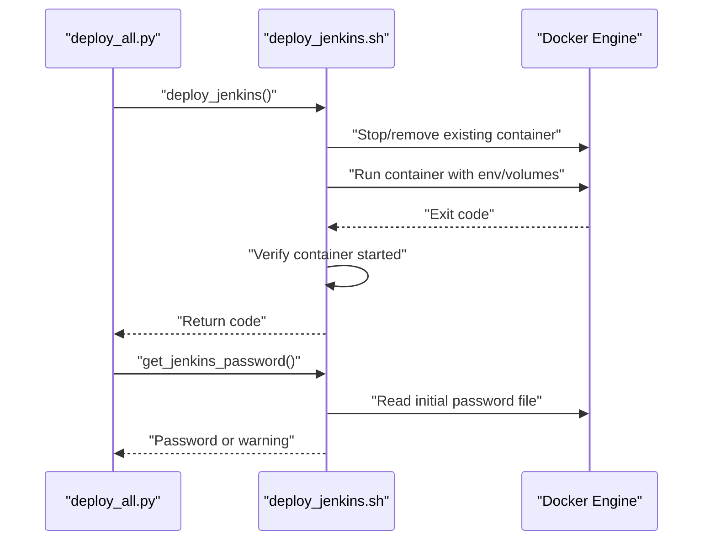

**Diagram sources**
- [deploy_all.py:502-545](file://deploy/deploy_all.py#L502-L545)
- [deploy_jenkins.sh:43-113](file://deploy/deploy_jenkins/deploy_jenkins.sh#L43-L113)
- [deploy_jenkins.sh:115-204](file://deploy/deploy_jenkins/deploy_jenkins.sh#L115-L204)

**Section sources**
- [deploy_jenkins.sh:43-113](file://deploy/deploy_jenkins/deploy_jenkins.sh#L43-L113)
- [deploy_jenkins.sh:115-204](file://deploy/deploy_jenkins/deploy_jenkins.sh#L115-L204)

### GitLab Deployment Script
- Multi-volume support (named volumes recommended on Windows/WSL).
- External URL configuration and HTTPS reverse proxy flags.
- Post-start verification and volume management commands.
- Initial root password retrieval with retry loop and guidance.

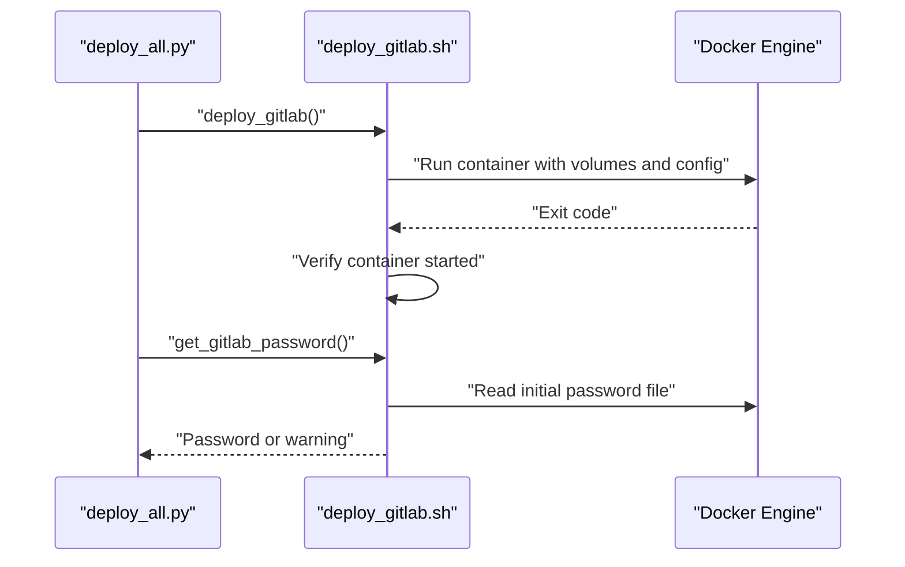

**Diagram sources**
- [deploy_all.py:502-545](file://deploy/deploy_all.py#L502-L545)
- [deploy_gitlab.sh:57-156](file://deploy/deploy_gitlab/deploy_gitlab.sh#L57-L156)
- [deploy_gitlab.sh:158-230](file://deploy/deploy_gitlab/deploy_gitlab.sh#L158-L230)

**Section sources**
- [deploy_gitlab.sh:57-156](file://deploy/deploy_gitlab/deploy_gitlab.sh#L57-L156)
- [deploy_gitlab.sh:158-230](file://deploy/deploy_gitlab/deploy_gitlab.sh#L158-L230)

### Nginx Deployment Script
- Standalone and integrated modes.
- Certificate generation/validation, backend detection, configuration file creation, container start, and config reload.
- Failure to detect backends or container start results in immediate error and guidance.

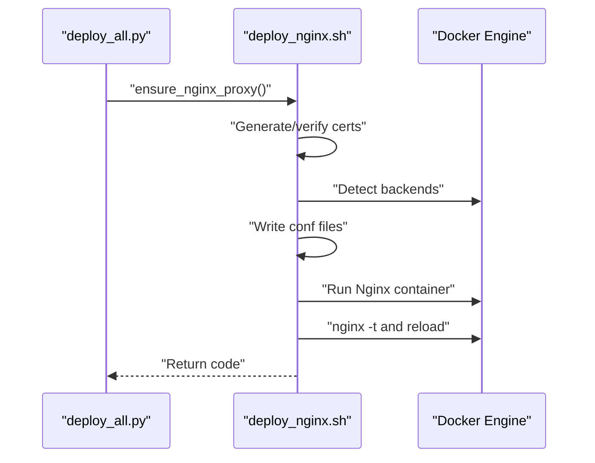

**Diagram sources**
- [deploy_all.py:769-788](file://deploy/deploy_all.py#L769-L788)
- [deploy_nginx.sh:58-365](file://deploy/deploy_nginx/deploy_nginx.sh#L58-L365)

**Section sources**
- [deploy_nginx.sh:58-365](file://deploy/deploy_nginx/deploy_nginx.sh#L58-L365)
- [deploy_all.py:769-788](file://deploy/deploy_all.py#L769-L788)

### Langfuse Deployment Script
- Repository checkout/update, environment variable generation, docker compose up with wait, and post-checks.
- Graceful fallbacks and logs collection on failure.

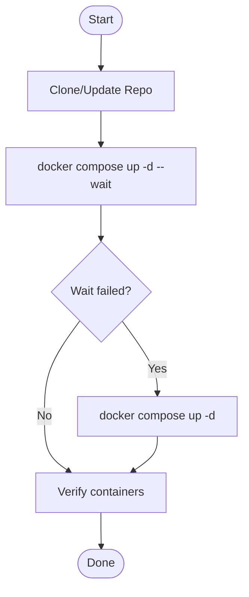

**Diagram sources**
- [deploy_langfuse.sh:46-139](file://deploy/deploy_langfuse/deploy_langfuse.sh#L46-L139)

**Section sources**
- [deploy_langfuse.sh:46-139](file://deploy/deploy_langfuse/deploy_langfuse.sh#L46-L139)

### Artifactory Deployment Script
- Multi-stage image pull with official and third-party fallbacks.
- Local image reuse, container creation, and startup readiness checks with ERROR detection.

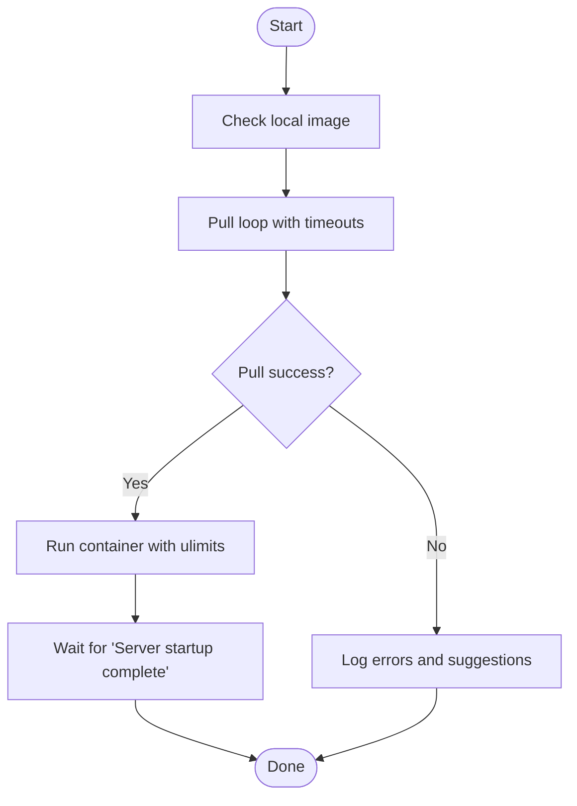

**Diagram sources**
- [deploy_artifactory.sh:22-190](file://deploy/deploy_artifactory/deploy_artifactory.sh#L22-L190)

**Section sources**
- [deploy_artifactory.sh:22-190](file://deploy/deploy_artifactory/deploy_artifactory.sh#L22-L190)

### Nexus Deployment Script
- Image pull with fallback mirrors, container creation, and startup readiness polling.
- Admin password retrieval and guidance.

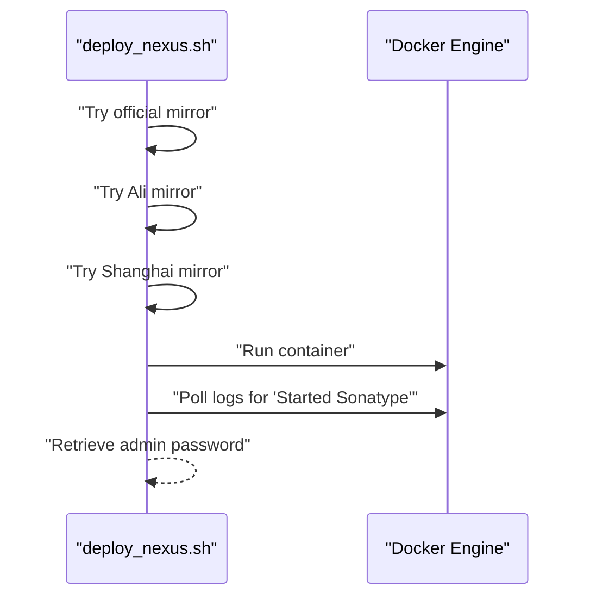

**Diagram sources**
- [deploy_nexus.sh:29-174](file://deploy/deploy_nexus/deploy_nexus.sh#L29-L174)

**Section sources**
- [deploy_nexus.sh:29-174](file://deploy/deploy_nexus/deploy_nexus.sh#L29-L174)

### Harbor Deployment Script
- Offline installer download and extraction, configuration templating, installation, and health check.

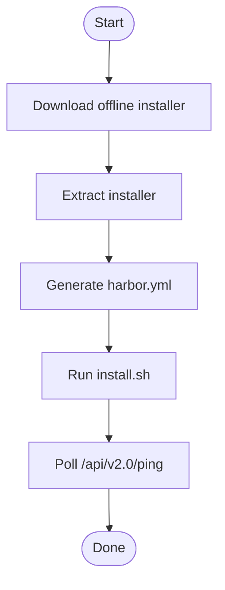

**Diagram sources**
- [deploy_harbor.sh:40-120](file://deploy/deploy_harbor/deploy_harbor.sh#L40-L120)

**Section sources**
- [deploy_harbor.sh:40-120](file://deploy/deploy_harbor/deploy_harbor.sh#L40-L120)

### MantisBT Deployment Script
- Dual-container setup (MantisBT + MariaDB), database initialization via SQL or PHP, admin account provisioning, and connection verification.
- Robust error handling for schema import and web installer fallback.

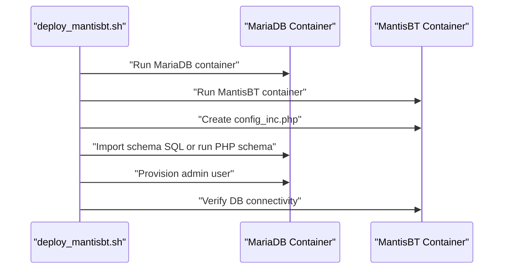

**Diagram sources**
- [deploy_mantisbt.sh:62-135](file://deploy/deploy_MantisBT/deploy_mantisbt.sh#L62-L135)
- [deploy_mantisbt.sh:137-433](file://deploy/deploy_MantisBT/deploy_mantisbt.sh#L137-L433)

**Section sources**
- [deploy_mantisbt.sh:62-135](file://deploy/deploy_MantisBT/deploy_mantisbt.sh#L62-L135)
- [deploy_mantisbt.sh:137-433](file://deploy/deploy_MantisBT/deploy_mantisbt.sh#L137-L433)

### Cleanup Tool
- Interactive and batch operations to stop/remove containers, prune volumes, and list status.
- Safe defaults and confirmation prompts for destructive actions.

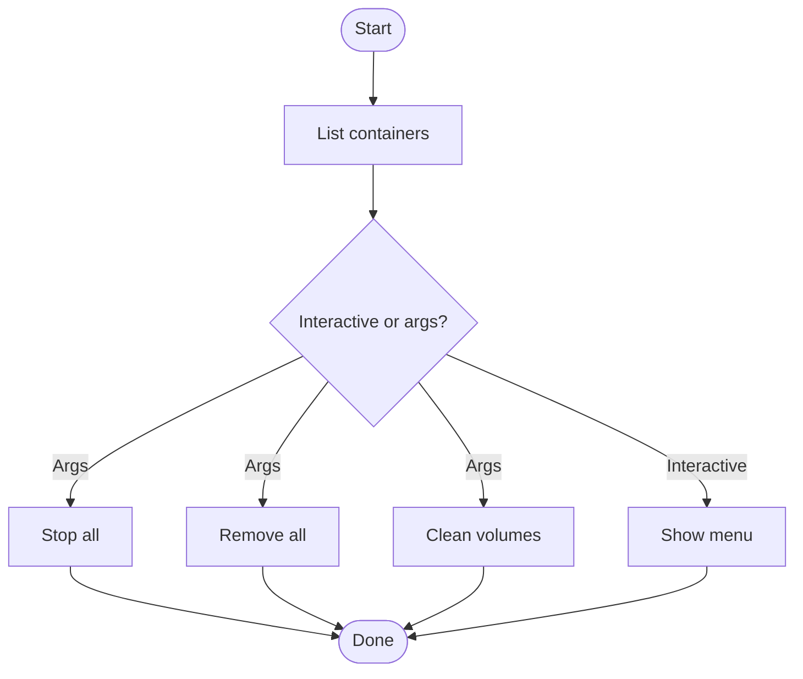

**Diagram sources**
- [clean_docker_container.sh:42-180](file://deploy/tools/clean_docker_container.sh#L42-L180)
- [clean_docker_container.sh:191-247](file://deploy/tools/clean_docker_container.sh#L191-L247)

**Section sources**
- [clean_docker_container.sh:42-180](file://deploy/tools/clean_docker_container.sh#L42-L180)
- [clean_docker_container.sh:191-247](file://deploy/tools/clean_docker_container.sh#L191-L247)

## Dependency Analysis
- Coupling
  - The orchestrator depends on service scripts and the shared library for logging and utilities.
  - Service scripts depend on the shared library for logging, environment loading, and Docker checks.
- Cohesion
  - Each service script encapsulates its lifecycle and error handling, promoting cohesion.
- External dependencies
  - Docker engine, Docker Compose, and third-party mirrors for images.
- Integration points
  - Nginx integration via generated configuration files and reload.
  - Environment variables passed from orchestrator to service scripts.

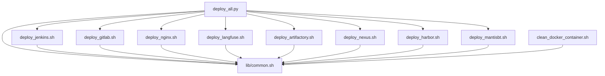

**Diagram sources**
- [deploy_all.py:1-1315](file://deploy/deploy_all.py#L1-L1315)
- [common.sh:1-566](file://deploy/lib/common.sh#L1-L566)
- [deploy_jenkins.sh:1-385](file://deploy/deploy_jenkins/deploy_jenkins.sh#L1-L385)
- [deploy_gitlab.sh:1-445](file://deploy/deploy_gitlab/deploy_gitlab.sh#L1-L445)
- [deploy_nginx.sh:1-712](file://deploy/deploy_nginx/deploy_nginx.sh#L1-L712)
- [deploy_langfuse.sh:1-164](file://deploy/deploy_langfuse/deploy_langfuse.sh#L1-L164)
- [deploy_artifactory.sh:1-195](file://deploy/deploy_artifactory/deploy_artifactory.sh#L1-L195)
- [deploy_nexus.sh:1-174](file://deploy/deploy_nexus/deploy_nexus.sh#L1-L174)
- [deploy_harbor.sh:1-124](file://deploy/deploy_harbor/deploy_harbor.sh#L1-L124)
- [deploy_mantisbt.sh:1-458](file://deploy/deploy_MantisBT/deploy_mantisbt.sh#L1-L458)
- [clean_docker_container.sh:1-248](file://deploy/tools/clean_docker_container.sh#L1-L248)

**Section sources**
- [deploy_all.py:1-1315](file://deploy/deploy_all.py#L1-L1315)
- [common.sh:1-566](file://deploy/lib/common.sh#L1-L566)

## Performance Considerations
- Timeouts and retries
  - Subprocess calls enforce timeouts to prevent hanging operations.
  - Image pull attempts include retries and fallback sources to improve reliability under poor network conditions.
- Startup waits
  - Services poll logs or HTTP endpoints to detect readiness, avoiding premature success.
- Resource cleanup
  - Volume pruning and container cleanup reduce disk usage and avoid conflicts.

[No sources needed since this section provides general guidance]

## Troubleshooting Guide
- Logging and reporting
  - Python orchestrator logs to console and file with timestamps and levels.
  - Bash scripts log to stdout and optionally to a file via environment variable.
- Common error scenarios and recovery workflows
  - Port conflicts: Orchestrator scans and auto-assigns alternative ports; manual override supported.
  - Docker network overlap: Orchestrator detects host routes overlapping Docker networks; adjust routes or network configuration.
  - Volume conflicts: Orchestrator resolves conflicting named volumes by appending suffixes; manual cleanup via cleanup tool.
  - Service startup failures: Scripts check container status, collect logs, and provide guidance; use cleanup tool to reset state.
  - Image pull failures: Scripts attempt multiple sources with retries; configure proxies or mirrors.
  - Nginx configuration errors: Scripts validate config and reload; inspect container logs for details.
- Preventive measures
  - Run environment scans before deployment.
  - Use named volumes for persistence and isolation.
  - Keep Docker and images updated.
  - Monitor logs and set up alerts for persistent failures.

**Section sources**
- [deploy_all.py:150-182](file://deploy/deploy_all.py#L150-L182)
- [common.sh:25-74](file://deploy/lib/common.sh#L25-L74)
- [deploy_all.py:269-340](file://deploy/deploy_all.py#L269-L340)
- [deploy_all.py:346-399](file://deploy/deploy_all.py#L346-L399)
- [deploy_all.py:405-427](file://deploy/deploy_all.py#L405-L427)
- [deploy_all.py:502-545](file://deploy/deploy_all.py#L502-L545)
- [deploy_all.py:769-788](file://deploy/deploy_all.py#L769-L788)
- [deploy_jenkins.sh:115-204](file://deploy/deploy_jenkins/deploy_jenkins.sh#L115-L204)
- [deploy_gitlab.sh:158-230](file://deploy/deploy_gitlab/deploy_gitlab.sh#L158-L230)
- [deploy_nginx.sh:356-365](file://deploy/deploy_nginx/deploy_nginx.sh#L356-L365)
- [deploy_artifactory.sh:162-182](file://deploy/deploy_artifactory/deploy_artifactory.sh#L162-L182)
- [deploy_nexus.sh:115-135](file://deploy/deploy_nexus/deploy_nexus.sh#L115-L135)
- [deploy_harbor.sh:94-112](file://deploy/deploy_harbor/deploy_harbor.sh#L94-L112)
- [deploy_mantisbt.sh:256-351](file://deploy/deploy_MantisBT/deploy_mantisbt.sh#L256-L351)
- [clean_docker_container.sh:61-101](file://deploy/tools/clean_docker_container.sh#L61-L101)

## Conclusion
DeployAgent implements robust error handling and recovery across its orchestrator and service scripts. Centralized logging, environment scanning, multi-source image pulls, and structured deployment workflows enable resilient deployments. Automated recovery includes port and volume resolution, Nginx configuration validation, and comprehensive cleanup tools. Operators can diagnose issues quickly using logs, container inspection, and the cleanup utilities, ensuring reliable and repeatable deployments.