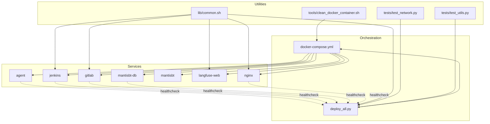
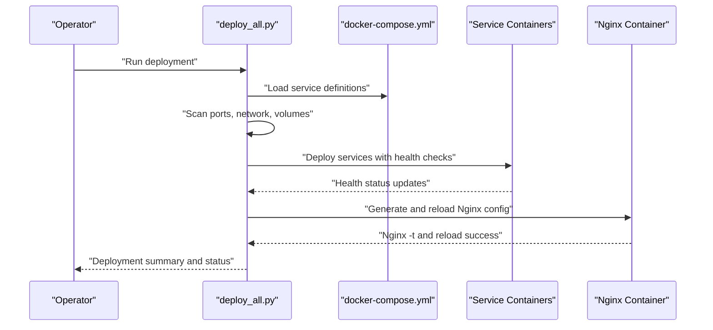
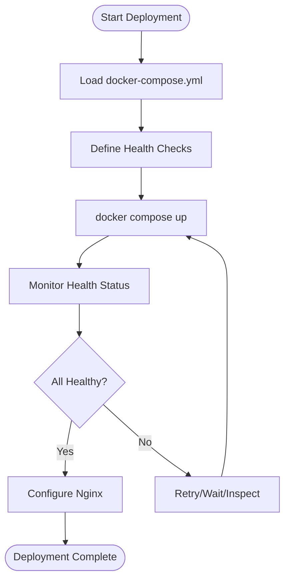
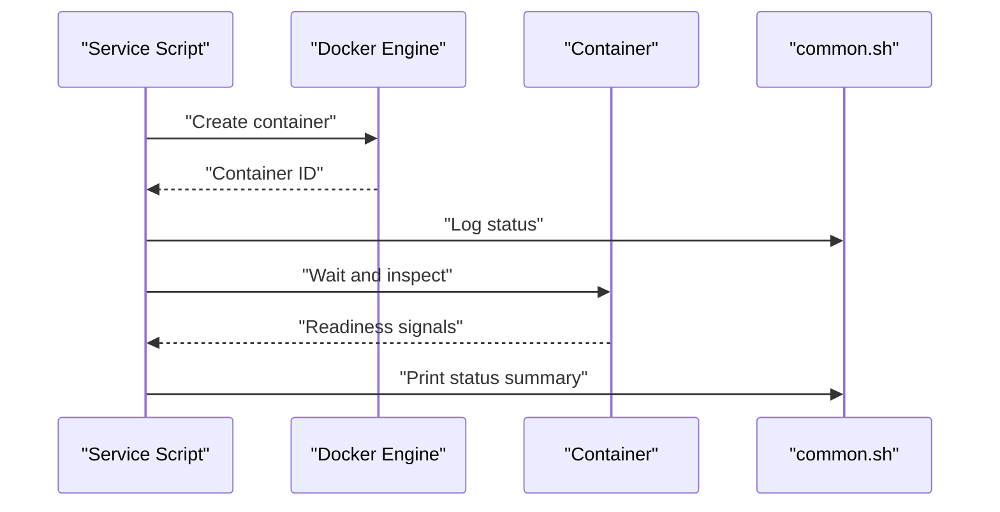
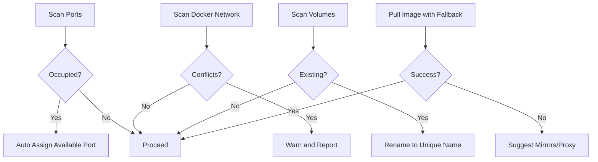
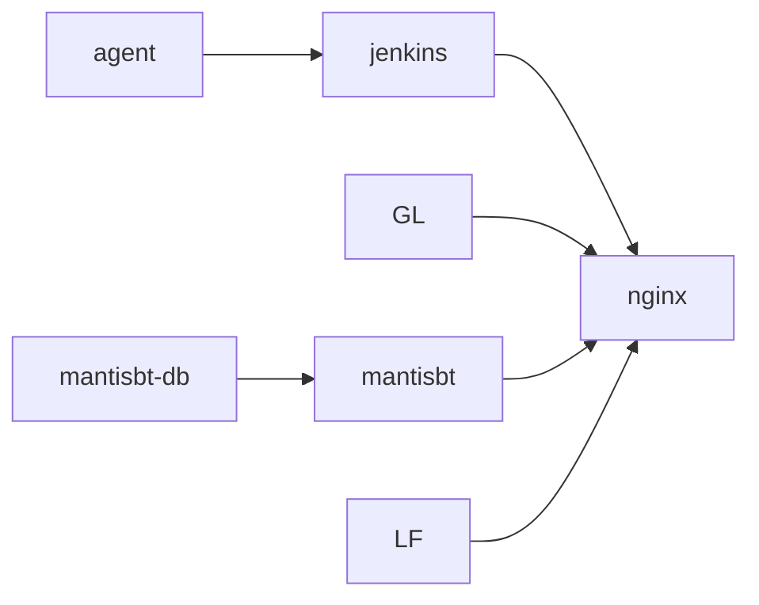
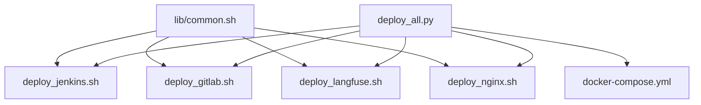

# Health Monitoring and Status Management

<cite>
**Referenced Files in This Document**
- [common.sh](file://deploy/lib/common.sh)
- [deploy_all.py](file://deploy/deploy_all.py)
- [docker-compose.yml](file://deploy/docker-compose.yml)
- [.global_settings_example.yaml](file://deploy/config/.global_settings_example.yaml)
- [deploy_jenkins.sh](file://deploy/deploy_jenkins/deploy_jenkins.sh)
- [deploy_gitlab.sh](file://deploy/deploy_gitlab/deploy_gitlab.sh)
- [deploy_langfuse.sh](file://deploy/deploy_langfuse/deploy_langfuse.sh)
- [deploy_nginx.sh](file://deploy/deploy_nginx/deploy_nginx.sh)
- [test_network.py](file://deploy/tests/test_network.py)
- [test_utils.py](file://deploy/tests/test_utils.py)
- [clean_docker_container.sh](file://deploy/tools/clean_docker_container.sh)
</cite>

## Table of Contents
1. [Introduction](#introduction)
2. [Project Structure](#project-structure)
3. [Core Components](#core-components)
4. [Architecture Overview](#architecture-overview)
5. [Detailed Component Analysis](#detailed-component-analysis)
6. [Dependency Analysis](#dependency-analysis)
7. [Performance Considerations](#performance-considerations)
8. [Troubleshooting Guide](#troubleshooting-guide)
9. [Conclusion](#conclusion)

## Introduction
This document describes the health monitoring and status management system implemented in the DeployAgent project. It explains how container lifecycles are monitored, service availability is verified, and status reporting is performed. It also covers error detection strategies, automatic recovery behaviors, container state management, service dependency tracking, and integration patterns with the broader deployment orchestration system. Examples of health check implementations, status reporting formats, and troubleshooting procedures are included to help operators maintain a reliable and observable deployment.

## Project Structure
The health monitoring and status management system spans multiple layers:
- Orchestration and orchestration integration via Docker Compose and centralized Python orchestrator
- Per-service deployment scripts with built-in status checks and password retrieval
- Shared logging and environment utilities
- Reverse proxy integration for HTTPS exposure and dependency-aware routing
- Testing utilities and cleanup tools for maintenance and recovery

**Diagram sources**
- [docker-compose.yml:34-222](file://deploy/docker-compose.yml#L34-L222)
- [deploy_all.py:40-142](file://deploy/deploy_all.py#L40-L142)
- [common.sh:1-566](file://deploy/lib/common.sh#L1-L566)
- [deploy_jenkins.sh:1-385](file://deploy/deploy_jenkins/deploy_jenkins.sh#L1-L385)
- [deploy_gitlab.sh:1-445](file://deploy/deploy_gitlab/deploy_gitlab.sh#L1-L445)
- [deploy_langfuse.sh:1-164](file://deploy/deploy_langfuse/deploy_langfuse.sh#L1-L164)
- [deploy_nginx.sh:1-712](file://deploy/deploy_nginx/deploy_nginx.sh#L1-L712)
- [test_network.py:1-82](file://deploy/tests/test_network.py#L1-L82)
- [test_utils.py:1-125](file://deploy/tests/test_utils.py#L1-L125)
- [clean_docker_container.sh:1-248](file://deploy/tools/clean_docker_container.sh#L1-L248)

**Section sources**
- [docker-compose.yml:1-222](file://deploy/docker-compose.yml#L1-L222)
- [deploy_all.py:1-800](file://deploy/deploy_all.py#L1-L800)
- [common.sh:1-566](file://deploy/lib/common.sh#L1-L566)

## Core Components
- Centralized orchestrator: Python-based orchestrator that scans environments, allocates ports, ensures Docker network, deploys services, and integrates reverse proxy configuration. It exposes functions for port scanning, Docker network validation, volume management, and service deployment.
- Docker Compose orchestration: Defines health checks per service, dependency chains, and network topology. Health checks are expressed as commands executed inside containers to verify readiness.
- Per-service deployment scripts: Provide service-specific deployment, status reporting, and credential retrieval. They integrate with the shared logging and environment utilities.
- Shared utilities: Provide logging, environment loading, port checking, image pulling with fallback mirrors, and helper functions for agent device management.
- Reverse proxy integration: Generates and reloads Nginx configurations based on running backend services, ensuring HTTPS exposure and dependency-aware routing.
- Testing and maintenance: Unit tests validate port scanning, network scanning, and utility functions. Cleanup tools support safe container and volume removal for recovery.

**Section sources**
- [deploy_all.py:40-142](file://deploy/deploy_all.py#L40-L142)
- [docker-compose.yml:56-131](file://deploy/docker-compose.yml#L56-L131)
- [deploy_jenkins.sh:43-113](file://deploy/deploy_jenkins/deploy_jenkins.sh#L43-L113)
- [deploy_gitlab.sh:57-156](file://deploy/deploy_gitlab/deploy_gitlab.sh#L57-L156)
- [deploy_langfuse.sh:46-139](file://deploy/deploy_langfuse/deploy_langfuse.sh#L46-L139)
- [deploy_nginx.sh:58-365](file://deploy/deploy_nginx/deploy_nginx.sh#L58-L365)
- [common.sh:25-62](file://deploy/lib/common.sh#L25-L62)
- [test_network.py:20-82](file://deploy/tests/test_network.py#L20-L82)
- [test_utils.py:24-125](file://deploy/tests/test_utils.py#L24-L125)
- [clean_docker_container.sh:42-101](file://deploy/tools/clean_docker_container.sh#L42-L101)

## Architecture Overview
The system implements a layered health monitoring architecture:
- Container-level health checks defined in Docker Compose evaluate readiness of each service.
- Orchestrator-level checks validate environment prerequisites (ports, Docker network, volumes) and coordinate deployments.
- Service-level checks provide status summaries and credentials retrieval.
- Reverse proxy health checks ensure Nginx configuration correctness and backend connectivity.
- Utilities centralize logging and environment handling for consistent status reporting.

**Diagram sources**
- [deploy_all.py:269-340](file://deploy/deploy_all.py#L269-L340)
- [deploy_all.py:682-699](file://deploy/deploy_all.py#L682-L699)
- [docker-compose.yml:34-222](file://deploy/docker-compose.yml#L34-L222)
- [deploy_nginx.sh:58-365](file://deploy/deploy_nginx/deploy_nginx.sh#L58-L365)

## Detailed Component Analysis

### Container Lifecycle Monitoring and Health Checks
- Docker Compose health checks:
  - Agent: HTTP GET against internal health endpoint with interval, timeout, retries, and start period.
  - Jenkins: HTTP GET against login endpoint with extended start period.
  - GitLab: HTTP GET against internal health endpoint with long start period.
  - MariaDB (MantisBT): MySQL ping command health check.
  - Nginx: Nginx configuration syntax check.
- Orchestrator integration:
  - The orchestrator reads service configurations and coordinates deployments, leveraging health checks for readiness assessment.
  - Port allocation and network creation ensure services can start with minimal conflicts.

**Diagram sources**
- [docker-compose.yml:56-131](file://deploy/docker-compose.yml#L56-L131)
- [deploy_all.py:502-545](file://deploy/deploy_all.py#L502-L545)

**Section sources**
- [docker-compose.yml:56-131](file://deploy/docker-compose.yml#L56-L131)
- [deploy_all.py:502-545](file://deploy/deploy_all.py#L502-L545)

### Service Availability Checks and Status Reporting
- Jenkins:
  - Deployment script creates the container, waits, and reports status.
  - Password retrieval via container inspection with retry loops and clear messaging.
  - Status summary prints access URLs and instructions.
- GitLab:
  - Deployment script supports named volumes and SSH port exposure.
  - Initial root password retrieval with robust wait-and-check loop.
  - Status summary includes access URLs and first-run guidance.
- Langfuse:
  - Standalone deployment script clones repository, generates environment, and starts services.
  - Reports access URLs and first-time setup steps.
- Nginx:
  - Shared function detects running backend services and generates per-service configuration.
  - Validates configuration syntax and reloads Nginx safely.

**Diagram sources**
- [deploy_jenkins.sh:43-113](file://deploy/deploy_jenkins/deploy_jenkins.sh#L43-L113)
- [deploy_gitlab.sh:57-156](file://deploy/deploy_gitlab/deploy_gitlab.sh#L57-L156)
- [deploy_langfuse.sh:46-139](file://deploy/deploy_langfuse/deploy_langfuse.sh#L46-L139)
- [deploy_nginx.sh:58-365](file://deploy/deploy_nginx/deploy_nginx.sh#L58-L365)
- [common.sh:25-74](file://deploy/lib/common.sh#L25-L74)

**Section sources**
- [deploy_jenkins.sh:115-204](file://deploy/deploy_jenkins/deploy_jenkins.sh#L115-L204)
- [deploy_jenkins.sh:224-254](file://deploy/deploy_jenkins/deploy_jenkins.sh#L224-L254)
- [deploy_gitlab.sh:158-230](file://deploy/deploy_gitlab/deploy_gitlab.sh#L158-L230)
- [deploy_gitlab.sh:250-285](file://deploy/deploy_gitlab/deploy_gitlab.sh#L250-L285)
- [deploy_langfuse.sh:100-139](file://deploy/deploy_langfuse/deploy_langfuse.sh#L100-L139)
- [deploy_nginx.sh:58-365](file://deploy/deploy_nginx/deploy_nginx.sh#L58-L365)

### Error Detection Strategies and Automatic Recovery
- Port and network conflict detection:
  - Orchestrator scans host and Docker exposed ports to prevent collisions.
  - Detects Docker bridge subnet and host route overlaps.
- Volume conflict detection:
  - Scans existing volumes and suggests unique naming to avoid conflicts.
- Image pull fallback:
  - Multi-source image pull with retries and timeouts, plus mirror suggestions.
- Container cleanup tool:
  - Interactive and batch operations to stop/remove containers and optionally clean volumes.
- Logging and status:
  - Unified logging functions with timestamps and optional file output for auditability.

**Diagram sources**
- [deploy_all.py:269-340](file://deploy/deploy_all.py#L269-L340)
- [deploy_all.py:346-399](file://deploy/deploy_all.py#L346-L399)
- [deploy_all.py:405-427](file://deploy/deploy_all.py#L405-L427)
- [common.sh:174-335](file://deploy/lib/common.sh#L174-L335)
- [clean_docker_container.sh:52-101](file://deploy/tools/clean_docker_container.sh#L52-L101)

**Section sources**
- [deploy_all.py:269-340](file://deploy/deploy_all.py#L269-L340)
- [deploy_all.py:346-399](file://deploy/deploy_all.py#L346-L399)
- [deploy_all.py:405-427](file://deploy/deploy_all.py#L405-L427)
- [common.sh:174-335](file://deploy/lib/common.sh#L174-L335)
- [clean_docker_container.sh:52-101](file://deploy/tools/clean_docker_container.sh#L52-L101)

### Container State Management and Dependency Tracking
- Dependencies:
  - Jenkins depends on Agent.
  - MantisBT depends on MariaDB.
- Restart policies:
  - Services configured with restart policies to improve resilience.
- Network:
  - All services share a dedicated Docker network for inter-service communication.
- Reverse proxy dependency:
  - Nginx configuration generation depends on backend container presence.

**Diagram sources**
- [docker-compose.yml:96-97](file://deploy/docker-compose.yml#L96-L97)
- [docker-compose.yml:182-183](file://deploy/docker-compose.yml#L182-L183)
- [deploy_all.py:682-699](file://deploy/deploy_all.py#L682-L699)

**Section sources**
- [docker-compose.yml:96-97](file://deploy/docker-compose.yml#L96-L97)
- [docker-compose.yml:182-183](file://deploy/docker-compose.yml#L182-L183)
- [deploy_all.py:682-699](file://deploy/deploy_all.py#L682-L699)

### Monitoring Integration Patterns
- Health check commands:
  - HTTP GET against service endpoints for web apps.
  - Command-based checks for database and proxy services.
- Orchestrator-driven configuration:
  - Environment variables and port maps drive service exposure and reverse proxy routing.
- Status reporting:
  - Scripts print human-readable summaries and access URLs.
  - Centralized logging utilities standardize output formatting.

**Section sources**
- [docker-compose.yml:90-95](file://deploy/docker-compose.yml#L90-L95)
- [deploy_all.py:701-756](file://deploy/deploy_all.py#L701-L756)
- [common.sh:25-74](file://deploy/lib/common.sh#L25-L74)

### Examples of Health Check Implementations
- Agent: HTTP health endpoint with short intervals and retries.
- Jenkins: Login endpoint health check with extended warm-up.
- GitLab: Internal health endpoint with long start period.
- MariaDB: MySQL ping command health check.
- Nginx: Configuration syntax check.

**Section sources**
- [docker-compose.yml:56-61](file://deploy/docker-compose.yml#L56-L61)
- [docker-compose.yml:90-95](file://deploy/docker-compose.yml#L90-L95)
- [docker-compose.yml:126-131](file://deploy/docker-compose.yml#L126-L131)
- [docker-compose.yml:153-158](file://deploy/docker-compose.yml#L153-L158)
- [docker-compose.yml:212-217](file://deploy/docker-compose.yml#L212-L217)

### Status Reporting Formats
- Human-readable summaries include container status, access URLs, and operational notes.
- Logging functions provide timestamped entries with severity levels and optional file output.

**Section sources**
- [deploy_jenkins.sh:224-254](file://deploy/deploy_jenkins/deploy_jenkins.sh#L224-L254)
- [deploy_gitlab.sh:250-285](file://deploy/deploy_gitlab/deploy_gitlab.sh#L250-L285)
- [deploy_nginx.sh:519-556](file://deploy/deploy_nginx/deploy_nginx.sh#L519-L556)
- [common.sh:25-74](file://deploy/lib/common.sh#L25-L74)

## Dependency Analysis
- Coupling:
  - Per-service scripts depend on shared utilities for logging and environment handling.
  - Orchestrator depends on Docker Compose definitions and service configurations.
- Cohesion:
  - Health checks are co-located with service definitions, improving maintainability.
- External dependencies:
  - Docker and Docker Compose are required; Nginx for HTTPS exposure; OpenSSL for certificate generation.
- Circular dependencies:
  - None observed; scripts and orchestrator follow a unidirectional dependency chain.

**Diagram sources**
- [common.sh:560-566](file://deploy/lib/common.sh#L560-L566)
- [deploy_all.py:40-142](file://deploy/deploy_all.py#L40-L142)
- [docker-compose.yml:34-222](file://deploy/docker-compose.yml#L34-L222)

**Section sources**
- [common.sh:560-566](file://deploy/lib/common.sh#L560-L566)
- [deploy_all.py:40-142](file://deploy/deploy_all.py#L40-L142)
- [docker-compose.yml:34-222](file://deploy/docker-compose.yml#L34-L222)

## Performance Considerations
- Health check intervals and timeouts are tuned per service type to balance responsiveness and overhead.
- Port scanning and network checks are lightweight and executed before heavy operations to reduce failure latency.
- Image pull fallback reduces downtime by trying multiple sources with bounded retries and timeouts.
- Reverse proxy configuration generation is incremental and only updates when backend containers change.

[No sources needed since this section provides general guidance]

## Troubleshooting Guide
- Port conflicts:
  - Use orchestrator’s port scan to identify and auto-assign available ports.
- Docker network issues:
  - Verify network existence and inspect for overlapping routes; resolve conflicts before redeployment.
- Volume conflicts:
  - Resolve existing volume names to unique identifiers; use backup and prune as needed.
- Image pull failures:
  - Try mirror configurations or proxy settings; the utility provides actionable suggestions.
- Container cleanup:
  - Use the cleanup tool for safe stop/remove operations; optionally remove named volumes for a clean slate.
- Logging:
  - Enable file logging via environment variable to persist logs for later inspection.

**Section sources**
- [deploy_all.py:269-340](file://deploy/deploy_all.py#L269-L340)
- [deploy_all.py:346-399](file://deploy/deploy_all.py#L346-L399)
- [deploy_all.py:405-427](file://deploy/deploy_all.py#L405-L427)
- [common.sh:174-335](file://deploy/lib/common.sh#L174-L335)
- [clean_docker_container.sh:52-101](file://deploy/tools/clean_docker_container.sh#L52-L101)

## Conclusion
The DeployAgent health monitoring and status management system combines container-level health checks, orchestrator-driven environment validation, and per-service status reporting to deliver a robust and observable deployment. By leveraging Docker Compose health checks, centralized logging, and reverse proxy integration, the system ensures reliable service availability and simplifies troubleshooting and recovery. Operators can confidently manage multi-service deployments with predictable status reporting and automated conflict resolution.