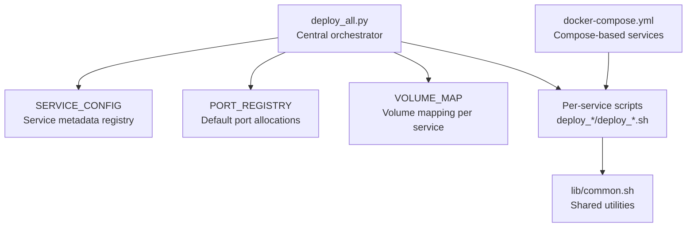
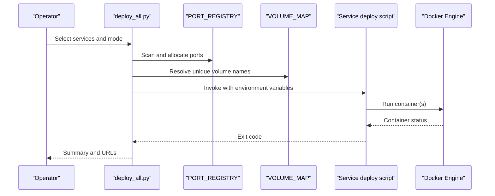
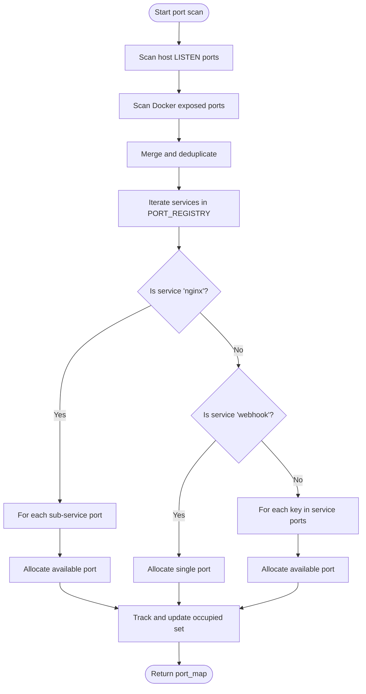
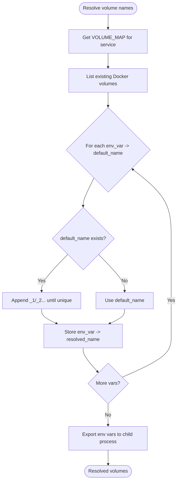
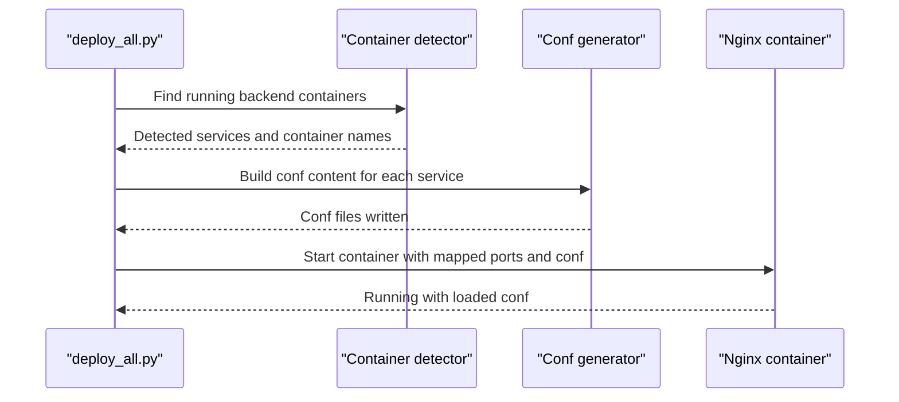
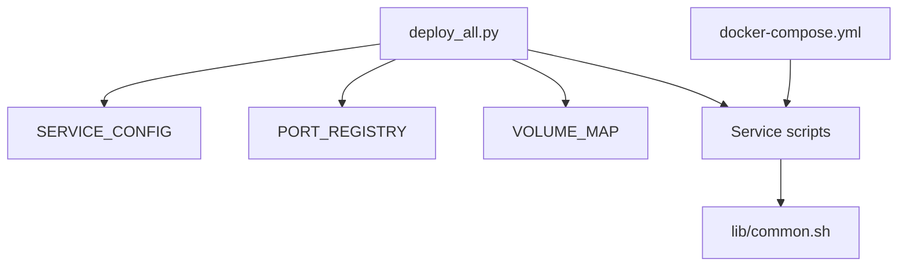

# Service Configuration System

<cite>
**Referenced Files in This Document**
- [deploy_all.py](file://deploy/deploy_all.py)
- [docker-compose.yml](file://deploy/docker-compose.yml)
- [common.sh](file://deploy/lib/common.sh)
- [.global_settings_example.yaml](file://deploy/config/.global_settings_example.yaml)
- [deploy_jenkins.sh](file://deploy/deploy_jenkins/deploy_jenkins.sh)
- [deploy_gitlab.sh](file://deploy/deploy_gitlab/deploy_gitlab.sh)
- [deploy_nginx.sh](file://deploy/deploy_nginx/deploy_nginx.sh)
- [deploy_langfuse.sh](file://deploy/deploy_langfuse/deploy_langfuse.sh)
- [deploy_nexus.sh](file://deploy/deploy_nexus/deploy_nexus.sh)
- [deploy_artifactory.sh](file://deploy/deploy_artifactory/deploy_artifactory.sh)
</cite>

## Table of Contents
1. [Introduction](#introduction)
2. [Project Structure](#project-structure)
3. [Core Components](#core-components)
4. [Architecture Overview](#architecture-overview)
5. [Detailed Component Analysis](#detailed-component-analysis)
6. [Dependency Analysis](#dependency-analysis)
7. [Performance Considerations](#performance-considerations)
8. [Troubleshooting Guide](#troubleshooting-guide)
9. [Conclusion](#conclusion)

## Introduction
This document explains the service configuration architecture used throughout DeployAgent. It focuses on the SERVICE_CONFIG dictionary structure, service metadata definitions, configuration inheritance patterns, service registration, container naming conventions, port mapping strategies, volume management configuration, environment variable propagation, and service-specific deployment parameters. It also documents how service configurations relate to deployment scripts and outlines validation mechanisms and examples for integrating custom services.

## Project Structure
DeployAgent organizes services into a centralized Python orchestrator and per-service Bash deployment scripts. The orchestrator defines service metadata and orchestration logic, while each service script encapsulates its own runtime configuration and environment variable propagation.

**Diagram sources**
- [deploy_all.py:61-129](file://deploy/deploy_all.py#L61-L129)
- [deploy_all.py:40-59](file://deploy/deploy_all.py#L40-L59)
- [deploy_all.py:459-475](file://deploy/deploy_all.py#L459-L475)
- [docker-compose.yml:34-222](file://deploy/docker-compose.yml#L34-L222)
- [common.sh:1-566](file://deploy/lib/common.sh#L1-L566)

**Section sources**
- [deploy_all.py:1-1315](file://deploy/deploy_all.py#L1-L1315)
- [docker-compose.yml:1-222](file://deploy/docker-compose.yml#L1-L222)
- [common.sh:1-566](file://deploy/lib/common.sh#L1-L566)

## Core Components
- SERVICE_CONFIG: Central registry of service metadata, including deploy script path, container name, reverse proxy integration keys, backend host/port, and Nginx location mapping.
- PORT_REGISTRY: Default port allocation registry for services and Nginx sub-services.
- VOLUME_MAP: Per-service mapping of environment variables to default volume names, enabling unique volume resolution.
- Orchestration functions: Port scanning, volume resolution, service deployment, Nginx proxy configuration, and environment propagation.

Key responsibilities:
- Define service identity and deployment linkage
- Manage port and volume naming uniqueness
- Coordinate reverse proxy configuration
- Propagate environment variables to child scripts

**Section sources**
- [deploy_all.py:61-129](file://deploy/deploy_all.py#L61-L129)
- [deploy_all.py:40-59](file://deploy/deploy_all.py#L40-L59)
- [deploy_all.py:459-475](file://deploy/deploy_all.py#L459-L475)
- [deploy_all.py:502-545](file://deploy/deploy_all.py#L502-L545)

## Architecture Overview
The system combines a Python orchestrator with per-service Bash scripts. The orchestrator reads configuration dictionaries, resolves ports and volumes, sets environment variables, and invokes service scripts. Services may also use Docker Compose for their own deployments.

**Diagram sources**
- [deploy_all.py:302-340](file://deploy/deploy_all.py#L302-L340)
- [deploy_all.py:492-501](file://deploy/deploy_all.py#L492-L501)
- [deploy_all.py:502-545](file://deploy/deploy_all.py#L502-L545)

## Detailed Component Analysis

### SERVICE_CONFIG Dictionary Structure
SERVICE_CONFIG defines metadata for each service, including:
- deploy_script: Path to the service’s Bash deployment script
- container: Expected container name for the service
- nginx_port_key: Tuple pointing to PORT_REGISTRY entry for Nginx sub-port
- nginx_container_port: Internal Nginx proxy port used by the orchestrator
- backend_host/backend_port: Backend container and port for reverse proxy
- nginx_location: Nginx location block mapping

Example entries:
- Jenkins: reverse proxy under /jenkins/, backend on 8080
- GitLab: reverse proxy under /, backend on 80
- Langfuse: reverse proxy under /, backend on 3000
- Artifactory/Nexus/Harbor: reverse proxy under /, backend on 8081

Inheritance patterns:
- Reverse proxy integration is standardized via nginx_port_key and nginx_container_port
- Backend host/port are derived from container naming and service-specific backend ports
- Nginx location defaults to “/” unless overridden (e.g., Jenkins)

Validation:
- The orchestrator checks that deploy_script exists and is executable before invoking
- Container existence is validated post-deployment; if not running, it attempts to locate a devopsagent-prefixed alternative

**Section sources**
- [deploy_all.py:61-129](file://deploy/deploy_all.py#L61-L129)
- [deploy_all.py:502-545](file://deploy/deploy_all.py#L502-L545)
- [deploy_all.py:554-564](file://deploy/deploy_all.py#L554-L564)

### Container Naming Conventions
- Standardized naming: devopsagent-<service> (e.g., devopsagent-jenkins, devopsagent-gitlab)
- Special cases:
  - Langfuse uses a multi-container stack with a prefix; the orchestrator detects the primary web container
  - MantisBT includes a database container with a distinct name
- The orchestrator attempts to match either exact or devopsagent-prefixed alternatives when validating running containers

**Section sources**
- [deploy_all.py:554-564](file://deploy/deploy_all.py#L554-L564)
- [deploy_langfuse.sh:118-124](file://deploy/deploy_langfuse/deploy_langfuse.sh#L118-L124)
- [docker-compose.yml:137-187](file://deploy/docker-compose.yml#L137-L187)

### Port Mapping Strategies
- Default allocations are defined in PORT_REGISTRY with:
  - Top-level service ports (e.g., Jenkins web/agent, GitLab HTTP/SSH, MantisBT web, MariaDB)
  - Nginx sub-ports for each proxied service
- Port scanning:
  - Scans host LISTEN sockets and Docker exposed ports
  - Automatically selects an available port within a bounded offset
  - Updates PORT_REGISTRY and exports environment variables for downstream scripts
- Environment propagation:
  - For Nginx, special environment variables are exported (e.g., GITLAB_NGINX_PORT)
  - For MariaDB, a simplified environment variable is exported (MARIADB_PORT)

**Diagram sources**
- [deploy_all.py:269-340](file://deploy/deploy_all.py#L269-L340)
- [deploy_all.py:294-300](file://deploy/deploy_all.py#L294-L300)
- [deploy_all.py:241-264](file://deploy/deploy_all.py#L241-L264)

**Section sources**
- [deploy_all.py:40-59](file://deploy/deploy_all.py#L40-L59)
- [deploy_all.py:269-340](file://deploy/deploy_all.py#L269-L340)
- [deploy_all.py:241-264](file://deploy/deploy_all.py#L241-L264)

### Volume Management Configuration
- VOLUME_MAP defines per-service environment variable to default volume name mappings
- Resolution:
  - Checks existing Docker volumes and appends numeric suffixes until a unique name is found
  - Passes resolved volume names via environment variables to service scripts
- Service scripts consume these variables to mount named volumes or bind mounts depending on configuration

**Diagram sources**
- [deploy_all.py:459-475](file://deploy/deploy_all.py#L459-L475)
- [deploy_all.py:477-500](file://deploy/deploy_all.py#L477-L500)
- [deploy_all.py:513-518](file://deploy/deploy_all.py#L513-L518)

**Section sources**
- [deploy_all.py:459-475](file://deploy/deploy_all.py#L459-L475)
- [deploy_all.py:477-500](file://deploy/deploy_all.py#L477-L500)
- [deploy_all.py:513-518](file://deploy/deploy_all.py#L513-L518)

### Environment Variable Propagation
- Global environment loading:
  - .env file is parsed and exported to the process environment
- Port-specific environment:
  - For each allocated port, environment variables are exported with service-specific keys
  - Special cases:
    - Nginx sub-ports export GITLAB_NGINX_PORT, MANTISBT_NGINX_PORT
    - MariaDB exports MARIADB_PORT
- Reverse proxy environment:
  - When Nginx is enabled, orchestrator exports service-specific URLs and hostnames for downstream scripts

Examples of propagated variables:
- SERVICE_PORT_<KEY>=<value>
- SERVICE_PORT=<value> (for single-port services)
- GITLAB_NGINX_PORT, MANTISBT_NGINX_PORT
- MARIADB_PORT

**Section sources**
- [deploy_all.py:209-217](file://deploy/deploy_all.py#L209-L217)
- [deploy_all.py:235-264](file://deploy/deploy_all.py#L235-L264)
- [deploy_all.py:701-756](file://deploy/deploy_all.py#L701-L756)

### Reverse Proxy Integration
- The orchestrator generates Nginx configuration dynamically:
  - Detects running backend containers by name
  - Creates per-service conf files with proxy_pass to backend containers
  - Starts Nginx with mapped ports and SSL certificates
- Service-specific configuration:
  - Jenkins: location /jenkins/
  - Others: location /
- SSL certificate generation:
  - Self-signed certificates are generated if missing

**Diagram sources**
- [deploy_all.py:769-872](file://deploy/deploy_all.py#L769-L872)
- [deploy_all.py:591-681](file://deploy/deploy_all.py#L591-L681)

**Section sources**
- [deploy_all.py:769-872](file://deploy/deploy_all.py#L769-L872)
- [deploy_all.py:591-681](file://deploy/deploy_all.py#L591-L681)

### Service Registration and Deployment
- Registration:
  - SERVICE_CONFIG maps service names to deployment metadata
  - Each service has a dedicated deploy script path
- Deployment:
  - The orchestrator resolves volumes, applies port mapping, and invokes the script
  - Scripts handle container creation, environment configuration, and service-specific steps
- Compose-based services:
  - Some services (e.g., Agent, Jenkins, GitLab, MantisBT, Nginx) are orchestrated via docker-compose.yml
  - The orchestrator ensures the devopsagent-network exists and connects containers

**Section sources**
- [deploy_all.py:61-129](file://deploy/deploy_all.py#L61-L129)
- [deploy_all.py:502-545](file://deploy/deploy_all.py#L502-L545)
- [docker-compose.yml:3-6](file://deploy/docker-compose.yml#L3-L6)
- [docker-compose.yml:34-222](file://deploy/docker-compose.yml#L34-L222)

### Per-Service Configuration Patterns
- Jenkins:
  - Uses named volumes by default; supports bind mounts
  - Exposes web and agent ports; integrates with Nginx under /jenkins/
- GitLab:
  - Supports named volumes or bind mounts; configurable external URL
  - SSH port and HTTP/HTTPS ports are configurable
- Langfuse:
  - Clones repository and uses docker-compose; generates environment variables including database and Redis connections
- Nexus:
  - Supports named volumes; pulls image with fallback sources
- Artifactory:
  - Attempts official and third-party mirrors; handles startup detection and initial credentials
- Nginx:
  - Dynamically generates conf files for detected backends; manages SSL certificates

**Section sources**
- [deploy_jenkins.sh:31-41](file://deploy/deploy_jenkins/deploy_jenkins.sh#L31-L41)
- [deploy_gitlab.sh:32-55](file://deploy/deploy_gitlab/deploy_gitlab.sh#L32-L55)
- [deploy_langfuse.sh:74-97](file://deploy/deploy_langfuse/deploy_langfuse.sh#L74-L97)
- [deploy_nexus.sh:29-103](file://deploy/deploy_nexus/deploy_nexus.sh#L29-L103)
- [deploy_artifactory.sh:22-157](file://deploy/deploy_artifactory/deploy_artifactory.sh#L22-L157)
- [deploy_nginx.sh:58-365](file://deploy/deploy_nginx/deploy_nginx.sh#L58-L365)

### Configuration Validation Mechanisms
- Port conflict detection:
  - Scans host and Docker ports; allocates non-conflicting ports automatically
- Network conflict detection:
  - Checks Docker network existence and potential host route overlaps
- Volume conflict detection:
  - Lists existing volumes and warns on potential collisions
- Service readiness:
  - Validates container existence and connectivity
- Nginx configuration:
  - Tests configuration syntax and reloads safely

**Section sources**
- [deploy_all.py:269-340](file://deploy/deploy_all.py#L269-L340)
- [deploy_all.py:346-399](file://deploy/deploy_all.py#L346-L399)
- [deploy_all.py:405-427](file://deploy/deploy_all.py#L405-L427)
- [deploy_all.py:848-867](file://deploy/deploy_all.py#L848-L867)

### Examples of Service Configuration Patterns
- Standard service with reverse proxy:
  - Jenkins: SERVICE_CONFIG specifies nginx_port_key and nginx_container_port; orchestrator writes jenkins.conf with proxy_pass to devopsagent-jenkins:8080 and location /jenkins/
- Single-port service:
  - Langfuse: SERVICE_CONFIG maps to langfuse-langfuse-web-1:3000; orchestrator writes langfuse.conf with location /
- Multi-port service:
  - GitLab: PORT_REGISTRY includes HTTP, HTTPS, and SSH ports; GitLab script exposes all three and sets external URL accordingly
- Compose-managed service:
  - Agent/Jenkins/GitLab/MantisBT/Nginx are defined in docker-compose.yml with explicit ports, volumes, and environment variables

**Section sources**
- [deploy_all.py:61-129](file://deploy/deploy_all.py#L61-L129)
- [deploy_all.py:769-872](file://deploy/deploy_all.py#L769-L872)
- [docker-compose.yml:67-222](file://deploy/docker-compose.yml#L67-L222)

### Custom Service Integration
To integrate a new service:
1. Add an entry to SERVICE_CONFIG with:
   - deploy_script path
   - container name
   - nginx_port_key tuple and nginx_container_port
   - backend_host/backend_port
   - nginx_location
2. Add default port(s) to PORT_REGISTRY
3. Optionally add volume mappings to VOLUME_MAP
4. Implement a deploy script that:
   - Loads environment variables (.env)
   - Resolves volumes if applicable
   - Creates containers with proper networking and port mapping
   - Handles service-specific initialization and credentials
5. Ensure the script exports any required environment variables for reverse proxy integration

**Section sources**
- [deploy_all.py:61-129](file://deploy/deploy_all.py#L61-L129)
- [deploy_all.py:40-59](file://deploy/deploy_all.py#L40-L59)
- [deploy_all.py:459-475](file://deploy/deploy_all.py#L459-L475)

## Dependency Analysis
The orchestrator coordinates several subsystems:
- SERVICE_CONFIG drives service selection and metadata
- PORT_REGISTRY and VOLUME_MAP drive resource allocation
- Per-service scripts implement deployment logic
- docker-compose.yml defines Compose-based services and their dependencies

**Diagram sources**
- [deploy_all.py:61-129](file://deploy/deploy_all.py#L61-L129)
- [deploy_all.py:40-59](file://deploy/deploy_all.py#L40-L59)
- [deploy_all.py:459-475](file://deploy/deploy_all.py#L459-L475)
- [docker-compose.yml:34-222](file://deploy/docker-compose.yml#L34-L222)
- [common.sh:1-566](file://deploy/lib/common.sh#L1-L566)

**Section sources**
- [deploy_all.py:61-129](file://deploy/deploy_all.py#L61-L129)
- [deploy_all.py:40-59](file://deploy/deploy_all.py#L40-L59)
- [deploy_all.py:459-475](file://deploy/deploy_all.py#L459-L475)
- [docker-compose.yml:34-222](file://deploy/docker-compose.yml#L34-L222)
- [common.sh:1-566](file://deploy/lib/common.sh#L1-L566)

## Performance Considerations
- Port scanning and volume resolution are O(n) over the number of services and existing resources
- Nginx configuration generation is triggered only when backends are detected
- Image pulling includes fallback strategies to minimize downtime
- Compose-based services benefit from pre-fetched images and reduced startup overhead

## Troubleshooting Guide
Common issues and resolutions:
- Port conflicts:
  - Use the scan-only mode to generate .env.auto with allocated ports
  - Adjust PORT_REGISTRY defaults or use .env overrides
- Volume conflicts:
  - Review existing volumes and resolve naming collisions
  - Use named volumes to avoid filesystem permission issues
- Nginx configuration errors:
  - Verify backend container names and ports
  - Check generated conf files and reload Nginx
- Service startup failures:
  - Inspect container logs and healthchecks
  - Confirm network connectivity and environment variables
- Initial credentials:
  - Retrieve Jenkins and GitLab initial passwords via helper functions
  - For Artifactory, default admin/password is documented in the script

**Section sources**
- [deploy_all.py:1223-1230](file://deploy/deploy_all.py#L1223-L1230)
- [deploy_all.py:878-900](file://deploy/deploy_all.py#L878-L900)
- [deploy_nginx.sh:357-364](file://deploy/deploy_nginx/deploy_nginx.sh#L357-L364)
- [deploy_artifactory.sh:184-189](file://deploy/deploy_artifactory/deploy_artifactory.sh#L184-L189)

## Conclusion
DeployAgent’s service configuration system centers on a declarative SERVICE_CONFIG registry, robust port and volume allocation, and a unified orchestrator that propagates environment variables and integrates reverse proxy configuration. Per-service scripts encapsulate deployment specifics while adhering to shared conventions. The architecture supports extensibility for custom services and includes validation and troubleshooting mechanisms to ensure reliable deployments.