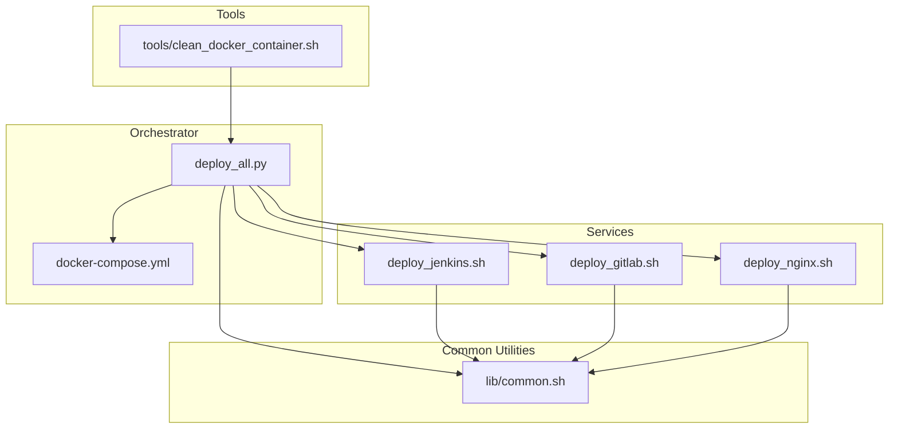
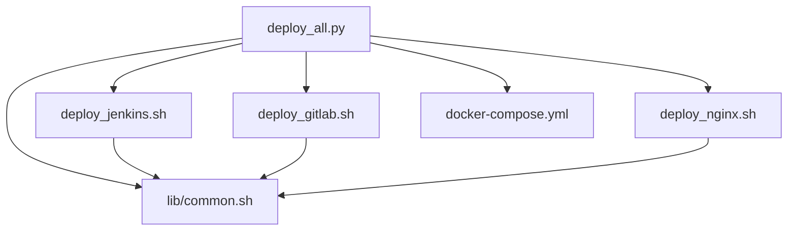
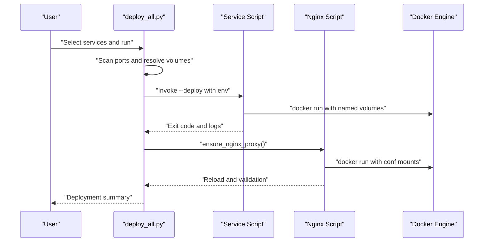
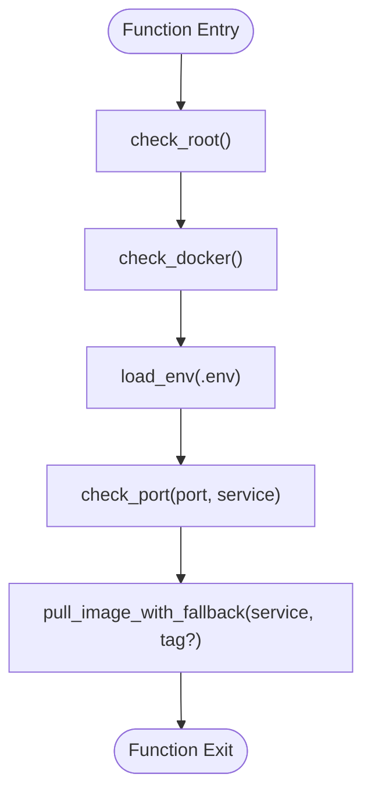
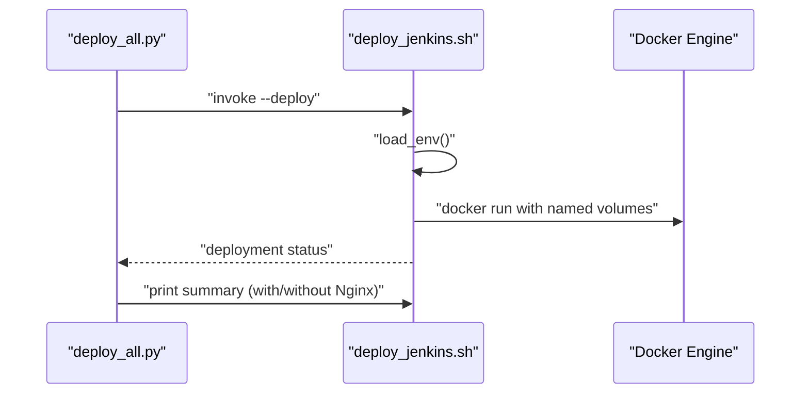
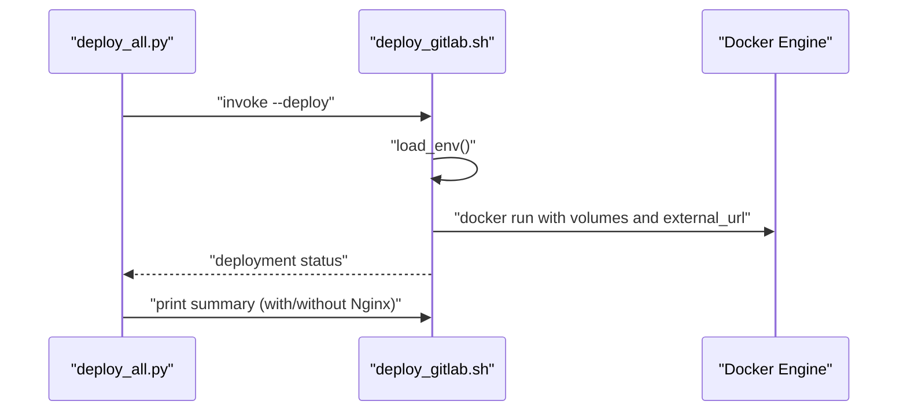
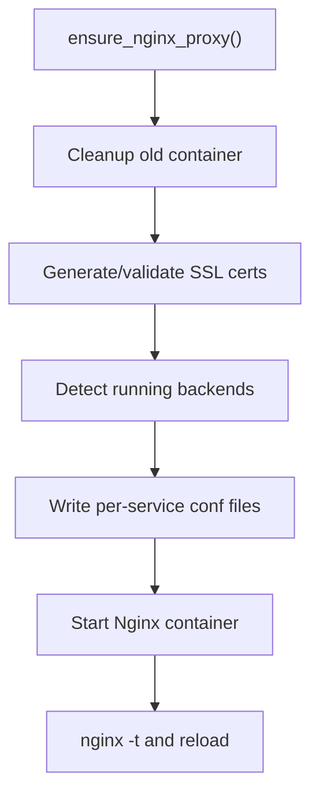
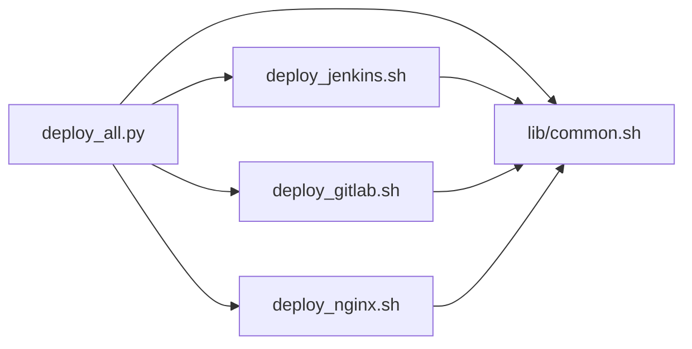

# Service Management System

<cite>
**Referenced Files in This Document**
- [README.md](file://README.md)
- [common.sh](file://deploy/lib/common.sh)
- [deploy_all.py](file://deploy/deploy_all.py)
- [docker-compose.yml](file://deploy/docker-compose.yml)
- [.global_settings_example.yaml](file://deploy/config/.global_settings_example.yaml)
- [deploy_jenkins.sh](file://deploy/deploy_jenkins/deploy_jenkins.sh)
- [deploy_gitlab.sh](file://deploy/deploy_gitlab/deploy_gitlab.sh)
- [deploy_nginx.sh](file://deploy/deploy_nginx/deploy_nginx.sh)
- [clean_docker_container.sh](file://deploy/tools/clean_docker_container.sh)
- [test_config.py](file://deploy/tests/test_config.py)
- [conftest.py](file://deploy/tests/conftest.py)
- [部署问题.md](file://deploy/部署问题.md)
- [部署设计.md](file://deploy/部署设计.md)
- [b.sh](file://deploy/b.sh)
- [c.sh](file://deploy/c.sh)
- [m.sh](file://deploy/m.sh)
</cite>

## Table of Contents
1. [Introduction](#introduction)
2. [Project Structure](#project-structure)
3. [Core Components](#core-components)
4. [Architecture Overview](#architecture-overview)
5. [Detailed Component Analysis](#detailed-component-analysis)
6. [Dependency Analysis](#dependency-analysis)
7. [Performance Considerations](#performance-considerations)
8. [Troubleshooting Guide](#troubleshooting-guide)
9. [Conclusion](#conclusion)
10. [Appendices](#appendices)

## Introduction
This document describes the DeployAgent service management system, a modular, Docker-first platform for deploying and operating integrated DevOps services (Jenkins, GitLab, MantisBT, Langfuse, Nginx, and others). The system emphasizes:
- Modular service architecture: each service has an independent deployment script while sharing common utilities.
- Centralized orchestration via a Python orchestrator that coordinates environment checks, port allocation, volume resolution, and Nginx reverse proxy integration.
- Health checks and robust error handling across services.
- Lifecycle management: deployment, monitoring, updates, and cleanup.
- Inter-service communication patterns and dependency handling.
- Scalability and consistency when adding new services.

## Project Structure
The repository organizes functionality by feature and layer:
- deploy/: Orchestration, service scripts, configuration, and tools
- deploy/lib/common.sh: Shared Bash utilities (logging, environment loading, Docker checks, image pulling, device management)
- deploy/deploy_all.py: Python orchestrator managing environment scanning, port assignment, volume naming, and service deployment
- deploy/docker-compose.yml: Optional Docker Compose orchestration (parameterized via environment variables)
- deploy/config/.global_settings_example.yaml: Global configuration template for agents and integrations
- deploy/deploy_*: Independent service deployment scripts (Jenkins, GitLab, Nginx, etc.)
- deploy/tools/clean_docker_container.sh: Cleanup utility for containers and volumes
- deploy/tests: PyTest-based validation of configuration and constants
- deploy/部署问题.md and deploy/部署设计.md: Operational and design documentation

**Diagram sources**
- [deploy_all.py:1-1315](file://deploy/deploy_all.py#L1-L1315)
- [common.sh:1-566](file://deploy/lib/common.sh#L1-L566)
- [deploy_jenkins.sh:1-385](file://deploy/deploy_jenkins/deploy_jenkins.sh#L1-L385)
- [deploy_gitlab.sh:1-445](file://deploy/deploy_gitlab/deploy_gitlab.sh#L1-L445)
- [deploy_nginx.sh:1-712](file://deploy/deploy_nginx/deploy_nginx.sh#L1-L712)
- [docker-compose.yml:1-222](file://deploy/docker-compose.yml#L1-L222)
- [clean_docker_container.sh:1-248](file://deploy/tools/clean_docker_container.sh#L1-L248)

**Section sources**
- [README.md:1-3](file://README.md#L1-L3)
- [deploy_all.py:1-1315](file://deploy/deploy_all.py#L1-L1315)
- [common.sh:1-566](file://deploy/lib/common.sh#L1-L566)
- [docker-compose.yml:1-222](file://deploy/docker-compose.yml#L1-L222)

## Core Components
- Orchestrator (Python): Scans environment, assigns ports, resolves volumes, invokes service scripts, configures Nginx, and manages state.
- Common utilities (Bash): Logging, environment variable loading, Docker detection, port checks, multi-source image pulls, and service-specific helpers (e.g., password retrieval, device management).
- Service scripts (Bash): Each service defines its own deployment, status, and maintenance commands, leveraging shared utilities.
- Docker Compose (optional): Parameterized compose file for alternative orchestration.
- Tools: Cleanup utility for containers and volumes.

Key responsibilities:
- Environment scanning and conflict detection (ports, Docker networks, volumes)
- Automated port allocation with persistence (.env.auto)
- Volume naming uniqueness to avoid conflicts
- Nginx reverse proxy generation and reload
- Health checks per service
- Error handling and logging

**Section sources**
- [deploy_all.py:1-1315](file://deploy/deploy_all.py#L1-L1315)
- [common.sh:1-566](file://deploy/lib/common.sh#L1-L566)
- [deploy_jenkins.sh:1-385](file://deploy/deploy_jenkins/deploy_jenkins.sh#L1-L385)
- [deploy_gitlab.sh:1-445](file://deploy/deploy_gitlab/deploy_gitlab.sh#L1-L445)
- [deploy_nginx.sh:1-712](file://deploy/deploy_nginx/deploy_nginx.sh#L1-L712)
- [docker-compose.yml:1-222](file://deploy/docker-compose.yml#L1-L222)
- [clean_docker_container.sh:1-248](file://deploy/tools/clean_docker_container.sh#L1-L248)

## Architecture Overview
The system follows a layered architecture:
- Layer 1: Orchestrator (Python) controls lifecycle and integrates services.
- Layer 2: Shared utilities (Bash) provide common functions.
- Layer 3: Service-specific scripts implement deployment and maintenance.
- Layer 4: Docker runtime and optional compose orchestration.
- Layer 5: Nginx reverse proxy layer for HTTPS ingress.

**Diagram sources**
- [deploy_all.py:1-1315](file://deploy/deploy_all.py#L1-L1315)
- [common.sh:1-566](file://deploy/lib/common.sh#L1-L566)
- [deploy_jenkins.sh:1-385](file://deploy/deploy_jenkins/deploy_jenkins.sh#L1-L385)
- [deploy_gitlab.sh:1-445](file://deploy/deploy_gitlab/deploy_gitlab.sh#L1-L445)
- [deploy_nginx.sh:1-712](file://deploy/deploy_nginx/deploy_nginx.sh#L1-L712)
- [docker-compose.yml:1-222](file://deploy/docker-compose.yml#L1-L222)

## Detailed Component Analysis

### Orchestrator (deploy_all.py)
- Port scanning and automatic allocation with persistence to .env.auto
- Docker network creation and volume resolution ensuring uniqueness
- Service invocation with environment propagation and timeouts
- Nginx integration via ensure_nginx_proxy(), generating per-service configs and reloading
- Health checks and post-deployment summaries

**Diagram sources**
- [deploy_all.py:1-1315](file://deploy/deploy_all.py#L1-L1315)
- [deploy_nginx.sh:58-365](file://deploy/deploy_nginx/deploy_nginx.sh#L58-L365)

**Section sources**
- [deploy_all.py:1-1315](file://deploy/deploy_all.py#L1-L1315)

### Common Utilities (lib/common.sh)
- Logging with colored output and optional log file
- Environment loading from .env files
- Docker detection and Compose command selection
- Port availability checks
- Multi-source image pulling with retries and fallback mirrors
- Service-specific helpers: Jenkins/GitLab initial password retrieval, Agent device management, local IP detection

**Diagram sources**
- [common.sh:93-124](file://deploy/lib/common.sh#L93-L124)
- [common.sh:130-151](file://deploy/lib/common.sh#L130-L151)
- [common.sh:157-168](file://deploy/lib/common.sh#L157-L168)
- [common.sh:174-335](file://deploy/lib/common.sh#L174-L335)

**Section sources**
- [common.sh:1-566](file://deploy/lib/common.sh#L1-L566)

### Jenkins Service (deploy_jenkins.sh)
- Deploys Jenkins container with configurable port binding, named volumes, and Java options
- Provides status, password retrieval, and standalone deployment with Nginx integration
- Supports both direct and Nginx-accessible URLs

**Diagram sources**
- [deploy_all.py:502-545](file://deploy/deploy_all.py#L502-L545)
- [deploy_jenkins.sh:43-113](file://deploy/deploy_jenkins/deploy_jenkins.sh#L43-L113)

**Section sources**
- [deploy_jenkins.sh:1-385](file://deploy/deploy_jenkins/deploy_jenkins.sh#L1-L385)

### GitLab Service (deploy_gitlab.sh)
- Deploys GitLab with configurable HTTP/HTTPS/SSH ports and external URL
- Supports named volumes and HTTPS reverse proxy mode
- Password retrieval and health considerations during initialization

**Diagram sources**
- [deploy_all.py:502-545](file://deploy/deploy_all.py#L502-L545)
- [deploy_gitlab.sh:57-156](file://deploy/deploy_gitlab/deploy_gitlab.sh#L57-L156)

**Section sources**
- [deploy_gitlab.sh:1-445](file://deploy/deploy_gitlab/deploy_gitlab.sh#L1-L445)

### Nginx Service (deploy_nginx.sh)
- Generates SSL certificates and per-service reverse proxy configs
- Detects running backends and starts Nginx with mounted configs
- Validates configuration and reloads without full restart when possible

**Diagram sources**
- [deploy_nginx.sh:58-365](file://deploy/deploy_nginx/deploy_nginx.sh#L58-L365)

**Section sources**
- [deploy_nginx.sh:1-712](file://deploy/deploy_nginx/deploy_nginx.sh#L1-L712)

### Docker Compose (Optional)
- Parameterized compose file with environment-driven ports, volumes, and network
- Health checks defined per service
- Optional Nginx role and labels for service identification

**Section sources**
- [docker-compose.yml:1-222](file://deploy/docker-compose.yml#L1-L222)

### Testing Framework
- PyTest suite validates port registry, service configuration completeness, and deployment modes
- Fixtures mock environment and capture output for deterministic tests

**Section sources**
- [test_config.py:1-131](file://deploy/tests/test_config.py#L1-L131)
- [conftest.py:1-29](file://deploy/tests/conftest.py#L1-L29)

## Dependency Analysis
- Coupling: Services depend on shared utilities; orchestrator depends on service scripts and Nginx integration.
- Cohesion: Each service script encapsulates its deployment logic; common.sh centralizes cross-cutting concerns.
- External dependencies: Docker/Docker Compose, image registries, and optional third-party mirrors.
- Circular dependencies: None observed; scripts source common.sh but do not import each other.

**Diagram sources**
- [deploy_all.py:1-1315](file://deploy/deploy_all.py#L1-L1315)
- [common.sh:1-566](file://deploy/lib/common.sh#L1-L566)
- [deploy_jenkins.sh:1-385](file://deploy/deploy_jenkins/deploy_jenkins.sh#L1-L385)
- [deploy_gitlab.sh:1-445](file://deploy/deploy_gitlab/deploy_gitlab.sh#L1-L445)
- [deploy_nginx.sh:1-712](file://deploy/deploy_nginx/deploy_nginx.sh#L1-L712)

**Section sources**
- [deploy_all.py:1-1315](file://deploy/deploy_all.py#L1-L1315)
- [common.sh:1-566](file://deploy/lib/common.sh#L1-L566)

## Performance Considerations
- Image pulling: Multi-source fallback with retries reduces downtime and improves reliability.
- Port scanning: Efficiently detects occupied ports and merges host and container exposure to prevent collisions.
- Volume naming: Unique volume resolution avoids unnecessary rebuilds and data loss.
- Nginx reload: Prefer reload over restart to minimize downtime.
- Health checks: Built-in health checks enable quick failure detection and remediation.

[No sources needed since this section provides general guidance]

## Troubleshooting Guide
Common issues and resolutions:
- Jenkins standalone rebuilds Nginx and prints incorrect HTTP URLs
  - Root cause: ensure_nginx_proxy() deletes and recreates Nginx; output text was hardcoded to HTTP
  - Resolution: Updated ensure_nginx_proxy() to reuse existing container and fixed output to HTTPS
  - Reference: [部署问题.md:1-200](file://deploy/部署问题.md#L1-L200)
- External browser cannot reach Nginx
  - Root cause: default binding to 127.0.0.1 prevents external access
  - Resolution: Add --nginx-bind option to override NGINX_BIND and expose externally
  - Reference: [部署问题.md:205-260](file://deploy/部署问题.md#L205-L260)
- GitLab via Nginx returns 502/500
  - Root cause: external_url mismatch with reverse proxy headers
  - Resolution: Enable HTTPS proxy mode and ensure X-Forwarded-* headers match actual ingress
  - Reference: [部署问题.md:259-345](file://deploy/部署问题.md#L259-L345)
- Jenkins Git clone fails with self-signed certificate
  - Workaround: Set GIT_SSL_NO_VERIFY=true in Jenkins pipeline for temporary use
  - Long-term: Import Nginx CA into Jenkins trust store
  - Reference: [部署问题.md:595-661](file://deploy/部署问题.md#L595-L661)
- Cleanup and maintenance
  - Use the cleanup tool to stop/remove containers and optionally clean volumes
  - Reference: [clean_docker_container.sh:1-248](file://deploy/tools/clean_docker_container.sh#L1-L248)

**Section sources**
- [部署问题.md:1-985](file://deploy/部署问题.md#L1-L985)
- [clean_docker_container.sh:1-248](file://deploy/tools/clean_docker_container.sh#L1-L248)

## Conclusion
DeployAgent provides a scalable, modular service management system with:
- Clear separation of concerns: each service is independently deployable yet shares common utilities.
- Robust orchestration: automated environment checks, port allocation, volume naming, and Nginx integration.
- Strong operational hygiene: health checks, logging, and error handling.
- Extensibility: straightforward patterns for adding new services and maintaining consistency across the ecosystem.

[No sources needed since this section summarizes without analyzing specific files]

## Appendices

### Service Configuration Patterns
- Environment variables drive service configuration and port bindings.
- Example templates and global settings:
  - [docker-compose.yml:1-222](file://deploy/docker-compose.yml#L1-L222)
  - [.global_settings_example.yaml:1-31](file://deploy/config/.global_settings_example.yaml#L1-L31)

**Section sources**
- [docker-compose.yml:1-222](file://deploy/docker-compose.yml#L1-L222)
- [.global_settings_example.yaml:1-31](file://deploy/config/.global_settings_example.yaml#L1-L31)

### Health Checks and Monitoring
- Jenkins: curl-based health check against /jenkins/login
- GitLab: curl-based health check against /-/health
- Agent: curl-based health check against /health
- Nginx: nginx -t validation

**Section sources**
- [docker-compose.yml:56-95](file://deploy/docker-compose.yml#L56-L95)
- [docker-compose.yml:126-131](file://deploy/docker-compose.yml#L126-L131)
- [docker-compose.yml:212-217](file://deploy/docker-compose.yml#L212-L217)

### Service Relationship and Dependencies
- Jenkins depends_on Agent
- MantisBT depends_on MariaDB
- Nginx depends_on Jenkins/GitLab/OpenClaw (when enabled)

**Section sources**
- [docker-compose.yml:96-97](file://deploy/docker-compose.yml#L96-L97)
- [docker-compose.yml:137-187](file://deploy/docker-compose.yml#L137-L187)
- [docker-compose.yml:353-356](file://deploy/docker-compose.yml#L353-L356)

### Adding New Services
- Follow the established pattern:
  - Create deploy_<service>/deploy_<service>.sh with deploy_<service>(), status, and helpers
  - Extend SERVICE_CONFIG in deploy_all.py with deploy_script, container, and Nginx mapping fields
  - Add service to PORT_REGISTRY and DEPLOY_MODES as appropriate
  - Reference: [deploy_all.py:40-142](file://deploy/deploy_all.py#L40-L142), [部署设计.md:530-634](file://deploy/部署设计.md#L530-L634)

**Section sources**
- [deploy_all.py:40-142](file://deploy/deploy_all.py#L40-L142)
- [部署设计.md:530-634](file://deploy/部署设计.md#L530-L634)

### Integration Patterns
- Jenkins ↔ OpenClaw via docker exec CLI
- Jenkins ↔ GitLab via Webhooks or SCM polling
- CI Self-Heal Skill invoking OpenClaw CLI inside the container

**Section sources**
- [部署设计.md:636-800](file://deploy/部署设计.md#L636-L800)

### Image Pulling and Mirrors
- Multi-source fallback with retry and timeout
- Mirror lists and alternative tags for resilience
- References: [common.sh:174-335](file://deploy/lib/common.sh#L174-L335), [b.sh:1-199](file://deploy/b.sh#L1-L199), [c.sh:1-275](file://deploy/c.sh#L1-L275), [m.sh:1-219](file://deploy/m.sh#L1-L219)

**Section sources**
- [common.sh:174-335](file://deploy/lib/common.sh#L174-L335)
- [b.sh:1-199](file://deploy/b.sh#L1-L199)
- [c.sh:1-275](file://deploy/c.sh#L1-L275)
- [m.sh:1-219](file://deploy/m.sh#L1-L219)