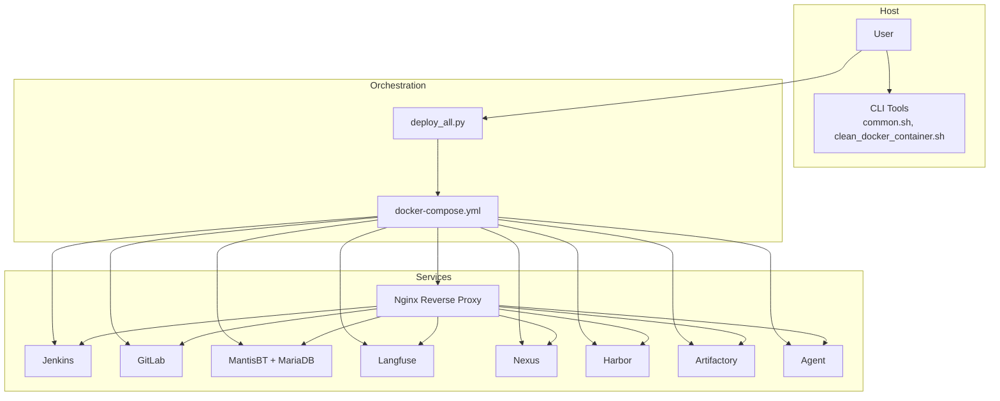
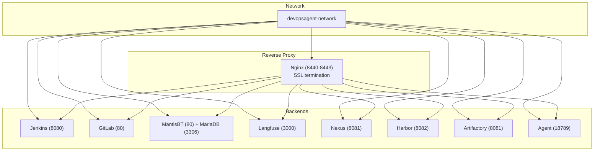
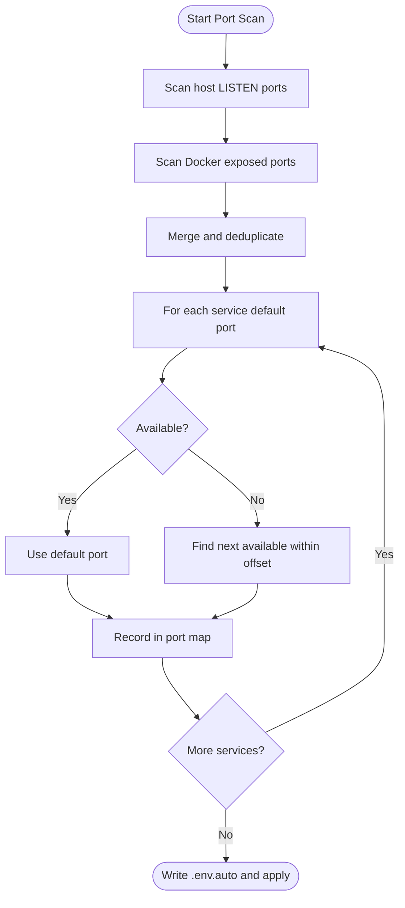
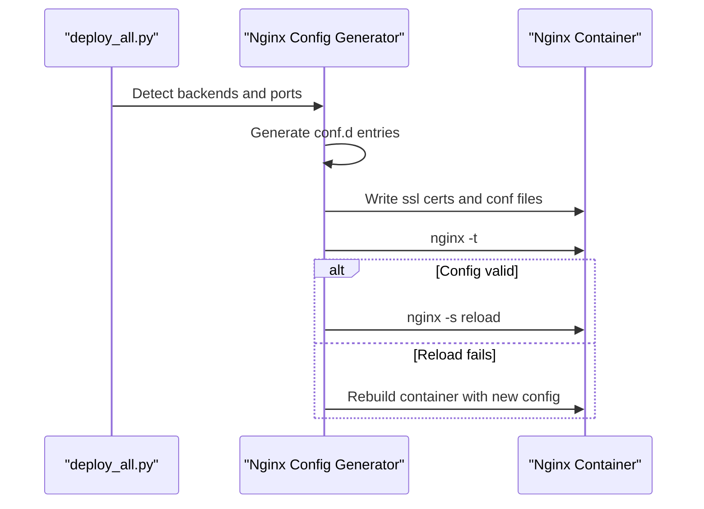
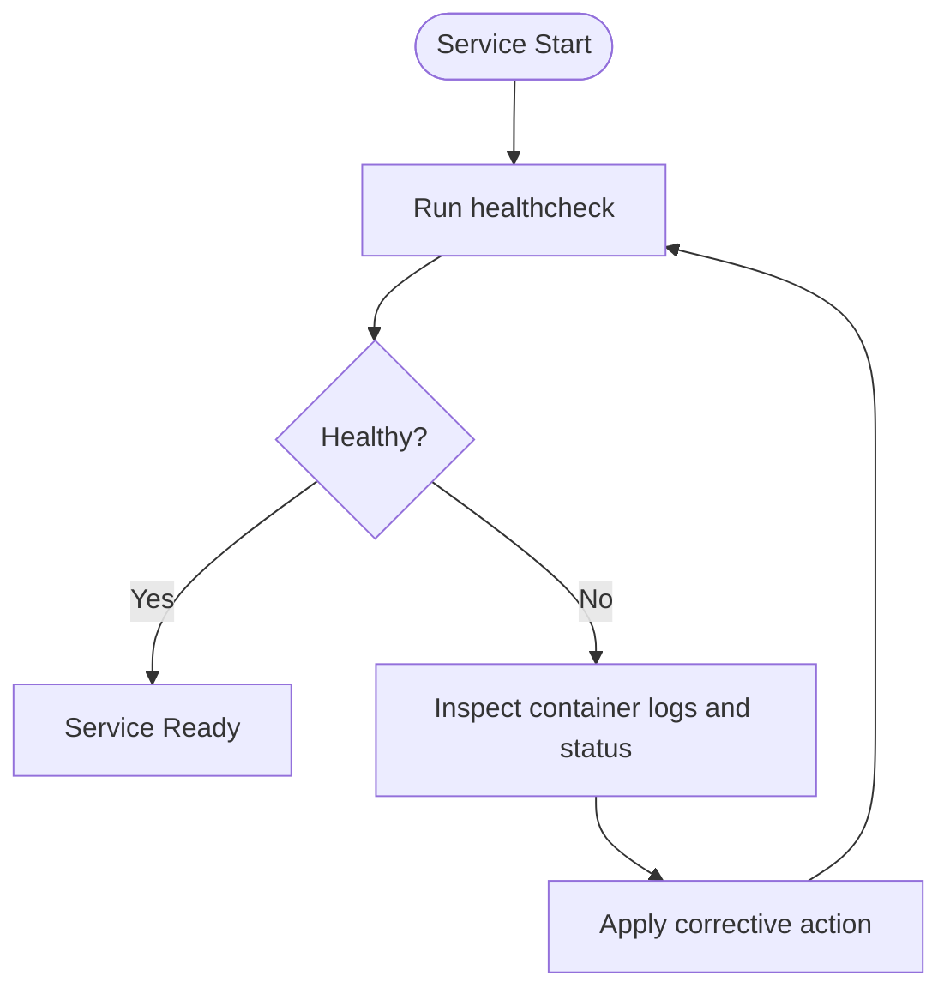
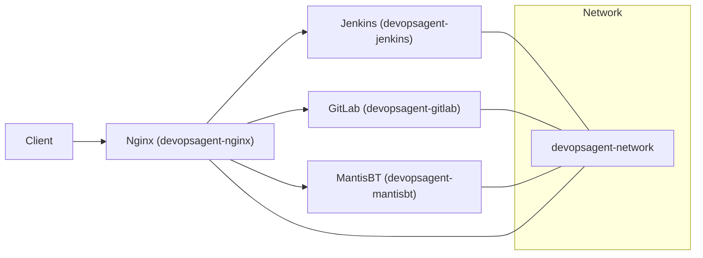
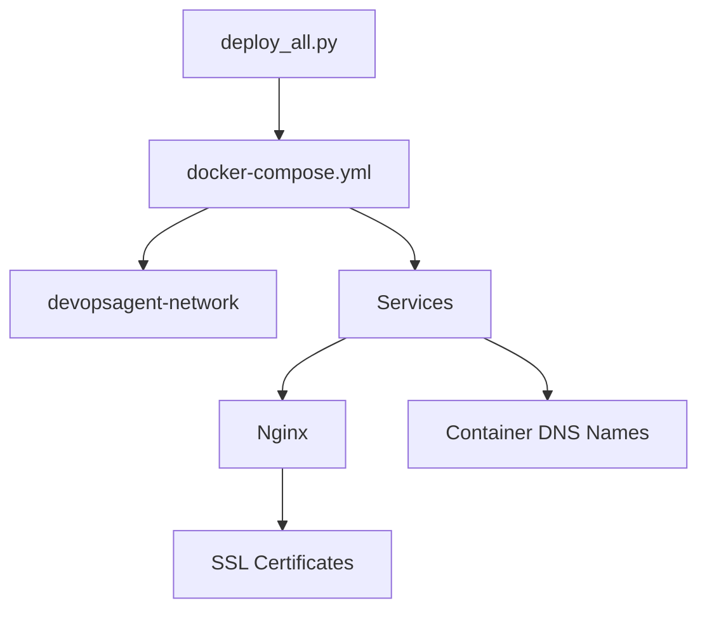

# Troubleshooting and Maintenance

<cite>
**Referenced Files in This Document**
- [README.md](file://README.md)
- [部署问题.md](file://deploy/部署问题.md)
- [docker-compose.yml](file://deploy/docker-compose.yml)
- [common.sh](file://deploy/lib/common.sh)
- [clean_docker_container.sh](file://deploy/tools/clean_docker_container.sh)
- [ECONNREFUSED.md](file://deploy/issue/ECONNREFUSED.md)
- [容器IP漂移-ECONNREFUSED-根因与永久修复.md](file://deploy/issue/容器IP漂移-ECONNREFUSED-根因与永久修复.md)
- [单独部署openclaw时没有部署nginx.md](file://deploy/issue/单独部署openclaw时没有部署nginx.md)
- [deploy_all.py](file://deploy/deploy_all.py)
- [b.sh](file://deploy/b.sh)
- [c.sh](file://deploy/c.sh)
- [m.sh](file://deploy/m.sh)
</cite>

## Table of Contents
1. [Introduction](#introduction)
2. [Project Structure](#project-structure)
3. [Core Components](#core-components)
4. [Architecture Overview](#architecture-overview)
5. [Detailed Component Analysis](#detailed-component-analysis)
6. [Dependency Analysis](#dependency-analysis)
7. [Performance Considerations](#performance-considerations)
8. [Troubleshooting Guide](#troubleshooting-guide)
9. [Maintenance Procedures](#maintenance-procedures)
10. [Escalation and Monitoring](#escalation-and-monitoring)
11. [Conclusion](#conclusion)

## Introduction
This document provides comprehensive troubleshooting and maintenance guidance for DeployAgent. It focuses on diagnosing and resolving common deployment issues such as port conflicts, container startup failures, and service connectivity problems. It also covers systematic debugging procedures, log analysis techniques, error resolution strategies, maintenance routines (cleanup, pruning, configuration validation), preventive maintenance, monitoring recommendations, performance optimization, and escalation procedures integrated with external monitoring systems.

## Project Structure
DeployAgent orchestrates multiple services behind a shared Nginx reverse proxy. The deployment stack includes Jenkins, GitLab, MantisBT, Langfuse, Nexus, Harbor, Artifactory, and the Agent service. Services are managed via Docker Compose and coordinated by a Python orchestration script. Supporting libraries and tools provide logging, environment checks, port scanning, and container cleanup.

**Diagram sources**
- [docker-compose.yml:34-222](file://deploy/docker-compose.yml#L34-L222)
- [deploy_all.py:682-699](file://deploy/deploy_all.py#L682-L699)

**Section sources**
- [README.md:1-3](file://README.md#L1-L3)
- [docker-compose.yml:1-222](file://deploy/docker-compose.yml#L1-L222)
- [deploy_all.py:1-162](file://deploy/deploy_all.py#L1-L162)

## Core Components
- Orchestration and deployment coordination: Python orchestration script manages environment scanning, port allocation, service deployment, and Nginx integration.
- Docker Compose: Defines networks, volumes, service images, ports, and healthchecks.
- Logging and diagnostics library: Provides standardized logging, environment loading, port checks, and helper utilities.
- Container cleanup tool: Offers interactive and batch operations to stop/remove containers and prune volumes.
- Issue documentation: Captures real-world problems and their root causes, including networking, proxy misconfiguration, and certificate issues.

**Section sources**
- [deploy_all.py:1-162](file://deploy/deploy_all.py#L1-L162)
- [docker-compose.yml:1-222](file://deploy/docker-compose.yml#L1-L222)
- [common.sh:1-124](file://deploy/lib/common.sh#L1-L124)
- [clean_docker_container.sh:1-248](file://deploy/tools/clean_docker_container.sh#L1-L248)
- [部署问题.md:1-985](file://deploy/部署问题.md#L1-L985)

## Architecture Overview
The system uses a shared Docker network for inter-service communication and a centralized Nginx reverse proxy to expose services securely over HTTPS. The orchestration script ensures proper port allocation, detects conflicts, and integrates Nginx configurations dynamically. Healthchecks are defined for each service to monitor readiness.

**Diagram sources**
- [docker-compose.yml:3-222](file://deploy/docker-compose.yml#L3-L222)
- [deploy_all.py:682-756](file://deploy/deploy_all.py#L682-L756)

**Section sources**
- [docker-compose.yml:34-222](file://deploy/docker-compose.yml#L34-L222)
- [deploy_all.py:682-756](file://deploy/deploy_all.py#L682-L756)

## Detailed Component Analysis

### Port Allocation and Conflict Resolution
- The orchestration script scans host and container ports, identifies conflicts, and auto-assigns alternative ports. It writes a generated environment file for persistent configuration.
- Conflicts commonly occur when services reuse default ports or when Docker exposes ports on loopback only.

**Diagram sources**
- [deploy_all.py:269-340](file://deploy/deploy_all.py#L269-L340)

**Section sources**
- [deploy_all.py:269-340](file://deploy/deploy_all.py#L269-L340)

### Nginx Reverse Proxy Integration
- The orchestration script generates Nginx configuration fragments for each backend and ensures SSL termination on dedicated HTTPS ports.
- It validates certificates, reloads Nginx when safe, and rebuilds the container only when necessary (e.g., bind address change).

**Diagram sources**
- [deploy_all.py:769-800](file://deploy/deploy_all.py#L769-L800)

**Section sources**
- [deploy_all.py:769-800](file://deploy/deploy_all.py#L769-L800)
- [docker-compose.yml:189-222](file://deploy/docker-compose.yml#L189-L222)

### Container Startup Failures and Healthchecks
- Each service defines a healthcheck. For example, Nginx validates configuration, Jenkins checks login endpoint, and databases check connectivity.
- Use Docker logs and healthcheck status to diagnose startup issues.

**Diagram sources**
- [docker-compose.yml:56-95](file://deploy/docker-compose.yml#L56-L95)
- [docker-compose.yml:126-131](file://deploy/docker-compose.yml#L126-L131)
- [docker-compose.yml:212-217](file://deploy/docker-compose.yml#L212-L217)

**Section sources**
- [docker-compose.yml:56-95](file://deploy/docker-compose.yml#L56-L95)
- [docker-compose.yml:126-131](file://deploy/docker-compose.yml#L126-L131)
- [docker-compose.yml:212-217](file://deploy/docker-compose.yml#L212-L217)

### Service Connectivity and Network Issues
- Hard-coded Docker bridge IPs are unstable; replace with container names for resilient DNS-based routing.
- Use container DNS resolution to reach backends and avoid relying on ephemeral IPs.

**Diagram sources**
- [容器IP漂移-ECONNREFUSED-根因与永久修复.md:48-79](file://deploy/issue/容器IP漂移-ECONNREFUSED-根因与永久修复.md#L48-L79)

**Section sources**
- [容器IP漂移-ECONNREFUSED-根因与永久修复.md:1-118](file://deploy/issue/容器IP漂移-ECONNREFUSED-根因与永久修复.md#L1-L118)

## Dependency Analysis
- Orchestration depends on Docker and Docker Compose availability and uses a shared network across services.
- Services depend on each other indirectly via Nginx and DNS resolution.
- Nginx depends on SSL certificates and backend container names.

**Diagram sources**
- [deploy_all.py:757-767](file://deploy/deploy_all.py#L757-L767)
- [docker-compose.yml:3-6](file://deploy/docker-compose.yml#L3-L6)
- [docker-compose.yml:189-222](file://deploy/docker-compose.yml#L189-L222)

**Section sources**
- [deploy_all.py:757-767](file://deploy/deploy_all.py#L757-L767)
- [docker-compose.yml:3-6](file://deploy/docker-compose.yml#L3-L6)
- [docker-compose.yml:189-222](file://deploy/docker-compose.yml#L189-L222)

## Performance Considerations
- Prefer Nginx-based HTTPS termination to offload SSL and enable connection reuse.
- Use healthchecks to detect slow-starting services and avoid premature failover.
- Monitor disk usage for data volumes and logs; prune unused images and volumes periodically.
- Optimize service resource limits (CPU/memory) via environment variables if needed.

[No sources needed since this section provides general guidance]

## Troubleshooting Guide

### Port Conflicts
Symptoms:
- Deployment fails with “port already in use.”
- Services fail to start or bind to loopback-only addresses.

Diagnosis steps:
- Use the orchestration’s port scanner to identify conflicts and auto-assign alternatives.
- Verify host and Docker exposed ports.

Resolution:
- Apply the generated environment file and redeploy.
- Adjust bind addresses to non-conflicting ports.

**Section sources**
- [deploy_all.py:269-340](file://deploy/deploy_all.py#L269-L340)

### Container Startup Failures
Symptoms:
- Containers stuck in restarting or unhealthy state.
- Healthcheck failures.

Diagnosis steps:
- Inspect container logs and healthcheck status.
- Verify image pulls and environment variables.
- Confirm network connectivity and volume mounts.

Resolution:
- Fix configuration errors, update images, or adjust resource limits.
- Restart services after correcting configuration.

**Section sources**
- [docker-compose.yml:56-95](file://deploy/docker-compose.yml#L56-L95)
- [docker-compose.yml:126-131](file://deploy/docker-compose.yml#L126-L131)
- [docker-compose.yml:212-217](file://deploy/docker-compose.yml#L212-L217)

### Service Connectivity Problems
Symptoms:
- ECONNREFUSED or 403/5xx errors when accessing services via Nginx.
- Jenkins/GitLab endpoints return unexpected statuses.

Root causes and resolutions:
- Hard-coded Docker bridge IPs change after restart; switch to container names for DNS resolution.
- Nginx listens on loopback only; configure bind address to 0.0.0.0 or a specific IP.
- GitLab external URL mismatch with proxy headers; align external URL and proxy headers for HTTPS.

Validation:
- Use curl inside the container to verify backend reachability.
- Confirm Nginx configuration and certificate validity.

**Section sources**
- [容器IP漂移-ECONNREFUSED-根因与永久修复.md:1-118](file://deploy/issue/容器IP漂移-ECONNREFUSED-根因与永久修复.md#L1-L118)
- [ECONNREFUSED.md:1-166](file://deploy/issue/ECONNREFUSED.md#L1-L166)
- [部署问题.md:205-258](file://deploy/部署问题.md#L205-L258)
- [部署问题.md:259-499](file://deploy/部署问题.md#L259-L499)

### Nginx Misconfiguration and Certificate Issues
Symptoms:
- SSL handshake errors or certificate mismatches.
- Nginx reload fails or configuration invalid.

Diagnosis steps:
- Validate Nginx configuration syntax.
- Check certificate presence and key-certificate pair match.
- Review proxy headers and backend URLs.

Resolution:
- Regenerate self-signed certificates when missing or mismatched.
- Reload Nginx safely; rebuild only when bind address or mount changes.

**Section sources**
- [deploy_all.py:769-800](file://deploy/deploy_all.py#L769-L800)
- [docker-compose.yml:189-222](file://deploy/docker-compose.yml#L189-L222)

### Jenkins and GitLab Access Issues
Symptoms:
- Incorrect recommended URLs (HTTP vs HTTPS).
- External browser cannot reach services.

Resolutions:
- Use HTTPS URLs for Nginx-integrated deployments.
- Bind Nginx to a public IP or 0.0.0.0 for external access.
- Align GitLab external URL and proxy headers when using HTTPS reverse proxy.

**Section sources**
- [部署问题.md:1-204](file://deploy/部署问题.md#L1-L204)
- [部署问题.md:259-499](file://deploy/部署问题.md#L259-L499)

### Agent and OpenClaw Proxy Access
Symptoms:
- Agent token-based access not reachable externally.
- OpenClaw standalone deployed without Nginx.

Resolutions:
- Deploy Nginx after Agent to expose HTTPS endpoints.
- Ensure NGINX_BIND is configured for external access.

**Section sources**
- [单独部署openclaw时没有部署nginx.md:1-185](file://deploy/issue/单独部署openclaw时没有部署nginx.md#L1-L185)

### Image Pull Failures and Network Diagnostics
Symptoms:
- Docker pull timeouts or failures.
- Manifest validation errors.

Resolutions:
- Use alternative registries and retry strategies.
- Diagnose Docker Hub connectivity and mirror configuration.
- Clean Docker cache if corrupted.

**Section sources**
- [b.sh:57-110](file://deploy/b.sh#L57-L110)
- [c.sh:39-105](file://deploy/c.sh#L39-L105)
- [c.sh:174-196](file://deploy/c.sh#L174-L196)
- [m.sh:47-111](file://deploy/m.sh#L47-L111)
- [m.sh:113-147](file://deploy/m.sh#L113-L147)

## Maintenance Procedures

### System Cleanup and Container Pruning
- Use the cleanup tool to stop/remove containers and optionally prune volumes.
- Perform periodic cleanup to free disk space and reduce clutter.

Operational notes:
- Interactive menu supports stop, remove, and volume cleanup.
- Dry-run option available before destructive operations.

**Section sources**
- [clean_docker_container.sh:1-248](file://deploy/tools/clean_docker_container.sh#L1-L248)

### Configuration Validation
- Validate Nginx configuration before reload.
- Ensure environment variables for ports and bind addresses are applied consistently.

**Section sources**
- [deploy_all.py:769-800](file://deploy/deploy_all.py#L769-L800)

### Preventive Maintenance Tasks
- Periodically review and prune unused images, containers, and volumes.
- Monitor healthchecks and alert on sustained unhealthy states.
- Rotate SSL certificates proactively and verify key-certificate pairs.

**Section sources**
- [docker-compose.yml:212-217](file://deploy/docker-compose.yml#L212-L217)
- [deploy_all.py:769-800](file://deploy/deploy_all.py#L769-L800)

### Performance Optimization
- Consolidate SSL termination at Nginx to reduce CPU overhead.
- Tune proxy timeouts and buffer sizes as needed.
- Limit concurrent builds and optimize service resource allocations.

**Section sources**
- [docker-compose.yml:189-222](file://deploy/docker-compose.yml#L189-L222)

## Escalation and Monitoring

### Escalation Procedures
- If initial diagnostics fail, escalate to:
  - Network team for routing and firewall issues.
  - Platform team for Docker and registry connectivity.
  - Application team for service-specific configurations.

[No sources needed since this section provides general guidance]

### Integration with External Monitoring Systems
- Export healthcheck and log metrics to external monitoring systems.
- Use structured logging and deploy logs for correlation.
- Alert on repeated failures, port conflicts, and Nginx reload errors.

**Section sources**
- [deploy_all.py:150-162](file://deploy/deploy_all.py#L150-L162)
- [common.sh:25-74](file://deploy/lib/common.sh#L25-L74)

## Conclusion
This guide consolidates practical troubleshooting and maintenance practices for DeployAgent. By leveraging the orchestration script’s port scanning and Nginx integration, validating configurations, and following the cleanup and preventive maintenance routines, most deployment issues can be diagnosed and resolved efficiently. For complex escalations, coordinate with platform and application teams and integrate monitoring for continuous observability.